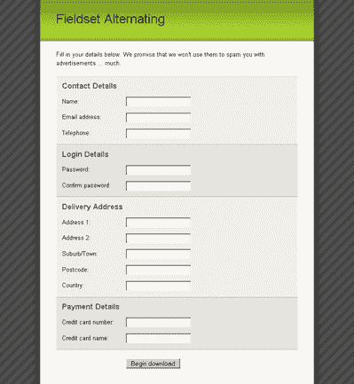
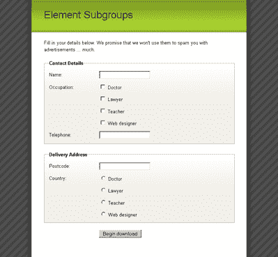

# 使用 CSS 文章的花式表单设计

> 原文：<https://www.sitepoint.com/fancy-form-design-css-6/>

**分组单选按钮和复选框**

有两种类型的表单元素可能是它们自己的子组的一部分。这些是复选框和单选按钮，它们都可以用来在回答表单上的给定问题时为用户提供多种选择。


*图 22:变色`[fieldset](https://reference.sitepoint.com/html/fieldset)`元素*

//

这些表单元素的布局方式与文本字段、`[select](https://reference.sitepoint.com/html/select)`框或`[textarea](https://reference.sitepoint.com/html/textarea)`略有不同。因为它们是自己子组的一部分，所以应该包含在主`[fieldset](https://reference.sitepoint.com/html/fieldset)`中的嵌套`[fieldset](https://reference.sitepoint.com/html/fieldset)`中。使用我们的`[fieldset](https://reference.sitepoint.com/css/ form as a starting point, we can add some grouped elements inside the <code>/#l#/https://reference.sitepoint.com/html/fieldset)`:

```
element-subgroups.html (excerpt)      
<fieldset>       
<legend>Contact Details</legend>       

<ol>       
<li>       
<fieldset>       

<legend>Occupation:</legend>       
<ol>       
<li>       

<input id="occupation1" name="occupation1"       
class="checkbox" type="checkbox" value="1" />       

<label for="occupation1">Doctor</label>       
</li>       
<li>       

<input id="occupation2" name="occupation2"       
class="checkbox" type="checkbox" value="1" />       

<label for="occupation2">Lawyer</label>       
</li>       
<li>       

<input id="occupation3" name="occupation3"element       
class="checkbox" type="checkbox" value="1" />       

<label for="occupation3">Teacher</label>       
</li>       
<li>       

<input id="occupation4" name="occupation4"       
class="checkbox" type="checkbox" value="1" />       

<label for="occupation4">Web designer</label>       
</li>       
</ol>       

</fieldset>       
</li>       
</ol>      

</fieldset>
```

子组的`[label](https://reference.sitepoint.com/html/label/)`实际上变成了嵌套的`[fieldset](https://reference.sitepoint.com/html/fieldset)`的`[legend](https://reference.sitepoint.com/html/legend)`，然后`[fieldset](https://reference.sitepoint.com/html/fieldset)`中的每个复选框或单选按钮都有自己的`[label](https://reference.sitepoint.com/html/label/)`。放置在顶层的有序列表结构也在这个子层上复制，更多的是为了一致性而不是必要性，尽管如果您想要样式化一些子项，它会非常方便。

嵌套元素将继承我们为顶级项目设置的样式，因此在嵌套元素正确显示之前，我们必须专门为它们设置一些规则:

```
element-subgroups.css (excerpt)      
fieldset fieldset {       
margin-bottom: -2.5em;       

border-style: none;       
background-color: transparent;       
background-image: none;      
}      

fieldset fieldset legend {       
margin-left: 0;       
font-weight: normal;      
}      

fieldset fieldset ol {       
position: relative;       
top: -1.5em;       
margin: 0 0 0 11em;       

padding: 0;      
}      
fieldset fieldset label {       
float: none;       

width: auto;       
margin-right: auto;      
}
```

首先，移除嵌套的`[fieldset](https://reference.sitepoint.com/html/fieldset)`上的所有装饰:`[background-color](https://reference.sitepoint.com/css/background-color)`、`[background-image](https://reference.sitepoint.com/css/background-image)`和`[border](https://reference.sitepoint.com/css/border)`属性。相反，它给出了一个否定的`[margin-bottom](https://reference.sitepoint.com/css/margin-bottom)`，目的是为了一些我们稍后会看到的诡计。

我们想让`[legend](https://reference.sitepoint.com/html/legend)`看起来和普通的`[label](https://reference.sitepoint.com/html/label/)`完全一样，所以我们去掉了左边距，也去掉了粗体的`font-weight`。注意`[legend](https://reference.sitepoint.com/html/legend)`中文本的长度很重要，因为大多数浏览器不会用`[legend](https://reference.sitepoint.com/html/legend)`将文本换行。因此，您为图例/文本设置的任何`[width](https://reference.sitepoint.com/css/width)`都将被忽略，因为文本将在一行中继续，可能会覆盖其余的`[form](https://reference.sitepoint.com/html/form)`。我们可以通过为`[legend](https://reference.sitepoint.com/html/legend)`文本设置最大字符宽度并以`[em](https://reference.sitepoint.com/html/em)`为单位调整`[form](https://reference.sitepoint.com/html/form)`列的大小来克服这一限制，这样，通过调整文本大小，布局也将随之调整。

***图例的限制**除了`[legend](https://reference.sitepoint.com/html/legend)`元素不能换行，它们还能抵抗`[width](https://reference.sitepoint.com/css/width)`设置和`text`对齐。使用`[legend](https://reference.sitepoint.com/html/legend)`元素在`[fieldset](https://reference.sitepoint.com/html/fieldset)`元素中进行分组只可能用于左对齐的`[label](https://reference.sitepoint.com/html/label/)`元素，而不是右对齐的`[label](https://reference.sitepoint.com/html/label/)`元素。*

我们使用有序列表来定位嵌套的表单元素和`[label](https://reference.sitepoint.com/html/label/)`元素。它的左`[margin](https://reference.sitepoint.com/css/margin)`将整个容器推离左边缘，相当于给予顶层表单元素的`[margin](https://reference.sitepoint.com/css/margin)`量。然后，为了使表单元素的顶部与它们各自的`[legend](https://reference.sitepoint.com/html/legend)`顶部对齐，我们需要相对定位有序列表，并通过`-1.5em`将其上移。这将在列表的底部留下一个大的空间(如果列表没有相对移动，它将会在这里)，这就是`[fieldset](https://reference.sitepoint.com/html/fieldset)`的负`[margin](https://reference.sitepoint.com/css/margin)`开始发挥作用的地方。负的`[margin](https://reference.sitepoint.com/css/margin)`将`[fieldset](https://reference.sitepoint.com/html/fieldset)`之后的内容向上拉，拉的量与我们移动有序列表的量相同，使它看起来没有空白。这里不需要放在顶级有序列表上的`[padding](https://reference.sitepoint.com/css/padding)`，所以我们只需将这个属性设置为`0`。

我们需要做的最后一件事是将我们的`[label](https://reference.sitepoint.com/html/label/)`元素恢复到它们的原始状态。这意味着我们阻止它们浮动，并将它们的`[width](https://reference.sitepoint.com/css/width)`设置为`auto`。因为它们是内联元素，所以它们现在可以很好地放在实际的表单元素(复选框或单选按钮)旁边。

对特定于 Internet Explorer 的样式表还有一个额外的更改:关闭嵌套的`[legend](https://reference.sitepoint.com/html/legend)`的负相对位置。我们不必处理嵌套的`[fieldset](https://reference.sitepoint.com/html/fieldset)`元素的背景颜色，所以这里不需要负相对位置:

```
element-subgroups-ie.css (excerpt)      
fieldset fieldset legend {       
top: 0;      
}
```

一旦创建了这些新样式，我们最终得到了如图 23 所示的表单——一个嵌套的`[fieldset](https://reference.sitepoint.com/html/fieldset)`,它与所有其他表单元素完美地排列在一起，并为用户提供了一个简单明了的选项选择。


*图 23:复选框和单选按钮的嵌套子组*

**Go to page:** [1](/fancy-form-design-css) | [2](/fancy-form-design-css-2/) | [3](/fancy-form-design-css-3/) | [4](/fancy-form-design-css-4/) | [5](/fancy-form-design-css-5/) | [6](/fancy-form-design-css-6/) | [7](/fancy-form-design-css-7/)

## 分享这篇文章