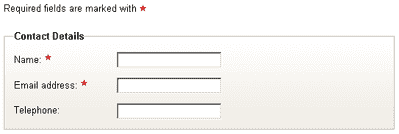
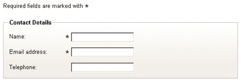
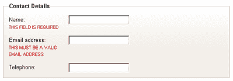

# 使用 CSS 文章的花式表单设计

> 原文：<https://www.sitepoint.com/fancy-form-design-css-7/>

##### 必填字段和错误消息

通常你想在表单上传达一些额外的信息，它们应该和表单元素的文本元素一样容易访问。事实上，为了确保它们是可访问的，它们应该包含在`[label](https://reference.sitepoint.com/html/label/)`本身中。这里我们要看两种类型:必填字段和错误消息。

**表示必填字段**

在表格上注明必填字段的最简单、最容易的方法是在表格`[label](https://reference.sitepoint.com/html/label/)`后写上“必填”。这种增加不仅可以被屏幕阅读器读出，而且还意味着不需要为可视用户提供额外的符号键，如果您选择用星号或其他符号标记必填字段，情况就是这样。

为了强调信息的重要性，我们可以在`[em](https://reference.sitepoint.com/html/em)`元素中添加文本“required ”,这也为我们提供了一个可设置样式的元素来区分“required”文本和`[label](https://reference.sitepoint.com/html/label/)`文本:

```
required-fields.html (excerpt)      
<label for="name">        
Name: <em>required</em>       

</label>
```

为了让`[em](https://reference.sitepoint.com/html/em)`在`[form](https://reference.sitepoint.com/html/form)`上有自己的一席之地，我们可以将其设置为`display: block`，并更改文本的外观:

```
required-fields.css (excerpt)       

label em {        
display: block;        
color: #060;        
font-size: 85%;        

font-style: normal;        
text-transform: uppercase;      
}
```

我们的“必需”标记现在看起来如图 24 所示。


*图 24:用文本“必填”标记标记的表单字段([在新窗口中查看大图](https://i2.sitepoint.com/graphics/forms_required.png))。)*

然而，星号或星号现在已经成为标记必填字段的常用工具，可能是因为它的简洁性。但是它在视觉上下文之外没有太多意义——大多数屏幕阅读器会将星号字符理解为“星”因此，你最终会得到一个“电子邮件地址之星”，这对用户来说有点困惑。

出于可访问性的目的，与其在表单`[label](https://reference.sitepoint.com/html/label/)`旁边包含一个真正的星号字符，不如包含一个星号的内联图像，用`[alt](https://reference.sitepoint.com/html/img/alt)`文本表示“必填”。这意味着 screenreader 用户将听到单词“required”，而不仅仅是“star”，这更有帮助。如果你使用的是图像，你应该在`[form](https://reference.sitepoint.com/html/form)`的顶部加上一个关键词，让视觉用户确切地知道它的意思。

我们仍然希望强调这样一个事实，即`[label](https://reference.sitepoint.com/html/label/)`是必需的，所以我们只是用星号的图像替换了`[em](https://reference.sitepoint.com/html/em)`元素中的文本“required ”:

```
required-fields-star1.html (excerpt)       

<label for="name">        
Name: <em></em>       

</label>
```

这种替换实际上不需要任何造型；我们可以将`[em](https://reference.sitepoint.com/html/em)`作为行内元素，星号将直接出现在表单`[label](https://reference.sitepoint.com/html/label/)`的旁边:

 *
图 25:内嵌星号标记必填字段([在新窗口中查看大图](https://i2.sitepoint.com/graphics/forms_required-stars.png))。)*

或者，我们可以使用一些 CSS 来绝对定位图像，并使其与表单元素本身更紧密地关联起来:

```
required-fields-star2.css (excerpt)      
label {        
position: relative;        

float: left;        
width: 10em;        
margin-right: 1em;      
}       

label em {        
position: absolute;        
left: 10em;        
top: 0;       

}
```

绝对定位`[em](https://reference.sitepoint.com/html/em)`时，相对定位其父`[label](https://reference.sitepoint.com/html/label/)`很重要，这样当我们为`[em](https://reference.sitepoint.com/html/em)`指定一些坐标时，它们将相对于`[label](https://reference.sitepoint.com/html/label/)`的左上角。星形图像应该位于`[label](https://reference.sitepoint.com/html/label/)`和表单元素(由`[label](https://reference.sitepoint.com/html/label/)`的右边`[margin](https://reference.sitepoint.com/css/margin)`创建)之间的间隙，因此`[em](https://reference.sitepoint.com/html/em)`的`[left](https://reference.sitepoint/com/css/left)`的值将取决于我们在那里设置的内容。设置`[em](https://reference.sitepoint.com/html/em)`的上限值只是一种预防措施，以防图像换行。

通过采取这样的行动，我们将得到一系列更加有序的“必需”标记，如图 26 所示。


*图 26:标有绝对定位的星形图像的必填字段，与表单元素对齐([在新窗口中查看大图](https://i2.sitepoint.com/graphics/forms_required-stars-aligned.png))。)*

**处理错误信息**

错误消息的处理方式几乎与必需的标记相同。为了在 screenreader 用户将焦点放在适当的表单元素上时被读出，它们应该构成`[label](https://reference.sitepoint.com/html/label/)`的一部分:

```
error-fields1.html (excerpt)      
<label for="name">        
Email: <strong>This must be a valid email address</strong>       

</label>
```

语义`strong`元素用于包含错误消息，将它与所需的标记区分开来，并给予它更强的强调。

样式与文本“required”标记几乎相同，除了您可能想要更改颜色。一种好的强烈的红色是适当的警告:

```
error-fields1.css (excerpt)       

label strong {        
display: block;        
color: #C00;        
font-size: 85%;        

font-weight: normal;        
text-transform: uppercase;      
}
```

这种样式产生了如图 27 所示的布局。



*图 27:错误消息作为`[label](https://reference.sitepoint.com/html/label/)`元素的一部分，显示在`[label](https://reference.sitepoint.com/html/label/)`文本的下面([在新窗口](https://i2.sitepoint.com/graphics/forms_required-text.png)中查看大图)。)*

错误消息的另一个位置确实存在，但是它取决于几个先决条件。只要满足以下条件，错误消息就可以放在表单元素的右侧:

*   任何`[form](https://reference.sitepoint.com/html/form)`元素的最大宽度是已知的。
*   该错误信息不太可能会自动换行。

这种放置涉及到错误消息的绝对定位，所以我们必须预先知道错误要移动多远。绝对元素在文档流之外，因此如果开始换行，其他内容将不会调整以适应错误消息。如果设计可以解决这两个问题，那么工作的 CSS 就是:

```
error-fields2.css (excerpt)      
label {        

position: relative;        
float: left;        
width: 10em;        
margin-right: 1em;       

}      
label strong {      
position: absolute;      
left: 27em;       

top: 0.2em;      
width: 19em;      
color: #C00;      
font-size: 85%;       

font-weight: normal      
;text-transform: uppercase;      
}
```

同样，因为`strong`元素被绝对定位，它的父元素`[label](https://reference.sitepoint.com/html/label/)`必须被相对定位，以允许我们相对于`[label](https://reference.sitepoint.com/html/label/)`本身移动错误消息。

错误消息的`[width](https://reference.sitepoint.com/css/width)`由表单元素后面的空格决定。通过将表单元素的`[width](https://reference.sitepoint.com/css/width)`,加上`[label](https://reference.sitepoint.com/html/label/)`的`[width](https://reference.sitepoint.com/css/width)`,再加上我们为了正确对齐错误消息所需的任何额外空间，计算出`[left](https://reference.sitepoint/com/css/left)`。

图 28 显示了它在浏览器中的最终显示。


*图 28:错误消息作为`[label](https://reference.sitepoint.com/html/label/)`元素的一部分，使用绝对定位显示([在新窗口中查看大图](https://i2.sitepoint.com/graphics/forms_required-text-aligned.png))。)*

 **   *将错误文本放置在`[label](https://reference.sitepoint.com/html/label/)`* 之外
*   *包括将`[form](https://reference.sitepoint.com/html/form)`元素嵌套在`[label](https://reference.sitepoint.com/html/label/)`中，并将错误文本放在表单元素*之后

*这两种解决方案都是不可访问的，因为当`[form](https://reference.sitepoint.com/html/form)`元素被聚焦时，屏幕阅读器很可能无法读出错误信息。*

在正确定位错误消息的同时，我们还可以包括错误图标，以进一步突出显示表单上的问题区域。错误图标包含在 HTML 中，具有适当的`alt`属性:

```
error-fields3.html (excerpt)       

<fieldset>        
<legend>Contact Details</legend>        
<ol>        

<li>        
<label for="name">        
Email: <strong> This must be a valid email address        
</strong>        
</label>        

<input id="name" name="name" class="text" type="text" />        

</li>
```

我们现在可以使用绝对定位将它移动到表单元素的左侧。因为它的父元素(`strong`元素)已经被绝对定位，我们所做的任何移动都是相对于那个父元素的，所以，实际上，我们必须向负方向移动它，以便将它移回左侧:

```
error-fields3.css (excerpt)      
label strong img {        

position: absolute;        
left: -16em;      
}
```

这种调整相当于表单元素的宽度，加上一点额外的间距，所以我们将得到一个位置很好的图标，如图 29 所示。


*图 29:显示在`[form](https://reference.sitepoint.com/html/form)`元素右侧的错误消息，以及左侧的错误图标([在新窗口中查看大图](https://i2.sitepoint.com/graphics/forms_required-stars-text.png))。)*

##### 摘要

既然你已经读完了这一章，你就没有理由再制作使用表格定位的不可访问的表单了！

我们已经完成了表单元素的正确有效的标签、分组、布局和样式，并预测和解决了潜在的兼容性和可访问性问题。有了这里提供的代码，你就有了很多不同的选择，但是通过组合和试验不同的样式、表单元素和布局，你还可以做更多的事情。

如果这一章有一个潜在的信息，那就是要记住，无论你做什么，你的表单都必须是可用的和可访问的。归根结底，表单实际上就是让用户能够尽可能容易地提供信息并告诉你他们想要什么。当然，网站的可用性还有其他方面可以发挥作用——你可能想看看[导航和表格章节](https://www.sitepoint.com/books/cssdesign1/toc.php)，也包括在[*CSS*](https://www.sitepoint.com/books/cssdesign1/)的艺术和科学中，别忘了下载本章的 PDF[！](https://www.sitepoint.com/books/cssdesign1/)

**Go to page:** [1](/fancy-form-design-css) | [2](/fancy-form-design-css-2/) | [3](/fancy-form-design-css-3/) | [4](/fancy-form-design-css-4/) | [5](/fancy-form-design-css-5/) | [6](/fancy-form-design-css-6/) | [7](/fancy-form-design-css-7/)*

## *分享这篇文章*