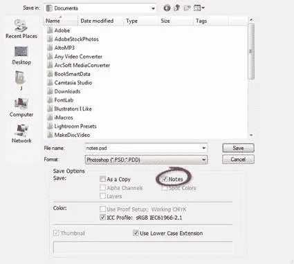

# 快速反馈:使用 Photoshop 中的笔记工具进行协作

> 原文：<https://www.sitepoint.com/fast-feedback-using-the-notes-tool-in-photoshop-for-collaboration/>

“注释”工具或 CS4 中的“注释”工具可以与吸管工具组合在一起。尽管它非常容易使用，非常有用，但却没有得到充分利用。

要为图像添加注释，请单击注释工具，然后单击图像本身。一个小的笔记框打开了，你可以输入任何你想要的东西。

这对于“要做的事情”或者甚至是你已经做了什么来获得图像是非常方便的。如果您有一些文本需要放在图像中，您可以暂时复制并粘贴到框中，直到您决定将它放在哪里。

你可以通过点击右上角的小方框来最小化注释。注释在图像上显示为不可打印的小图标。

您可以给图像添加任意数量的注释。如果您添加了多个注释，请使用左/右箭头来滚动注释。垃圾桶会删除当前便笺。您可以右键单击注释并从弹出菜单(Win)中选择“删除所有注释”(或在 MAC 上按住 Ctrl 键单击)来删除所有注释。

保存文件时，请确保选中“另存为”对话框中的“注释”框。PSD、PSB、Tiff 和 PDF 支持注释。

好的。这真的很简单，但是协作呢？比方说，现在你想把图像发送给客户，并得到他们的评论，但客户没有 Photoshop。你所需要做的就是将你的文件保存为 PDF(可移植文档格式)。然后，您的客户可以在免费的 Acrobat Reader 中打开 Photoshop PDF 进行查看，他们可以添加自己的注释，将文件再次保存为 PDF，然后发送给您。一种简单快捷的方式，无需离开 Photoshop 就可以向客户展示您的模型或设计。

这是你以前用过的合作方式吗？你还发现了哪些与客户分享模型或设计的方式？

## 分享这篇文章