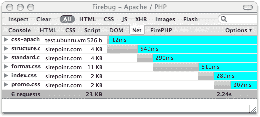
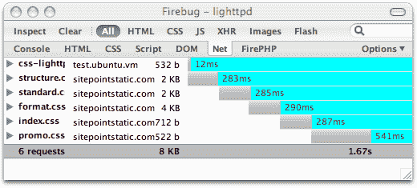
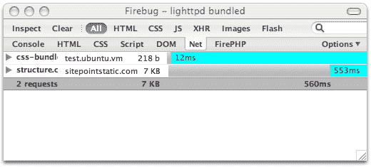

# 更快的页面加载——捆绑你的 CSS 和 Javascript

> 原文：<https://www.sitepoint.com/faster-page-loads-bundle-your-css-and-javascript/>

你有没有在等待页面加载的时候看着状态栏，想知道为什么在你看到屏幕上的任何东西之前，有几个文件似乎已经被下载了？最终显示页面内容，然后插入图像。

让您等待的文件通常是从 HTML 文档的“head”部分链接的 CSS 和 Javascript 文件。因为这些文件决定了页面的显示方式，所以呈现会延迟，直到它们完全下载完毕。

**HTTP 开销**

对于这些文件中的每一个，都会向服务器发送一个 HTTP 请求，然后浏览器在请求下一个文件之前等待响应。浏览器的限制通常会阻止平行下载。这意味着对于每个文件，您等待请求到达服务器，服务器处理请求，以及回复(包括文件内容本身)到达您。端到端来看，其中一些会对页面加载时间产生很大影响。

**示例案例**

作为演示，我创建了一个加载 5 个样式表的空 HTML 文档。浏览器缓存被禁用，我使用了 [Firebug](http://www.getfirebug.com/) ，这是一个对任何 web 开发人员都非常有用的工具，用来可视化 HTTP 计时信息。哦，为了简洁起见，我省略了 DOCTYPE 声明——在本文的写作中，没有真正的站点受到损害。

```
 <html>
<head>
<title>Apache / PHP</title>
<link rel="stylesheet" type="text/css" href="https://www.sitepoint.com/css2/structure.css" />
<link rel="stylesheet" type="text/css" href="https://www.sitepoint.com/css2/standard.css" />
<link rel="stylesheet" type="text/css" href="https://www.sitepoint.com/css2/format.css" />
<link rel="stylesheet" type="text/css" href="https://www.sitepoint.com/css2/index.css" />
<link rel="stylesheet" type="text/css" href="https://www.sitepoint.com/css2/promo.css" />
</head>
<body>
</body>
</html> 
```



总加载时间为 2.24 秒。对于空白页面。

让我们来看看，如果我们从没有被 PHP 拖累的轻量级 web 服务器 [lighttpd](http://www.lighttpd.net/) 请求相同的样式表，会发生什么。值得注意的是，为静态内容使用单独的域意味着在 sitepoint.com 域上设置的任何 cookies 都不会随 HTTP 请求一起发送。较小的请求速度更快。

```
 <html>
<head>
<title>lighttpd</title>
<link rel="stylesheet" type="text/css" href="https://i2.sitepoint.com/css2/structure.css" />
<link rel="stylesheet" type="text/css" href="https://i2.sitepoint.com/css2/standard.css" />
<link rel="stylesheet" type="text/css" href="https://i2.sitepoint.com/css2/format.css" />
<link rel="stylesheet" type="text/css" href="https://i2.sitepoint.com/css2/index.css" />
<link rel="stylesheet" type="text/css" href="https://i2.sitepoint.com/css2/promo.css" />
</head>
<body>
</body>
</html> 
```



我们已经节省了半秒钟，但我怀疑大部分时间都花在了每个文件与服务器之间的来回切换上。那么我们如何进一步改善加载时间呢？

**静态内容捆绑**

维护小型的模块化样式表可以使开发变得更容易，并且可以将样式专门交付给需要它们的页面，从而减少每页提供的 CSS 总数。但是我们现在看到 HTTP 开销是有代价的。

这是您从静态内容的服务器端捆绑中获得性能的地方。简而言之，您向服务器发出一个请求，请求一个页面所需的所有 CSS 文件，服务器在提供它们之前将它们组合成一个文件。因此，您仍然可以上传小型的模块化样式表，服务器能够将它们的任意组合作为单个文件交付。

使用 rakaz.nl 的一篇[文章中描述的技术(那里也有 PHP 脚本)，我们可以处理如下所示的特殊 URL:](http://rakaz.nl/item/make_your_pages_load_faster_by_combining_and_compressing_javascript_and_css_files)

http://example.org/bundle/one.css,two.css,three.css

对于 SitePoint.com，我用 Lua 为 [lighttpd/mod_magnet](http://trac.lighttpd.net/trac/wiki/Docs:ModMagnet) 编写了一个捆绑实现，这样我们仍然可以避免 Apache/PHP 的开销。当文件组合第一次被捆绑时，捆绑包被缓存在服务器上，这样，如果其中一个源文件被修改，只需要重新生成它。如果浏览器支持压缩， [lighttpd/mod_compress](http://trac.lighttpd.net/trac/wiki/Docs:ModCompress) 处理压缩版本的 gzipping 和缓存。

让我们现在检查我们的装载时间..

```
 <html>
<head>
<title>lighttpd bundled</title>
<link rel="stylesheet" type="text/css" href="https://i2.sitepoint.com/bundle/structure.css,standard.css,format.css,index.css,promo.css" />
</head>
<body>
</body>
</html> 
```



**最终结果**

560ms！这比原来的例子快了 1.6 秒。

这种捆绑技术适用于 CSS，也适用于 JavaScript..但是显然你不能把这两者混为一谈。

## 分享这篇文章