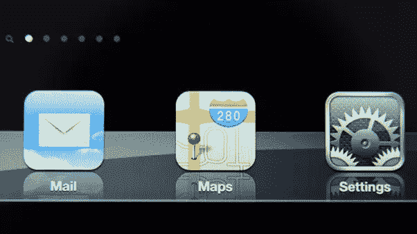
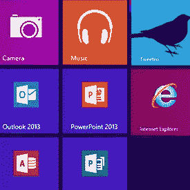

# Favicon:不断变化的角色

> 原文：<https://www.sitepoint.com/favicon-a-changing-role/>

许多开发者对图标的重要性不够重视，因此错过了让他们的网站更有特色、更令人难忘的机会。

如今，favicons 已经不仅仅是浏览器地址栏一端的一个有趣的小图标，它已经成为网站身份的一个重要组成部分，并被用于品牌推广。正确使用它们不仅可以帮助你在网站访问者中创造一个良好的第一印象，而且可以留下一个持久的印象。

1999 年，Internet Explorer 首次引入了图标的概念。它们以 ICO 格式生成，并作为`/favicon.ico`放在域的根文件夹中。从那以后，许多事情都变了。它们现在在不同的设备中用于多种目的。

网站使用 favicon 的最基本格式如下:

```
<link rel="shortcut icon" href="favicon.ico"/>
```

## rel 属性

上面声明的重要部分是`rel`属性。正是这个属性帮助浏览器识别 favicon 并正确显示它们。传统的 IE 浏览器使用“快捷方式”和“图标”来识别图像，并将其显示在浏览器标题和快捷方式栏中。在 HTML5 发布后，这已经被改为只有“图标”作为 favicon 的全局表示。

## 类型属性

属性有时可以定义浏览器是否显示图标。Internet Explorer 只能看到 ICO 文件的服务器 MIME，否则会忽略该文件。一般来说，对于 IE 来说，你必须用下面的方式来声明图标:

```
<!-- For IE6+ -->
<link rel="shortcut icon" href="path/to/favicon.ico" type="image/x-icon">
```

```
<!-- For IE6+ -->
<link rel="shortcut icon" href="path/to/favicon.ico">
```

```
<!-- For IE6+ -->
<link rel="shortcut icon" href="path/to/favicon.ico" type="image/vnd.microsoft.icon">
```

最近对 favicon 使用的最好的升级之一是接受 PNG 文件。您可以使用圆角透明图像作为网站的收藏夹图标。带有透明边缘的圆角在 ICO 格式中很难实现。像谷歌 Chrome 和 Mozilla Firefox 这样的浏览器允许使用 PNG 收藏夹图标。

这里需要注意的重要一点是，如果 ICO 格式和 PNG 格式都被声明，那么 ICO 格式将被所有浏览器使用，不管它们声明的顺序如何。

```
<!-- Works in Chrome, Safari, IE -->
<link rel="shortcut icon" href="path/to/favicon.ico">
```

```
<!-- Works in Firefox, Opera, Chrome and Safari ->
<link rel="icon" href="path/to/favicon.png">
```

## 尺寸

favicon 角色的另一个发展是大小。旧的浏览器使用 16×16 作为 favicon 的标准大小，而现代浏览器允许 32×32 大小的图标，这些图标后来被缩小到合适的大小。IE10 使用 32×32 大小的图标显示在地址栏中。

```
<!-- For IE 6-10 -->
<link rel="shortcut icon" href="favicon.ico"/>
<!-- For all other browsers -->
<link rel="icon" href="favicon.ico"/>
```

通过使用 PNG favicons，添加了另一个名为 size 的新属性，它决定了在`href`属性中指定的文件的大小。例如:

```
<link rel="icon" href="favicon16.png" sizes="16x16">

<link rel="icon" href="favicon32.png" sizes="32x32">

<link rel="icon" href="favicon48.png" sizes="48x48">

<link rel="icon" href="favicon64.png" sizes="64x64">

<link rel="icon" href="favicon128.png" sizes="128x128">
```

一般来说，Firefox 和 Safari 会在声明中首先使用 favicon。不同版本的 Chrome 有不同的偏好。Chrome for Windows 将使用 16×16 或 ICO，以先到者为准。如果存在的话，Chrome for Mac 将使用 ICO favicon，否则它将使用 32×32 大小的 favicon，并缩小到 16×16，以便在非 retina 设备中获得更高的清晰度。另一方面，歌剧没有任何这样的偏好；它从所有的收藏图标中随机选择一个。


## 最佳用途

因为 Internet Explorer 不支持 PNG 文件，而其他现代浏览器支持，所以我们可以在条件语句中包装 ICO 文件，并保持 PNG 文件打开。例如:

```
<!-- For IE -->

<!--[if IE]><link rel="shortcut icon" href="path/to/favicon.ico"><![endif]-->
```

```
<!-- For Modern Browsers with PNG Support -->

<link rel="icon" type="image/png" href="path/to/favicon.png">
```

但是我们在上面的声明中有一个问题！IE 10 不支持条件语句，PNG 文件也不支持。我们现在应该做什么？

我们可以将 ICO 文件放在根目录下，只对 PNG 文件进行声明。这样，Internet Explorer 将忽略`<icon rel="icon">`并优先选择根目录中的 ICO 映像。现代浏览器会找到`<icon rel="icon">`声明并使用 PNG 文件。

## 对于苹果设备

装有 iOS 1.1.3 及更高版本的 Apple 设备需要一种特殊类型的`rel`属性，只有此类设备才能识别。此类设备中的`rel`属性使用`apple-touch-icon`和`apple-touch-icon-precomposed`。

在这里，收藏夹图标不仅用于在浏览器中显示，也用于当一个网站被书签标记到应用程序屏幕时显示。为了在其他应用程序中脱颖而出，这种图标需要更高的分辨率和定制。



```
<!-- For rounded corners and reflective shine in Apple devices -->

<link rel="apple-touch-icon" href="favicon.png" />
```

```
<!-- Favicon without reflective shine -->

<link rel="apple-touch-icon-precomposed" href="favicon.png" />
```

值`apple-touch-icon-precomposed`用于指示设备不要给图标添加反射光，而是按原样使用。

Apple 设备的推荐基本尺寸为 57×57，90 度角。对于更高分辨率的屏幕，请使用 114×114 尺寸的图像。iPad 2 使用 72×72 尺寸，而 iPad 3 使用 114×114 的视网膜显示屏。

## 对于 Windows 8

Windows 8 使用磁贴的概念，可以选择将网站固定在主屏幕上。在这样的网站图标应该是高质量的，以便在屏幕上看起来很好。



```
<meta name="msapplication-TileColor" content="#D83434">

<meta name="msapplication-TileImage" content="path/to/tileicon.png">
```

注意，在上面的声明中，我使用了`meta`标签，而不是`link`标签。Windows 8 更喜欢在磁贴中看到图像的`meta`声明。标签`msapplication-TileColor`指定了填充到图块中的颜色，标签`msapplication-TileImage`指定了显示在图块中心的图像。

## 收藏夹图标的限制

由于在同一个位置重复检查，Favicons 有时会为您的网站带来额外的流量。如果找不到，有时甚至会在日志文件中创建垃圾 404 错误。

这些图标的另一个重要限制是不能自动加载新的图标。这个问题主要出现在 IE6-9 等较旧的浏览器中。

W3C 也没有对`rel`属性进行标准化，因此不同的用户代理定义了自己的版本。

在过去，收藏夹图标是许多类型的网络钓鱼攻击和窃听的主要目标，例如当它们没有被认证为安全时显示安全图标。

这些都是在决定是否以及如何在网站上使用图标时需要考虑的因素。它们都不应该阻止你创造性地使用图标。

如今，图标有了自己的重要性。它们的视觉冲击力将继续增长，你应该期待它们在功能上也有所增长。

## 分享这篇文章