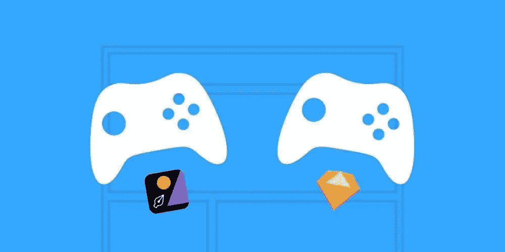
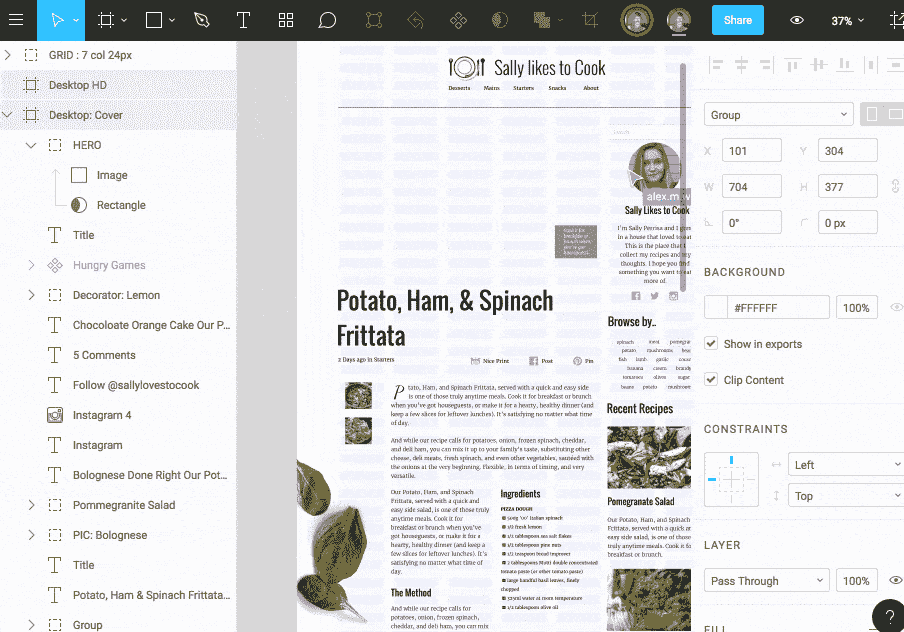
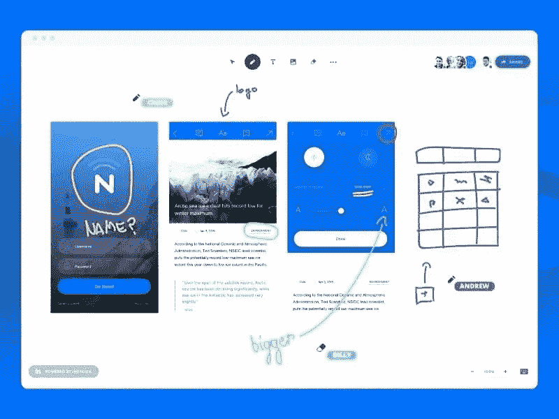
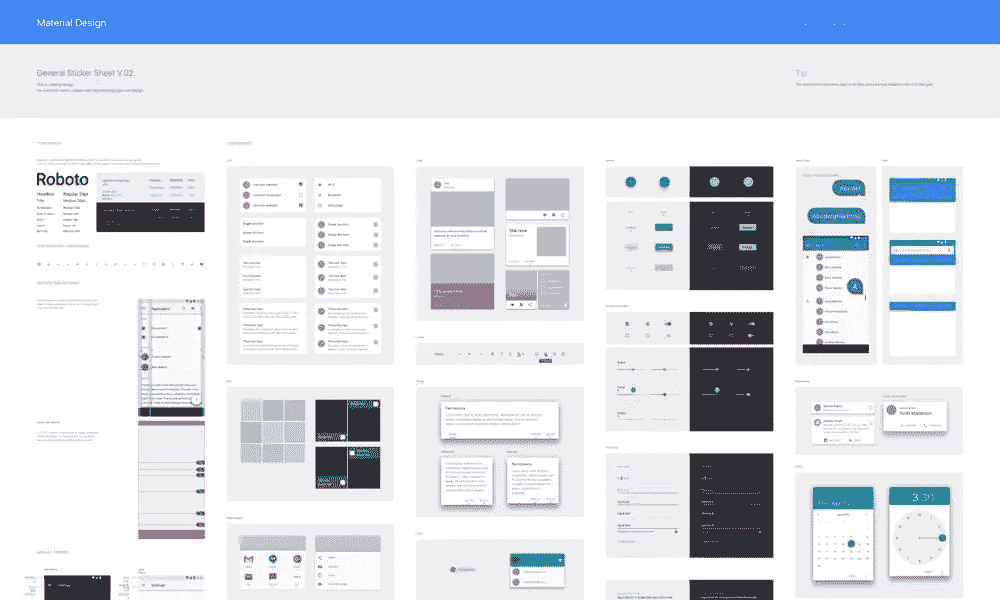

# Figma 或 Sketch:谁赢得了多人游戏设计之战？

> 原文：<https://www.sitepoint.com/figma-vs-sketch-who-wins-the-war-on-multiplayer-design/>

多人设计是指不止一个设计师在同一个设计文件上工作，由于多人是 Figma 应用程序的旗舰功能，设计师们一直在想:Figma 还是 Sketch？

在一个设计团队中工作(相对于只有一个常驻设计师的公司)每天变得越来越普遍，允许多个设计师同时处理同一个设计文件的技术也在不断改进。那么你应该使用哪个应用，如果你是唯一的设计师，你还需要多人游戏吗？

## 但是这个多人游戏的东西不就是一个大噱头吗？

有趣的是，直到大约六个月前，SitePoint 团队和我都会说“是”。

直到我们的共同编辑 Alex 开始在一个副业项目中使用 Figma，并开始与团队共享文件。他们发现:

1.  开发人员喜欢不用设计师的帮助，只用浏览器就能导出图形。
2.  初级设计师可以扩展高级设计师的工作，因为他们在同一个文件上合作，⏤，这就像一个厨师的厨房。
3.  项目经理不需要监视任何人来跟踪设计项目的进展。

尽管多人游戏(有时被称为*实时协作*)在 Google Docs 等应用中已经存在多年，但他们和其他人一样惊讶于它如此适合 UI 设计。

让我们更深入地了解一下 Figma，以及它与设计协作草图相比有何不同。

## Figma(面向充满活力的设计团队)

*   **平台** : web、macOS、Windows
*   功能:真人多人游戏设计
*   的**:充满活力的设计团队**

甚至在十年前，“用户体验设计师”这个词几乎还不存在(或者至少，它没有今天这么时髦)。多年来，我们逐渐认识到，优化用户体验有助于转化和留住客户。这就是为什么现在公司经常雇佣整个设计团队的原因，这也是为什么建立了 T2 图玛图-让大型设计团队的设计师在同一时间处理 T4 相同的设计文件。

Figma 不仅仅是将你的设计文件存储在云中，每个人都可以访问它的最新版本(我们已经用 Dropbox 做了一段时间了)。它实际上允许多个设计师同时编辑设计。它超级酷，是基于网络的，是真正的创新，而且因为有一个免费的计划，你真的不会因为和你的团队一起尝试它而失去什么。

你说，它与草图相比如何？就功能而言，我认为它更好。这取决于你最喜欢使用哪个应用程序，然而，我可以肯定地说，Figma 非常适合大型、充满活力的设计团队，设计师需要在不搞砸事情的情况下同时进行协作。目前，没有其他设计应用程序允许多个设计师在一个文件上进行实时协作。

## 素描+手绘(适用于较小的团队)

*   **平台** : macOS(或者 Windows + Photoshop + Craft)
*   **功能**:实时白板协作
*   **适用于**:需要反馈工具的中速团队

Sketch 一直受到用户界面设计师的高度赞扬，连续第二年成为用户界面设计中使用最多的应用程序(Photoshop 不再是第一名)。也就是说，Sketch 并不是*自动*的最佳解决方案——它取决于你的团队需要多高的协作水平。

Sketch 如此受欢迎的原因之一是其庞大的社区自制插件库。设计师可以通过构建自己的扩展(或下载现有的扩展)来扩展 Sketch 的功能。也许其中最令人印象深刻的是 InVision 的 [Craft 插件](https://www.invisionapp.com/craft)，它包括一个**协作白板工具**。

在一系列其他设计和原型制作工具中，Craft 提供了将您的设计镜像到草图内部的白板上的能力，您和您的团队成员可以使用文本、形状和手绘来注释、绘制和讨论设计。

Craft Freehand 对于那些只想向非设计师团队成员寻求反馈的个人设计师和中速团队特别有用，我个人认为最好的方法是使用经典的“展示，不要说”方法。并不是所有的团队都需要多人游戏设计，有些团队只需要多人游戏合作，比如 T2——Craft Freehand 是理想的选择。

Craft 包括 Freehand 之外的大量工具:逼真的内容来源、快速复制工具、共享资源库、原型功能，甚至能够[同步和移交设计](https://www.sitepoint.com/how-to-handoff-designs-with-sketch-and-invision/)。

*亚当·拉希德的[用户界面设计与素描课程](https://www.sitepoint.com/premium/courses/user-interface-design-with-sketch-4-2927)可以教你素描和工艺的基础知识(还有一些其他的东西！)一个下午。*

## Sketch + GitLab(用于轻量级协作)

*   **平台** : macOS(带草图)或 Windows(带 Photoshop)
*   **功能**:设计文件的版本控制
*   **适合**:需要适度协作的慢节奏团队

Sketch 43 最近引入了一种用 JSON 编码的[新文件格式](https://www.sitepoint.com/need-know-sketchs-new-file-format/)，它比传统的二进制格式更易于阅读。您知道吗，现在您可以将`.sketch`文件重命名为`.zip`文件，解压缩`.zip`文件，编辑 JSON 代码中的图层和样式，*重新压缩*文件，然后在 Sketch GUI 中看到变化。很酷的东西，试试吧！

这实际上意味着我们可以使用 GitLab 这样的应用程序来维护某种版本控制。对于那些不熟悉的人来说， [GitLab](https://gitlab.com/) 是一个代码库，如果两个不同的开发人员对一个代码文件做了他们自己的更改，GitLab 会帮助他们将这些更改合并成一个单一的、可用的文件，你可以在任何时候回滚到以前的版本(因此“版本”-控制)。

可悲的是，这对大型团队来说很少奏效，因为它通常会导致令人沮丧的代码冲突，极难合并；然而，在较小的团队中，开发人员不需要同时处理同一个文件，这是一种非常有用的方法，可以确保开发人员总是协作处理文件的最新版本。

但是如果 Git 是面向开发者的，我为什么要谈论它呢？因为 Sketch 新的基于 JSON 的文件格式，我们实际上可以提交。草图文件到 Git 存储库，并能够从协作版本控制工作流中受益。

GitLab 目前是草图文件版本控制的领导者。目前，该功能仅限于显示你的草图画板的 PNG 预览，但很快我们将能够看到两个版本并排的视觉比较。我们还可以期待 GitHub 和其他版本控制应用程序也开始适应草图文件。

如果你是一个 Sketch 用户，不想学习像 Figma、*和*这样的新工具，你的协作需求不是那么强烈，Sketch + GitLab 方法可能是你的小团队的正确工作流程。如果你热衷于了解 Git 如何在引擎盖下工作，我们的[快速入门 Git 书](https://www.sitepoint.com/premium/books/jump-start-git)在 94 个评论中获得了非常好的 4.5 星评级，我们的[Git 视频课程简介](https://www.sitepoint.com/premium/courses/introduction-to-git-2902)在 110 个评论中获得了 4.6 星评级！

## 那么，菲格玛还是素描？

无论你是在一个大型设计团队中工作，还是一个独行侠设计师，在某个阶段你仍然需要在设计上进行合作，即使只是向你的非设计师队友寻求反馈。为了充分利用你有限的时间，你需要一个鼓励生产力的工作流程。那么，你属于哪一类呢？

*   Figma(大型团队都在处理同一个文件)
*   草图+手工手绘(寻找协作反馈和头脑风暴工具的小团队)
*   Sketch + GitLab(轻量级设计协作)

**荣誉奖**

*   [Git Sketch 插件](http://mathieudutour.github.io/git-sketch-plugin/)(这种方法需要你手动创建新的分支并将更新提交给 GitHub)
*   [Abtract](https://www.abstractapp.com/) (一个专用于。草图文件⏤这个方法是自动的，但是只对 beta 测试人员可用)

请在下面的评论中告诉我们，当然，也请告诉我们你选择的方法效果如何！

## 分享这篇文章