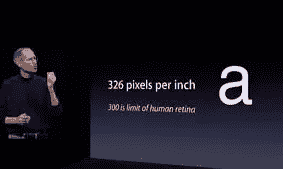
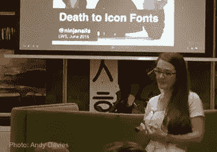
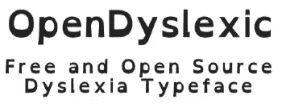
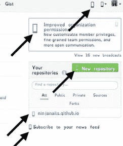

# 图标字体棺材里的最后一颗钉子？

> 原文：<https://www.sitepoint.com/final-nail-icon-fonts-coffin/>

使用矢量图形作为导航图标总是很有意义。

但似乎是视网膜屏幕(2011-ish)的到来真正点燃了这个想法下的火箭。

几乎在一夜之间，在标准屏幕上看起来很好的图标突然看起来像是用生锈的小刀从一份旧报纸上残忍地砍下来的。我们在可伸缩向量方面可能遇到的小麻烦突然变得很值得解决。

当时——就像今天一样——有两种方式向浏览器传递向量，每种方式都有其优缺点。

### Web fonts vs. SVG

尽管这两种技术已经存在了很长时间，但网络字体似乎占据了早期的领先地位。我们中的许多人已经习惯了使用字体，毫无疑问，像 [FontAwesome](http://fortawesome.github.io/Font-Awesome/) 这样的即插即用解决方案使入门变得更加容易。

但在过去一年左右的时间里，情况发生了变化。

当人们开始欣赏 SVG 的强大和灵活性时，图标字体的一些“陷阱”变得更加明显。其中包括:

*   字体支持的神秘拼凑([和 bug](http://www.sergiocosta.me/ie9-on-windows-phone-has-no-font-face-support-and/))
*   定位限制(CSS 行高、垂直对齐等)
*   字体文件重新创作开销
*   缺乏色调/颜色选择

我们现在可以在这个清单上增加一些新的项目。

几周前，Seren Davies ( [@Ninjanails](https://twitter.com/ninjanails) )在伦敦网络标准组织做了一个名为“[图标字体之死](https://speakerdeck.com/ninjanails/death-to-icon-fonts)”的演讲。Seren 患有阅读障碍，她详细描述了图标字体给她的浏览体验带来的一些问题。

### 为什么图标字体和阅读障碍是一个糟糕的组合？

字体选择对阅读障碍用户的可读性有很大影响。具有讽刺意味的是，尽管漫画 Sans 多年来一直受到鄙视，但它经常被诵读困难症患者视为最易读的字体之一。

这意味着对于阅读障碍的读者来说，用他们自己的更易读的字体覆盖网站上的默认字体是很常见的做法——也许是类似于[open readisc](http://opendyslexic.org/)的东西。

这就是我们遇到问题的地方。

为了加快速度，字体图标通常被捆绑成一个单一的网站范围的字体，也包含字母数字字符。图标被放置在字体的非指定“私有”部分。

当用户覆盖此字体时，他们会替换字母数字字符，但这些自定义图标没有替代品。我们得到的是又大又丑又没用的空盒子。

Github 为这个问题的出现提供了一个完美的例子。情况不太妙，对吧？

Seren 还谈到了屏幕阅读器对待图标字体的方式。使用 unicode 星形图标来表示“收藏夹”按钮可能会让人感觉非常聪明和足智多谋。

也就是说，直到你意识到一个屏幕阅读器愉快地宣布那个按钮是更神秘的“黑星”..最爱！..'。

不幸的是，当你把一个图形编码成一个印刷字符时，你几乎是在要求任何一个屏幕阅读器试图理解它。

也许我们已经意识到，将图片嵌入字体只是一种暂时的权宜之计，而不是真正的出路。

我想这就是我现在的处境。

Seren 的幻灯片中有许多有趣的见解，尽管目前在网上还看不到她的完整演讲。

希望我们在接下来的几个月里能有这样的机会。

## 分享这篇文章