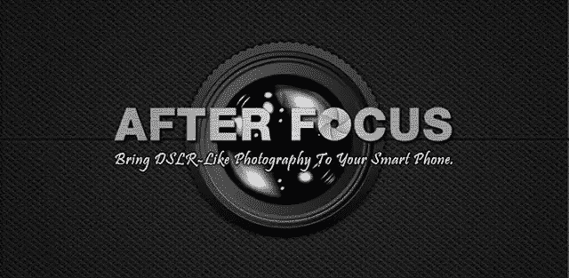
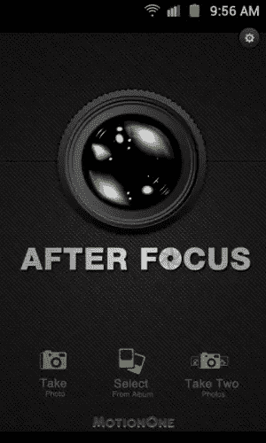
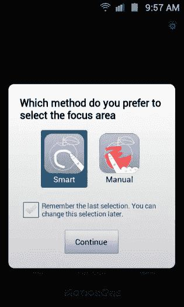
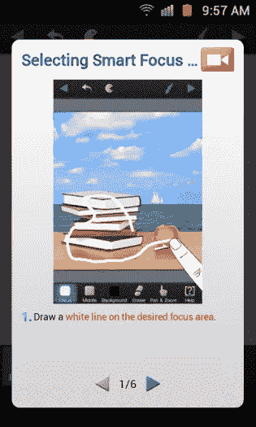
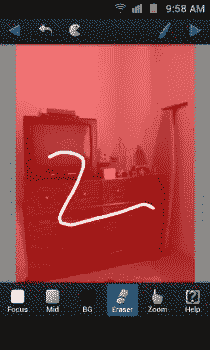
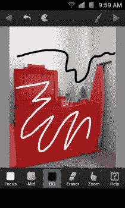
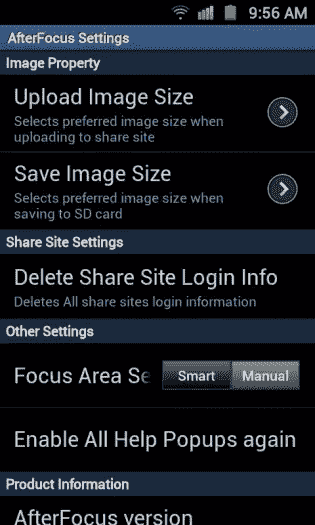

# 使用后焦微调您的照片

> 原文：<https://www.sitepoint.com/fine-tune-your-photos-with-afterfocus/>

智能手机上的摄影应用随处可见。在 BuildMobile 上，我们已经介绍了两个流行的 Android 摄影应用: [Camera ZOOM FX](https://www.sitepoint.com/enhance-your-photos-with-camera-zoom-fx/#fbid=qNYNdXzbGnf) 和 [Instagram](https://www.sitepoint.com/snap-edit-and-share-photos-with-instagram/#fbid=qNYNdXzbGnf) 。这些摄影应用程序的目的非常清晰明了:指向、拍摄和添加滤镜。选择你更喜欢哪个摄影 app，完全是基于你的喜好。

[AfterFocus](https://www.appm1.com/afterfocus/) 是摄影应用领域的最新成员之一。它的前提很简单，但你可能很快就会发现自己正在使用这个应用程序作为你手机照片库中的一个工具。让我们仔细看看！

* * *

* * *

### 主屏幕+编辑模式

* * *

* * *

AfterFocus 从一个华丽的主屏幕开始，突出显示了相机镜头和应用程序的名称。下面是应用程序的三种模式。您可以使用设备上任何可用的相机应用程序来拍摄照片，选择您已经拍摄的照片，或者您可以拍摄两张照片。第三个选项仅适用于专业版应用程序。下面是它的工作原理(根据应用程序的描述):

> 拍摄一个对象的照片并稍微向右移动以拍摄同一对象的另一张照片，它将分析图像并识别最近的对象，因此无需绘制焦点区域。(确保背景和对象的距离足够远，并且具有清晰的纹理，以获得很好的结果。)

我将在这里快速拍摄一张照片，向您展示该应用程序的编辑模式。

* * *

 

* * *

点击*拍照*或*从相册中选择*图标，你会看到两个“焦点区域”的选择——“智能”或“手动”这两种模式都会给你一个有用的视频演示和一系列步骤来为你的图像创建你的焦点区域。(如果您稍后改变主意，您可以在设置中进行编辑。)

完成后，点击右上角的蓝色箭头继续。

* * *

* * *

现在你已经完成了后焦图像。这让我想起了一点隐藏在 [Lytro](https://www.lytro.com/) 背后的概念，因为你可以在保存照片之前更改和编辑你的焦点区域。模糊功能有两种设置(镜头和动作)，五种光圈设置(方形 x2、五边形、八边形和圆形)，以及一种“渐变背景”效果。您还可以从两个滤镜部分下的多个 Instagram 类型滤镜中进行选择:

1.  **滤镜:**无效果，彩色蒙版，B & W，B & W，深褐色，深褐色，XProcess 1，XProcess 2，复古，古风
***   **滤镜 2:** 渐晕、散景、贴纸、锐化**

 **滤镜 2 下面的不同滤镜非常有趣，尤其是拾取聚光灯的散景滤镜。完成后，轻按顶部的磁盘图标保存照片，或轻按 iOS 共享图标将其共享到脸书、Twitter、Flickr、Picasa 或设备上的其他位置。

### 设置

与 Android 上的大多数摄影应用相比，AfterFocus 的设置非常简单。您可以选择更改上传图像的大小和保存图像的大小，并且可以删除您在脸书、Twitter、Flickr 和 Picasa 上的社交网络登录凭证。您还可以切换您的焦点区域设置，并在整个应用程序中重新启用帮助弹出窗口。

* * *

* * *

### 缺点

鉴于 AfterFocus 的工作原理，最好是在拍摄照片后用它来编辑照片，而不是用它来快速拍摄。(毕竟 app 在焦点之后叫*。)对我来说，一个很大的缺点是一旦你应用了你的焦点区域，图像的分辨率。上传到社交网络或保存到设备的最高分辨率是 800 像素(不确定是宽度还是高度，但我假设是 800 x 600 像素)。您也可以保存 1024 像素或 1600 像素的图像，但这些都是为该应用程序的专业版保留的(在本次审查时并不存在)。*

说到 Pro 版，app 的一种构图模式(拍两张照片)仅限于 Pro 版。根据 MotionOne 的说法，它将在 5 月份首次亮相，所以我想看看除了这两个以外，还有什么新功能。

另一个缺点是应用程序的用户界面。编辑模式中使用的一些图标有点放错了位置。吃豆人图标可以清理你的焦点区域，但我认为这个图标可以是更清晰的东西，比如扫帚和簸箕。橡皮擦图标看起来有点像感叹号，缩放图标是一个指向的手指(我认为里面带加号或减号的放大镜会更好)。

起初，分享似乎仅限于 Instagram、Gmail、脸书、Twitter、Flickr 和 Picasa，但如果你点击 Instagram/Gmail 组合图标，你就可以将照片分享到你设备上安装的其他几个服务。同样，这有点不直观，但是用正确的图标可以很容易地弄清楚。

我还注意到了重复的滤镜和光圈模式(我不能单凭名字来确定它们真正的区别；我不得不通过点击每一个来看)一旦我去编辑照片。这可以通过添加一些适当的措辞来更好地描述它们的不同效果来解决。我还希望渐晕、散景和锐化效果可以使用聚焦蒙版进行编辑。相反，在渲染聚焦遮罩后，它们会整体应用于图像。

### 结论

AfterFocus 是一个摄影应用程序，可以将 DSLR 风格的摄影风格带到你的智能手机上。你可以使用应用程序的两种对焦模式轻松创建景深效果，还可以添加 Instagram 风格的滤镜。用户界面在某些地方有点粗糙，图像输出分辨率较小，但这些将在未来的应用更新中解决(包括 5 月份推出的专业版)。

* * *

AfterFocus 在 Google Play 上免费提供，需要 Android OS v2.0 或更高版本才能运行。从下面的谷歌 Play 商店链接或点击提供的 Google Play 徽章下载该应用程序。

[下载后焦](https://play.google.com/store/apps/details?id=com.motionone.afterfocus)** 

## **分享这篇文章**