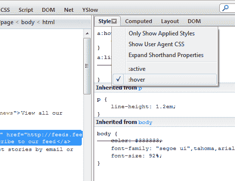

# 如何在 Firebug 中检查 CSS :active 和:hover 状态

> 原文：<https://www.sitepoint.com/firebug-css-active-hover-states/>

所有使用[萤火虫](http://getfirebug.com/)的人举起手来。你当然是。不这样做是愚蠢的。尽管 5 年来几乎每天都在使用 Firebug，我仍然在寻找新的特性和小部件。这里有一个你可能已经错过了…

当检查链接时，Firebug 显示默认的 CSS 状态，即应用于链接的样式。默认情况下，不显示:hover 和:active 样式。幸运的是，您可以通过点击**样式**并选择适当的选项来改变链接的状态:

悬停和/或活动状态的 CSS 将神奇地出现在控制台中。

这个特性非常有用——尤其是在调试复杂的 CSS 下拉菜单或其他效果时。目前，Firebug 是唯一支持它的开发人员控制台，尽管该特性已被添加到 webkit inspector 的每夜版本中。它最终会出现在 Chrome 和 Safari 中。

Opera 的蜻蜓控制台略有不同。如果您使用右键菜单选项检查一个元素，它将相应地设置:hover 或:focus，并显示 CSS 样式。但是，导航 DOM 树不会设置状态。

据我所知，该功能在 IE 的开发者工具中不可用——除非有人知道其他情况？

你还有其他有用的开发者控制台提示吗？

## 分享这篇文章