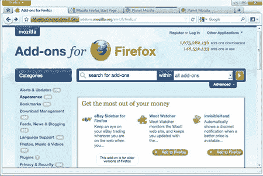
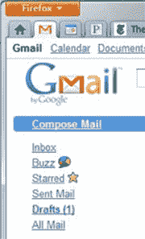

# 火狐 4.0 将会推出什么

> 原文：<https://www.sitepoint.com/firefox-4-features/>

尽管是最受欢迎的网络开发浏览器，Mozilla Firefox 已经被谷歌 Chrome 夺走了 T2 的市场份额。用户似乎正在转变，因为 Chrome 提供了更快、更干净、更整洁的浏览体验。

Mozilla 一直在监听。火狐主管 Mike Beltzner 透露了 4.0 版本的主要目标:

*   快速:让火狐变得更快*(这是他的原话——不是我的！)*
*   强大:支持新的开放、标准的 Web 技术(HTML5 和更高版本)，
*   授权:让用户完全控制他们的浏览器、数据和网络体验。

一张用户界面截图展示了浏览器是如何受到 Chrome 和 Opera 的影响的:

迈克声明:

> UI 设计师很久以前就知道，界面看起来越简单，速度就越快。用户用眼睛看得越少，他们处理的速度就越快，整个应用程序看起来也就越快。所以我们实际上是在通过改变界面的外观来让界面变得更快。

还将实现永久标签，以方便访问常用网站或在线应用程序，例如 GMail、Twitter 和 SitePoint.com。如果我没记错的话，这个功能最初是作为 Chrome OS 浏览器的一个想法提出来的。

Mozilla 还将移除最后剩下的模态对话框，并正在考虑一个类似 Chrome 的后台浏览器更新过程。

其他功能可能包括:

*   更好的操作系统集成，例如 Aero Peek 和多点触控支持
*   在 Windows 上支持 64 位操作系统和 Direct2D 硬件加速——可能会在 IE9 实现之前实现
*   CSS 过渡
*   改进的 DOM、视频、音频和画布性能
*   JavaScript 线程
*   远程 JavaScript 调试以及对控制台和 web 检查器的改进
*   一个新的权限管理器，用于控制如何与网站共享信息，例如地理位置数据和本地存储
*   一个内置的 Jetpack API，用于更容易的(非 XUL)扩展开发
*   WebGL

很棒的东西。但是不要抱太大希望——这些特性在 4.0 版本中都没有保证，而且，即使它们最终发布，你也需要等到 2010 年 11 月才能使用它们。

你的火狐 4.0 愿望清单上的第一项是什么？实际上，放弃吧——每个人都想提高速度！你第二想拥有的功能是什么？

## 分享这篇文章