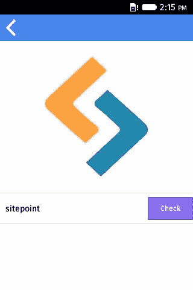
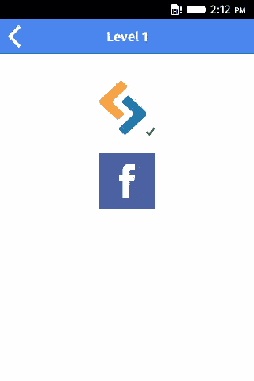

# 用 Ionic 框架开发 Firefox OS 游戏，第 2 部分

> 原文：<https://www.sitepoint.com/firefox-os-game-development-ionic-framework-part-2/>

在本教程的第一部分中，我们创建了大部分用户界面。现在我们将创建它的逻辑。

## 实现功能

我们想知道用户是否输入了正确的徽标名称。在`templates/logo.html`视图中，删除之前包含输入字段和按钮的 div，并替换为:

```
<div class="item item-input">
    <input type="text" name="logoName" ng-model="logo_name">
    <button class="button button-small button-royal" ng-click="check(logo_name)">
        Check
    </button>
</div>
```

UI 不会改变，但是这段代码确保了无论用户在字段中输入什么，都会传递给控制器中的函数`check()`。因此，我们现在通过在`LogoCtrl`控制器的末尾添加以下代码来实现该功能:

```
//check if the logo name is found
$scope.check = function(name) {
    if ( angular.isDefined(name) 
        && name.toUpperCase() == $scope.logo.name.toUpperCase() ) 
    {
        localStorage[$scope.logo.name] = true;
        alert("Correct!");
        history.back(-1);
    }
}
```



当用户输入正确的徽标名称时，一个变量被存储到本地存储中，以便我们稍后检查它的值。

在 Firefox OS 模拟器中，您可能会遇到一些屏幕键盘问题。如果是这样的话，在输入前尝试按 backspace 键，或者如果你幸运的话，得到一个真正的设备！

当用户点击一个他们已经玩过的标志时，我们不希望他看到同样的“输入标志名称”视图。因此，我们将`$location`依赖项添加到`LogoCtrl`控制器中，并在`$http.get()`末尾的`img.attr('src',$scope.logo.img);`之后添加这段代码:

```
//this logo has been seen  before
if (localStorage[$scope.logo.name]) {
    $location.path('/level/'+ $scope.lvl.id +'/logo-found/'+$scope.logo.id);
}
```

但是我们并没有首先创建这个应用程序状态，所以我们现在通过添加这个状态来创建它:

```
state('logo-found', {
    url         : '/level/:levelId/logo-found/:logoId',
    templateUrl : 'templates/logo-found.html',
    controller  : 'LogoCtrl'
})
```

在`app.config`中。用这个源代码创建`templates/logo-found.html`文件:

```
<ion-pane>
  <ion-header-bar class="bar-positive">
    <a ng-href="#/level/{{lvl.id}}">
    <button class="button icon-left ion-chevron-left button-clear button-white">
    </button></a>
  </ion-header-bar>

  <ion-content class="content">

    <div class="logo">
      
    </div>

    <h2>{{logo.name}}</h2>
  </ion-content>
</ion-pane>
```

每当用户点击一个以前找到的标志，应用程序会将他重定向到`templates/logo-found.html`视图。


我们差不多完成了。剩下的就是找到一种方法告诉用户哪些标志已经播放过了，而不需要点击这个标志。我们可以通过在每个播放的徽标的角上添加一个勾号来做到这一点。

为了实现这一点，我们应该修改`LevelCtrl`控制器内部的一小段代码。使加载该级别的徽标列表成为可能的代码部分:

```
for (var i=0;i<$scope.lvl.content.logos.length;i++) {
    var currLogo = $scope.lvl.content.logos[i];

    cnt += '<li>'+
        '<a href="#/level/'+$scope.levelId+'/logo/'+currLogo.id+'">' +
        ''+
        '</a>'+
        '</li>';
}
```

应该改成这样:

```
for (var i=0;i<$scope.lvl.content.logos.length;i++) {
    var currLogo = $scope.lvl.content.logos[i];

    if (localStorage[currLogo.name]) {
        cnt += '<li>'+
            '<a href="#/level/'+$scope.levelId+'/logo/'+currLogo.id+'">' +
            ''+
            '<i class="ion-checkmark"></i>' +
            '</a>'+
            '</li>';
    } else {

        cnt += '<li>'+
            '<a href="#/level/'+$scope.levelId+'/logo/'+currLogo.id+'">' +
            ''+
            '</a>'+
            '</li>';
    }
}
```

为什么？因为第二段代码有能力判断之前玩的是哪个 logo。对于这些徽标，它添加了`logo-found`类，改变了单击该徽标时应用程序将移动到的状态，还添加了一个图标。因此，让我们进行最后的 CSS 编辑，将它附加到`css/style.css`:

```
.ion-checkmark {
    color: green;
}
```



## 接下来呢？

尽管这个应用程序可以工作，但是它只有两个级别，每个级别有两个徽标。现在由你来添加更多的级别和每个级别的标志。为此，你必须在`data/levels.json`文件中添加一个新的关卡(或标志)。级别应由唯一的`id`、级别名称(`Level {id}`)及其内容指定。内容是具有两个属性的对象:

1.  `logo_num`(级别中的徽标数量)和
2.  `logos`，标志的数组。

徽标也是具有 3 个属性的对象:
1。独特的`id`标志
2。标志的`name`和
3。`img`，它保存了徽标图像的 url。

```
{
    "id"        : 1,
    "name"      : "Level 1",
    "content"   : {
        "logo_num"  : 2,
        "logos"     : [
            {
                "id"    : "sitepoint",
                "name"  : "Sitepoint",
                "img"   : "img/lvl1/sitepoint.jpg"
            },
            {
                "id"    : "fb",
                "name"  : "Facebook",
                "img"   : "img/lvl1/fb.png"
            }
        ]
    }
}
```

游戏的设计也可以改进。看一下[离子成分](http://ionicframework.com/docs/components/)。您可能会发现一些有用的东西，可以用于更好的设计。

## 结论

我们创造了另一个标志游戏。其他平台上有很多这样的软件(我的安卓手机上有四个)，但是在 Firefox OS 市场上只有一个。

看完这篇教程后，我希望我已经很好地向你介绍了如何为 Firefox OS 这样一个新的、不断发展的平台开发游戏。开发 Firefox OS 应用就像 HTML5 编码一样简单，所以每个人都可以(也应该)去做。记住，你可以在 [GitHub](https://github.com/sitepoint-examples/yalg) 上找到这个源代码。随意使用它，玩它，然后将你的(也许是第一个)Firefox OS 游戏提交到 Firefox OS Marketplace。

## 分享这篇文章