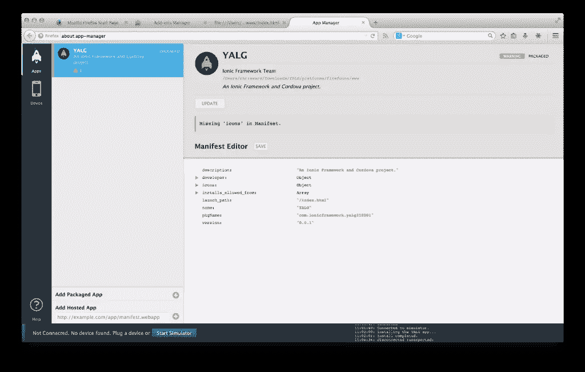
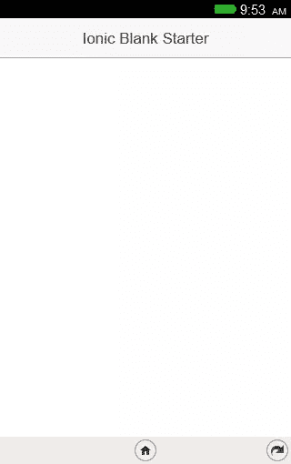
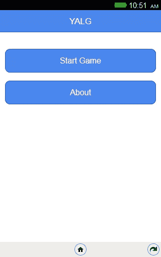
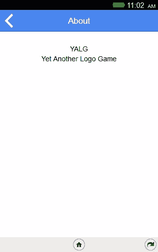
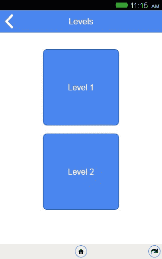
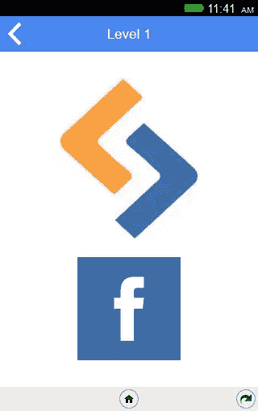
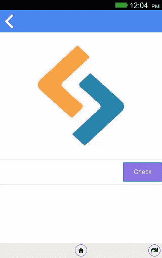

# 使用 Ionic 框架开发 Firefox OS 游戏

> 原文：<https://www.sitepoint.com/firefox-os-game-development-ionic-framework/>

我可能不需要谈论太多关于火狐操作系统，因为你们中的许多人已经知道了很多。如果没有，我们在 SitePoint 上有几篇关于这个主题的文章，[这篇文章是一个很好的起点。](https://www.sitepoint.com/series/getting-started-with-firefox-os/)

对于本教程，你需要知道的是 Firefox OS 应用程序仅仅是使用 HTML5、CSS 和 JavaScript 编写的 **webapps** 、*因此*。

我将创建一个简单的游戏，叫做 **YALG** ，*又一个标志游戏*。

## 我们需要什么？

首先是 Mozilla [Firefox](https://www.mozilla.org/en-US/firefox/new/) 浏览器。我们大多数人都没有 Firefox OS 设备，Firefox OS 模拟器是一个 Firefox 插件，你可以在这里找到[如何安装它](https://developer.mozilla.org/en-US/Firefox_OS/Using_the_App_Manager#Using_a_Firefox_OS_Simulator_Add-on)。

我决定为这个项目使用一个叫做 [Ionic](http://ionicframework.com/) 的框架。

*为什么是离子型？*

*   它很简单并且有很棒的文档
*   它允许跨平台开发，使用基于 Cordova 的 CLI
*   它基于最好的 Javascript 框架之一 AngularJS
*   它是面向移动的

### 开始项目

首先安装 Ionic，你可以通过跟随我们的 Ionic 教程来完成。然后使用 Ionic CLI 工具，执行:

```
ionic start YALG blank
cd YALG
ionic platform add firefoxos 
# You can add more platforms as required
```

这将创建一个新的支持 Firefox OS 的 Ionic blank 项目(您可能希望更改 Cordova 创建的`config.xml`文件中的一些内容)。

现在执行:

```
cordova prepare firefoxos
```

这使得您的应用程序可以部署到 Firefox OS。

要在模拟器中运行新的应用程序，添加`products/firefox/www`作为“打包的应用程序”,然后点击“更新”按钮。



您应该会在模拟器中看到类似这样的内容:



现在我们将对`www`文件夹中的源代码进行一些修改。

首先，打开`index.html`文件。将其内容更改为:

```
<!DOCTYPE html>
<html>
  <head>
    <meta charset="utf-8">
    <meta name="viewport" content="initial-scale=1, maximum-scale=1, user-scalable=no, width=device-width">
    <title>YALG</title>

    <link href="lib/ionic/css/ionic.css" rel="stylesheet">
    <link href="css/style.css" rel="stylesheet">
    <script src="lib/ionic/js/ionic.bundle.js"></script>

    <!-- cordova script (this will be a 404 during development) -->
    <script src="cordova.js"></script>

    <script src="js/app.js"></script>
  </head>
  <body ng-app="yalg">

      <ion-nav-view>
          <!-- View Goes Here -->
      </ion-nav-view>

  </body>
</html>
```

如果你不熟悉 AngularJS，你可能会注意到一些奇怪的事情。一个是`ng-app="yalg"`。这是一种告诉 HTML 页面它应该作为一个 Angular 项目工作的方式，由一个名为`yalg`的 Angular 模块管理。

还有一个是`ion -nav-view`。这是一个由 Ionic 框架创建的 HTML 指令，用于加载不同的视图，因为 AngularJS 是一个 MVC 框架。这些视图在`app.js`文件中定义，编辑该文件如下:

```
var app = angular.module('yalg',['ionic']);

app.config(function($stateProvider, $urlRouterProvider, $compileProvider) {
    $stateProvider.
        state('main', {
            url         : '/',
            templateUrl : 'templates/main.html',
            controller  : 'MainCtrl'
        }).
        state('levels', {
            url         : '/levels',
            templateUrl : 'templates/levels.html',
            controller  : 'LevelsCtrl'
        }).
        state('level', {
            url         : '/level/:levelId',
            templateUrl : 'templates/level.html',
            controller  : 'LevelCtrl'
        }).
        state('logo', {
            url         : '/level/:levelId/logo/:logoId',
            templateUrl : 'templates/logo.html',
            controller  : 'LogoCtrl'
        }). 
        state('about', {
            url         : '/about',
            templateUrl : 'templates/about.html',
            controller  : 'MainCtrl'
        });

    $urlRouterProvider.otherwise('/');

    /**
     * Firefox OS only
     * @see http://goo.gl/cKJyRm
     */
    $compileProvider.aHrefSanitizationWhitelist(/^\s*(https?|ftp|mailto|app):/);
});
```

使用`angular.module`我们创建了一个角度应用，称为`yalg`。接下来，我们定义不同的视图，以及应用程序如何访问每个视图。我们通过创建不同的应用程序状态来做到这一点。

对于每个不同的视图，我们添加一个用状态名定义的状态，以及一个包含状态的 URL、模板(*即*视图)和控制器的对象，这将在后面创建。

如果我们浏览到`#/`，`templates/main.html`的内容将被加载到`ion -nav-view>`标签中。如果我们浏览到`#/about`，就会加载`templates/about.html`的内容，以此类推。如果我们浏览到一个未知的 URL，那么`templates/main.html`的内容就会被加载，因为`$urlRouterProvider.otherwise('/');`。

最后一行代码是用 AngularJS 路由修复 Firefox OS 的一个问题的方法。如果您计划在任何其他平台上测试这个应用程序，**删除最后一行代码。**

如果您在模拟器中重新加载这个应用程序，您将只看到一个空白页。这是因为在标签之间，我们目前什么都没有，因为还没有创建模板，所以没有加载任何东西。要创建我们需要的视图，为您的应用程序创建这个目录树:

```
www
 |---- css
 |      |---- style.css
 |
 |---- img
 |---- js
 |      |---- app.js
 |
 |---- lib
 |---- templates
        |---- about.html
        |---- level.hmtl
        |---- levels.html
        |---- logo.html
        |---- main.html
```

`lib`文件夹包含对 Ionic 框架和项目有用的文件，所以让它保持原样。

将此添加到`templates/main.html`文件:

```
<ion-pane>
  <ion-header-bar class="bar-positive">
    <h1 class="title">{{appname}}</h1>
  </ion-header-bar>

  <ion-content class="content">

    <div class="main-view">
      <ul>
        <li>
          <a target="_blank" href="#/levels">
          <button class="button button-positive main-button">Start Game</button>
          </a>
          <br>
        </li>

        <li>
          <a target="_blank" href="#/about">
          <button class="button button-positive main-button">About</button>
          </a>
        </li>
      </ul>
    </div>

  </ion-content>
</ion-pane>
```

如果您不认识任何 HTML 标签，请在 [Ionic Framework 文档](http://ionicframework.com/docs/)中搜索它们。Ionic 增加了许多有用的标签/角度指示。

现在让我们通过编辑`css/style.css`文件给这个视图添加一些样式:

```
.content {
    text-align: center;
    padding-top: 8%;
}

.button.main-button {
    border-radius: 10px;
    width: 300px;
}

ul li {
    padding: 8px;
}
```

您可能已经注意到视图的标题是`{{appname}}`。我们不希望那样，我们希望标题是`YALG`。由于这是一个角度项目，它使用角度模板，`{{`和`}}`之间的一切都是由控制器评估的角度表达式。

当我们创建状态时，我们在这个视图中添加了一个名为`MainCtrl`的控制器。现在我们创建这个控制器。将此附加到`js/app.js`文件:

```
app.controller('MainCtrl', ['$scope',
    function($scope) {
        $scope.appname = "YALG";
        $scope.descr = "Yet Another Logo Game";
}]);
```

由于`main.html`有这个作为控制器，`{{appname}}`将被替换为`$scope.appname`的值。

运行:

```
cordova prepare firefoxos
```

在模拟器中运行更新的应用程序。目前为止事情应该是这样的:



单击按钮不会有任何作用，因为我们还没有添加他们的视图。将此添加到`templates/about.html`:

```
<ion-pane>
  <ion-header-bar class="bar-positive">
    <a target="_blank" href="#/">
    <button class="button icon-left ion-chevron-left button-clear button-white">
    </button></a>

    <h1 class="title">About</h1>
  </ion-header-bar>
  <ion-content class="content">

    <div class="about-view">
      {{appname}} <br>
      {{descr}}
    </div>

  </ion-content>
</ion-pane>
```

我们在这里添加了一个带有 [*离子图标*](http://ionicons.com/) 的后退按钮。重新加载应用程序后，您应该会在模拟器中看到以下内容:



点击`Start Game`按钮后，应出现所有级别的视图。因此，我们首先创建一个所有级别的列表，通过创建包含以下内容的`data/levels.json`文件:

```
[
    {
        "id"        : 1,
        "name"      : "Level 1",
        "content"   : {
            "logo_num"  : 2,
            "logos"     : [
                {
                    "id"    : "sitepoint",
                    "name"  : "Sitepoint",
                    "img"   : "img/lvl1/sitepoint.jpg"
                },
                {
                    "id"    : "fb",
                    "name"  : "Facebook",
                    "img"   : "img/lvl1/fb.png"
                }
            ]
        }
    },

    {
        "id"        : 2,
        "name"      : "Level 2",
        "content"   : {
            "logo_num"  : 2,
            "logos"     : [
                {
                    "id"    : "twitter",
                    "name"  : "Twitter",
                    "img"   :"img/lvl2/twitter.jpg"
                },
                {
                    "id"    : "android",
                    "name"  : "Android",
                    "img"   : "img/lvl2/android.jpg"
                }
            ]
        }
    }
]
```

我只创建了两个级别，每个级别有两个徽标，但是您可以按照相同的逻辑添加更多。我们创建这个`JSON`文件的原因是我们可以使用`ng-repeat`将它的内容加载到一个 HTML 页面中，而不需要太多的 Javascript 代码。

我们所需要的就是获取控制器中的内容。所以我们从实现`LevelsCtrl`开始。将此附加到`js/app.js`文件中:

```
app.controller('LevelsCtrl', ['$scope','$http',
    function($scope,$http) {

        //getting list of levels
        $http.get('data/levels.json').success(function(data) {
            $scope.levels = data;
        });
}]);
```

事情*就是*这么简单。你注意到 Angular 的*依赖注入*，将`$http`服务注入控制器。

现在要创建视图，将这段代码添加到您的`template/levels.html`:

```
<ion-pane>
  <ion-header-bar class="bar-positive">
    <a target="_blank" href="#/">
    <button class="button icon-left ion-chevron-left button-clear button-white">
    </button></a>
    <h1 class="title">Levels</h1>
  </ion-header-bar>

  <ion-content class="content">

    <ul class="level-list">
      <li ng-repeat="lvl in levels" class="level-card">
        <a target="_blank" href="#/level/{{lvl.id}}">
          <button class="button button-positive level-button">{{lvl.name}}</button><br>
        </a>
      </li>
    </ul>

  </ion-content>
</ion-pane>
```

只是为了好玩，把这个添加到`css/style.css`文件中，让你的应用看起来更好:

```
.level-button {
    height: 150px;
    width: 150px;
    border-radius: 8px;
}
```

这是您通过点击`Start Game`按钮获得的视图:



点击它们将不起作用…还不行！

现在我们实现另一个视图，`templates/level.html`。该文件将显示一个级别的所有徽标(本例中为 2 个徽标)。

首先创建图像文件，如`data/levels.json`所示。将该目录树添加到`www`文件夹:

```
img
 |---- lvl1
 |      |---- fb.png
 |      |---- sitepoint.jpg
 |
 |---- lvl2
        |---- twitter.jpg
        |---- android.jpg
```

现在将这个添加到您的`template/level.html`文件中:

```
<ion-pane>
  <ion-header-bar class="bar-positive">
    <a target="_blank" href="#/levels">
    <button class="button icon-left ion-chevron-left button-clear button-white">
    </button></a>
    <h1 class="title">{{lvl.name}}</h1>
  </ion-header-bar>
  <ion-content class="content">

    <ul id="logo-list">

    </ul>

  </ion-content>
</ion-pane>
```

如果您正在为另一个平台开发，您需要做的就是将这段代码放在`ul`标签之间(当然，还要创建控制器):

```
<li ng-repeat="logo in lvl.content.logos">
    <a target="_blank" href="#/level/{{levelId}}/logo/{{logo.id}}">
        
    </a>
</li>
```

不幸的是，`ng-src`不能在 Firefox 操作系统上运行，所以我们必须在`js/app.js`中手动操作:

```
app.controller('LevelCtrl', ['$scope', '$stateParams', '$http',
    function($scope,$stateParams,$http){
        $scope.levelId = $stateParams.levelId;

        //getting list of levels
        $http.get('data/levels.json').success(function(data) {
            $scope.levels = data;
            for (var i=0;i<$scope.levels.length;i++) {
                if($scope.levels[i].id == $scope.levelId) {
                    // lvl is the clicked level
                    $scope.lvl = $scope.levels[i];
                    break;
                }
            }

            var logoList = angular.element(document.querySelector('#logo-list'));
            var cnt = ""; //content of logoList
            for (var i=0;i<$scope.lvl.content.logos.length;i++) {
                var currLogo = $scope.lvl.content.logos[i];

                cnt += '<li>'+
                    '<a target="_blank" href="#/level/'+$scope.levelId+'/logo/'+currLogo.id+'">' +
                    ''+
                    '</a>'+
                    '</li>';
            }
            //set the desired content
            logoList.html(cnt);

        });
}]);
```

您可以在这里看到另一个依赖注入，即`$stateParams`服务。这个角度服务用于访问 URL 中的参数。当我们为这个视图创建状态时，我们将 URL 定义为`/level/:levelId`。这里，`:levelId`是状态参数，`$stateParams`用于访问这些参数。

如你所见，使用这个

```
angular.element(document.querySelector('#logo-list'));
```

我们选择了一个 DOM 元素，就像使用

```
$('#logo-list')
```

在 jQuery 中。

AngularJS 附带了 jQuery 的一个很小的子集，叫做 [jqLite](https://docs.angularjs.org/api/ng/function/angular.element) 。使用这个子集，我们能够将所需的内容放在视图的`ul`标签之间。

这是重新加载到模拟器后您将得到的视图:



目前，当您单击徽标时，什么也不会发生。我们还需要添加另一个视图，最后一个视图，`templates/logo.html`。将以下代码添加到其中:

```
<ion-pane>
  <ion-header-bar class="bar-positive">
    <a ng-href="#/level/{{lvl.id}}">
    <button class="button icon-left ion-chevron-left button-clear button-white">
    </button></a>
  </ion-header-bar>

  <ion-content class="content">

    <div class="logo">
      
    </div>

     <div class="item item-input">
        <input type="text" name="logoName" ng-model="logo_name">
        <button class="button button-small button-royal" ng-click="check(logo_name)">
            Check
        </button>

    </div>

  </ion-content>
</ion-pane>
```

也将该控制器添加到`js/app.js`:

```
app.controller('LogoCtrl', ['$scope','$stateParams','$http',
    function($scope,$stateParams,$http){
        $scope.levelId = $stateParams.levelId;
        $scope.logoId = $stateParams.logoId;

        //getting list of levels
        $http.get('data/levels.json').success(function(data) {
            $scope.levels = data;
            for (var i=0;i<$scope.levels.length;i++) {

                //level found
                if($scope.levels[i].id == $scope.levelId) {
                    $scope.lvl = $scope.levels[i];
                    break;
                }
            }

            for (var i=0;i<$scope.lvl.content.logos.length;i++) {
                //getting the clicked logo as $scope.logo
                if($scope.lvl.content.logos[i].id == $scope.logoId) {
                    $scope.logo = $scope.lvl.content.logos[i];
                    break;
                }
            }

            var img = angular.element(document.querySelector('#logo-img'));
            img.attr('src',$scope.logo.img); //loading the image
        });
}]);
```

使用与上一个控制器相同的技术，我们加载被点击的徽标的图像。现在要做的最后一件事是添加一些 CSS:

```
.logo-img {
    height: 70px;
    width: auto;
}

.logo {
    padding-bottom: 20px;
}

.button.button-small {
    padding: 5px 20px;
}
```

最后一次重新加载，你的应用程序应该是这样的:



## 结论

我们还没有一个可用的游戏，但是我们有它的结构和一个可用的用户界面。在本教程的下一部分，我们将添加功能，把它变成一个真正的游戏！

## 分享这篇文章