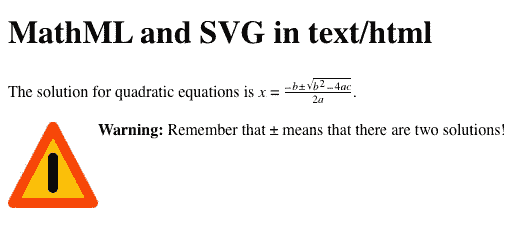

# Firefox 闪亮的新 HTML5 解析器

> 原文：<https://www.sitepoint.com/firefoxs-shiny-new-html5-parser/>

Mozilla 的 Firefox 开发者之一 Henri Sivonen 在 hacks.mozilla.org 的[上写了一篇关于 Firefox 新的 HTML5 解析器的](https://hacks.mozilla.org/)[客座博文](https://hacks.mozilla.org/2010/05/firefox-4-the-html5-parser-inline-svg-speed-and-more/)。

为什么 Firefox 需要一个新的 HTML 解析器？几个原因。首先，HTML5 规范是第一个真正描述用户代理(即浏览器)应该如何解析 HTML 以进行呈现的 HTML 规范。以前，由浏览器制造商自己决定如何解析 HTML 文档，并将其转换成 DOM 树进行显示。Firefox 的新解析器是该规范的第一个浏览器实现。如果你对更多的细节感兴趣，并且有一个下午的时间可以消磨，看看 WHATWG 的[解析 HTML 页面](http://www.whatwg.org/specs/web-apps/current-work/multipage/parsing.html)。如果你没有那么多时间，Sivonen 给你 CliffsNotes 版本:

> HTML5 解析算法有两个主要部分:标记化和树构建。标记化是将源流分成标记、文本、注释和标记内的属性的过程。树构建阶段获取标签、交错文本和注释，并构建 DOM 树。HTML5 解析算法的标记化部分比 Gecko 以前做的更接近于 Internet Explorer。一段时间以来，Internet Explorer 占据了大部分市场份额，所以网站通常都经过测试，在受到 IE 的 tokenizer 攻击时不会崩溃。树构建部分已经接近 WebKit 所做的了。在主流浏览器引擎中，WebKit 在 HTML5 之前拥有最合理的树构建解决方案。

因此，如果你现在获得了 Firefox 的[夜间版本，你将使用闪亮的新解析器浏览网页。这对 web 开发者意味着什么？出奇的少。正如西沃宁自己指出的，新解析器最重要的特性是你不会注意到任何区别。现有页面应该以几乎相同的方式呈现，并有一些微小的改进:解析引擎现在运行在与浏览器主 UI 不同的线程中，因此显然有一些性能提升；`innerHTML`现在运行速度提高了约 20%;Firefox 中许多长期存在的解析器错误已经被修复，这是从头重写解析器的副作用。](http://nightly.mozilla.org/)

然而，Sivonen 指出，新解析器有一个显著的特性可能会让一些开发人员兴奋:HTML5 文档可以包括直接混合到 HTML 标记中的内联 SVG 和 MathML，它们将分别呈现为图形和数学字符。他整理了一个[测试页面来演示这些新特性](http://hsivonen.iki.fi/test/moz/html5-hacks-demo.html)(你需要运行 Firefox 夜间版本才能正确查看)。该页面如下所示:

**展示内嵌 MathML 和 SVG 的演示页面**

创建该示例的代码简单得令人满意。查看该页面的源代码，了解我的意思。

当然，这离在日常网站中可用还有很长的路要走，但是窥视 HTML 和相关技术的未来，以及我们最喜欢的浏览器的未来总是很有趣的。感谢 Henri 让我们一窥 Mozilla 正在进行的伟大工作的幕后！

## 分享这篇文章