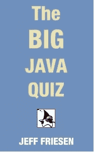
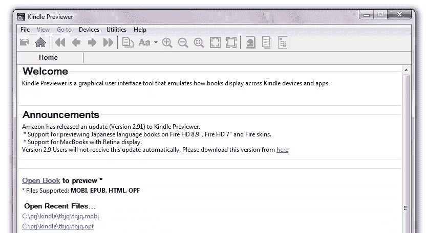
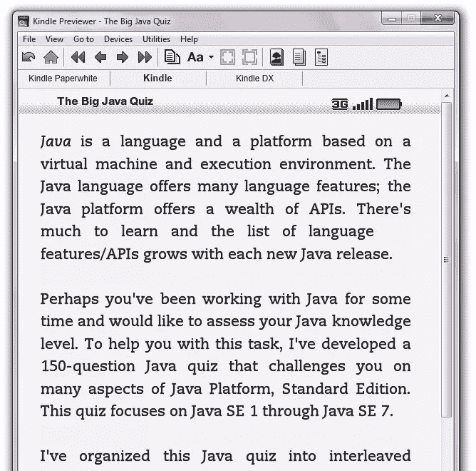
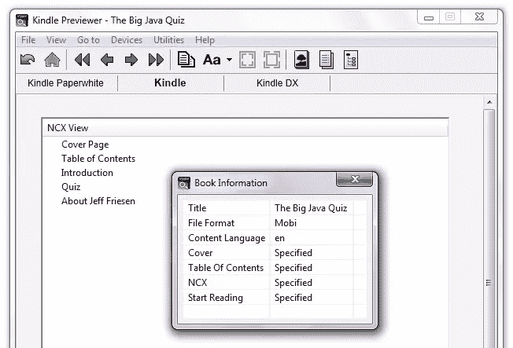
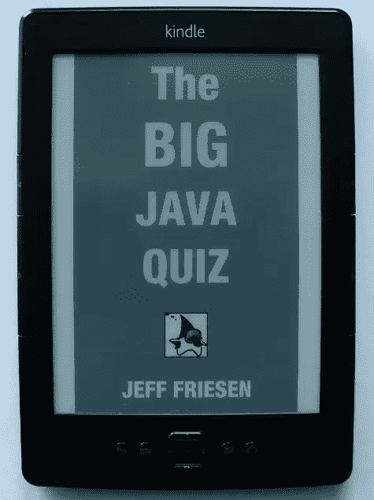
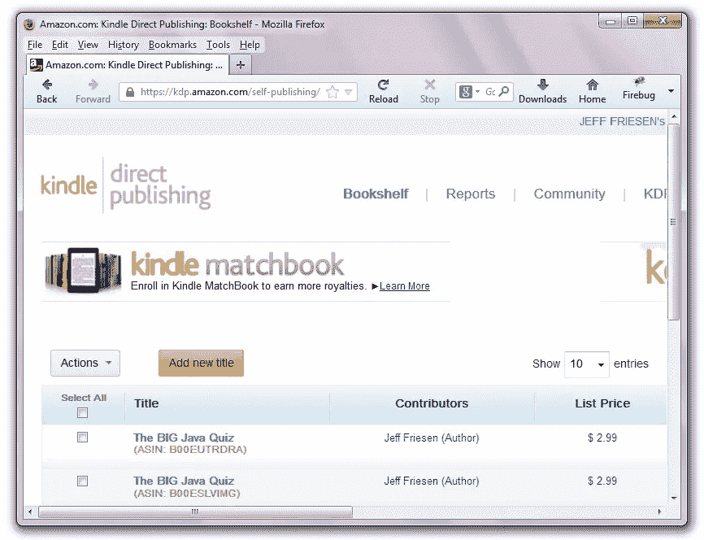
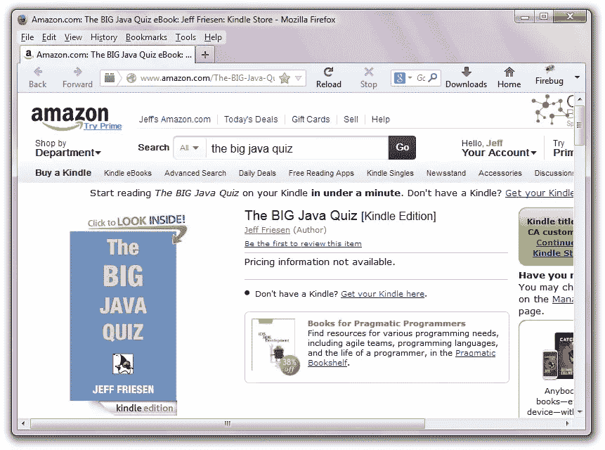

# 我的第一本 Kindle 图书:案例研究

> 原文：<https://www.sitepoint.com/first-kindle-book-case-study/>

几年来，我一直在考虑创作和出版一本 Kindle 图书。然而，其他项目排在第一位，我将这个想法搁置到最近。

几个月前，我买了我的第一台 Kindle 电子阅读器，这让我开始创作我的第一本书，我在这台设备上进行了测试，随后在亚马逊上出版了。通过反复试验，我从这个项目中学到了很多，我想我应该与你分享这个经验。也许当你决定创作并出版你的第一本 Kindle 图书时，你会发现它很有帮助。

## 找出要写的内容

弄清楚这本书的主题是我写这本书最难的部分。我想过写小说，比如一部流行的吸血鬼爱情小说，就像阿曼达·霍金最畅销的作品一样，但是我放弃了自己的想法，因为我对吸血鬼之间的爱情一点概念都没有。话又说回来，也许一部以史莱克为导向的讽刺这种浪漫的电影可能会被证明是有利可图的(并且值得一笑)。

因为我对技术更感兴趣，所以一本技术书籍正合我的胃口，我决定专注于创作这类书。此外，我在 Java 语言和平台方面的经验使我确信应该以 Java 为目标。

应该创作什么样的 Java 书？有许多不同的 Java 书籍，重复使用相同的“Java 入门”公式可能不会引起太多兴趣。我想要一些不同的东西，浏览了亚马逊的网站，阅读了各种 Java 电子书的描述和评论。

在我的探索过程中，我输入了搜索关键字 **Java 小测验**，得到了一个搜索结果。我终于发现了一个有待开发的类别，并决定写一本书来测试读者对 Java 语言概念的理解。

## 写这本书

在开始写作之前，我需要回答几个问题:书名是什么，我应该如何组织这本书，以及我应该采用高层次还是低层次的方法来写作？

我决定把我的书命名为【Java 大测验。此外，我避免了传统的章节格式，这不适合我心目中的书，本质上是一本单章的书。相反，我是这样组织这本书的:

*   封面图像页面
*   封面
*   目录
*   介绍
*   恶作剧
*   关于页面

对于这本书的测验部分，我选择了一种格式，在这种格式中，我在屏幕上呈现一个问题，然后在下一个屏幕上呈现它的答案。这种格式可以防止在屏幕上看到多个问题时分心，并提供关于答案的即时反馈。

编写 Kindle 书籍有两种基本方法:高级和低级。高级方法包括使用诸如微软 Word 的文字处理器和诸如[mobi packet Creator](http://www.mobipocket.com/en/downloadsoft/productdetailscreator.asp)的工具。低级方法包括直接处理 HTML、CSS 和使用 KindleGen 工具。我选择遵循低级的方法，这样我就可以完全控制格式并学习任何 Kindle 书籍的基本结构。

基于 PDF 的书籍
很难(如果不是不可能的话)创建一个技术 Kindle 书籍，它具有代码列表、表格和其他有用的功能，在所有 Kindle 设备上看起来都很棒。困难的两个原因:旧设备不支持新功能，不同设备的屏幕分辨率不同，这很难防止代码换行(看起来很可怕)。鉴于这些限制，你可以考虑制作一个好看的基于 PDF 的书，Kindle 支持。但是，亚马逊不让你在它的网站上卖 PDF 格式的书，何苦呢？

接下来，我获得了[亚马逊 Kindle 出版指南](http://kindlegen.s3.amazonaws.com/AmazonKindlePublishingGuidelines.pdf)来了解更多关于 Kindle 书籍的格式规则。我发现第 3 章“通用格式指南”非常有用。

最后，我开始写这本书，创建了一个`quiz.html`文件来存放测验，并用问题和答案填充它。清单 1 显示了这个文件的摘录(为了可读性，重新格式化)。

```
<!DOCTYPE html PUBLIC "-//W3C//DTD XHTML 1.1//EN" 
    "https://www.w3.org/TR/xhtml11/DTD/xhtml11.dtd">
<html >
<head>
</head>

<body>
<div>
<ol>
<li>
<b>True or false:</b> The Java language was developed by Oracle.
</li>

<mbp:pagebreak />
<b>Answer:</b> false<br><br>
The Java language was developed by Dr. James Gosling at Sun Microsystems.
Oracle acquired Java as part of its acquisition of Sun Microsystems on 
January 27, 2010.

<mbp:pagebreak />

<li>
Java's original name was what?<br><br>

<b>a)</b> Java<br>
<b>b)</b> Oak<br>
<b>c)</b> Project Green<br>
<b>d)</b> Star7
</li>

<mbp:pagebreak />
<b>Answer:</b> b

<mbp:pagebreak />

<li>
<b>True or false:</b> Java is partly patterned after the C and C++ languages.
</li>

<mbp:pagebreak />
<b>Answer:</b> true

<mbp:pagebreak />

<!-- ... -->

<mbp:pagebreak />
</li>
</ol>
</div>
</body>
</html>
```

**清单 1:** 摘自`quiz.html`的内容。

清单 1 展示了一个非常基本的格式，这是我在研究了与 [KindleGen 工具](http://www.amazon.com/gp/feature.html?ie=UTF8&docId=1000765211)相关的`samples.zip`文件中的指南样本后采用的。

我将`<head></head>`部分留空，尽管我可以插入一个`<title>`元素(它的缺失似乎并没有影响到这本书)。如果我计划使用 CSS，我可能还会在样式表文件中插入一个`<link>`元素。

我决定将测验编码为一个有序的是非交替列表和多项选择问题列表项，放在一个`<div></div>`部分。我可能会忽略除法，但在未来版本的测验中可能会用到它。

每个问题和答案都需要出现在自己的屏幕上。为了强制需要的分页，我使用了`<mbp:pagebreak />`，这是亚马逊支持的[定制 HTML 标签。](https://kdp.amazon.com/self-publishing/help?topicId=A1B8OEIMUN0HFY)

## 创建附加图书文件

这个文件只是我需要为我的书创建的几个文件之一。例如，我还需要创建这本书的封面图片和封面。

### 封面

亚马逊要求每本书都有两张封面图片:一张显示在亚马逊网站上，另一张显示在书的首页。虽然不是强制性的，但是我还创建了一个跟在封面图片后面的封面。

亚马逊的[创建目录/封面图片](https://kdp.amazon.com/self-publishing/help?topicId=A2J0TRG6OPX0VM)页面声明封面图片应该“具有 1.6 的理想高/宽比。”此外，出现在网站上的图像应该“最短边为 1563 像素，最长边为 2500 像素”(以获得最佳质量)。

我为网站创建了一个尺寸为 1563(宽)2500(高)的文件。我还创建了一个较小的版本(存储在`cover.jpg`中)，尺寸为 500(宽)800(高)，以出现在书中。图 1 显示了该图像。


**图 1:** 为获得最佳质量，封面图像的高宽比应为 1.6。

虽然封面图片后面不一定要有封面，但是包含一个封面是个好主意。在这一页上，你提供书名和你的作者姓名。您还可以包括版权信息或任何其他您认为重要的信息。清单 2 展示了`coverpg.html`的内容，它描述了我的书的封面。

```
<!DOCTYPE html PUBLIC "-//W3C//DTD XHTML 1.1//EN" 
    "https://www.w3.org/TR/xhtml11/DTD/xhtml11.dtd">
<html >
<head>
</head>

<body>
<div>

The <b style="font-size: x-large">BIG</b> Java Quiz<br><br>
by<br><br>
Jeff Friesen<br><br><br><br><br><br><br><br><br><br>
A <a href="http://tutortutor.ca">TUTORTUTOR.CA</a> PUBLICATION

</div>
</body>
</html>
```

清单 2: 封面的内容通常是居中的。

### 包括目录

封面后面是目录。这个 HTML 文件包含了书中各个章节的链接。它不包括页码，因为 Kindle 书籍是*可重排的*:改变字体大小会导致文本从当前屏幕流到下一个屏幕。清单 3 展示了我的书的目录。

```
<html  xml:lang="en">

<head>
<style>
p {margin-bottom: 1em; text-align: left}
p.ind {margin-left: 2em;}
</style>
</head>

<body>
<p><a href="intro.html">Introduction</a></p>
<p><a href="quiz.html">Quiz</a></p>
<p><a href="aboutjf.html">About Jeff Friesen</a></p>
</body>
</html>
```

清单 3: 目录不包括页码。

清单 3 展示了一些基本的 CSS 样式，这是我在浏览各种 Kindle 书籍样本时获得的。实质上，文本是左对齐的，在连续的行之间出现一些间距，并且文本从左侧缩进。我认为结果看起来不错——我将在本文稍后向您展示。

### 精心制作介绍

引言通常跟在目录后面，为读者提供该书的概述。因为它出现在书的开头附近，所以介绍很可能出现在亚马逊的“看里面”预览中，潜在的读者可以阅读它来了解更多关于这本书的信息以及是否购买它。清单 4 展示了我的书的介绍，它存储在`intro.html`中。

```
<!DOCTYPE html PUBLIC "-//W3C//DTD XHTML 1.1//EN" 
    "https://www.w3.org/TR/xhtml11/DTD/xhtml11.dtd">
<html >
<head>
</head>

<body>
<div>
<i>Java</i> is a language and a platform based on a 
virtual machine and execution environment. The Java 
language offers many language features; the Java 
platform offers a wealth of APIs. There's much to 
learn and the list of language features/APIs grows 
with each new Java release.<br><br>

Perhaps you've been working with Java for some time 
and would like to assess your Java knowledge level. 
To help you with this task, I've developed a 
150-question Java quiz that challenges you on many 
aspects of Java Platform, Standard Edition. This 
quiz focuses on Java SE 1 through Java SE 7.<br><br>

I've organized this Java quiz into interleaved 
true/false and multiple choice categories. To help 
you quickly determine if you've answered a question 
correctly, I've listed the question's answer on the 
page immediately following the question page. I 
hope you find this quiz helpful.
</div>
</body>
</html>
```

**清单 4:** 向读者介绍一本书。

从目录中链接到了`intro.html`文件——参见清单 3。

### 创建“关于”页面

我在介绍之后做了一个小测验(前面已经讨论过了)，并在小测验之后做了一个关于我的页面，提供了我的信息(包括联系信息)。我觉得这一页会给这本书提供一个合适的结尾——算是一个结论。清单 5 展示了我的书的 about 页面，它存储在`aboutjf.html`中。

```
<!DOCTYPE html PUBLIC "-//W3C//DTD XHTML 1.1//EN" 
    "https://www.w3.org/TR/xhtml11/DTD/xhtml11.dtd">
<html >
<head>
</head>

<body>
<div>
<br>

<b>Jeff Friesen</b> is a freelance tutor and software 
developer with an emphasis on Java. Check out my <a 
href="http://www.tutortutor.ca">TutorTutor.ca</a> 
website to learn more about me.<br><br>

If you have any comments/questions about this quiz or 
would like to see it expanded, let me know by sending 
an email to <a 
href="mailto:jeff@tutortutor.ca">jeff@tutortutor.ca</a>.
</div>
</body>
</html>
```

**清单 5:** 向读者提供一些作者信息。

从目录中链接到了`aboutjf.html`文件——参见清单 3。此外，它引用了一个名为`jeff.png`的图像文件。

### 指定图书的 OPF 文件

Kindle 书籍通常被创建为 [EPUB(电子出版物)文档](http://en.wikipedia.org/wiki/EPUB)，这些文档随后在上传到其自助出版平台(稍后讨论)时被转换为亚马逊自己的格式。EPUB 文档必须包含 OPF 文件。

*开放打包格式(OPF)文件*存储 EPUB 文档的元数据、文件清单和线性阅读顺序。清单 6 展示了我的书的文件`tbjq.opf`的内容——通常指定文件扩展名为`.opf`。

```
<?xml version="1.0" ?>

<package version="2.0"  unique-identifier="tbjq">

<metadata xmlns:dc="http://purl.org/dc/elements/1.1/" xmlns:opf="http://www.idpf.org/2007/opf">
<dc:title>The BIG Java Quiz</dc:title>
<dc:language>en</dc:language>
<dc:identifier id="tbjq" opf:scheme="uuid">urn:uuid:e9d31c40-0cfe-11e3-8ffd-0800200c9a66</dc:identifier>
<dc:creator>Friesen, Jeff</dc:creator>
<dc:publisher>Friesen, Jeff</dc:publisher>
<dc:date>2013-08-24</dc:date>
<dc:subject>Quiz</dc:subject>
<dc:description>A quiz on the Java language, various APIs, and other aspects of this 
    technology.</dc:description>
<meta name="cover" content="BookCover" />
</metadata>

<manifest>
<item id="BookCover" media-type="image/jpg" href="cover.jpg"></item>
<item id="cp" media-type="application/xhtml+xml" href="coverpg.html"></item>
<item id="tc" media-type="application/xhtml+xml" href="toc.html"></item>
<item id="intro" media-type="application/xhtml+xml" href="intro.html"></item>
<item id="quiz" media-type="application/xhtml+xml" href="quiz.html"></item>
<item id="aboutjf" media-type="application/xhtml+xml" href="aboutjf.html"></item>
<item id="MyNcx" media-type="application/x-dtbncx+xml" href="toc.ncx"></item>
</manifest>

<spine toc="MyNcx">
<itemref idref="cp"/>
<itemref idref="tc"/>
<itemref idref="intro"/>
<itemref idref="quiz"/>
<itemref idref="aboutjf"/>
</spine>

<guide>
<reference type="cover" title="Cover" href="coverpg.html"></reference>
<reference type="toc" title="Table of Contents" href="toc.html"></reference>
<reference type="text" title="Beginning" href="intro.html"></reference>
</guide>

</package>
```

**清单 6:** 提供一本书的元数据、清单、书脊和指南。

OPF 文件的根元素是`<package>`。这个元素需要一个`version`属性，标识文档符合的 OPF 版本(例如`2.0`)，还需要一个`unique-identifier`属性，其值标识提供图书标识号的元数据元素。

嵌套在`<package>`中的是`<metadata>`、`<manifest>`、`<spine>`和`<guide>`元素。前三个要素是强制性的；`<guide>`是可选的。

#### 探索`<metadata>`

`<metadata>`元素提供了关于整个出版物的信息。它通过由都柏林核心元数据倡议(DCMI)标准化的一组元素来提供这些信息，这些元素通常被称为 [*都柏林核心*](http://en.wikipedia.org/wiki/Dublin_Core) 。

在各种都柏林核心元数据元素中，EPUB 只要求指定`<title>`、`<language>`和`<identifier>`:

*   `<title>`提供书名(如`The BIG Java Quiz`)。
*   `<language>`以 [RFC 3066](http://www.ietf.org/rfc/rfc3066.txt) 格式或其后续版本(如更新的 [RFC 4646](http://www.ietf.org/rfc/rfc4646.txt) )提供图书内容的语言。例如，`en`将英语标识为我的图书的语言。
*   `<identifier>`提供图书的唯一标识符，如 ISBN 或 URL。该元素的`id`属性的值应该与`<package>`元素的`unique-identifier`属性的值相匹配。`scheme`属性指定了唯一的标识符。我决定使用一个[通用唯一标识符](http://en.wikipedia.org/wiki/Universally_unique_identifier)，并通过一个[在线工具](http://www.famkruithof.net/uuid/uuidgen)获得了一个。

我还指定了`<creator>`、`<publisher>`、`<date>`、`<subject>`和`<description>` Dublin Core 元数据元素。查看[使用都柏林核心元素](http://dublincore.org/documents/usageguide/elements.shtml)了解更多信息。

`<metadata>`元素可以包含`<meta>`元素，这些元素提供 Dublin Core 描述的数据之外的任意数据项(这些元素属于`dc:` XML 名称空间)。只需要一个这样的元素来识别书的封面图像(不是亚马逊网站上的封面图像)。其`name`属性必须设置为`cover`；它的`content`属性必须设置为`<manifest>`元素的嵌套`<item>`元素之一的`id`属性的值。

#### 探索`<manifest>`

`<manifest>`元素通过其嵌套的`<item>`元素提供了作为出版物一部分的所有文件(例如，HTML 文件、图像文件和样式表)的列表。除了链接到 about 页面的`jeff.png`文件之外，我已经识别了所有文件——我忘了包括`jeff.png`(它的省略没有引起任何问题)。

最后一个`<item>`元素很有趣，因为它引用了一个名为`toc.ncx`的文件。稍后你会学到更多关于 NCX 的资料。现在，注意`MyNCX`，它是`<item>`元素的`id`属性的值，也是后续`<spine>`元素的`toc`属性的值。

#### 探索`<spine>`

元素指定了文档的线性阅读顺序。它通过一系列嵌套的`<itemref>`元素来完成这个任务，这些元素的`idref`属性引用清单描述的文档项(例如目录或简介)。

我已经指定封面先出现。此页之后是目录页，接着是简介，然后是测验，最后是关于页。如果我从书脊上省略了这些项目中的任何一个，丢失的项目就会出现在书的最后(至少在 Kindle Previewer 工具中，稍后讨论)。

#### 探索`<guide>`

可选的`<guide>`元素通过其嵌套的`<reference>`元素提供了书籍的基本结构组件。示例包括封面图像和目录。它的存在允许 Kindles 和其他电子阅读设备直接导航到这些项目(而不必遍历中间项目)。

例如，Kindle 预览器工具包含一个 **`Go to`** 菜单，用于导航到书的各个部分。其中三个菜单项是**`Table of Contents`****`Beginning`**和 **`Cover`** 。选择这些菜单项应该会把你带到书的目录页、开头和封面。

您可以通过指定一个`<reference>`元素来标识目录的 HTML 文件，该元素的`type`属性被设置为`toc`，其`href`属性标识该文件。类似地，您可以通过指定一个`<reference>`元素来标识开始页面的 HTML 文件，该元素的`type`属性被设置为`text`，其`href`属性标识该文件。Kindle 预览器(以及我测试的 Kindle 设备)似乎忽略了 cover `<reference>`元素。

**Kindle Previewer 和起始页**当你在 Kindle Previewer 中打开一本书时，它会显示被标识为起始页`<reference>`元素的值的 HTML 文件的内容。

### 指定图书的 NCX 文件

虽然不是 EPUB 规范的一部分，但 EPUB 文档通常包括一个*XML 导航控制文件(NCX)文件*，它包含 EPUB 文档的层次目录，传统上被命名为`toc.ncx`(我一直坚持这个传统)。

带有键盘的老式 Kindles 处理 NCX 文件以获得其预定义的书签集(通常用于章节或章节中的主要部分)。这些设备可以通过使用设备的五向控制器上的左右箭头在这些预设之间跳转。Kindle Touch 和 Kindle Fire 似乎不使用 NCX 文件，但提供一个支持旧版本 Kindle 的文件还是值得的。

清单 7 展示了我的书的`toc.ncx`文件。

```
<?xml version="1.0" encoding="UTF-8"?>
<!DOCTYPE ncx PUBLIC "-//NISO//DTD ncx 2005-1//EN" "http://www.daisy.org/z3986/2005/ncx-2005-1.dtd">
<ncx  version="2005-1" xml:lang="en">
<head>
<meta name="dtb:uid" content="urn:uuid:e9d31c40-0cfe-11e3-8ffd-0800200c9a66"/>
<meta name="dtb:depth" content="1"/>
<meta name="dtb:totalPageCount" content="0"/>
<meta name="dtb:maxPageNumber" content="0"/>
</head>

<docTitle><text>The BIG Java Quiz</text></docTitle>
<docAuthor><text>Friesen, Jeff</text></docAuthor>

<navMap>
<navPoint id="navpoint-1" playOrder="1">
<navLabel><text>Cover Page</text></navLabel>
<content src="coverpg.html"/>
</navPoint>

<navPoint id="navpoint-2" playOrder="2">
<navLabel><text>Table of Contents</text></navLabel>
<content src="toc.html"/>
</navPoint>

<navPoint id="navpoint-3" playOrder="3">
<navLabel><text>Introduction</text></navLabel>
<content src="intro.html"/>
</navPoint>

<navPoint id="navpoint-4" playOrder="4">
<navLabel><text>Quiz</text></navLabel>
<content src="quiz.html"/>
</navPoint>

<navPoint id="navpoint-5" playOrder="5">
<navLabel><text>About Jeff Friesen</text></navLabel>
<content src="aboutjf.html"/>
</navPoint>
</navMap>
</ncx>
```

**清单 7:** 提供一本书的导航控制信息。

NCX 文件以一个`<head>`元素开始，它通过嵌套的`<meta>`元素提供各种元数据。每个`<meta>`元素的`name`属性标识一种
元数据，它的`content`属性提供数据。

`name`属性的值命名一个元数据项。这个名字以`dtb:`开头，其中`dtb`是[数字有声读物](http://en.wikipedia.org/wiki/DAISY_Digital_Talking_Book)的首字母缩写。使用了以下名称:

*   `dtb:uid`:图书的唯一标识符，它必须与 OPF 文件的`<dc:identifier>`元素中的`scheme`属性值相匹配。
*   `dtb:depth`:后续`<navmap>`元素的深度——初始深度为 1。
*   `dtb:totalPageCount`:被 Kindle 忽略，这也是它的`content`设置为 0 的原因。
*   `dtb:maxPageNumber`:被 Kindle 忽略，这也是它的`content`设置为 0 的原因。

NCX 文件继续使用指定书名和作者的`<docTitle>`和`<docAuthor>`元素，这些元素必须与 OPF 文件中的对应元素相匹配。

NCX 文件以标识导航地图的`<navMap>`元素结束。该地图由嵌套的`<navPoint>`元素组成，这些元素标识了代表书籍中重要点的导航点，读者可以直接导航到这些点；例如，移动到特定章节的开头。

每个`<navPoint>`元素必须有一个唯一的`id`值——我已经指定了带前缀的`navpoint-`值。该元素还必须有一个`playOrder`属性，该属性具有一个从`1`开始的唯一的基于整数的值，这表示这是地图中的第一个导航点。

`<navLabel>`元素包含可能出现在目录中的文本(通过嵌套的`<text>`元素)。`<content>`元素标识了当读者导航到这一点时要显示其内容的 HTML 文件。

通过使用某些 Kindle 设备支持的五向控制器上的左/右箭头键，我的 NCX 文件可以快速从封面导航到目录页、简介页、测验页的开始、关于页。

## 生成并测试图书

在为我的 Kindle book 创建了必要的文件之后，我需要将它们合并成一个文件并测试这个文件。我使用亚马逊的 KindleGen 工具来生成这本书，并使用亚马逊的 Kindle 预览工具和我的 Kindle 电子阅读器设备来测试它。

### 用 KindleGen 生成图书

KindleGen 是一个命令行工具，允许出版商在一个自动化的环境中使用各种源内容，包括 HTML、XHTML 或 EPUB。这个工具将源内容转换成支持 [Mobipocket](http://en.wikipedia.org/wiki/Comparison_of_e-book_formats#Mobipocket) 和[亚马逊 KF8](http://en.wikipedia.org/wiki/Comparison_of_e-book_formats#KF8_.28Amazon_Kindle.29) 格式的单一文件。

你可以[下载适用于 Windows XP/Vista/7、Mac OS 和 Linux 平台的](http://www.amazon.com/gp/feature.html?ie=UTF8&docId=1000765211) KindleGen。我为我的 Windows 7 平台下载了 KindleGen v2.9，解压缩了它的发行版归档文件，并将`kindlegen.exe`可执行文件的路径添加到我的`PATH`环境变量中。

在确保当前目录包含了这本书的`quiz.html`、`cover.jpg`、`coverpg.html`、`toc.html`、`intro.html`、`aboutjf.html`、`jeff.png`、`tbjq.opf`和`toc.ncx`文件之后，我执行了下面的命令行来生成这本书:

```
kindlegen tbjq.opf
```

KindleGen 没有发布任何警告信息，并为我的书创建了一个`tbjq.mobi`文件。该文件本质上是一个 ZIP 文件，包含以下结构:

```
html/aboutjf.html
html/coverpg.html
html/intro.html
html/quiz.html
html/toc.html
image/cover.jpg
image/jeff.png
tbjq.opf
xml/toc.ncx
```

### 使用 Kindle 预览器和真实设备测试图书

不是每个有抱负的 Kindle 作者都有一个真正的 Kindle 设备，更多的人没有多个 Kindle 设备来测试他们的创作。为了帮助没有 Kindle 设备的开发者，亚马逊发布了一款 Kindle 模拟器，名为 [Kindle Previewer](http://www.amazon.com/gp/feature.html?ie=UTF8&docId=1000765261) 。

您可以[下载适用于 Windows XP/Vista/7 和 Mac OS 平台的](http://www.amazon.com/gp/feature.html?ie=UTF8&docId=1000765261) Kindle 预览器。我为我的 Windows 7 平台下载了 Kindle Previewer v9 并运行了安装程序。安装 Kindle 预览器后，我运行了这个工具。图 2 显示了开始屏幕的一部分。


**图 2:** 打开的屏幕还提供了访问帮助、更改默认设置等功能的链接。

为了用 Kindle 预览器测试我的书，我从 **`File`** 菜单中选择了 **`Open Book`** 菜单项，并从打开的对话框中选择了`tbjq.mobi`。图 3 显示了这本书的开始页面，恰好是导言。

[](https://www.sitepoint.com/wp-content/uploads/2013/09/kindlefig3.jpg) 
**图 3:** Kindle Previewer 将介绍页作为开始页。该页面将显示在基本的 Kindle 电子墨水设备上。

Kindle 预览器提供了丰富的菜单系统和导航控件。例如，您可以通过从 **`Go to`** 菜单中选择一个菜单项来指定您想要进入的图书位置。此外，您还可以选择一组 Kindle 设备，从 **`Device`** 菜单中选择“组”菜单项，从中选择一台设备进行仿真。

另一个功能是能够通过从 **`View`** 菜单中选择 **`NCX View`** 菜单项来获得图书的 NCX 视图，并且能够通过从同一菜单中选择 **`Book Information`** 来查看图书信息。图 4 显示了结果。


**图 4:** 可以查看一本书的 NCX 层次结构和关于该书的附加信息。

虽然 Kindle 预览器是测试一本书的有用工具，但在实际的 Kindle 设备上测试这本书更有帮助。在 Kindle Previewer 上测试了我的书之后，我把我的 Kindle 设备插入电脑，并把`tbjq.mobi`传输到设备上。图 5 显示了封面图像屏幕。


**图 5:** 一张 500×800 像素的封面图片非常适合我的 Kindle 设备的屏幕。

## 出版并变得富有和出名(或不)

在测试了这本书之后，我决定通过 Kindle Direct Publishing (KDP)在亚马逊的 Kindle 商店中发布它。如果你从未使用过亚马逊的自助出版平台，你首先需要创建一个账户(这是免费的)。通过将您的浏览器指向[KDP 主页](https://kdp.amazon.com/self-publishing/signin)来完成这项任务，并按照指示创建您的帐户。

每次你登录 KDP，你将被带到你的书架，它提供了你已经出版的所有书籍的列表(每本书的相关详细信息)，它提供了对各种报告的访问，以便你可以看到你的书籍的销售情况，它还提供了对其他功能的访问。例如，图 6 展示了我的书架的一部分。


**图 6:** 书架上列出了你所有的书条目。

为了添加我的书，我点击了 **`Add New Title`** 按钮，然后填写了 **`Your book`** 和 **`Rights & Pricing`** 屏幕。最后，我点击了 **`Save and Publish`** 按钮。

在 **`Your book`** 屏幕上，你有机会上传或制作一本书的封面，它会出现在亚马逊的网站上。我点击 **`Browse for image...`** 按钮，按照指示上传了我的`cover_big.jpg`文件。

为什么有两个【Java 大竞猜参赛作品？在发布了底部条目后，我改变了对其封面图像的想法，并创建了一个新的图像。然后我从书架页面的 **`Actions`** 下拉列表中选择了 **`Edit book details`** ，上传了新的封面图片。

不幸的是，亚马逊不会在其网站上更新封面图片，所以我取消了我的书，但无法删除它。我决定用新的封面图片重新出版这本书，忘记最初的尝试。教训:第一次就把书的封面图像做好！

图 7 展示了在其自己的亚马逊网页上发布的【Java 大测验。


**图 7:**Java 大测验等待第一次复习。

## 结论

创作和出版我的第一本 Kindle 书是一次不寻常的经历。我犯了一些错误，但学到了很多。如果你决定创作自己的 Kindle 图书，希望这篇文章的信息对你有所帮助。将来，我可能会为 Kindle 再创作一本书。也许这一次，我会专注于一部以史莱克为导向的讽刺吸血鬼的电影，他们相互浪漫，并以写 Kindle 书籍为生！

## 分享这篇文章