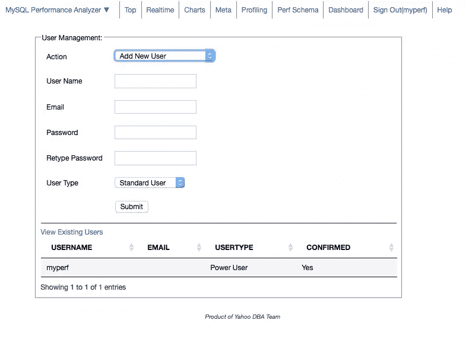
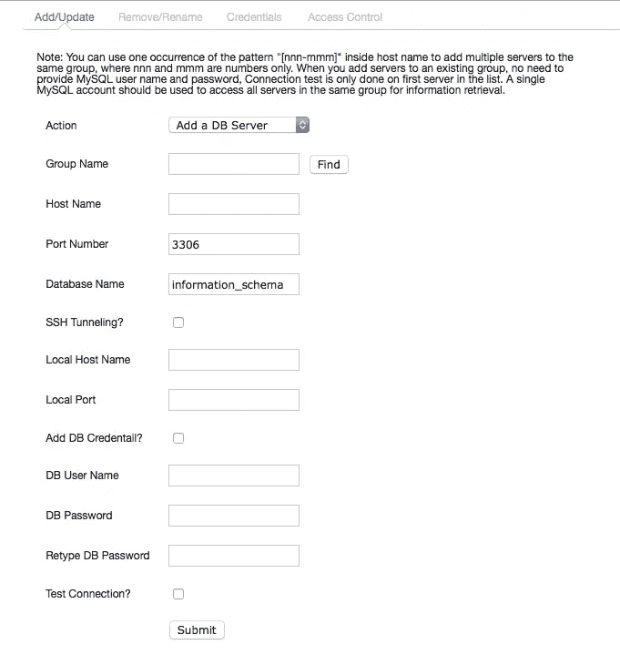
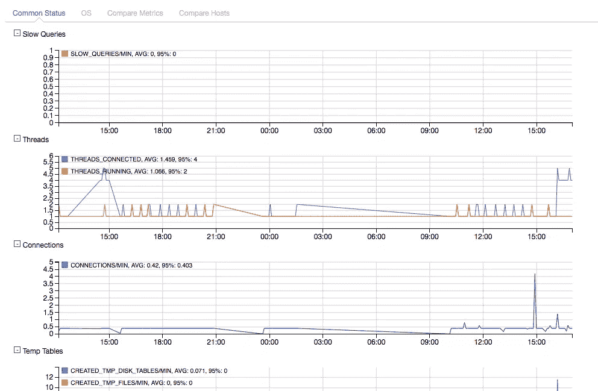
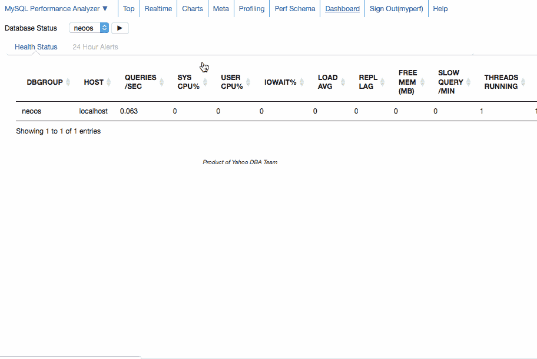
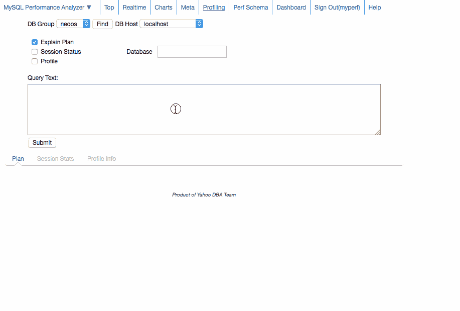
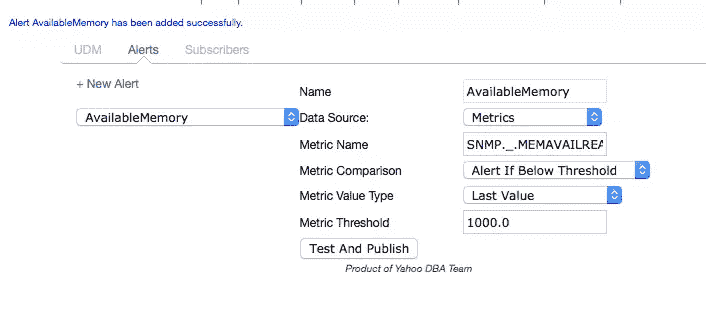
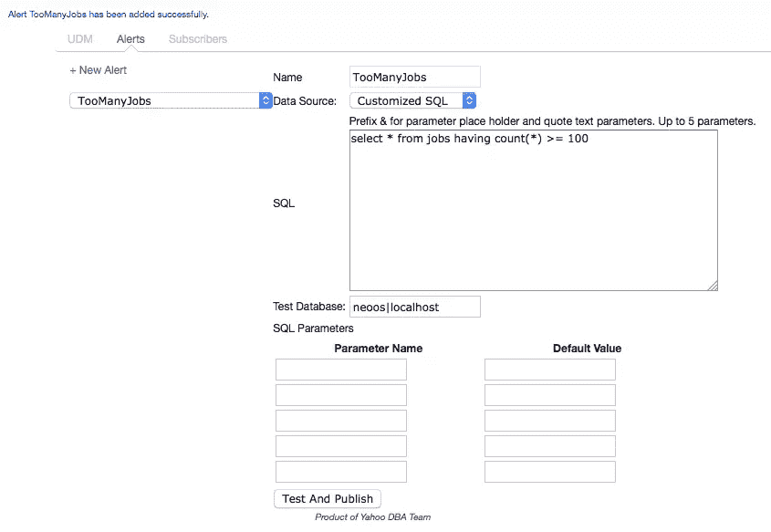

# 首先看看雅虎的 MySQL 性能分析器

> 原文：<https://www.sitepoint.com/first-look-at-yahoos-mysql-performance-analyzer/>

当您将应用程序部署到生产服务器时，随着数据的增长，您可能会遇到一些数据库问题。一些工具可以帮助你调试和解决问题，比如 MysqlTuner、 [Percona](https://www.sitepoint.com/optimize-mysql-indexes-slow-queries-configuration/) 等。在本文中，我们将探索[雅虎 MySql 性能分析器](https://github.com/yahoo/mysql_perf_analyzer/)，看看它的主要特性是什么。


## 装置

分析器使用可用的 SNMP,所以将它安装在数据库服务器上是个好主意。

因为这是一个 JAVA 应用程序，所以在继续之前，请确保您已经安装了 JDK。它需要版本 8 才能运行，但是版本 7 也可以，因为它不使用版本 8 的任何功能。您可以在 repo 中的[自述文件](https://github.com/yahoo/mysql_perf_analyzer/#build)中了解更多信息。

我的流浪者盒子上有一个演示应用程序，我将把分析器安装在我的应用程序的根目录下。让我们从使用 ssh 登录到我们的机器并克隆存储库开始。

```
vagrant ssh
git clone git@github.com:yahoo/mysql_perf_analyzer.git myperf
```

要构建应用程序，您需要运行`mvn clean package`命令。构建过程完成后，您会在`perfJettyServer/target`目录下找到一个`myperfserver-server.zip`文件。将该文件移动到服务器上的新目录中，并将其解压缩。结果输出包含管理服务器的`start_myperf.sh`和`stop_myperf.sh`脚本。让我们使用启动脚本来启动应用程序。你可以在[回购](https://github.com/yahoo/mysql_perf_analyzer/#installation-and-usage-instructions)中了解更多可用选项。

## 管理用户

启动服务器后，使用机器主机名和指定端口(`vaprobash.dev:9092/myperf`)打开浏览器。您可以使用默认管理员帐户登录(用户名:myperf，密码:change)。

可以从左上角的菜单访问用户管理页面。它允许您添加、编辑、删除和确认用户，并且您可以使用它来更改默认的管理员密码。



## 仪表盘

主仪表板显示数据库的当前状态以及其他细节，如 CPU 使用率、运行线程、死锁等。

仪表板上的第二个选项卡显示过去 24 小时的警报。我们将在后面详细讨论警报以及如何配置它们。

## 配置数据库组

要监控一个或一组数据库，您可以从左上角菜单创建一个新的数据库组，并选择`DB Info`。完成输入后，您可以访问仪表板来查看您的数据库状态。您可以使用`Access Control`选项卡将数据库访问权限限制在某一组用户。



## 监控流程

通过从菜单访问`Top`页面，您可以对您的系统资源进行实时监控。如果您曾经在 linux 上使用过`top`命令，这基本上可以为您的数据库做同样的事情。它显示你的内存，CPU 的使用，数据库连接，网络传输等。您可以使用页面顶部的控件随时启动和停止该过程。


当可用时，您也可以使用 [SNMP](https://en.wikipedia.org/wiki/Simple_Network_Management_Protocol) 程序，但是在开始该过程之前，请选中复选框以启用它。

## 制图

如果您是一个报表爱好者，并且更喜欢使用图表来比较一段时间内的数据库服务器性能，那么图表选项卡提供了一个图表工具以及日期范围选择来帮助您了解服务器性能。您还可以比较不同的服务器指标，如内存使用、数据库连接等。



## 探索数据库元数据

虽然我们习惯于从 SequelPro 等数据库管理应用程序中探索数据库元数据，但 Yahoo performance analyzer 提供了一种简单的方法来探索数据库和表元数据，如列、视图、索引、触发器等。



## 解释查询

性能分析中最常用的特性可能是`Profiling Queries`，因为它在检测缓慢的查询并解释它们方面帮助很大。它还显示内存使用、执行时间、缓存使用等数据。



## 警报

警报是监控数据库性能不可或缺的功能。基本上，您设置了一个规则来定义您的系统何时(或将会)遇到问题。
从页面顶部的`User Defined Alerts`菜单中，您可以使用预定义的指标创建警报。例如，我将使用`SNMP._.MEMAVAILREAL`指标，它定义了可用内存，我将设置警报，如果低于 1000KB 就触发警报。



您还可以基于数据库查询创建通知。我们可以创建一个警报，在排队作业列表超过 100 时触发。



创建警报后，您需要转到同一页面上的`subscribers`选项卡，选择您的数据库组并检查您想要附加的警报。

现在，如果您导航到`Alerts`页面，您将找到过去 24 小时的错误列表，并且您可以选择一个日期范围来查看以前发生的错误。


## 结论

这篇文章简要介绍了 Yahoo 性能分析器的主要特性，还有很多需要探索的地方。该项目仍在开发中——你可以在 [Github](https://github.com/yahoo/mysql_perf_analyzer) 上投稿。

关于分析器在真实数据库中的用法的更高级的帖子即将发布！

如果您有任何问题或意见，请在下面发表。

## 分享这篇文章