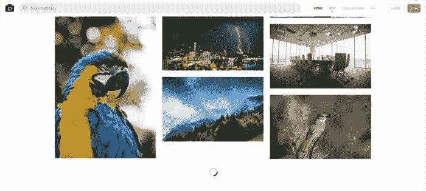

# 提高网站性能的五种延迟加载图片的方法

> 原文：<https://www.sitepoint.com/five-techniques-lazy-load-images-website-performance/>

随着图片成为网络上最受欢迎的内容类型，网站的页面加载时间很容易成为一个问题。

即使当[适当地优化](https://www.sitepoint.com/saving-bandwidth-by-using-images-the-smart-way/)时，图像也会变得很重。这可能会对访问者在访问您网站上的内容之前必须等待的时间产生负面影响。很有可能，他们变得不耐烦，并导航到其他地方，除非你想出一个不干扰速度感知的图像加载解决方案。

在本文中，您将了解到五种延迟加载图像的方法，您可以将它们添加到您的 web 优化工具包中，以改善您网站的用户体验。

## 什么是懒装？

延迟加载图像意味着异步加载网站上的图像——也就是说，在上面的内容完全加载后，或者甚至有条件地，只有当它们出现在浏览器的视窗中时。这意味着，如果用户不一直向下滚动，位于页面底部的图像甚至不会被加载。

许多网站都使用这种方法，但是在图片多的网站上尤其明显。试着浏览你最喜欢的网上高分辨率照片的猎场，你很快就会意识到网站是如何加载有限数量的图片的。当您向下滚动页面时，您会看到占位符图像很快被用于预览的真实图像填满。例如，请注意[Unsplash.com](https://unsplash.com/)上的加载器:将页面的这一部分滚动到视图中会触发一个占位符替换为全分辨率照片:



## 为什么您应该关心延迟加载图像？

至少有几个很好的理由说明为什么你应该考虑为你的网站延迟加载图片:

*   如果您的网站使用 JavaScript 来显示内容或向用户提供某种功能，那么快速加载 DOM 就变得至关重要。脚本通常会等到 DOM 完全加载后才开始运行。在一个有大量图片的网站上，延迟加载——或者异步加载图片——会决定用户是留在还是离开你的网站。
*   由于大多数惰性加载解决方案的工作方式是，只有当用户滚动到图像在视口内可见的位置时才加载图像，如果用户从未到达该位置，这些图像将永远不会被加载。这意味着相当大的带宽节省，为此大多数用户，尤其是那些通过移动设备和慢速连接访问网络的用户，将会感谢你。

嗯，延迟加载图片有助于提高网站性能，但是最好的方法是什么呢？

没有完美的方法。

如果您喜欢 JavaScript，那么实现自己的惰性加载解决方案应该不成问题。没有什么比自己编码更能给你控制力了。

或者，您可以在网上浏览可行的方法，并开始尝试它们。我就是这样做的，并且发现了这五个有趣的技巧。

## #1 本地延迟加载

图片和 iframes 的原生惰性加载超级酷。没有比下面的标记更简单的了:

```

<iframe src="content.html" loading="lazy"></iframe> 
```

如您所见，没有 JavaScript，没有动态交换`src`属性的值，只是普通的旧 HTML。

属性为我们提供了延迟离屏图像和 iframes 的选项，直到用户滚动到他们在页面上的位置。`loading`可以取这三个值中的任何一个:

*   `lazy`:非常适合延迟加载
*   `eager`:指示浏览器立即加载指定的内容
*   `auto`:由浏览器决定是否延迟加载。

这种方法没有对手:它没有开销，干净简单。然而，尽管在撰写本文时，大多数主流浏览器都很好地支持了属性`loading`，但并不是所有的浏览器都支持。

要深入了解这一令人惊叹的图像延迟加载特性，包括浏览器支持变通方法，请不要错过 Addy Osmani 的"[web 原生图像延迟加载！](https://addyosmani.com/blog/lazy-loading/)”。

## #2 使用交叉点观察器 API 的延迟加载

[Intersection Observer API](https://developer.mozilla.org/en-US/docs/Web/API/Intersection_Observer_API) 是一个现代化的接口，您可以利用它来延迟加载图像和其他内容。

MDN 是这样介绍这个 API 的:

> 交叉点观察器 API 提供了一种异步观察目标元素与祖先元素或顶级文档的视口的交叉点变化的方法。

换句话说，被异步观察的是一个元素与另一个元素的交集。

Denys Mishunov 有一个很棒的教程，既有关于交叉点观察器的，也有关于使用它来延迟加载图像的。以下是他的解决方案。

假设你想延迟加载一个图片库。每个图像的标记如下所示:

```
 
```

注意图像的路径是如何包含在一个`data-src`属性中，而不是一个`src`属性中。原因是使用`src`意味着图像会立即加载，这不是你想要的。

在 CSS 中，你给每个图像一个`min-height`值，比如说`100px`。这为每个图像占位符(没有 src 属性的 img 元素)提供了一个垂直维度:

```
img {
  min-height: 100px;
  /* more styles here */
} 
```

在 JavaScript 文档中，然后创建一个`config`对象并用一个`intersectionObserver`实例注册它:

```
// create config object: rootMargin and threshold
// are two properties exposed by the interface
const config = {
  rootMargin: '0px 0px 50px 0px',
  threshold: 0
};

// register the config object with an instance
// of intersectionObserver
let observer = new intersectionObserver(function(entries, self) {
  // iterate over each entry
  entries.forEach(entry => {
    // process just the images that are intersecting.
    // isIntersecting is a property exposed by the interface
    if(entry.isIntersecting) {
      // custom function that copies the path to the img
      // from data-src to src
      preloadImage(entry.target);
      // the image is now in place, stop watching
      self.unobserve(entry.target);
    }
  });
}, config); 
```

最后，迭代所有图像，并将它们添加到这个`iterationObserver`实例中:

```
const imgs = document.querySelectorAll('[data-src]');
imgs.forEach(img => {
  observer.observe(img);
}); 
```

这种解决方案的优点是:实施起来很容易，很有效，并且让`intersectionObserver`来做繁重的计算。

另一方面，尽管大多数浏览器在其最新版本中都支持交叉点观察器 API，但并不是所有浏览器都一致支持它。幸运的是，有一个[多填充物可供选择](https://github.com/w3c/IntersectionObserver/tree/master/polyfill)。

你可以在 Denys 的文章中了解更多关于交叉点观察器 API 和这个实现的细节。

## 三个洛沙达

实现图像延迟加载的一个快速简单的替代方法是让 JS 库为您完成大部分工作。

Lozad 是一个高性能、轻量级、可配置的纯 JavaScript 惰性加载器，没有依赖性。你可以用它来延迟加载图片、视频、iframes 等等，它使用了交叉点观察器 API。

您可以将 Lozad 包含在 npm/Yarn 中，并使用您选择的模块捆绑器导入它:

```
npm install --save lozad

yarn add lozad 
```

```
import lozad from 'lozad'; 
```

或者，您可以简单地使用 CDN 下载这个库，并将其添加到 HTML 页面底部的一个`< script>`标签中:

```
<script src="https://cdn.jsdelivr.net/npm/lozad/dist/lozad.min.js"></script> 
```

接下来，对于一个基本实现，将类 *lozad* 添加到您的标记中的资产:

```
 
```

最后，在 JS 文档中实例化 Lozad:

```
const observer = lozad();
observer.observe(); 
```

你可以在 [Lozad GitHub 库](https://github.com/ApoorvSaxena/lozad.js)上找到如何使用这个库的所有细节。

如果您不想深入研究 Intersection Observer API 的工作原理，或者您只是在寻找适用于各种内容类型的快速实现，Lozad 是一个很好的选择。

只是，要注意浏览器支持，并最终将该库与交叉点观察器 API 的 polyfill 集成在一起。

## #4 带有模糊图像效果的延迟加载

如果你是一个中等读者，你一定注意到了网站是如何在文章中加载主图片的。

你首先看到的是一个模糊的低分辨率图像，而它的高分辨率版本被延迟加载:


Blurred placeholder image on Medium website


High-res, lazy loaded image on Medium website

你可以通过多种方式延迟加载带有这种有趣模糊效果的图像。

我最喜欢的技术是克雷格·巴克勒的。这种解决方案的所有优点如下:

*   性能:只有 463 字节的 CSS 和 1，007 字节的精简 JavaScript 代码
*   支持视网膜屏幕
*   无依赖性:不需要 jQuery 或其他库和框架
*   逐步增强以应对旧浏览器和失败的 JavaScript

你可以在[如何构建你自己的渐进式图像加载器](https://www.sitepoint.com/how-to-build-your-own-progressive-image-loader/)中阅读所有相关内容，并在该项目的 [GitHub repo](https://github.com/craigbuckler/progressive-image.js) 上下载代码。

## #5 Yall.js

Yall 是一个用于图像、视频和 iframes 的功能丰富、延迟加载的脚本。更具体地说，它使用交叉点观察器 API，并在必要的地方巧妙地依靠传统的事件处理程序技术。

当在文档中包含 Yall 时，需要按如下方式初始化它:

```
<script src="yall.min.js"></script>
<script>
  document.addEventListener("DOMContentLoaded", yall);
</script> 
```

接下来，要延迟加载一个简单的`img`元素，您需要在标记中做的就是:

```
 
```

请注意以下几点:

*   您将类 *lazy* 添加到元素中
*   `src`的值是一个占位符图像
*   您想要延迟加载的图像的路径在`data-src`属性中

Yall 的优势包括:

*   交叉点观察器 API 的出色性能
*   出色的浏览器支持(可以追溯到 IE11)
*   不需要其他依赖

要了解更多关于 Yall 可以提供什么以及更复杂的实现，请随时查看 GitHub 上的[项目页面。](https://github.com/malchata/yall.js)

## 结论

现在你有了它——五种延迟加载图像的方法，你可以开始在你的项目中试验和测试。

## 分享这篇文章