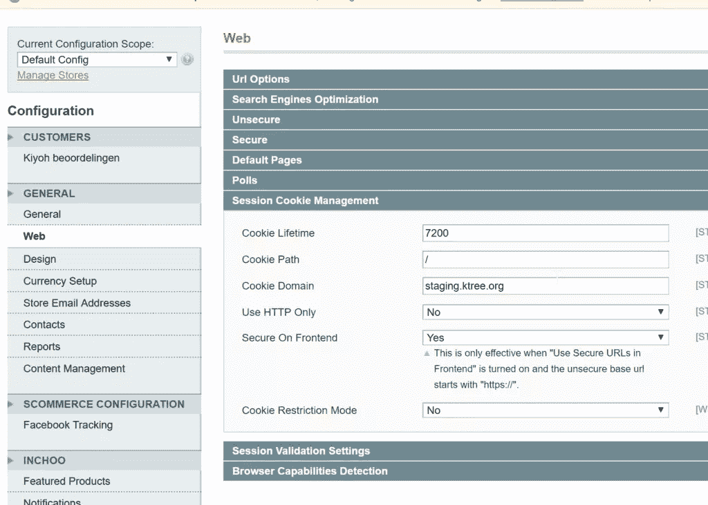

# 如何修复 Magento 的 Cookies 和会话登录问题

> 原文：<https://www.sitepoint.com/fix-magento-login-issues-cookies-sessions/>

*本文是与 [Ktree](https://ktree.com) 合作创作的。感谢您对使 SitePoint 成为可能的合作伙伴的支持。*

在本文中，我们将探讨 Magento cookies 如何给面向客户的前端和管理员后端的登录功能带来问题，出现问题的原因以及如何解决问题。

这也称为循环问题，因为即使用户名和密码是正确的，屏幕也会重定向到同一个屏幕。

本文末尾提供了一个脚本，可以帮助检测一些问题。请根据您的需要随意使用和修改。

## 什么是饼干？

cookie 是 web 服务器可以存储在用户硬盘上的一段文本，以后还可以检索它。Magento 在购物车和后端管理功能中使用 cookies，当无法登录 Magento 时，它们可能是一些问题的来源。

## 什么是会话？

会话是服务器端的一个数组变量，它存储跨多个页面使用的信息。例如，添加到购物车中的商品通常保存在会话中，当用户浏览结帐页面时，会从会话中读取这些商品。

会话由唯一的 ID 标识。它的名字根据编程语言的不同而不同——在 PHP 中，它被称为“PHP 会话 ID”。正如您可能已经猜到的那样，相同的 PHP 会话 ID 需要作为 cookie 存储在客户端浏览器中，以便进行关联。

### Magento 的存储会话

Magento 可以通过多个会话提供者存储会话，这可以在`app/etc/local.xml`的 Magento 配置文件中进行配置。可以在这里选择这些会话提供者。

**文件**

```
<session_save><![CDATA[files]]></session_save>
<session_save_path>
    <![CDATA[/tmp/session]]>
</session_save_path> 
```

**数据库**

通过添加`<session_save><![CDATA[db]]></session_save>`，在`/app/etc/local.xml`中允许会话将自己存储在数据库中。

Magento 应用程序将会话存储在`Core\_session`表中。

**再说一遍**

```
<session_save>db</session_save>
    <redis_session>                           
             <host>127.0.0.1</host>    
        <port>6379</port>
    </redis_session> 
```

**模快取**

```
session_save><![CDATA[memcache]]></session_save>
<session_save_path>
<![CDATA[tcp://localhost:11211?persistent=1&weight=2&timeout=10&retry_interval=10]]>
</session_save_path> 
```

## 胃用途

Magento 使用两种不同的 cookies，名为“前端”和“adminhtml”。第一个是在浏览任何页面时创建的。每当客户登录时，同样的 cookie 也会更新，下一个 cookie 是在后端用户登录时创建的。您可以通过点击*检查元素>应用*来检查 cookies 是否已经创建，如下图所示(来自 Chrome):


通过配置管理菜单-*系统>配置>常规>网页*在 Magento 中配置 Cookies。



## 问题:登录失败&重定向到登录页面

如果你没有经历过这个问题，那么你和 Magento 合作的时间还不够长！

它通常是这样发生的:当您通过输入用户名和密码登录时，您将被重定向到相同的登录页面和 URL，并且您的浏览器会附加一个 nonce id。客户前端和 Magento 后端登录都会发生这种情况。

让我们来看看发生这种情况的几个原因，以及我们应该如何解决这些问题。

### 原因#1: Cookie 域与服务器域不匹配

假设你的 Magento 站点是`example.com`，Magento 中的 cookie 域配置为`xyz.com`。

在这种情况下，两个 Magento cookies 都会将`Domain Value`设置为`xyz.com`，但是为了验证会话，Magento 会考虑访问站点的域，在这种情况下是`example.com`。因为它无法找到带有`example.com`域值的活动会话，所以即使提供了有效的凭证，它也会将用户重定向到登录页面。

**T2`app/code/core/Mage/Core/Model/Session/Abstract.php`**

登录或注销后，Magento 系统将使用以下脚本重新生成会话:

```
public function renewSession()
    {
        $this->getCookie()->delete($this->getSessionName());
        $this->regenerateSessionId();

        $sessionHosts = $this->getSessionHosts();
        $currentCookieDomain = $this->getCookie()->getDomain();
        if (is_array($sessionHosts)) {
            foreach (array_keys($sessionHosts) as $host) {
                // Delete cookies with the same name for parent domains
                if (strpos($currentCookieDomain, $host) > 0) {
                    $this->getCookie()->delete($this->getSessionName(), null, $host);
                }
            }
        }

        return $this;
    } 
```

**T2`app/code/core/Mage/Core/Model/Session/Abstract/Varien.php`**

Magento 将使用以下方法验证每个请求的会话:

```
public function init($namespace, $sessionName=null)
    {
        if (!isset($_SESSION)) {
            $this->start($sessionName);
        }
        if (!isset($_SESSION[$namespace])) {
            $_SESSION[$namespace] = array();
        }

        $this->_data = &$_SESSION[$namespace];

        $this->validate();
        $this->revalidateCookie();

        return $this;
    } 
```

当您将 Magento 实例从一个域迁移到另一个域时，例如从生产域迁移到暂存域，并且忘记更改 cookie 域时，您通常会看到这种情况。

**注意:**您可以运行提供的`cookieTest.php`脚本，该脚本验证什么是服务器 cookie 域，以及在 Magento 配置中设置了什么。

**解决方案:**

通过配置管理菜单更改 Cookie 域。根据截图进入*系统>配置>总>网页*。

或者，您可以通过运行这些 SQL 查询来更改这一点。

要验证 cookie 域，请使用以下选择查询来获取配置:

```
SELECT * FROM core_config_data WHERE path = 'web/cookie/cookie_domain'; 
```

执行这个查询后，我们将得到结果。验证“值”列是否与您的域相同。如果它与您的域不同，请更新该值。

要更新 cookie 域，请使用以下查询:

```
UPDATE core_config_data SET VALUE = "domain.com" WHERE  path = 'web/cookie/cookie_domain'; 
```

### 原因#2:使用了多个子域，Magento 的 cookie 配置不正确

假设你的站点是`example.com`。登录`example.com/admin`工作正常。

但是在您的暂存/QA 站点上，例如`staging.example.com/admin`，如果不删除所有 cookies，您将无法登录。系统可能允许登录到`staging.example.com`，但是当我们再次登录到`example.com/admin`时，你下一次点击`staging.example.com`会把你踢回登录页面。使用前端登录的客户也会遇到类似的行为。

#### 解决方案 1

**选项 A:如果你的主域名和子域托管在同一个服务器上**

*   通过配置管理菜单更改 Cookie 域。根据截图进入*系统>配置>总>网页*。
*   看 Cookie 域是`example.com`，还是`.example.com`(注意前面的句号)。如果没有，设置为`.example.com`。

**选项 B:如果你的主域名和子域托管在不同的服务器上**

*   通过配置管理菜单更改 Cookie 域。根据截图进入*系统>配置>总>网页*。
*   看 Cookie 域是`www.example.com`，还是`.www.example.com`(注意前面的句号)。如果没有，设置为`.www.example.com`。
*   在`test.example.com`商店中，在测试环境中将 Cookie 域设置为`.test.example.com`。

或者，通过运行这些 sql 查询来更改这一点。

要验证 cookie 域，请使用以下 select 查询来获取配置:

```
SELECT * FROM core_config_data WHERE path = 'web/cookie/cookie_domain'; 
```

执行上述查询后，我们将得到结果。验证“值”列是否与您的域相同。如果与您的域不同，请更新该值。

要更新 cookie 域，请使用以下查询:

```
UPDATE core_config_data SET VALUE = "domain.com" WHERE  path = 'web/cookie/cookie_domain'; 
```

#### 解决方案 2

检查您的`php.ini`文件是否与 Magento 配置中的 cookie 域相同——如果不是，将其更改为与 Magento 配置相同，如下所示:

```
cookie\_domain = example.com 
```

#### 解决方案 3

这不是推荐的方法，但是如果所有的选项都失败了，你可以试试这段代码，通过改变子域的`adminhtml` cookie 名称来改变选项。复制文件`action.php`并将其保存在与本地相同的文件夹路径中，这样您的核心代码文件就可以被覆盖。

在文件`app/code/core/Mage/Core/Controller/Varien/Action.php`中有两处需要修改。

在`preDispatch`功能中，更改这些行:

```
/** @var $session Mage_Core_Model_Session */ $session = Mage::getSingleton('core/session', array('name' => $this->_sessionNamespace))->start(); 
```

收件人:

```
$namespace = $this->_sessionNamespace.($_SERVER['SERVER_NAME']=='subdomain.example.com'?'_subdomain':''); /** @var $session Mage_Core_Model_Session */ $session = Mage::getSingleton('core/session', array('name' => $namespace))->start(); 
```

在功能`setRedirectWithCookieCheck`中，更改:

```
/** @var $session Mage_Core_Model_Session */ session = Mage::getSingleton('core/session', array('name' => $this->_sessionNamespace)); 
```

收件人:

```
$namespace = $this->_sessionNamespace.($_SERVER['SERVER_NAME']=='subdomain.example.com'?'_subdomain':''); /** @var $session Mage_Core_Model_Session */ $session = Mage::getSingleton('core/session', array('name' => $namespace)); 
```

之后，在所有文件中搜索以下文本:

```
Mage::getSingleton('core/session', array('name' => 'adminhtml'));` 
```

如果发现任何情况，请将其替换为:

```
Mage::getSingleton('core/session', array('name' => 'adminhtml'.($_SERVER['SERVER_NAME']=='subdomain.example.com'?'_subdomain':''))); 
```

### 原因 3:双前端 cookies 导致间歇性登录问题

在某些情况下，系统可能会创建多个前端 cookies，这会阻止系统允许您登录..

#### 场景 1

当您的 Magento 系统在 Magento 配置中有相同的主域和子域配置时，如果用户同时登录两个站点，Magento 会创建两个 cookies。一个用主域设置“域值”,另一个用子域设置。因此，我们将有两个前端 cookie 会话，因此我们将无法登录到系统。

**解决方案**

对于域和子域配置，将 *Cookie 域*设置更改为`.example.com`。

#### 场景 2

在这个场景中，假设在您的`php.ini`中，没有配置 cookie 域，但配置了`example.com`的 Magento *域值*。现在，当用户通过`www.example.com`登录时，系统从 Magento 配置中创建一个域值为`example.com`的 cookie。当用户注销时，Magento 将从访问的 URL(即`www.example.com`)重新生成带有域值的 cookie，因为在`php.ini`中没有指定 cookie 域。请注意，如果用户使用`example.com`登录或者在`php.ini`中配置了 cookie 域，将不会出现任何问题。

#### 解决方案 1

向您的`php.ini`文件添加一个 cookie 域，它与您的 Magento 配置相同。

```
session.cookie\_domain = example.com 
```

#### 解决方案 2

对于域和子域配置，将 Cookie 域更改为`.example.com`。

注意:使用我们的`cookieTest.php`脚本看看你是否有双前端 cookies。

### 原因#4:无法创建(读取)会话 ID

```
Recoverable Error: session\_regenerate\_id(): Failed to create(read) session ID: user (path: /var/lib/php/sessions) in app/code/core/Mage/Core/Model/Session/Abstract/Varien.php on line 492 
```

这是一个您可能在异常日志中看到的错误，并且可能只在 PHP7 中出现，因为 PHP7 会进行严格的类型检查。

这个问题的解决方案是通过类型转换来改变 Magento 核心读取函数。更多信息请点击。

```
public function read($sessId) {
//return $data;
return (string)$data;
} 
```

### 原因#5:会话数据文件不是由您的 uid 创建的

```
Warning: session_start(): Session data file is not created by your uid  in app/code/core/Mage/Core/Model/Session/Abstract/Varien.php on line 125 
```

#### 解决方案 1

如果您将会话保存在文件中，并且文件夹或文件缺少 webserver 用户权限，则会出现此错误。因此，在 nginx 的情况下，如果您的 web 服务器用户是 www-data，您需要使用以下命令授予文件夹的所有权:

```
sudo chown -R www-data:www-data 
```

#### 解决方案 2

如果您正在运行，您可能必须确定或更改文件会话路径。

#### 解决方案 3

另一个原因是在`var/sessions`文件夹中可能有一些旧的会话——删除它们并测试这是否能解决问题。

**注意:**如果您可以选择使用不同的会话提供者，请切换到另一个。比如从 Redis 到 file。清空您的`var/cache`文件夹，看看它是否工作——同样，只在您的开发环境中尝试这样做。

## 检测 Cookie 问题的 PHP 脚本

```
<?php
ini_set('display_errors', 1);
$mageFileName = getcwd() . '/app/Mage.php';
require $mageFileName;
Mage::app();
echo "<b> Server Cookie Domain Configuration : </b> ".ini_get('session.cookie_domain')."<br>";
foreach (Mage::app()->getStores() as $store) {

    echo "<b>" . $store->getName() . "</b><br>";
    $configCookieDomain = Mage::getStoreConfig('web/cookie/cookie_domain', $store->getId());
    $storeConfigUrl = Mage::getStoreConfig('web/unsecure/base_url', $store->getId());
    $sourceUrl = parse_url($storeConfigUrl);
    $storeDomain = $sourceUrl['host'];
    $cookieDomainResult = ($configCookieDomain == $storeDomain || $configCookieDomain == '.' . $storeDomain) ? "" : "not";
    echo "Config cookie Domain : " . $configCookieDomain . " and Store Domain: " . $storeDomain . " " . $cookieDomainResult . " configured properly<br>";
}
//echo "<b>Request Cookies:</b> ";
$requestCookie = Mage::app()->getRequest()->getHeader('cookie');
$requestCookieArr = explode(';', $requestCookie);
$sessionIds = array();
foreach ($requestCookieArr as $requestCookieItem) {
    $cookieValue = explode('=', $requestCookieItem);
    // echo $requestCookieItem."<br>";
    if (trim($cookieValue[0]) == 'frontend' || trim($cookieValue[0]) == 'adminhtml') {
        $cookieName = trim($cookieValue[0]);
        $sessionId = trim($cookieValue[1]);
        $sessionIds[$cookieName][] = $sessionId;
    }
}
$areas = array("frontend", "adminhtml");
foreach ($areas as $area => $cookieName) {
    echo "<b>validating " . $cookieName . " cookie </b><br>";
    $cookieExpires = Mage::getModel('core/cookie')->getLifetime($cookieName);
    $cookiePath = Mage::getModel('core/cookie')->getPath($cookieName);
    $cookieDomain = Mage::getModel('core/cookie')->getDomain($cookieName);
    $cookieSecure = Mage::getModel('core/cookie')->isSecure($cookieName);
    $cookieHttpOnly = Mage::getModel('core/cookie')->getHttponly($cookieName);
    echo "Cookie Lifetime : " . $cookieExpires . " <br>";
    echo "Cookie Path : " . $cookiePath . " <br>";
    echo "Cookie Domain : " . $cookieDomain . " <br>";
    echo "Cookie Is Secure : " . $cookieSecure . " <br>";
    echo "Cookie Httponly : " . $cookieHttpOnly . " <br>";
    if (count($sessionIds[$cookieName]) > 1) {
        echo "<span style='color:red'><b>We have " . count($sessionIds[$cookieName]) . " " . $cookieName . " Cookies with values : </b>" . implode(',', $sessionIds[$cookieName]) . "<br>";
        //$encryptedSessionId =  Mage::getSingleton("core/session")->getEncryptedSessionId();
        $encryptedSessionId = Mage::getModel('core/cookie')->get($cookieName);
        echo "Original Cookie value : " . $encryptedSessionId . "<br>";
        echo "Please verify the Subdomain and Main Site Cookie Domain Configuration</span><br>";
    }
}

?> 
```

输出:

```
Magento Store EN
Config cookie Domain : staging.abc.com and Store Domain: staging.abc.com configured properly
Magento Store  FR
Config cookie Domain : staging.abc.com and Store Domain: staging.abc.com configured properly
validating frontend cookie 
Cookie Lifetime : 31536000 
Cookie Path : / 
Cookie Domain : staging.zeb.be 
Cookie Is Secure : 
Cookie Httponly : 1 
validating adminhtml cookie 
Cookie Lifetime : 31536000 
Cookie Path : / 
Cookie Domain : staging.zeb.be 
Cookie Is Secure : 
Cookie Httponly : 1 
```

## 分享这篇文章