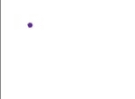
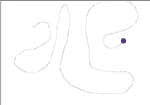
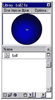
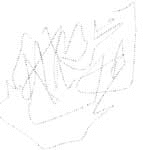
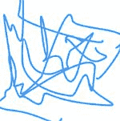
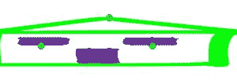

# flash 101–第 3 部分:弹跳

> 原文：<https://www.sitepoint.com/flash-101-3-bouncing-around/>

 **##### 动画快速发展

如果你已经跟随学习了[，你现在应该对 Flash 中基本的逐帧动画有所了解。但是一帧接一帧地制作一个序列的动画是一个乏味的过程——尤其是当序列是一个复杂的序列时 Flash 提供了一些强大的工具来帮助这个过程。](https://www.webmasterbase.com/article/713)

本周，我将看看逐帧动画的替代方案，这是一种在 Flash 行话中称为“补间”的技术。我将向您展示 Flash 强大的补间工具如何大幅减少您在动画剪辑上花费的时间，并通过一些简单的演示来说明如何有效地使用它们。

##### 为了你的酷

大多数人(包括新手)认为补间是 Flash 最酷的地方。不难理解为什么——Flash 的补间功能与一些简单易学的技术相结合，使新手和专家都可以轻松快捷地创建好看的动画序列。

觉得难以置信吗？我会尽我所能让你在这篇文章结束时成为一名信徒——但首先，我要讲一点理论。

补间动画不同于您之前学习的逐帧动画，因为它不需要动画师制作动画剪辑的每一帧动画；相反，动画师只需要指定剪辑的开始和结束帧，Flash 创建所有的中间帧。

考虑一个简单的例子:一块石头滚下山坡。在传统的逐帧动画中，有必要为石头下坡的每一步制作动画；使用补间技术，只需要创建两个帧–石头在山顶的初始帧和石头在底部的最终帧–Flash 将完成其余工作。

Flash 提供了两种类型的补间:“形状补间”，主要用于将一个形状变形为另一个形状；和“运动补间”，用于创建运动的幻觉(虽然，正如你将看到的，你也可以用它做更多)。形状补间不能应用于元件实例或文本块，而运动补间适用于元件实例、成组元素和文本块。

##### 紫色

让我们从一个简单的补间动画开始，它将更好地说明这个概念。打开一个新的 Flash 电影，使用圆形工具画一个简单的椭圆。用你最喜欢的颜色填充它。

您会注意到，当您创建椭圆时，Flash 会自动在第 1 帧添加一个关键帧。

将椭圆转换为图形符号–它应该会显示在库窗口中。

现在，单击第 10 帧，插入新的关键帧，并将椭圆移动到舞台上的新位置。回到框架#1，弹出打开窗口->面板->框架面板。在补间框中选择“运动”。第 1 帧和第 10 帧之间的区域应该用浅紫色和实心箭头填充–这表示补间动画。

播放动画–您的椭圆应该从其原始位置平稳地移动到您指定的新位置。

<object classid="clsid:D27CDB6E-AE6D-11cf-96B8-444553540000" codebase="https://download.macromedia.com/pub/shockwave/cabs/flash/swflash.cab#version=5,0,0,0" align="center" width="300" height="300"><param name="movie" value="https://www.webmasterbase.com/examples/flash101-part3/x1.swf"><param name="loop" value="true/"><param name="quality" value="high/"><param name="bgcolor" value="#FFFFFF/"><embed src="https://www.webmasterbase.com/examples/flash101-part3/x1.swf" loop="" quality="high" bgcolor="#FFFFFF" align="center" width="300" height="300" type="application/x-shockwave-flash" pluginspage="https://www.macromedia.com/shockwave/download/index.cgi?P1_Prod_Version=ShockwaveFlash"></object>

这是你的第一部动作片。很简单，是吧？

版权所有[梅龙菲尔](https://www.melonfire.com/)，2000 年。保留所有权利。

##### 一抹猩红色

来点更复杂的怎么样？回到第 10 帧，右键单击椭圆，并选择缩放选项。通过拉动缩放手柄来修改椭圆，直到您看到如下所示的内容:

再次播放剪辑–您的椭圆在舞台上移动时应该会改变形状。

<object classid="clsid:D27CDB6E-AE6D-11cf-96B8-444553540000" codebase="https://download.macromedia.com/pub/shockwave/cabs/flash/swflash.cab#version=5,0,0,0" align="center" width="300" height="300"><param name="movie" value="https://www.webmasterbase.com/examples/flash101-part3/x2.swf"><param name="loop" value="true/"><param name="quality" value="high/"><param name="bgcolor" value="#FFFFFF/"><embed src="https://www.webmasterbase.com/examples/flash101-part3/x2.swf" loop="" quality="high" bgcolor="#FFFFFF" align="center" width="300" height="300" type="application/x-shockwave-flash" pluginspage="https://www.macromedia.com/shockwave/download/index.cgi?P1_Prod_Version=ShockwaveFlash"></object>

让我们也增加一点颜色变化，好吗？仍然选择第 10 帧中的实例，弹出打开窗口->面板->效果对话框，并从下拉菜单中选择“色调”。选择一种色调——第 10 帧中展平椭圆的填充颜色应立即变为所选颜色。

当你播放这个片段时，你的椭圆不仅会改变形状，还会改变颜色。

<object classid="clsid:D27CDB6E-AE6D-11cf-96B8-444553540000" codebase="https://download.macromedia.com/pub/shockwave/cabs/flash/swflash.cab#version=5,0,0,0" align="center" width="300" height="300"><param name="movie" value="https://www.webmasterbase.com/examples/flash101-part3/x3.swf"><param name="loop" value="true/"><param name="quality" value="high/"><param name="bgcolor" value="#FFFFFF/"><embed src="https://www.webmasterbase.com/examples/flash101-part3/x3.swf" loop="" quality="high" bgcolor="#FFFFFF" align="center" width="300" height="300" type="application/x-shockwave-flash" pluginspage="https://www.macromedia.com/shockwave/download/index.cgi?P1_Prod_Version=ShockwaveFlash"></object>

##### 走风景优美的路线

默认情况下，Flash 选择对象的起始位置和结束位置之间的最短距离作为运动路径。如果这不符合您的要求，您还可以选择沿您定义的路径补间运动。

让我们考虑一个新的例子来更好地说明这一点。打开一个新的 Flash 电影，在第一帧，用笔刷工具创建一个小点。将其转换为图形符号。

接下来，移动到第 25 帧，插入一个新的关键帧，并将圆点移动到舞台的另一端。

创建一个补间动画并播放剪辑–您的点将水平穿过舞台，因为这是两个位置之间的最短距离。

<object classid="clsid:D27CDB6E-AE6D-11cf-96B8-444553540000" codebase="https://download.macromedia.com/pub/shockwave/cabs/flash/swflash.cab#version=5,0,0,0" align="center" width="550" height="400"><param name="movie" value="https://www.webmasterbase.com/examples/flash101-part3/x4.swf"><param name="loop" value="true/"><param name="quality" value="high/"><param name="bgcolor" value="#FFFFFF/"><embed src="https://www.webmasterbase.com/examples/flash101-part3/x4.swf" loop="" quality="high" bgcolor="#FFFFFF" align="center" width="550" height="400" type="application/x-shockwave-flash" pluginspage="https://www.macromedia.com/shockwave/download/index.cgi?P1_Prod_Version=ShockwaveFlash"></object>

要添加您自己的运动路径，右键单击包含点的层，并使用“添加运动引导”命令添加一个新的运动引导层-该层将保存补间动画的运动路径的路径。

使用钢笔、铅笔、画笔或钢笔工具绘制希望符号穿过的路径。

请注意，完成后，您需要将元件“对齐”到运动路径的起点和终点，方法是使用箭头工具选择元件，并将其拖到路径的适当终点，直到元件的“注册点”(中间的小空心点)对齐到路径的终点。当您再次播放片段时，圆点应该会沿着您刚刚创建的路径移动。

<object classid="clsid:D27CDB6E-AE6D-11cf-96B8-444553540000" codebase="https://download.macromedia.com/pub/shockwave/cabs/flash/swflash.cab#version=5,0,0,0" align="center" width="550" height="400"><param name="movie" value="https://www.webmasterbase.com/examples/flash101-part3/x5.swf"><param name="loop" value="true/"><param name="quality" value="high/"><param name="bgcolor" value="#FFFFFF/"><embed src="https://www.webmasterbase.com/examples/flash101-part3/x5.swf" loop="" quality="high" bgcolor="#FFFFFF" align="center" width="550" height="400" type="application/x-shockwave-flash" pluginspage="https://www.macromedia.com/shockwave/download/index.cgi?P1_Prod_Version=ShockwaveFlash"></object>

通过在“帧”面板中分别选择“定向到路径”和“对齐”选项，可以选择使元件的基线和/或其注册点朝向运动路径。

版权所有[梅龙菲尔](https://www.melonfire.com/)，2000 年。保留所有权利。

##### 弹跳球

补间动画是创建好看且易于组合的动画剪辑的好方法——如下例所示。

<object classid="clsid:D27CDB6E-AE6D-11cf-96B8-444553540000" codebase="https://download.macromedia.com/pub/shockwave/cabs/flash/swflash.cab#version=5,0,0,0" align="center" width="550" height="400"><param name="movie" value="https://www.webmasterbase.com/examples/flash101-part3/x6.swf"><param name="loop" value="true/"><param name="quality" value="high/"><param name="bgcolor" value="#FFFFFF/"><embed src="https://www.webmasterbase.com/examples/flash101-part3/x6.swf" loop="" quality="high" bgcolor="#FFFFFF" align="center" width="550" height="400" type="application/x-shockwave-flash" pluginspage="https://www.macromedia.com/shockwave/download/index.cgi?P1_Prod_Version=ShockwaveFlash"></object>

我是怎么做到的？很简单。

首先，在舞台上画一个圆，并用渐变填充它——我用了蓝色，但请随意实验——来创建一个平滑的弹跳球。将其转换为图形符号-您将在整个练习中使用该符号。

接下来，选择第 7 帧，插入一个新的关键帧，并垂直向下移动球。使用缩放手柄将其垂直变平，水平拉伸，使其看起来像被压扁了一样。

回到第 1 帧，在两个关键帧之间创建一个补间动画(也可以通过右键单击两个关键帧之间的任意位置并选择“创建补间动画”命令来完成)。

现在，移动到第 14 帧，插入一个新的关键帧，并将球移动回原来的位置。弹出打开“变换”面板，并使用“重置”按钮(右下角)将元件恢复到其原始状态。在第 7 帧和第 14 帧之间插入一个补间动画。

当您播放您的剪辑时，您会看到类似这样的内容:

<object classid="clsid:D27CDB6E-AE6D-11cf-96B8-444553540000" codebase="https://download.macromedia.com/pub/shockwave/cabs/flash/swflash.cab#version=5,0,0,0" align="center" width="550" height="400"><param name="movie" value="https://www.webmasterbase.com/examples/flash101-part3/x7.swf"><param name="loop" value="true/"><param name="quality" value="high/"><param name="bgcolor" value="#FFFFFF/"><embed src="https://www.webmasterbase.com/examples/flash101-part3/x7.swf" loop="" quality="high" bgcolor="#FFFFFF" align="center" width="550" height="400" type="application/x-shockwave-flash" pluginspage="https://www.macromedia.com/shockwave/download/index.cgi?P1_Prod_Version=ShockwaveFlash"></object>

如果你认为剪辑播放得快一点会更好看，你可以通过修改->电影对话框来改变帧速率。

这个动画还有几个步骤。首先，选择第 7 帧(扁平的球)并将符号向左移动大约 100 个像素。对第 14 帧(最后一个关键帧)执行相同的操作，只是在播放剪辑时，符号应该移动到右边，球看起来会在屏幕上反弹。

最后，淡入/淡出效果。选择第一帧中的球，并使用“效果”面板添加 alpha 效果，使球部分透明。对最后一个关键帧做同样的操作。这一次，当你回放剪辑时，球会随着向下移动而慢慢凝固，随着向上反弹而淡出。

<object classid="clsid:D27CDB6E-AE6D-11cf-96B8-444553540000" codebase="https://download.macromedia.com/pub/shockwave/cabs/flash/swflash.cab#version=5,0,0,0" align="center" width="550" height="400"><param name="movie" value="https://www.webmasterbase.com/examples/flash101-part3/x8.swf"><param name="loop" value="true/"><param name="quality" value="high/"><param name="bgcolor" value="#FFFFFF/"><embed src="https://www.webmasterbase.com/examples/flash101-part3/x8.swf" loop="" quality="high" bgcolor="#FFFFFF" align="center" width="550" height="400" type="application/x-shockwave-flash" pluginspage="https://www.macromedia.com/shockwave/download/index.cgi?P1_Prod_Version=ShockwaveFlash"></object>

那花了多长时间？大约五分钟，我会说，结果是一个非常好看的动画剪辑。此外，由于整个剪辑是使用元件构建的，因此您可以在元件编辑模式下轻松更改球的颜色和大小，并使您的更改立即反映在剪辑本身中。你自己试试，你就会明白我的意思了！

版权所有[梅龙菲尔](https://www.melonfire.com/)，2000 年。保留所有权利。

##### 放大

使用补间动画很容易实现的另一种效果是所谓的“缩放”效果。

<object classid="clsid:D27CDB6E-AE6D-11cf-96B8-444553540000" codebase="https://download.macromedia.com/pub/shockwave/cabs/flash/swflash.cab#version=5,0,0,0" align="center" width="400" height="400"><param name="movie" value="https://www.webmasterbase.com/examples/flash101-part3/x9.swf"><param name="loop" value="true/"><param name="quality" value="high/"><param name="bgcolor" value="#FFFFFF/"><embed src="https://www.webmasterbase.com/examples/flash101-part3/x9.swf" loop="" quality="high" bgcolor="#FFFFFF" align="center" width="400" height="400" type="application/x-shockwave-flash" pluginspage="https://www.macromedia.com/shockwave/download/index.cgi?P1_Prod_Version=ShockwaveFlash"></object>

正如您可能已经想到的，这在 Flash 中一点也不困难。对于您的第一个关键帧，只需创建一个符号(图像或文本块)，它的大小非常小:

然后放大第二个关键帧。

当你把两者融合在一起时，如果你做得对，看起来就像你在“放大”图像。

##### 曲线在所有正确的地方

接下来，变形。打开一个新的 Flash 电影，使用钢笔工具绘制一系列随机的曲线——你应该得到一堆线条和曲线，看起来像这样。

现在点击第 30 帧，插入一个新的关键帧。删除刚刚创建的形状，再次使用钢笔工具创建一个新的。您的新形状可能如下所示:

现在你有了两个独立的形状，你可以继续将它们补间在一起。点按第一个关键帧，并在“帧”弹出式菜单中选择“形状”作为补间类型。Flash 会用浅绿色填充中间帧，实心箭头表示补间形状。

回放动画剪辑时，第一个形状会慢慢变形为第二个形状，如下所示:

<object classid="clsid:D27CDB6E-AE6D-11cf-96B8-444553540000" codebase="https://download.macromedia.com/pub/shockwave/cabs/flash/swflash.cab#version=5,0,0,0" align="center" width="300" height="300"><param name="movie" value="https://www.webmasterbase.com/examples/flash101-part3/x10.swf"><param name="loop" value="true/"><param name="quality" value="high/"><param name="bgcolor" value="#FFFFFF/"><embed src="https://www.webmasterbase.com/examples/flash101-part3/x10.swf" loop="" quality="high" bgcolor="#FFFFFF" align="center" width="300" height="300" type="application/x-shockwave-flash" pluginspage="https://www.macromedia.com/shockwave/download/index.cgi?P1_Prod_Version=ShockwaveFlash"></object>

是的，它没有艺术价值——但它看起来很酷。您还可以在过渡时改变形状的颜色——只需用不同的颜色和线条样式描边/填充一个或两个形状。

但是，请注意，形状补间不能用于文本块和符号。

版权所有[梅龙菲尔](https://www.melonfire.com/)，2000 年。保留所有权利。

##### 接受暗示…或者两个…或者三个

Flash 还允许您使用一种称为“形状提示”的功能来控制形状变形的方式，这种功能实质上是一种微小的标记，允许您在初始形状和最终形状的特定点之间创建一一对应的关系。

假设你有两个形状，看起来像这样。

默认情况下，当 Flash 将它们补间在一起时，序列如下所示。

<object classid="clsid:D27CDB6E-AE6D-11cf-96B8-444553540000" codebase="https://download.macromedia.com/pub/shockwave/cabs/flash/swflash.cab#version=5,0,0,0" align="center" width="550" height="400"><param name="movie" value="https://www.webmasterbase.com/examples/flash101-part3/x11.swf"><param name="loop" value="true/"><param name="quality" value="high/"><param name="bgcolor" value="#FFFFFF/"><embed src="https://www.webmasterbase.com/examples/flash101-part3/x11.swf" loop="" quality="high" bgcolor="#FFFFFF" align="center" width="550" height="400" type="application/x-shockwave-flash" pluginspage="https://www.macromedia.com/shockwave/download/index.cgi?P1_Prod_Version=ShockwaveFlash"></object>

但是当我向起始和结束形状添加形状提示时

补间形状试图确保标记点在补间过程中相互对应。

<object classid="clsid:D27CDB6E-AE6D-11cf-96B8-444553540000" codebase="https://download.macromedia.com/pub/shockwave/cabs/flash/swflash.cab#version=5,0,0,0" align="center" width="550" height="400"><param name="movie" value="https://www.webmasterbase.com/examples/flash101-part3/x12.swf"><param name="loop" value="true/"><param name="quality" value="high/"><param name="bgcolor" value="#FFFFFF/"><embed src="https://www.webmasterbase.com/examples/flash101-part3/x12.swf" loop="" quality="high" bgcolor="#FFFFFF" align="center" width="550" height="400" type="application/x-shockwave-flash" pluginspage="https://www.macromedia.com/shockwave/download/index.cgi?P1_Prod_Version=ShockwaveFlash"></object>

您可以通过“修改”->“变换”->“添加形状提示”菜单命令或使用 Ctrl-Shift-H 键盘快捷键来添加形状提示。

这就是本周的全部内容。下一次，我将谈论使用文本工具，我还将向你展示如何为你的动画剪辑创建可点击的按钮。

*注意:本文中的所有示例都已经在 Macromedia Flash 5.0 上测试过。这些示例仅用于说明，并不适用于生产环境。YMMV！*
版权所有[梅龙菲尔](https://www.melonfire.com/)，2000 年。保留所有权利。

## 分享这篇文章**