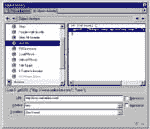

# 闪电侠 101–第四部分:别碰我

> 原文：<https://www.sitepoint.com/flash-101-4-dont-touch/>

 **##### 故意的错误

在本系列的第一篇文章中，我向您介绍了 Flash 工具箱，并解释了各种工具的用途。但是，如果你注意的话，你会知道我故意忽略了文本工具，它是在你的 Flash 电影中添加文本时使用的。

在本周的文章中，我将花一些时间使用这个工具，演示如何使用它和你上次在中学到的补间技术来创建有趣的文本效果。继续读！

##### 写作方式

使用键盘快捷键 T 激活的文本工具主要用于将文本插入到 Flash 电影中。

文本被放置在一个或多个块中，这些块有两种类型——固定宽度的块和可变宽度的块。当您键入文本时，可变宽度的块会水平扩展，而固定宽度的块具有刚性边框，当文本到达边框时会自动换行。

要创建可变宽度的块，只需激活文本工具并在舞台上开始键入。

为了创建固定宽度的块，您需要首先在舞台上绘制块的轮廓，方法是在文本工具处于活动状态时单击并拖动鼠标指针。根据您的要求定义块后，在其中单击以开始插入文字。

您可以通过“窗口”->“面板”->“字符面板”轻松更改插入文本的特征，该面板允许您指定字体、颜色、大小、强调和跟踪等属性。(字体单个字符之间的空间)。您还可以调整字符位置(正常、上标或下标)，如果是段落，还可以调整对齐方式、边距宽度和行距。

Flash 还允许你创建动态文本框，以及接受用户输入的文本框。您可以通过在“字符”面板的“文本选项”选项卡中选择适当的选项来使用这些选项，稍后将详细解释它们。

##### 高保真度

这里有一点需要注意，这与您在 Flash 电影中使用的字体有关。通常，您使用的字体嵌入在 Flash 电影中，这样它们就可以正确地出现在用户的浏览器中；这增加了 final 的文件大小。SWF 文件，但可以确保播放电影时的最大保真度。

这里的替代方法是使用 Flash 的内置“设备字体”，即“sans”、“sans-serif”和“monospace”字体系列中的通用字体。这些字体在“字符”面板的字体选择框中被命名为 _sans、_sans-serif 和 _typewriter，使用它们可以大大减小 Flash 文件的大小。缺点:由于这些字体没有嵌入到文件中，Flash player 将“近似”用户系统中最相似的字体，并以该字体显示文本。显然，这意味着保真度的损失，因为最终 Flash 电影中的文本看起来可能与原始文本完全不同。

要使用设备字体，请选中“字符”面板的“文本选项”选项卡中的“使用设备字体”选项。您还会在下方看到一个标记为“可选”的复选框，如果您希望用户能够选择最终 Flash 电影中出现的文本，请选中此复选框。

最后，您可以将文本块链接到网站 URL——只需在主字符面板的 URL 字段中输入 URL。这里有一个例子:

<object classid="clsid:D27CDB6E-AE6D-11cf-96B8-444553540000" codebase="https://download.macromedia.com/pub/shockwave/cabs/flash/swflash.cab#version=5,0,0,0" align="center" width="115" height="75"><param name="movie" value="https://www.webmasterbase.com/examples/flash101-part4/x1.swf"><param name="loop" value="true/"><param name="quality" value="high/"><param name="bgcolor" value="#FFFFFF/"><embed src="https://www.webmasterbase.com/examples/flash101-part4/x1.swf" loop="" quality="high" bgcolor="#FFFFFF" align="center" width="115" height="75" type="application/x-shockwave-flash" pluginspage="https://www.macromedia.com/shockwave/download/index.cgi?P1_Prod_Version=ShockwaveFlash"></object>

版权所有[梅龙菲尔](https://www.melonfire.com/)，2000 年。保留所有权利。

##### 打破它

通常，您不能对文本块应用渐变填充。如果您打算这样做，首先需要将块分开，以创建可以用各种形状工具修改的单个形状。

在 Flash 5 中，这是通过使用箭头工具选择文本块，然后通过名副其实的“修改”->“拆分”命令将其拆分为多个组成部分来实现的。

一旦块的单个组件被分离，您可以使用绘图和颜色工具来应用不同类型的效果到对象。拆分文本块是对对象应用补间形状的必要前提。

<object classid="clsid:D27CDB6E-AE6D-11cf-96B8-444553540000" codebase="https://download.macromedia.com/pub/shockwave/cabs/flash/swflash.cab#version=5,0,0,0" align="center" width="115" height="75"><param name="movie" value="https://www.webmasterbase.com/examples/flash101-part4/x2.swf"><param name="loop" value="true/"><param name="quality" value="high/"><param name="bgcolor" value="#FFFFFF/"><embed src="https://www.webmasterbase.com/examples/flash101-part4/x2.swf" loop="" quality="high" bgcolor="#FFFFFF" align="center" width="115" height="75" type="application/x-shockwave-flash" pluginspage="https://www.macromedia.com/shockwave/download/index.cgi?P1_Prod_Version=ShockwaveFlash"></object>

我是怎么做到的？很简单。

首先，激活文本工具并在舞台上放置一些文本。使用你最喜欢的字体和颜色。

接下来，用箭头工具选择文本块，将文本分开，你会看到文本块的每个元素都变成了一个不同的对象。现在，您已经有了补间动画的初始形状。

移动到新的帧(比如第 10 帧)，并插入新的关键帧。删除先前创建的文本块，并创建一个包含补间最终结果的新块。如上所述，将这个文本块分开。

回到第一个关键帧，并插入一个补间形状。现在，当您播放片段时，第一个关键帧中的单词将变形为第二个关键帧中的单词，如上例所示。

##### 淡出

如果需要对文本对象应用补间动画，首先需要通过“插入”->“转换为元件”命令将其转换为元件。一旦它成为一个符号，你就可以应用常规的运动效果了。

考虑下面的例子，它使用一个补间动画来模拟一个简单的滚动滚动条。

<object classid="clsid:D27CDB6E-AE6D-11cf-96B8-444553540000" codebase="https://download.macromedia.com/pub/shockwave/cabs/flash/swflash.cab#version=5,0,0,0" align="center" width="200" height="50"><param name="movie" value="https://www.webmasterbase.com/examples/flash101-part4/x3.swf"><param name="loop" value="true/"><param name="quality" value="high/"><param name="bgcolor" value="#FFFFFF/"><embed src="https://www.webmasterbase.com/examples/flash101-part4/x3.swf" loop="" quality="high" bgcolor="#FFFFFF" align="center" width="200" height="50" type="application/x-shockwave-flash" pluginspage="https://www.macromedia.com/shockwave/download/index.cgi?P1_Prod_Version=ShockwaveFlash"></object>

在本例中，我首先创建了一个包含 tickertape 文本的文本框。然后，我选择了该框，将其转换为一个元件，向下插入一个新的关键帧，并将该元件移动到舞台的另一侧。通过对中间阶段应用补间动画，可以模拟滚动滚动条的效果。

当您可以动态更改 tickertape 的内容时，这种技术就真正发挥了作用。当我们转到 ActionScripting 和 Flash 中可用的数据库功能时，我将讨论这个主题。

另一个有趣的效应是所谓的“文本淡化”效应。它看起来是这样的:

<object classid="clsid:D27CDB6E-AE6D-11cf-96B8-444553540000" codebase="https://download.macromedia.com/pub/shockwave/cabs/flash/swflash.cab#version=5,0,0,0" align="center" width="115" height="100"><param name="movie" value="https://www.webmasterbase.com/examples/flash101-part4/x4.swf"><param name="loop" value="true/"><param name="quality" value="high/"><param name="bgcolor" value="#FFFFFF/"><embed src="https://www.webmasterbase.com/examples/flash101-part4/x4.swf" loop="" quality="high" bgcolor="#FFFFFF" align="center" width="115" height="100" type="application/x-shockwave-flash" pluginspage="https://www.macromedia.com/shockwave/download/index.cgi?P1_Prod_Version=ShockwaveFlash"></object>

这也是通过一个补间动画来完成的——实际上是两个补间动画。创建包含文本的元件，并将它的三个实例放在舞台上，在时间轴中彼此相距适当的距离。第一个和第三个实例的 alpha 级别应为 0%(完全透明)，而第二个实例的 alpha 级别应为 100%(完全不透明)。最后，在第一个和第二个实例之间添加一个补间动画，在第二个和第三个实例之间添加另一个补间动画。

版权所有[梅龙菲尔](https://www.melonfire.com/)，2000 年。保留所有权利。

##### 纽扣人

好了，文字工具用够了。让我们转移到别的事情上。到目前为止，我一直限制您在 Flash 电影中创建和使用图形符号。是时候进入下一个层次了，使用另一种符号类型，称为“按钮”。

在 Flash 中，按钮就像一个常规符号，您可以创建它，将其放入 Flash 电影中，然后编辑它，但有一个重要的区别:与您一直在创建的图形符号不同，Flash 按钮具有一些预定义的特征。这些特征定义了当鼠标指针移动到按钮上或用户单击按钮时按钮的行为。

让我们来看看。打开一个新的 Flash 电影，画一个像这样的东西。

用渐变填充给它一个好按钮所需要的三维效果。

现在，选择图像并将其转换为符号。记住这次选择“按钮”作为符号类型。当您回到舞台上时，右键单击符号并选择“编辑”选项以切换到符号编辑模式。你应该在时间线上看到类似这样的东西。

正如你所看到的，每个按钮都有三个预定义的框架——“向上”、“越过”和“向下”(是的，我知道还有一个叫做“点击”的东西，你可以暂时忽略它。)

这三种状态允许您根据用户鼠标指针的位置来指定按钮的外观。要了解其工作原理，请执行以下操作:

保持“向上”状态——这是按钮默认显示的状态。

选择标记为“结束”的帧，右键单击它以插入新的关键帧。选择按钮，用不同的颜色填充。这是当用户的鼠标指针“悬停”在按钮上时出现的颜色。

选择标记为“向下”的帧，插入新的关键帧，并再次更改按钮的颜色。如果你喜欢，也可以使用文本工具在按钮下插入一行文本——就像这样:

这是用户用鼠标指针单击按钮时按钮的外观。

最后一帧“点击”实际上定义了按钮符号的“点击区域”——这是当指针移动到它上面时将触发“越过”和“按下”状态的区域。您可以定义比按钮尺寸更小或更大的点击区域。

完成了吗？切换回舞台，并确保“控制->启用简单按钮”菜单项已激活–这将允许您在 Flash 创作环境本身中测试按钮。现在尝试一下——您应该会看到类似这样的内容:

<object classid="clsid:D27CDB6E-AE6D-11cf-96B8-444553540000" codebase="https://download.macromedia.com/pub/shockwave/cabs/flash/swflash.cab#version=5,0,0,0" align="center" width="150" height="150"><param name="movie" value="https://www.webmasterbase.com/examples/flash101-part4/x5.swf"><param name="loop" value="true/"><param name="quality" value="high/"><param name="bgcolor" value="#FFFFFF/"><embed src="https://www.webmasterbase.com/examples/flash101-part4/x5.swf" loop="" quality="high" bgcolor="#FFFFFF" align="center" width="150" height="150" type="application/x-shockwave-flash" pluginspage="https://www.macromedia.com/shockwave/download/index.cgi?P1_Prod_Version=ShockwaveFlash"></object>

很酷吧。

版权所有[梅龙菲尔](https://www.melonfire.com/)，2000 年。保留所有权利。

##### 点击我

当然，一个点击时什么也不做的按钮就像一个坏掉的时钟——毫无用处。创造 Flash 的人也知道这一点——这就是为什么他们内置了一整套“动作”,你可以将它们附加到你的按钮上。其中最流行的是“获取 URL”动作，它指示浏览器打开一个新的 URL。

要将“获取 URL”操作或任何其他操作附加到按钮，请右键单击舞台上的按钮，然后从弹出菜单中选择“操作”。在打开的窗口中，双击“基本操作”部分中的“获取 URL”项，Flash 将在面板的右侧编写一些代码，并在底部显示几个文本字段，供您输入 URL 和窗口名称(如果有)。

一旦你输入了一个网址，你就可以看到它是如何通过下面的按钮工作的——它将在一个新的浏览器窗口中打开一个新的网站。

<object classid="clsid:D27CDB6E-AE6D-11cf-96B8-444553540000" codebase="https://download.macromedia.com/pub/shockwave/cabs/flash/swflash.cab#version=5,0,0,0" align="center" width="150" height="150"><param name="movie" value="https://www.webmasterbase.com/examples/flash101-part4/x6.swf"><param name="loop" value="true/"><param name="quality" value="high/"><param name="bgcolor" value="#FFFFFF/"><embed src="https://www.webmasterbase.com/examples/flash101-part4/x6.swf" loop="" quality="high" bgcolor="#FFFFFF" align="center" width="150" height="150" type="application/x-shockwave-flash" pluginspage="https://www.macromedia.com/shockwave/download/index.cgi?P1_Prod_Version=ShockwaveFlash"></object>

为了在 Flash 创作环境中测试动作，您需要确保 Control-> Enable Simple Frame Actions 菜单项被激活。

还有许多其他可用的操作，我将在下周探讨它们[。所以请继续关注——这越来越有趣了！](https://www.webmasterbase.com/article/736)

*注意:本文中的所有示例都已经在 Macromedia Flash 5.0 上测试过。这些示例仅用于说明，并不适用于生产环境。YMMV！*

版权所有[梅龙菲尔](https://www.melonfire.com/)，2000 年。保留所有权利。

## 分享这篇文章**