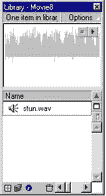
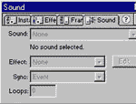
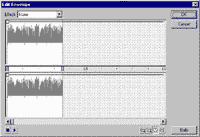
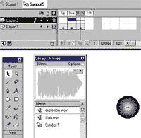
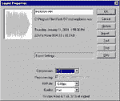
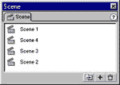

# 闪电侠 101–第 6 部分:最后的倒计时

> 原文：<https://www.sitepoint.com/flash-101-6-final-countdown/>

 **##### 音乐之声

好了，我们就要结束这场我称之为闪电侠 101 的疯狂之旅了。如果你一直在跟随学习[，你可能会松一口气，因为本教程几乎结束了，现在你可以开始实际使用 Flash 5 了。](https://www.webmasterbase.com/article/736)

不过，别这么快——我还有几分钟时间，我打算把它们都用掉。在这篇文章的结尾，我将教你如何通过添加声音剪辑，循环播放，同步和淡入淡出来使你的动画更有活力。我还将向您展示如何将声音附加到 Flash 按钮上，以及如何将图像从其他应用程序导入 Flash。

哪儿也别去！

##### 海浪

正如您可以创建符号并反复使用它们一样，Flash 允许您将声音文件导入到库中，并在 Flash 电影的不同位置使用它们。您可以通过文件->导入命令导入 WAV 和 MP3 格式的声音文件。一旦您将声音文件导入到您的 Flash 电影中，它将显示在库中。

将声音文件添加到您的 Flash 电影本身很简单-创建一个新层，选择您希望声音开始播放的帧，并将声音文件从库中拖到舞台上。波形的图形表示将出现在时间线中。

Flash 允许您添加任意数量的声音文件到 Flash 电影中；但是，请记住，回放最终影片时，所有这些声音文件会混合在一起。将每个声音文件放在单独的层上也是一个好主意，这样您就可以轻松地操纵电影中的各种文件。

您可以控制声音剪辑的属性，或者通过窗口->面板->声音面板为其添加效果。选中包含声音剪辑的帧，弹出打开此面板，查看可用的选项。

各种可用选项中最重要的是同步选项，它允许您指定声音文件是否与动画的其余部分同步。要使声音剪辑与动画的不同帧同步，请选择“流”选项。流式声音在下载时开始播放，并在影片结束时自动停止。

相反，如果您希望声音剪辑独立于动画在整个影片中播放，请选择“事件”选项。在这种情况下，声音剪辑独立于时间轴中的帧播放，甚至可能在影片结束后继续播放。事件选项最常用于将声音链接到 Flash 事件，如单击按钮。

如果您想要声音剪辑播放多次，您可以在“循环”栏中输入一个数字，还可以使用“效果”下拉菜单添加声音效果，如渐变和频道转换。

最后，您可以在特定点停止声音，方法是在声音层的该点插入一个关键帧，然后从该关键帧的“同步”菜单选项中选择“停止”。

版权所有[梅龙菲尔](https://www.melonfire.com/)，2000 年。保留所有权利。

##### 原声广告

如果预定义的 Flash 声音效果不够，您还可以使用 Flash 的内置编辑控件来进一步自定义声音剪辑。这些编辑控件可通过“声音”面板中的“编辑”命令获得。

这看起来很复杂，但实际上远比看起来简单。例如，要更改声音剪辑开始和停止播放的点，只需将时间进入和时间结束控制(左右声道波形之间的垂直灰色条)拖到适当的点。如果您有一个很长的声音剪辑，并且只需要在动画剪辑中使用它的特定部分，这将非常方便。

您还可以通过上下拖移“包络手柄”(您在每个通道中看到的空心框)来更改每个通道的音量。两个盒子之间的高度越大，音量水平越高，反之亦然。Flash 允许您为每个声音剪辑创建多达八对不同的信封手柄。

##### 嘣！

除了在电影播放时播放声音文件之外，Flash 还允许您播放声音来响应用户的操作。最常见的例子是将声音文件附加到 Flash 按钮上，以便根据按钮状态播放不同的声音。看一下这个例子，它演示了如何为“悬停”和“点击”事件播放不同的剪辑。

<object classid="clsid:D27CDB6E-AE6D-11cf-96B8-444553540000" codebase="https://download.macromedia.com/pub/shockwave/cabs/flash/swflash.cab#version=5,0,0,0" align="center" width="200" height="200"><param name="movie" value="https://www.webmasterbase.com/examples/flash101-part6/x1.swf"><param name="loop" value="true/"><param name="quality" value="high/"><param name="bgcolor" value="#FFFFFF/"><embed src="https://www.webmasterbase.com/examples/flash101-part6/x1.swf" loop="" quality="high" bgcolor="#FFFFFF" align="center" width="200" height="200" type="application/x-shockwave-flash" pluginspage="https://www.macromedia.com/shockwave/download/index.cgi?P1_Prod_Version=ShockwaveFlash"></object>

我是怎么做到的？实际上并不太难——创建一个 Flash 按钮，并在符号编辑模式下向时间轴添加一个新层。然后，只需在这个新图层上插入与向上、向上和向下状态对应的关键帧，并从库中为每个状态拖动不同的声音文件。

例如，如果您想要在鼠标指针移过按钮时播放特定的声音，您可以为“移过”状态插入一个新的关键帧，并将声音文件拖到该关键帧的舞台上。

确保您在声音面板上为同步选项选择了事件，并尝试它。

您也可以在这里添加声音效果，并使用编辑控件操纵声音剪辑。

##### 挤进去

当您发布电影时，Flash 通常会导出电影剪辑中的所有声音。作为电影的作者，您对导出过程有相当大的控制权，包括设置各种压缩选项的能力，如采样率和质量。

所有这些选项都可以在“声音属性”对话框中使用，您可以通过右键单击库中的声音文件时出现的“属性”快捷菜单来访问该对话框。有四种压缩选项可用:默认(默认设置)、ADPCM、MP3 和 raw(无压缩)。“测试”按钮允许您使用选定的压缩设置预览声音剪辑。

一些压缩选项允许您指定比特率和质量-请记住，在试验这些设置时，更高的压缩率等于更小的文件等于更低的质量。

版权所有[梅龙菲尔](https://www.melonfire.com/)，2000 年。保留所有权利。

##### 其他地方的漂亮照片

除了导入声音剪辑，Flash 还允许您导入在其他应用程序中创建的图像，并在您的 Flash 电影中使用它们。Flash 5 支持 Adobe Illustrator EPS 文件、AutoCAD DXF 文件、位图、gif、JPEGs、PNG 图像及其自身的 SWF 格式，所有这些都可以通过“文件”->“导入”命令导入到 Flash 中。导入的图像会与您创建的其他元件一起出现在资源库中。

由于位图通常非常大，它们会大大增加 Flash 电影的文件大小，因此，Flash 允许您使用“修改”->“跟踪位图”命令将导入的位图转换为更有效的矢量图形。

跟踪位图命令顾名思义，它跟踪位图图像和颜色，以矢量格式创建精确的渲染。通常，最终的矢量图像缺乏原始图像的保真度，但在网络上使用仍然是可以接受的。

通过指定颜色阈值(是否将具有相似颜色值的像素视为相同)和曲线拟合(曲线应该有多平滑)等属性，Flash 还允许您在一定程度上控制描摹过程。你必须尝试不同的值，直到你找到一个适合你的特定位图的设置。

位图转换为矢量图形后，您可以像操作舞台上的其他对象一样操作它-将其转换为元件，改变其颜色和形状，缩放，旋转和倾斜它。

Flash 还允许您使用导入的位图作为填充-为此，请使用“修改”->“分离”命令。这将打破位图分成单独的颜色部分。接下来，选择吸管工具，你应该在可用填充列表中看到断开的位图。选择该填充，然后使用绘图和绘画工具用该填充进行绘图和绘画。下面的示例演示如何用位图填充椭圆。

##### 风景优美的路线

在百老汇最好的传统中，Flash 允许你把一部电影分成“场景”，一个接一个回放的独立序列。当您需要将 Flash 电影组织成不同的部分时，Scenes 就派上了用场。

你可以通过窗口->面板->场景面板添加一个新的场景；如果您需要从电影中删除一个场景，或者改变场景播放的顺序，这也是一个好去处。

Flash 还允许您使用 ActionScript(特别是“转到”动作)通过跳转到特定场景来响应用户输入，从而为电影添加交互性。

最后，Flash 还允许您与其他 Flash 电影共享您在一个 Flash 电影中创建的符号，这种功能称为“共享库”。为此，您必须通过导出来标记想要共享的符号；您可以通过右键单击符号时出现的快捷菜单上的链接菜单命令来完成此操作。记住也要包括符号的标识符。

以这种方式导出所有共享元件后，您可以保存您的 Flash 电影，共享库将与它一起存储。现在，您可以通过“文件”->“打开为共享库”命令从任何其他电影中访问此 Flash 电影中的元件。打开共享库后，您可以像平常一样使用其中的元件，方法是将它们拖到舞台上。

但是，请注意，共享库通常以暗灰色显示，表示您不能修改其中包含的符号。

当您发布包含共享库中元件的 Flash 电影时，必须确保该共享库也可用于该电影。如果 Flash 找不到共享库，Flash 电影将无法正确播放。

差不多就这些了。希望您现在对 Flash 有足够的了解，可以开始将它用于您自己的动画剪辑和 Web 效果。如果你想阅读更多，或者学习更多关于 ActionScript 和高级 Flash 技术的知识，请给我写信，我会尽力而为。

直到下一次…保持健康！

*注意:本文中的所有示例都已经在 Macromedia Flash 5.0 上测试过。这些示例仅用于说明，并不适用于生产环境。YMMV！*
版权所有[梅龙菲尔](https://www.melonfire.com/)，2000 年。保留所有权利。

## 分享这篇文章**