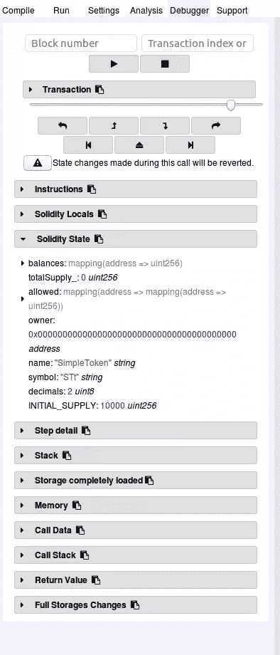
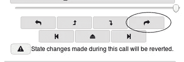
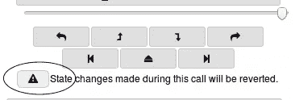
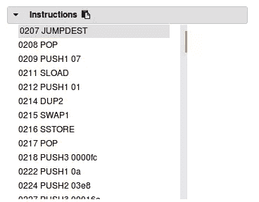
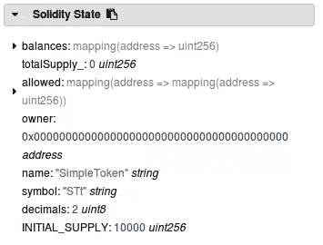
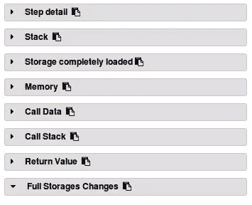

# 扁平化契约和使用 Remix 进行调试

> 原文：<https://www.sitepoint.com/flattening-contracts-debugging-remix/>

**以太坊主网上的智能合约使用真实的货币，因此建立无错误的[智能合约](https://bitfalls.com/2018/03/31/solidity-development-crash-course-building-blockchain-raffle/)至关重要，需要调试器等特殊工具。**

Remix IDE 是功能最全、最可靠的 IDE。在其他工具中，它有一个优秀的分步调试器。您可以通过展开各种面板来执行各种任务，如及时移动、更改当前步骤、探索局部变量和当前状态。

您还可以设置断点，在代码的不同点之间移动。终端允许您显示从 Remix 执行的事务并调试它们。

在本教程中，我们将使用 [Truffle 和 OpenZeppelin](https://www.sitepoint.com/solidity-openzeppelin) 构建一个简单的定制令牌。我们将了解为什么以及如何扁平化契约，最后我们将使用 Remix IDE 开始调试契约。

## 为什么要简化智能合同？

**扁平化**智能合约指的是将所有 Solidity 代码合并到一个文件中，而不是多个源文件中，这样，不是导入，而是将导入的代码嵌入到同一个文件中。由于各种原因，我们需要扁平化智能合约，例如手动审查合约，在 [Etherscan](https://etherscan.io) 上验证合约，或者用 Remix IDE 调试合约，因为它目前不支持导入。

## 使用 Truffle 和 OpenZeppelin 编写一个简单的令牌

Remix IDE 被官方推荐用于构建小契约或为了学习 Solidity，但一旦你需要构建更大的契约或需要高级编译选项，你就必须使用 Solidity 编译器或其他工具/框架，如 Truffle。

除了无错误契约之外，安全性也是构建智能契约的关键部分。出于这个原因，使用经过战斗考验的框架，如 [OpenZeppelin](https://openzeppelin.org/) ，它提供可重用的、经过良好测试的、经过社区审查的智能合同，将帮助您减少 Dapps 中的漏洞。

现在让我们看看如何使用 Truffle 和 OpenZeppelin 来创建一个简单的定制令牌，它扩展了 OpenZeppelin 的标准令牌。

### 要求

这个教程需要一些松露，以太坊，固体的知识。可以看一下[区块链介绍](https://www.sitepoint.com/blockchain-what-it-is-how-it-works-why-its-so-popular/)和[以太坊介绍](https://www.sitepoint.com/ethereum-introduction/)。

您还需要在系统上安装 Node.js *5.0+* 和 npm。参考他们的[下载页面](https://nodejs.org/en/download/)获取说明。

### 安装 Truffle

使用您的终端，运行以下命令来安装 Truffle:

```
npm install -g truffle 
```

### 创建一个新的松露项目

首先为您的项目创建一个新目录。让我们称之为`simpletoken`并进入其中:

```
mkdir simpletoken
cd simpletoken 
```

接下来，使用以下命令创建实际的项目文件:

```
truffle init 
```

该命令将创建多个文件夹，如`contracts/`和`migrations/`，以及将合同部署到区块链时将使用的文件。

接下来，我们将安装 OpenZeppelin:

```
npm install openzeppelin-solidity 
```

### 创建简单的令牌协定

在`contracts/`文件夹中，创建一个名为`SimpleToken.sol`的文件，并添加以下内容:

```
pragma solidity ^0.4.23;

import 'openzeppelin-solidity/contracts/token/ERC20/StandardToken.sol';

contract SimpleToken is StandardToken {
    address public owner;

    string public name = 'SimpleToken';
    string public symbol = 'STt';
    uint8 public decimals = 2;
    uint public INITIAL_SUPPLY = 10000;

    constructor() public {
      totalSupply_ = INITIAL_SUPPLY;
      balances[owner] = INITIAL_SUPPLY;
    }

} 
```

这是我们将要展开和调试的合同。我们正在导入 OpenZeppelin `StandardToken.sol`契约，并声明我们的`SimpleToken`契约，它使用`is`操作符扩展了`StandardToken.sol`。

我们的契约将继承一堆变量和函数，为了定制契约，需要覆盖这些变量和函数。

为了完成我们的 Truffle 项目，在您项目的`migrations/`文件夹中，创建一个名为`2_deploy_contract.js`的文件，并添加以下内容:

```
var  SimpleToken = artifacts.require("SimpleToken");
    module.exports  =  function(deployer) {
        deployer.deploy(SimpleToken);
}; 
```

使用这个文件，我们可以将我们的智能合约部署/迁移到区块链中，但是对于这个示例，我们实际上并不需要这个文件，因为我们将在展平智能合约之后使用 Remix IDE 来部署智能合约。

### 使用松露展平器展平合同

Truffle Flattener 是一个 npm 实用程序，它以正确的顺序展平或合并在 Truffle 下开发的 Solidity 文件及其所有依赖项。

首先，使用以下命令从 npm 全局安装`truffle-flattener`:

```
npm install -g truffle-flattener 
```

接下来，在您的 Truffle 项目中，运行以下命令来展平`SimpleToken.sol`文件:

```
truffle-flattener contracts/SimpleToken.sol > FlattenedSimpleToken.sol 
```

`truffle-flattener`将扁平化的合同输出到标准输出或终端。使用`>`操作符，我们将输出保存在当前文件夹中的`FlattenedSimpleToken.sol`文件中。

### 使用 Remix IDE 编译和部署合同

您可以从`FlattenedSimpleToken.sol`文件中访问展平的智能合同。打开文件并复制其内容。

接下来，从[https://remix.ethereum.org](https://remix.ethereum.org)打开 Remix IDE，并将展平的智能合约粘贴到 IDE 中的一个新文件中。

如果你得到一个错误消息说*模拟编译器:未找到源代码*，请确保从*设置选项卡>实体版本窗格>选择新编译器版本下拉列表*中选择一个新的编译器版本。

如果*自动编译*被禁用，点击*编译*面板上的*开始编译*按钮。

接下来，激活*运行*面板。首先确保您已经为环境选择了 *JavaScript VM* 。在第二个框中，从下拉列表中选择 *SimpleToken* 合同，然后点击下拉列表正下方的红色 *Deploy* 按钮。

您的合同部署并运行在 JavaScript VM 上，它模拟了一个区块链。我们现在可以开始用不同的方式调试它。

## 调试自定义令牌协定

为了查看如何调试契约，我们将首先引入一些错误。

你可以在 Remix IDE 中使用两种不同的方式开始调试智能合约，这取决于用例。

当您第一次部署您的智能合约或随后执行任何交易时，一些信息将被记录在终端中，您可以从日志旁边的白色 *Debug* 按钮开始调试它。让我们看看实际情况。

### 使用 assert()

SafeMath 是一个 OpenZeppelin 库，用于带有抛出错误的安全检查的数学运算。`sub(a,b)`函数将两个数相减并返回一个无符号数。第一个参数应该大于第二个参数，这样我们总能得到一个正数。这个函数使用一个 *assert()* 函数来执行这个规则。这是*子*功能的代码:

```
 function sub(uint256 a, uint256 b) internal pure returns (uint256) {
    assert(b <= a);
    return a - b;
  } 
```

只要您为验证条件 *b < = a* 的 *a* 和 *b* 提供值，执行就会顺利继续，但是一旦您提供的 *b* 的值大于 *a* 的值， *assert()* 函数就会抛出一个错误，指出:

```
VM error: invalid opcode. invalid opcode The execution might have thrown. Debug the transaction to get more information. 
```

因此，让我们在 *SimpleToken* 契约中添加一个对带有错误参数的 *sub()* 的调用:

```
 constructor() public {
      totalSupply_ = INITIAL_SUPPLY;
      balances[owner] = INITIAL_SUPPLY;
      SafeMath.sub(10, 1000);
    } 
```

如果您重新部署契约，您将在终端中得到无效操作码错误:


一旦你点击*调试*按钮，你将被带到*调试器*面板，在那里你可以开始调试你的代码。



在代码编辑器中，第一行/指令将突出显示，标记我们当前在代码中的位置。


点击*向前单步执行*按钮，单步执行代码。



您也可以使用*跳转到异常*按钮直接跳转到异常。



无论您使用哪种方式，调试器都会带您找到导致问题的代码，然后停止。


您可以在当前步骤检查局部变量的状态。


*实度局部*面板显示与当前上下文相关的局部变量。

从源代码和 *Solidity Locals* 可以得出结论，问题的来源与 *assert()* 方法和 *b* 的值大于 *a* 的值有关。

您可以使用*停止调试*按钮停止调试。


查看调试器的其他面板也是值得的。

### 说明



*指令*面板显示被调试合同的字节码。当前步骤的字节码被突出显示。

### 固体状态



*实体状态*面板显示当前调试契约的状态变量。

### 低级面板



这些面板显示关于执行的低级信息，如步骤细节、内存、堆栈和函数返回值。

## 结论

在本教程中，我们使用 Truffle 和 OpenZeppelin 构建了一个简单的令牌，然后使用 truffle-flattener 展平自定义契约，并使用 Remix IDE 开始调试契约中的错误。

希望这能帮助你无畏地一步一步调试你自己的合同。让我们知道它是如何为你工作的！

## 分享这篇文章