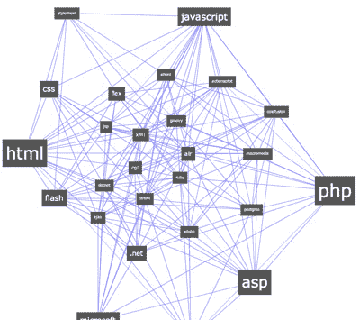

# 使用 Flex 实现数据可视化，第三部分

> 原文：<https://www.sitepoint.com/flex-data-visualization-part-3/>

在我们的[第一篇文章中，](https://www.sitepoint.com/article/flex-data-visualization-part-1)我们回顾了数据可视化的基础，创建了一个数据集，并生成了一个显示关键词在 [SitePoint 论坛中出现的显示。](https://www.sitepoint.com/forums)在[的第二部分中，](https://www.sitepoint.com/article/flex-data-visualization-part-2)我们用一个弹簧图代替了输出——更好地说明了关键词之间的关系——还添加了一些字体缩放来显示每个关键词的相对受欢迎程度。在我们的最后一期文章中，我们将向显示中添加更多的信息，并根据最佳实践重构我们的应用程序。这些说明将基于第二个教程中的已完成代码，但是您可能希望下载包含所有已完成代码的 [Flex Builder 项目档案。](http://sitepoint-examples.s3.amazonaws.com/flexdataviz/SitePoint_DataViz_Tutorial_Part3.zip)

本周我们又有一个由 Adobe 赞助的[文章测验](https://www.sitepoint.com/quiz/flex3/flex-data-visualization-part-3/)来测试你在教程中学到了什么。当你在这里完成后，一定要去[看看](https://www.sitepoint.com/quiz/flex3/flex-data-visualization-part-3/)！

## 添加基本工具提示

在第二篇文章的最后，我们得到了一个类似于这样的 spring 图:

**图一。初始图形**



这让我们可以看到关键词之间的直接关系，也可以看到它们的相对受欢迎程度。虽然它确实留下了一些需要改进的地方。首先，我们无法看到每个关键字的实际出现次数，因为我们是以固定的增量缩放字体大小，所以以相同大小显示的关键字之间的计数会有相当大的差异。

向图表中添加更多的文本可能会使它变得有些混乱，而准确的出现次数更多的是次要的数据，如果人们对收集更多的信息感兴趣，他们将会深入研究这些数据。考虑到这一点，一个好的方法是添加一个工具提示——这样用户可以将鼠标放在他们感兴趣的任何关键词上，并看到他们想要的信息，而不会不必要地阻塞图形。

实现这一点的简单方法是将计数添加到项目渲染器的`toolTip`属性中。让我们现在试着这样做:

**例 1。`(节选)`**

```
<sg:SpringGraph   id="mySpringGraph"  backgroundColor="#FFFFFF"   lineColor="#6666ff"   repulsionFactor="5"  right="10" left="10" bottom="10" top="10">  <sg:itemRenderer>    <mx:Component>      <mx:VBox         cornerRadius="5"         backgroundColor="0x444444"         paddingBottom="5"         paddingLeft="5"         paddingRight="5"         paddingTop="5"         toolTip="{data.data}">        <mx:Label           text="{data.id}"           fontSize="10"           color="0xFFFFFF"           textAlign="center" />      </mx:VBox>    </mx:Component>  </sg:itemRenderer></sg:SpringGraph>
```  
如果你看一下我们添加到内联项目渲染器组件中的`VBox`的`toolTip`属性，我们在对象中将`data`键传递给它。这可能看起来令人困惑:请记住，在 Flex 中，传递给项目渲染器的内容总是被赋予引用`data`，而碰巧的是，我们的`Item`类有一个名为 data 的属性，我们用它来存储关键字出现次数。如果我们在`Item`类中的属性被称为 occurrence_count ，代码将如下所示:

```
toolTip="{data.occurrence_count}"
```

保存上面的代码——当您将鼠标悬停在生成的 spring 图形中的某个关键字上时，您应该会看到类似这样的工具提示:

**图二。简单的工具提示**


这是可行的，并且证明了我们可以将我们的信息推送到工具提示中，但是既不吸引人也没有特别的帮助。理想情况下，我们想要更漂亮的界面，一个足够大的界面来包含一些额外的文本，如“在 12345 个线程中提到的”`  `## 最佳实践、代码架构和重构

在我们开始之前，有一个关于最佳实践的注意事项。在[第二部分中，](https://www.sitepoint.com/article/flex-data-visualization-part-2)我们简单地内联创建了我们的项目渲染器——这更容易，并且允许我们在没有大量代码架构妨碍的情况下探索这个概念。然而，在现实世界中，为项目渲染器创建一个独立的类要好得多。这样做为我们提供了封装，并允许我们在多个地方重用同一个工具提示，如果我们愿意的话。在这个 spring graph 应用程序的上下文中，将这些元素分开可能没有什么意义，尤其是如果您缺乏处理大型项目的经验。然而，从长远来看，我保证如果你遵循这些原则，你会发现生活变得容易得多。请记住，当它是一个很小的演示应用程序时，看起来工作量很大，但是一旦您的代码库达到几十万行代码，如果您遵循了这种最佳实践，那么调试、重构或修改应用程序的任何部分都会变得简单得多。

架构最佳实践的原因超出了本文的范围，所以现在我只列出一个简单的方法来构建代码。如果你是这方面的新手，我强烈建议你阅读一些关于 Flex 架构和设计模式的书籍，或许还可以看看一些框架，比如 [Mate](http://mate.asfusion.com) 和 [Swiz](http://code.google.com/p/swizframework/) 。

为了分离出我们的项目渲染器，我们需要创建一个新的类。在您的`src`目录中，您应该有一个名为`com`的子目录。在`com`中，创建一个名为`sitepoint`的目录，然后在其中创建另一个名为`itemrenderers`的目录。这种布局文件夹的方法有时被称为*反向域符号*，这是一种将代码从不同项目中分离出来的简便方法。只要路径是正确的，Flex 就不关心我们的代码在哪里——我们创建子目录纯粹是为了随着代码库的增长或者当您将不同项目中的代码合并成一个项目时，使其更容易管理。在我们的例子中，您可以看到我们已经有了一个目录—`adobe`—在我们的`com`目录中；这是 Adobe JSON 序列化类存在的地方。你已经可以看到坚持这个领域符号是如何自动保护我们免受任何命名冲突的影响，并保持它的整洁。

现在在 Flex Navigator 窗格中，右键单击`itemrenderers`文件夹并选择新建，然后选择 MXML 组件。称之为`KeywordRenderer.mxml`，以 VBox 为基础。您应该得到一个新文件，其内容如下所示:

**例二。`src/com/sitepoint/itemrenderers/KeywordRenderer.mxml`(节选)**

```
<?xml version="1.0" encoding="utf-8"?><mx:VBox xmlns:mx="http://www.adobe.com/2006/mxml" width="400" height="300"></mx:VBox>
```

我们完成渲染器所需的代码类似于我们在上一教程中构建的内联版本，完整的文件应该如下所示:

**例 3。`src/com/sitepoint/itemrenderers/KeywordRenderer.mxml`**

```
<?xml version="1.0" encoding="utf-8"?><mx:VBox   xmlns:mx="http://www.adobe.com/2006/mxml"  cornerRadius="5"  borderThickness="1"  borderStyle="solid"  backgroundColor="0x444444"   paddingBottom="5"   paddingLeft="5"   paddingRight="5"   paddingTop="5">  <mx:Label     text="{data.id}"     fontSize="{parentDocument.getFontSize(data.data)}"     color="0xFFFFFF"     textAlign="center" /></mx:VBox>
```

现在这已经完成了，我们回到我们的主`.mxml`文件并做一些修改。移除内嵌组件——包括标签在内的所有内容。它最终应该是这样的:

**例 4。`src/SitePoint_DataViz_Tutorial_Part3.mxml`(节选)**

```
<sg:SpringGraph   id="mySpringGraph"  backgroundColor="#FFFFFF"   lineColor="#6666ff"   repulsionFactor="5"  right="10" left="10" bottom="10" top="10" />
```

请注意，我已经删除了结束标记，并在开始标记中添加了一个尾随斜杠，因为我们不再需要在它里面嵌套任何东西。我们还需要将本系列的字体步进代码(我们在第二部分中编写的)移到项目渲染器类中。这将避免我们不得不使用对字体函数的`parentDocument`调用。让组件不依赖于代码的其余部分总是一个好主意，这样它们就可以不加修改地被重用。

因为我们的字体方法依赖于在主应用程序中计算的数据，所以我们需要将它作为一系列参数传入。我们可以将`getFontSize`方法复制并粘贴到新的项目渲染器中，然后像这样添加公共变量的声明:

**例 5。`src/com/sitepoint/itemrenderers/KeywordRenderer.mxml`(节选)**

```
public var dataMin:Number;public var dataMax:Number;public var fontMin:Number;public var fontMax:Number;public var fontLift:Number;
```

为了允许我们设置这些参数，我们需要在我们的主应用程序文件中分配 itemRenderer 。让我们将它添加到`setup`方法中，就在我们分配 dataProvider- 的那一行之前:

**例 6。`src/SitePoint_DataViz_Tutorial_Part3.mxml`(节选)**

```
var factory:ClassFactory = new ClassFactory(KeywordRenderer)factory.properties = {fontMin:fontMin, fontMax:fontMax, fontLift:fontLift, dataMin:dataMin, dataMax:dataMax};mySpringGraph.itemRenderer = factory; mySpringGraph.dataProvider = myGraph;
```

这里我们创建一个`ClassFactory`并在一个数组(`factory.properties`)中设置我们需要的参数，然后将工厂指定为 spring 图形的项目渲染器。我们需要在我们的脚本中这样做，因为如果我们简单地在 MXML 标签中将它指定为一个属性，我们就无法设置参数。

您的最终`KeywordRenderer.mxml`应该是这样的:

**例 7。`src/com/sitepoint/itemrenderers/KeywordRenderer.mxml`(节选)**

```
<?xml version="1.0" encoding="utf-8"?><mx:VBox   xmlns:mx="http://www.adobe.com/2006/mxml"  cornerRadius="5"  borderThickness="1"  borderStyle="solid"  backgroundColor="0x444444"   paddingBottom="5"   paddingLeft="5"   paddingRight="5"   paddingTop="5"   buttonMode="true"  mouseChildren="false"  useHandCursor="true"  click="this.searchForums()"  toolTip=" "  toolTipCreate="createCustomToolTip('Mentioned in '+formatter.format(data.data)+' threads', event)">  <mx:Script>    <![CDATA[      import mx.events.ToolTipEvent;      import com.sitepoint.tooltips.KeywordToolTip;            private var sitePointSearchURL:String = "https://www.sitepoint.com/forums/search.php?q=";      public var dataMin:Number;      public var dataMax:Number;      public var fontMin:Number;      public var fontMax:Number;      public var fontLift:Number;          private function createCustomToolTip(title:String, event:ToolTipEvent) : void {        var ktt:KeywordToolTip = new KeywordToolTip();        ktt.message = title;        event.toolTip = ktt;      }          private function getFontSize(data:Number) : Number {        var fontSize:Number = (data - dataMin) / fontLift;        if (fontSize < fontMin) {          return fontMin;        } else if (fontSize > fontMax) {          return fontMax;        } else {          return fontSize;          }      }            private function searchForums() : void {        navigateToURL(new URLRequest(sitePointSearchURL+data.id), "_self");      }    ]]>  </mx:Script>  <mx:NumberFormatter id="formatter" />  <mx:Label     text="{data.id}"     fontSize="{getFontSize(data.data)}"     color="0xFFFFFF"     textAlign="center" /></mx:VBox>
```

如果您编译并重新加载您的应用程序，什么都不会改变…完美！这正是你想要的！当重构时，目标是保持应用程序的行为不变，同时提供一种温暖模糊的感觉，知道你已经为未来正确地构建了代码。

**note:** Performance Considerations

创建自定义项目渲染器时(尤其是对于数据网格这样的组件)，您需要考虑性能。对于我们的简单目的，上面的项目渲染器已经足够了。但是，如果您正在为大量数据网格创建渲染器，那么最好创建一个纯 ActionScript 项目渲染器。这不依赖于容器，因为当在呈现网格时创建几十个或几百个元素时，像`Canvas`和`VBox`这样的元素会影响性能。` 

## `分享这篇文章`