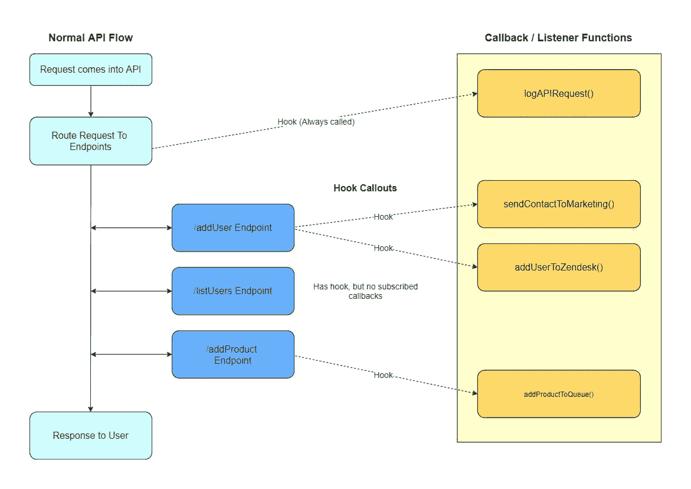

# 灵活的 API 设计:为你的 PHP API 管道创建钩子

> 原文：<https://www.sitepoint.com/flexible-api-design-create-hooks-for-php-api-pipeline/>

设计应用编程接口(API)可能是一项具有挑战性的工作。好的 API 有简单的接口，简单明了，易于使用。在这个简单的接口背后可能有许多复杂的系统交互，这些交互可能会把原本定义明确的端点任务的水搅浑。随着时间的推移，开发人员可能会被要求为现有的端点“添加”额外的业务逻辑。然后，在您知道它之前，一个 API 调用正在与十几个系统进行交互，这是其主要流程的一部分。

如果我们能够开发一个简单的管道，并且能够在不影响主流的情况下添加额外的任务，这不是很好吗？这篇文章将向你展示如何从 WordPress 和一般的编程中改编一个想法，让你的 API 有能力做更强大的交互。

## 什么是挂钩/动作？

一个[钩子(又名动作/过滤器)](https://developer.wordpress.org/plugins/hooks/)是 WordPress 社区给事件及其相关回调的名字。如果你有编程经验，你可能熟悉回调和[发布者-订阅者模式](https://en.wikipedia.org/wiki/Publish%E2%80%93subscribe_pattern)。在处理过程中，系统可能触发一个事件，该事件调用零到多个订阅该事件的函数。例如，作为对加载页面的响应，WordPress 调用函数来加载标题、标题、列出文章或寻找正确的模板。这些任务的运行不会打乱生成页面的主要过程。

钩子背后的想法并不新鲜，也不是 WordPress 发明的。然而，WordPress 在服务器端页面处理生命周期中做了很好的实现。在我看来，钩子的使用可能是这个平台最大的特点。有了这些钩子，用户可以编写自己的功能——无论是插件还是主题——绑定到 WordPress，并在需要的时候运行你想要的任何代码。您需要修改发送给用户的邮件头吗？没问题:挂钩到`wp_headers`事件，您可以根据需要修改标题。

## 为什么在 API 中使用钩子？

钩子对很多事情都有好处，包括触发一些辅助任务、通过 PHP cURL 命令调用另一个系统、构建一个对象并将其放入任务队列供另一个系统稍后获取、发送电子邮件等等。这些都可以在不需要遮蔽给定端点的主要流程的情况下完成(并且可能在流程中强制使用新的 API 版本)。

如果端点用于创建用户，我们可以专注于在数据库中创建该用户记录，并在此过程中向任何正在监听的人发出呼叫。也许在创建用户记录后，我们会发出一个事件，告诉正在听这个的人“我刚刚创建了一个用户，这是他们的信息”。可能一些回调函数已经订阅了事件并正在监听，也可能没有。事件其实并不在乎。

有了这个系统，我们可以让我们的 API 调用可能在以后某个时间编写的代码。我们可以做到这一点，而无需接触 API 端点代码本身。为了演示这可能是如何工作的，让我们换一种方式，展示如何在 PHP API 中开始这一过程的基本机制。请记住，虽然我们在这里使用 PHP，但我们实际上可以使用其他语言在 web 应用程序中实现类似的逻辑。

## 建立基本机制

首先，我们需要能够添加一个钩子/动作(从现在开始我将称之为“钩子”)。我们还需要能够删除一个钩子，最后触发一个钩子。一旦我们定义了这些机制，我们只需要确保它们包含在 API 中，然后在 API 中定位我们可能想要调用这些钩子的位置。下面是我们可能想要设置它的一种方式。

这里是`hooks.php`:

```
// Global array which will hold all of our hooks
// We will reference this array in each function to add/remove/call our hooks
// The code below should also be seen by any callbacks we write for the system later.
$hooks = [];

// Below are global functions that can be seen from our API code
// The add_hook method will allow us to attach a function (callback) to a given event name 
function add_hook($event_name, $callback) {
    global $hooks;

    if ($callback !== null) {
        if ($callback) {
          // We can set up multiple callbacks under a single event name
            $hooks[$event_name][] = $callback;
        }
    }
}

// Super easy to implement, we remove the given hook by its name
function remove_hook($event_name) {
    global $hooks;

    unset($hooks[$event_name]);
}

// When we want to trigger our callbacks, we can call this function 
// with its name and any parameters we want to pass.
function do_hook($event_name, ...$params) {
    global $hooks;

    if (isset($hooks[$event_name])) {
      // Loop through all the callbacks on this event name and call them (if defined that is)
      // As we call each callback, we given it our parameters.
        foreach ($hooks[$event_name] as $function) {
            if (function_exists($function)) {
                call_user_func($function, ...$params);
            }
        }
    }
} 
```

现在我们已经创建了我们的`hooks.php`文件，我们只需要将它包含到我们的 API 中，这样就可以看到这些函数了。一旦完成，就只需要使用`do_hook`将钩子插入到我们的 API 中。

作为一个简单的例子，让我们假设我们有一个用于向我们的系统注册新用户的 API。我们可能有一个名为`/addUser`的 REST API 端点。为了简单起见，我们还假设这里的目标是简单地将新用户的姓名和年龄插入到数据库的`users`表中。很直接，对吧？

```
// POST endpoint for adding a user (part of a larger API class)
public function addUser($name, $age) {
  if ($this->request->method === 'post') {
    try {
      $this->db->insert('users', ['name' => $name, 'age' => $age]);
      return new Response(200, 'User created successfully!');
    } catch (Exception $e) {
      // Oops, something went wrong.
      // Do some logging or whatever.
    }
  }

  // If not a POST request, return http status 400
  return new Response(400, 'Bad request');
} 
```

上面的代码是我们如何添加新用户的一个过于简单和一般化的视图。这个想法是，如果有人要调用我们的 API 的`/addUser`端点，他们最终会到达这个函数，在这个函数中，用户的姓名和年龄被从发布的数据中提取出来。我们首先检查以确保他们正在提交(按照适当的 REST 规则)，然后尝试将用户插入到`users`表中。

接下来，如果用户已经成功插入，我们要调用一个钩子来让任何代码监听一个用户被创建(这类似于在其他语言中引发一个事件)。

### 当需求改变时该做什么

几个月后，我们的营销部门坚持认为，当创建一个新用户时，应该发送一封包含该用户详细信息的电子邮件。我们可能倾向于在 API 中编写一个助手函数，然后从这个端点代码中调用它。太好了…如果这是所有的要求。但是，如果支持团队后来找到您，希望您也将该用户添加到他们的 Zendesk 系统中，该怎么办呢？因此，您编写了另一个函数，并将该调用也加入到这个端点中。

接下来，你知道，这个端点不仅向我们的网站数据库添加用户，还调用发送电子邮件的功能，向 Zendesk、吉拉和微软云添加用户，然后处理他们的成功/失败结果。所有这些额外的东西实际上背离了将用户添加到我们的数据库的明确目标。我们希望调用一个事件，让其他代码只监听用户何时被创建，并做他们自己的事情——而不需要我们修改这个端点。也许没有其他服务关心添加新用户，所以没有人被要求做任何事情。端点不必在意。很棒，对吧？

让我们继续我们的例子，给我们的钩子一个名字。这是所有回调代码需要用来监听的名称。同样，其他语言将这种设置称为“事件”，所以一定要在您的语言中查找以了解更多信息。

我们称我们的钩子为`added_user`。简单明了，你说呢？一旦我们有了一个名字，我们就可以决定在哪里调用这个钩子。我认为在成功插入后立即插入是一个好主意:

```
public function addUser($name, $age) {
  if ($this->request->method === 'post') {
    try {
      $this->db->insert('users', ['name' => $name,  'age' => $age]);
      // Call our new hook and give it the name and age of the user. Anyone listening can then access these params.
      do_hook('added_user', $name, $age);
      return new Response(200, 'User created successfully!');
    } catch (Exception $e) {
      // Oops, something went wrong.
      // Do some logging or whatever.
    }
  }

  return new Response(400, 'Bad request');
} 
```

现在我们可以有几十个回调函数监听`added_user`钩子或者根本没有。也许我们有一个回调函数负责将用户插入到 Zendesk 中，另一个回调函数将获取用户的姓名和年龄，并生成一封电子邮件发送给市场部。这个“订阅者”代码可以存在于代码库中的其他地方，只要它可以看到 API 项目内部的`hooks.php`代码。我通常将回调函数放在一个单独的文件中，并将该文件包含在 API 中。下面是一个回调的例子，它现在可以利用我们创建的这个新钩子:

```
function sendContactToMarketing($name, $age) {
  // Do email stuff
}

add_hook('added_user', 'sendContactToMarketing'); 
```

## 我们能在哪里放置这些钩子？

在上面的代码中，我们演示了在单个端点中使用钩子。这个钩子只有在调用`/addUser`端点时才会被触发，并且只有在插入成功之后才会被触发。但这不是你可以使用这些钩子的唯一地方。也许您的 API 类中有一些路由代码，用于检查 API 键是否有效，或者您是否收到了某种类型的请求。

您可以在 API 中的全局级别放置一个钩子，这样每个请求都会触发它。然后，在以后的某个时候，有人可以编写一个日志记录器，将它附加到您创建的`api_init`钩子上，并突然开始记录对 API 的所有请求——同样，不要触及主 API 类代码。同一个钩子可能还附加了一个回调函数，它将检查 API 滥用情况，如果发现有人用请求攻击您的 API，它会向您的信息技术部门报告。

下图显示了这一切在架构上的样子。



因为您可以在多个位置使用这种机制，所以您甚至可以在 API 端点的开始、中间和结尾调用钩子。您还可以在处理请求的整个 API 生命周期的不同点使用钩子。在哪里插入这些`do_hook`调用实际上取决于您的设计。

## 最佳实践

现在让我们介绍一些最佳实践，供您和您的开发人员遵循。

### 提示 1:保持你的钩子倾斜和刻薄

需要记住的一点是，这些钩子仍然会调用将在单线程中执行的代码。除非你在回调函数中触发了一些东西，将任务踢给一些后台进程或其他服务，否则 API 仍然会运行这些额外的代码(当钩子被触发时)。这意味着我们应该尽最大努力保持任何回调代码的精简和平均。长时间运行的回调代码会降低端点或整个 API 的速度。

### 技巧 2:隔离每个回调，并使其易于调试

然而，按照这种结构的设计方式，为钩子添加和移除回调函数很容易，调试也同样容易。找出哪个回调是违规的(也许让每个回调记录一些数据)，并找出它在哪里卡住了。然后简单地不要让它订阅钩子，直到 bug 被修复或者完成回调代码，同样不要接触端点/API 代码中的任何东西，也不要阻止 API 代码在生产中运行。

### 技巧 3:考虑性能，不要滥用钩子

同样重要的是要注意你的钩子上有多少回调。少量的快速回调是好的，但是在一个钩子上有 100 个回调，每个回调用一秒钟来执行，真的会拖累你的 API。我们希望快速的 API 调用，并且每个回调都很容易延长响应时间。同样，如果您发现回调很慢，就将任务扔给后台进程或队列系统，稍后由另一个服务来完成。我经常使用 Laravel 这样的系统中的 jobs 来处理这样的任务。也许将用户任务添加到一个 [Laravel 作业队列](https://laravel.com/docs/8.x/queues)中，并继续进行 API 处理。

### 技巧 4:与你的开发者社区保持联系

最后，确保您与可能使用这些钩子的开发人员保持联系。使用钩子和编写回调的开发人员通常不是最初在 API 中创建钩子的人。随着 API 的成熟，您可能会开始看到在不同的地方以更精细的粒度添加更多钩子的请求。他们可能会要求使用 before/after 挂钩来触发用户插入之前和之后的操作。他们还可能要求将附加信息传递给回调函数(例如，不仅是姓名和年龄，还有插入用户的新 ID)。将这些请求视为一个好的迹象，表明您的开发人员发现该机制非常有用，并且看到了扩展 API 在相关系统中的影响的潜力。拥有一个如此容易“挂钩”并执行一小段代码以产生巨大影响的系统，感觉真好。

使用这种方法，您可以让 API 做的事情是无限的。这一切都可以实现，同时在处理其他系统时，保持端点的主流清晰，不受干扰。

## 结论

在本文中，我们讨论了什么是钩子/动作以及如何使用它们。我们给出了一些示例 PHP 代码，您可以在 PHP API 中使用它们来实现“挂钩”以及如何使用回调来绑定到挂钩上。我们还讨论了在通用 API 级别(对所有请求更全面)以及端点中添加钩子。除此之外，我们还谈到了这个系统的一些缺点，这是一个好主意，让你的回调精益和手段。但是，如果您确实有一个长时间运行的回调，我们提到了一些处理这种进程的策略，以防止它们影响您的 API 管道。

如果你实现了这个系统，你也可以获得 WordPress 社区(以及一般的程序员)已经享受了多年的一些最棒的功能。您还可以节省大量时间，避免直接修改 API 代码的麻烦，并且可以专注于小的回调代码。您还可以添加和删除可能与其他系统完全集成的回调。所有这些功能——一次都不用重新发布您的 API 管道代码！这是一个很好的交易，对不对？有了这个系统，我可以在一天内完成一些简单的集成，现在你也可以做到了。

感谢阅读！

## 分享这篇文章