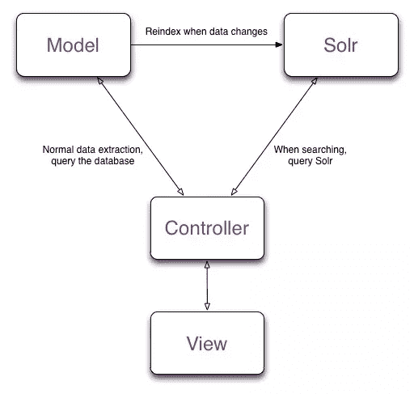
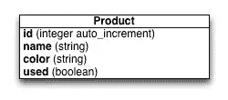

# Solr 和黑子的灵活搜索

> 原文：<https://www.sitepoint.com/flexible-searching-with-solr-and-sunspot/>

几乎每种类型的数据存储都有某种形式的索引。典型的关系数据库，如 MySQL 或 PostreSQL，可以索引字段以进行高效查询。大多数文档数据库，如 MongoDB，也包含索引。在关系数据库中建立索引几乎总是出于一个原因:速度。然而，有时你需要的不仅仅是速度，你还需要灵活性。这就是 Solr 的用武之地。

在本文中，我想概述一下 Solr 如何使您的项目的索引功能受益。我将从介绍索引开始，并进一步展示如何在 Rails 应用程序中使用 Solr。

## 什么是指数？

索引数据是一个非常古老的概念。它远远早于关系数据库和计算机。索引卡已被广泛应用于各种场合，尤其是在图书馆目录中。图书馆员使用多种技术为他们的书编制索引，其中一种技术是按字母顺序排列。一个简单的索引可以这样设计:列出所有以 A 开头的书，然后列出所有以 B 开头的书，依此类推。当搜索一本书时，比如说《双城记》，你看书名的第一个字母“A”，然后直接跳到你的图书馆索引中的“A”部分。

无论在哪里应用索引，它的目的总是与组织数据有关，以便可以快速提取数据。你可以想象按流派组织图书馆目录，在这种情况下，《双城记》可能会归入“小说”。然后图书管理员会直接跳到“小说”部分。

## 关系数据库索引

所有生产就绪的关系数据库系统都包含索引。通常，您希望通过外键进行索引，以便可以高效地查询外键。例如，在执行连接时，这可以显著提高性能。MySQL 和 PostgreSQL 都支持“全文索引”,它允许您对一大块文本进行查询，查找其中包含的片段。

如果你只是想在你的站点上有一个简单的搜索框，那么使用你已经存在的关系数据库的全文索引可能是个不错的选择。它有两个主要优点:你在同一个工具中工作，你的索引总是最新的。它有一个主要缺点:不够灵活，无法处理“框外”索引情况。

## Solr——当您的关系数据库不够用时

如果您坚持使用关系数据库来满足所有的搜索需求，您会发现自己经常创建笨拙而低效的查询。这是一个好迹象，表明您已经达到了数据库所能提供的极限。这就是 Solr 的用武之地。它旨在扩充您现有的关系数据库，并提供额外的数据查询方法。

Solr 是一项非常成熟的技术，最初创建于 2004 年，被像和[互联网档案馆](http://www.archive.org)这样的大狗使用。Solr 建立在 Lucene 之上，为你提供了一种不同的定义索引的方式。实际上，Solr 有助于将您的关系数据重新定义为更面向文档的结构，以便于查询。

以下是 Solr 如何融入您的 Rails 应用程序:

## 黑子——红宝石/索尔的爱子

[黑子](https://github.com/sunspot/sunspot)是 Ruby 和 Solr 的整合之王。它提供了一种清晰的 DSL(领域特定语言)来定义如何用 Solr 索引关系数据。让我们想出一个例子。

假设我们有一个产品模型，它具有以下属性:

我们有一个普通的 ActiveRecord 模型来用 Ruby 定义我们的数据库: