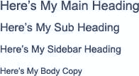
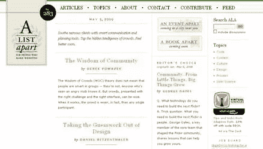
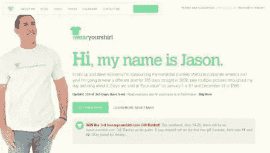
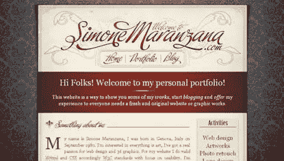
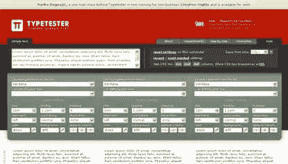

# 关注排版:尺寸

> 原文：<https://www.sitepoint.com/focus-on-typography-size/>

字体的大小和对比度可能是让页面清晰的两个最重要的因素。字体设计的基本原则——对比、层次、大小和空间——没有一个是孤立存在的，但是如果对比不好或者字体太小，你就会失去读者。

在过去的几年里，有一个阶段，正文变得难以置信的小，难以阅读。令人欣慰的是，这种趋势似乎已经结束了，人们对选择合适的字体、颜色和大小更感兴趣，并且通常会对排版进行选择，而不仅仅是选择默认字体。

上图显示了一个小写字母 x，大小从 6 磅到 72 磅不等。这种标度从 16 世纪就有了，如果你使用任何类型的允许你选择字体大小的软件，你就会对它很熟悉。

当你选择字体大小时，你可以使用这个比例作为指导。例如，您可能决定将所有正文文本设为 12 像素，主标题设为 18 像素，副标题设为 16 像素，侧栏标题设为 14 像素。我知道这不是火箭科学，但是这个简单的尺度可以帮助你确定网页不同部分的字体大小。这将提高布局的易读性和吸引力，你可能会发现你开始对字体作为一种设计元素感到有点兴奋！

所以一旦你设计好了，并且可以看到不同大小的字体，你就可以在你的 CSS 样式表中设置它。我不打算在这里讨论 CSS，但是 Ian Lloyd 有一本关于[开始使用 HTML 和 CSS 的优秀而详细的入门书。](https://www.sitepoint.com/html-css/)

作为一个经验法则，不要将你的主体副本设置为小于 10。想想你的观众。如果你在为年纪较大的用户创建一个网站，你可能需要将大小设置为 14，这对你来说可能显得很大，但是如果你的视力正在下降，大是好事。

当然，你可以更大胆地设置一个非常大的标题，这是最近的趋势。重要的一点是，你要选择你使用的尺码。我挑选了五个网站来展示不同大小的字体如何在你的网站上创造出完全不同的氛围。

[一份名单分开](http://www.alistapart.com/)。这个站点不可避免地会出现在与类型相关的文章中。这个网站以其漂亮的排版而闻名。

Kraaft.com 在他们的网站上特意选择了小字体。

[定义清晰](http://www.definedclarity.com/)

[西蒙娜·马兰扎](http://www.simonemaranzana.com/)

最后，一个在线工具是 [Typetester](http://www.typetester.org/) ，它对预览字体的大小(和其他属性)很有用。

你如何看待网站使用超大字体的趋势？是你自己用过的东西吗？

## 分享这篇文章