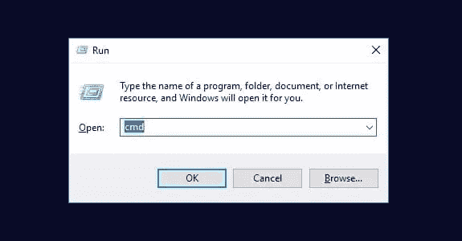
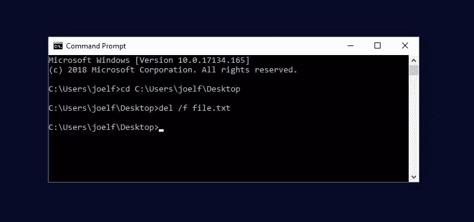

# 如何强制 Windows 删除文件

> 原文：<https://www.sitepoint.com/force-windows-delete-file/>

有时，不管出于什么原因，Windows 会认为某个程序正在使用某个文件或文件夹，并阻止它被删除、移动或重命名。这种锁定文件的行为令人非常沮丧，尤其是当你知道文件实际上并没有被使用的时候。这里有两种方法来解决这个问题。

## 1.使用 Shift + Delete 强制删除

也许在 Windows 中强制删除文件最简单的方法是使用键盘快捷键。选择您想要删除的文件或文件夹，然后按下 **Shift + Delete** 。请注意，这将永久删除文件；不会放入回收站。

如果这不起作用，您可以尝试使用命令提示符，它提供了高级删除命令。

## 2.使用命令提示符强制删除

首先，打开命令提示符。要做到这一点，首先打开开始菜单(Windows 键)，键入`run`，并点击**回车**。在出现的对话框中，输入`cmd`并点击**再次输入**。

在命令提示符打开的情况下，输入`del /f filename`，其中`filename`是要删除的一个或多个文件的名称(可以使用逗号指定多个文件)。微软的文档描述了使用该命令的[高级删除方法](https://docs.microsoft.com/en-us/windows-server/administration/windows-commands/del)的更多细节。

请注意，要删除该文件，您需要包含您替换`filename`的文件的完整路径，或者使用`cd folderpath`导航到它所在的文件夹，然后运行`del`命令。后一种方法的示例见下图。

现在你有了两个简单的方法来解决一个棘手的问题！

## 分享这篇文章