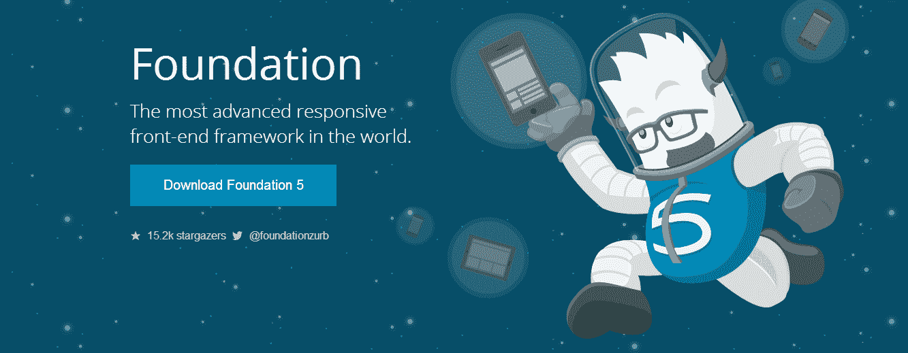

# foundation 5 Interchange–创建动态页面内容

> 原文：<https://www.sitepoint.com/foundation-5-interchange-creating-dynamic-page-content/>

基础框架对业界来说并不陌生，但它是一个尚未被完全探索的框架。它的最新版本 [Foundation 5](https://www.sitepoint.com/foundation-compelling-alternative-bootstrap/) ，迫使开发者毫不犹豫地使用它。随着 Foundation 4 以来的重大改进，它带来了迄今为止任何框架都没有实现的许多创新和有用的工具。我们将在本文中探索的一个这样的工具是**交换**。

> Foundation 5 框架被列入 2014 年的[最佳网页设计框架名单。](https://www.sitepoint.com/best-web-designing-frameworks-2014/)



Interchange，顾名思义，是一种帮助开发人员在不同类型的设备和屏幕尺寸上交换内容的功能。

假设您使用 Google Maps 脚本来显示您的离线商店的当前位置。它在你的网站的桌面和平板版本中看起来和工作起来都很好。但当涉及到移动设备上的小屏幕时，网站的速度最重要，你必须考虑实时地图脚本是否真的是最好的解决方案。

使用交换，您可以通过在旅途中将地图脚本与位置的静态图像进行交换来解决这个问题。听起来很酷，不是吗？

我写这篇教程的主要目的不是解决你的地图问题，而是各种其他类似的情况，重量级的 web 内容可以在移动设备和不同的屏幕尺寸上进行优化和替换。

Interchange 是一个 JS 特性，预装在 Foundation 5 包中。如果您已经设置了 Foundation 5 环境，可以跳过下面的“设置”主题。另一方面，如果你完全不熟悉 Foundation，请仔细阅读以下部分。

## 设置 Foundation 5 项目

就像任何其他 CSS 框架一样，Foundation 5 也附带了一组 CSS、JS 和字体文件。运行 Foundation 5 所需的所有必要文件都来自他们的网站[foundation.zurb.com](http://foundation.zurb.com/)。继续下载文件。解压文件夹，并复制你的网络应用程序中的 CSS，JS 和 IMG 文件夹。

创建一个名为 index.html 的索引文件，然后将下面的代码粘贴到其中。

```
 <!DOCTYPE html>
    <!--[if IE 9]><html class="lt-ie10" lang="en" > <![endif]-->
    <html class="no-js" lang="en" >

    <head>
      <meta charset="utf-8">
      <meta name="viewport" content="width=device-width, initial-scale=1.0">
      <title>Foundation 5</title>

      <!-- If you are using CSS version, only link these 2 files, you may add app.css to use for your overrides if you like. -->
      <link rel="stylesheet" href="css/normalize.css">
      <link rel="stylesheet" href="css/foundation.css">

      <!-- If you are using the gem version, you need this only -->
      <link rel="stylesheet" href="css/app.css">

      <script src="js/vendor/modernizr.js"></script>

    </head>
    <body>

      <!-- body content here -->

      <script src="js/vendor/jquery.js"></script>
      <script src="js/foundation.min.js"></script>
      <script>
        $(document).foundation();
      </script>
    </body>
    </html>
```

以上 html 是基础推荐的基本标记。它有所有正确的元标签和必要文件的正确链接。根据您自己的项目，确保到静态资源(JS、CSS 等)的所有路径都已正确配置并正常工作。

*Foundation 5 使用 Normalize 和 Mordernizr，所以要确保它们如上所示正确链接。这里的`app.css`只是一个自定义 CSS 文件的名字。你可以把它替换为主 CSS 文件的名字。*

就是这样。你已经准备好开始你的第一个基金会项目了。

## 了解基础 5 交换

基金会的文件指出:

> Interchange 现在可以拉入 HTML 片段，因此您可以为特定的媒体查询加载页面的不同部分。

简而言之，当浏览器的尺寸改变时，它会自动触发并加载适合该屏幕尺寸的不同内容。

Interchange 使用`data-interchange`属性来标识要加载的内容。这是一个由 Foundation 5 创建的自定义属性，由位于`js/foundation`文件夹中的`foundation.intercept.js`截取。

在本教程中，我们将查看以下演示:

*   在较小的屏幕上用静态地图图像交换地图脚本。
*   交换图像。
*   浏览器禁用 JavaScript 会怎样？互换还能用吗？让我们看看。

从第一个例子开始:

### 互换地图类型

**情景:**在桌面浏览器中显示动态的谷歌地图，在平板电脑中显示较大的静态地图图像，在移动设备中显示较小的静态图像。

**Markup:**

```
 <div data-interchange="[maps/small.html, (small)], [maps/medium.html, (medium)], [maps/large.html, (large)]">
              <div data-alert class="alert-box secondary radius">
                This is the default content.
                <a href="#" class="close">&times;</a>
              </div>
        </div>
```

仔细看看`data-interchange`属性的值。它以各种规则为价值。每个规则都用方括号括起来(JavaScript 数组的语法)，并用逗号分隔。

对于每个规则，我们有两个参数:第一个参数获取内容的路径，第二个参数指定媒体查询，用括号括起来。

有七种类型的预定义媒体查询:默认、小型、中型、大型、横向、纵向和视网膜。

最后一个返回 true 的规则将用于加载指定部分的内容。

在每个交换部分中，我们还有一个子部分，如果规则中指定的内容不可用，就会显示这个子部分。在我们的例子中，默认内容是一个警告框，上面写着“这是默认内容”右上角有一个关闭按钮。

查看[演示页面](http://extremecss.com/demos/foundation_interchange/)并尝试调整浏览器大小，您将看到地图部分如何改变其内容。

现在让我们看看如何利用 Interchange 来加载不同分辨率的图像。

### 交换图像

Foundation 5 的交换也可以用于替换不同类型浏览器的图像。例如，我们有一个高清版本，一个中等大小的版本和一个相同图像的较小版本。让我们看看如何使用数据交换来实现这一点。

```

```

使用图像交换时，建议不要使用 src 属性。这样做有两个原因。首先，src 标签中指定的图像无论如何都会被 Foundation 的交换脚本覆盖，其次，为了防止两个浏览器同时请求同一个``标签。

如果您想进一步优化 retina 显示屏的图像，您可以使用媒体查询指定一个新规则为“retina”。

```
data-interchange="[img/retina.jpg, (retina)]"
```

您应该始终指定一个默认的媒体查询，以保证您的 html 标记在每个设备中至少有一些内容。

```
data-interchange="[img/def.jpg, (default)]"
```

### 覆盖默认媒体查询

如果您对框架提供的媒体查询标准不满意，您可以随时指定自己的媒体查询。这很容易通过编写一个基础脚本来完成。

```
 $(document).foundation('interchange', {
      named_queries : {
        ipad_4 : 'only screen and (max-width: 700px)'
      }
    });
```

下次可以用“ipad_4”代替七个媒体查询中的一个。

### 基础 5 在非基础工程中的互换

如果希望在非基础项目中使用 Interchange，需要包含三个 JavaScript 文件:jQuery、FoundationJS 和 FoundationInterchangeJS。

```
 <script src="js/vendor/jquery.js"></script>
    <script src="js/foundation/foundation.js"></script>
    <script src="js/foundation/foundation.interchange.js"></script>
```

### JavaScript 禁用情况

您可以在每个使用交换功能的部分下面放置一个`<noscript>`标签。

```
 
    <noscript></noscript>
```

只有在浏览器中禁用了 JavaScript 时,`<noscript>`标签才会起作用。这个特性进一步保证了一个部分有一些内容。

## 结论

这都是关于如何为不同类型的浏览器优化 HTML 页面。我认为基金会的交换脚本是目前每个项目的必要工具。因此，仅仅做一个手机友好的设计是不够的——优化设计才是当务之急！

要了解有关 Foundation framework 的更多信息，可以参考以下 SitePoint 文章:

*   [与专家谈基础](https://www.sitepoint.com/talk-foundation-expertsthe-transcript/)
*   [基础:Bootstrap 的引人注目的替代方案](https://www.sitepoint.com/foundation-compelling-alternative-bootstrap/)

你也可以[下载](http://www.extremecss.com/demos/Foundation.zip)我在本教程中使用的源代码，并尝试使用它。

[演示页面](http://extremecss.com/demos/foundation_interchange/)

## 分享这篇文章