# 宝藏！免费移动设计资源

> 原文：<https://www.sitepoint.com/free-mobile-design-resources/>

作为一名设计师，通常需要了解你可以用来提高你的手艺的资源，以及你可以在工作中使用的资源。

在 SitePoint 网站上，已经有一些文章为你指出了网上最好的网页设计资源。本文将关注移动设计资源。它将专注于免费资源，我将它们分为三大类——教育、灵感和在你的工作中使用的资产。如果你是一名手机设计师(或者其他设计师，因为这些资源也与其他领域相关)，我希望这些链接对你有所帮助。

## 教育

### 面向移动开发者的 UX 设计

[面向移动开发者的 UX 设计](https://www.udacity.com/course/ud849)是 Udacity 上的一门课程，教授用于创造卓越用户体验的技术和最佳实践。它的目标是希望获得一些设计知识的开发人员，帮助他们构建设计良好和构建良好的应用程序，但编程经验并不要求受益于课程中的设计原则。

该课程是免费观看的，但如果你想得到教练的一对一帮助以及对你的设计进行审查，你就必须付费。

这是学习 UX 手机设计的良好开端。尽管该课程是针对 Android 教授的，但这些原则适用于任何移动平台。

### 面向开发者的用户体验设计

这是 Android 开发者 YouTube 频道上的一个[节目，在这里，谷歌开发者 Nazmul Idris 教授移动 UX 设计，他也教授前面提到的 Udacity 课程。](https://www.youtube.com/playlist?list=PLWz5rJ2EKKc-riD21lnOjVYBqSkNII3_k)

针对初学者，它向你展示了设计原则和最佳做法，进入手工艺伟大的 UX 设计。

### 安卓设计在行动

[Android Design in Action](https://www.youtube.com/playlist?list=PLWz5rJ2EKKc8j2B95zGMb8muZvrIy-wcF) 是 Android Developers YouTube 频道上的一个节目，谷歌设计师 Nick Butcher、Adam Koch 和 Roman Nurik 在这里讨论 Android 设计的各种元素。

在每一集里，他们查看各种应用程序，并拆除他们的用户界面和 UX 设计，解释什么有效，什么无效。讨论完应用程序的设计后，他们展示了同一个应用程序的新设计，并解释了设计过程中的决策。如果你是一名手机设计师，尤其是 Android 设计师，那么你将会为你的项目收集到优秀的设计实践、设计模式和灵感。

### 黑客设计

Hack Design 是一个网站，为任何希望填补设计知识空白的人提供设计教育。它由博客、书籍、视频、游戏和教程组成，由业内几位顶级设计师策划，分为 50 节课。你每周会收到一节课的电子邮件，但你也可以通过访问网站来阅读它们。

它不是专门针对手机设计师的，但它确实包含了一些手机设计方面的课程；此外，无论你选择哪一个设计分支，你都必须学习基础——设计的元素和原则，黑客设计是一个很好的起点。

## 灵感

以下资源为您提供了一个寻找设计灵感的地方。在创作过程中，看看其他人的作品，看看什么有用，什么没用，探索设计模式，看看它们被使用的不同方式，这样你就可以知道在你的设计中应该尝试什么。通过观察别人做了什么，你可以学到很多东西，下面的网站做得很好，在一个中心位置收集了各种各样的应用程序设计，以便于浏览。

### CAPPTIVATE.co

[cap tivate](http://capptivate.co)是一个移动模式库，不仅仅是显示 iOS 应用的截图。它显示了五秒钟的应用程序及其过渡和动画视频。视频由鼠标点击激活，应用程序按照设计模式(如导航、加载、拖动刷新)或运动类型(如渐变、视差、波纹)进行分类。

如果你正在寻找将动画和过渡添加到你的应用程序的用户界面的方法，这将是一个获得一些想法的好地方。

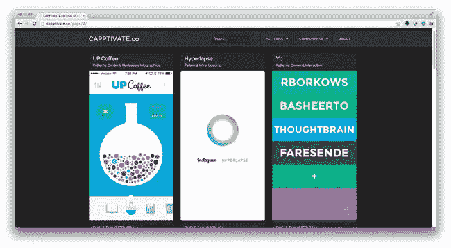

### Android 细节

[Android nices](http://androidniceties.tumblr.com)收集了一些最漂亮的 Android 应用程序的截图。您可以查看每个应用程序的不同屏幕，并深入了解 Android UI 惯例。

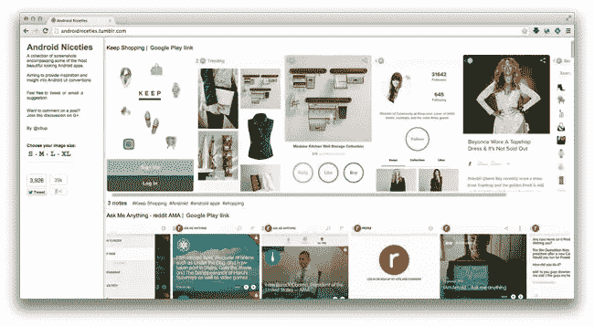

### 移动模式

[Mobile Patterns](http://www.mobile-patterns.com) 保存了一系列 iOS 和 Android 应用的截图。您可以选择从两个平台查看 ui，或者过滤掉一个。您还可以查看特定类别的屏幕，如注册流程、闪屏、时间线、图库等

因为它托管 Android 和 iOS 的 UI 设计，所以这是学习这两个平台的设计模式和约定的好地方。

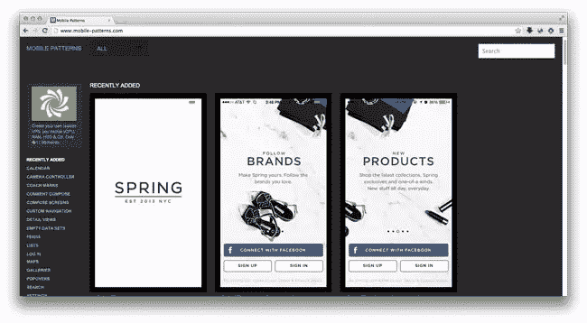

### Pttrns

显示 iPhone 和 iPad 的移动模式集合。你可以根据不同的类别过滤模式，如启动屏幕、个人资料、评论、列表、空状态等

这是另一个寻找灵感的好地方。

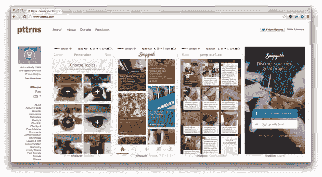

## 资产

### 工具

### Android 资产工作室

[Android Asset Studio](http://romannurik.github.io/AndroidAssetStudio/index.html) 是一个工具集合，您可以轻松快速地使用它来为您的 Android 项目生成资源。

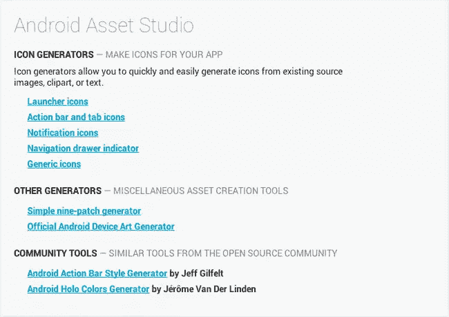

它承载了许多图标生成器，您可以使用这些生成器从现有的源图像、剪贴画或文本中生成图标。您可以生成启动器、操作栏、标签、通知、导航抽屉和通用图标。

这是通过选择图像，剪贴画或文本，你想要的图标，配置一些艺术作品的设置，然后下载生成的文件。生成的文件将采用 Android 图像资产的不同密度，即 xxxhdpi、xxhdpi、xhdpi、hdpi 和 mdpi。

除了图标生成器，还有其他工具的链接，如 Android 动作栏样式生成器，Android 赫萝颜色生成器和设备艺术生成器。

Android 操作栏样式生成器允许你为你的 Android 应用程序创建自定义的操作栏样式。它会生成所有必需的九个补丁资源以及相关的 XML drawables 和样式，您可以将它们复制到项目中。

Android 赫萝颜色生成器可以让你轻松地创建 Android 组件，如按钮，微调，复选框等你自己的颜色。它将生成所有必需的九个补丁资产以及相关的 XML drawables 和样式，您可以将它们复制到您的项目中。

您可以使用设备插图生成器将应用程序屏幕截图包装在真实的设备插图中。然后你可以在你的网站或其他宣传材料中使用它。

### 草图插件

Sketch 作为一种设计工具，尤其是对 UI 设计师来说，已经在设计社区获得了牵引力。 [Awesome Sketch Plugins](http://awesome-sket.ch/) 是一个网站，列出了一些有用的 Sketch 插件，如果你使用 Sketch，可以用它们来改善你的工作流程。

## UI 套件

### 铁汉+洛杉矶

Teehan+lax 是一家设计公司，有一套免费工具[供你设计使用。例如，他们为](http://www.teehanlax.com/tools/)[的 iPhone](http://www.teehanlax.com/tools/iphone/) 和[的 iPad](http://www.teehanlax.com/tools/ipad/) 提供 iOS 7 UI 套件，有 PSD 和 Sketch 两种格式。自 iOS 5 以来，他们一直在更新他们的 UI 套件，所以可以肯定的是，他们很快就会推出 iOS 8 套件，所以请保持警惕。

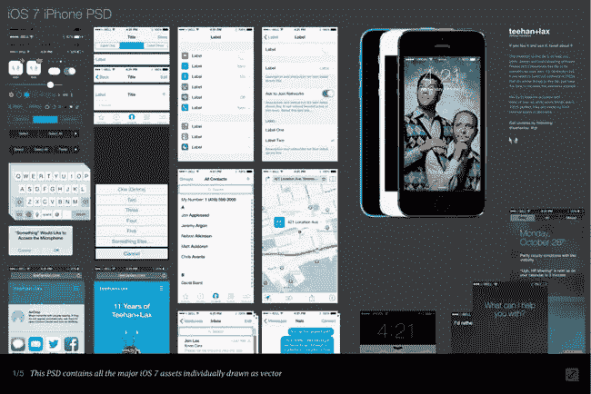

#### 系绳

Tethr 是一个免费的 iOS 设计套件，提供了广泛的组件，包括多媒体、社交、导航、电子商务等。

它包括 8 个 PSD 文件，138 个模板和 250 多个组件。所以在你的设计中会有很多不同的 UI 元素。

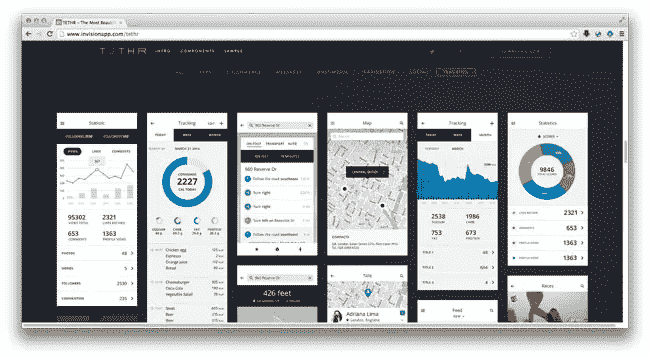

### 汞

你可以从 Mercury [这里](http://mercury.io/blog/ios-8-illustrator-vector-ui-kit-update)下载一个免费的 iOS 8 矢量工具包。该套件包含适用于 iPhone 和 iPad 的 UI 组件。

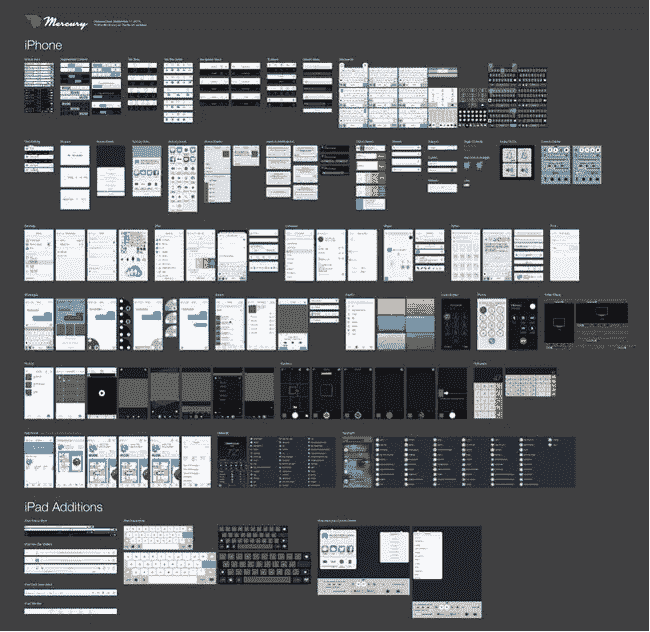

## 图标集

### 平面图标

[平面图标](http://www.flaticon.com/)被认为是最大的自由矢量图标集合。您可以下载 SVG、EPS、PSD 或 PNG 格式的图标，并且有一个适用于 Photoshop、Illustrator 和 After Effects 的插件，允许您在不离开工作环境的情况下快速找到设计所需的图标。

### Android 图标

我推荐的其他资源要么是免费的，要么是它们的免费软件包提供了相当多的入门组件，但对于这一点，我推荐一个付费资源，因为它非常实惠，并且物有所值。

Android Icons 为 Android 开发(甚至是网页设计和其他移动平台)提供了一个很棒的图标集，售价 25 美元。该套装带有 250 个 5 种尺寸和 14 种颜色的图标，包括矢量源和友好的许可证

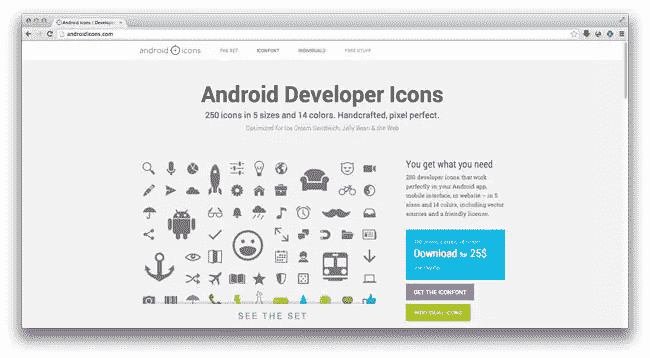

### 像素爱

Pixel Love 提供了一些很棒的免费图标集。您可以下载一套 60 个免费的 iOS 和 Android 图标，以及一套 40 个免费的 iOS 和 Android 社交媒体图标。

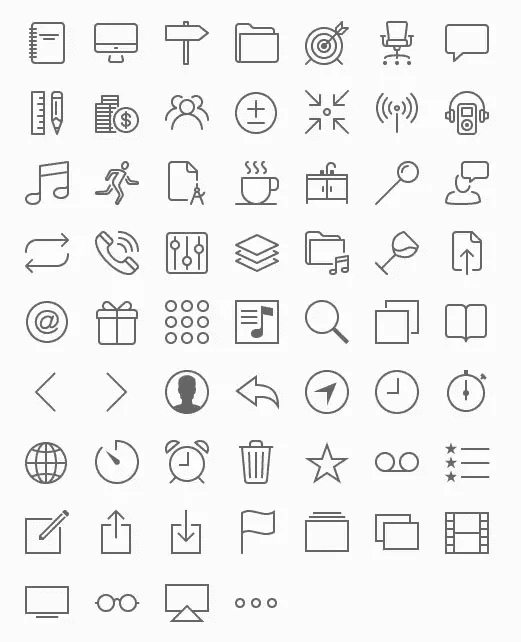

### 图标野兽

[Icon Beast](http://www.iconbeast.com/free/) 免费提供一套 500 个 iOS 标签栏图标，条件是你得注明出处。这些图标可用于 iPhone 和 iPad 设计。

### Appzger 清除图标

Appzger 有一套 500 个极简图标，价格模式为“随你付”。图标有不同的格式，如 PSD，PNG，SVG 和 CSH。您可以将图标用于移动项目和 web 项目。

### 线条图标集

[在这里你可以找到](http://designinstruct.com/roundups/line-icons-free/)不同来源的免费线路图标集。

## 字体

你在一个设计中选择的字体可以决定它的成败，所以这是一个你不能掉以轻心的决定。在很多情况下，最好的字体通常是优质字体，但你可以在网上找到非常好的免费字体。下面是一些你可以寻找免费字体的来源。

### 字体松鼠

你可以找到商业用途的免费字体，或者在[字体松鼠](http://www.fontsquirrel.com/home)找到。

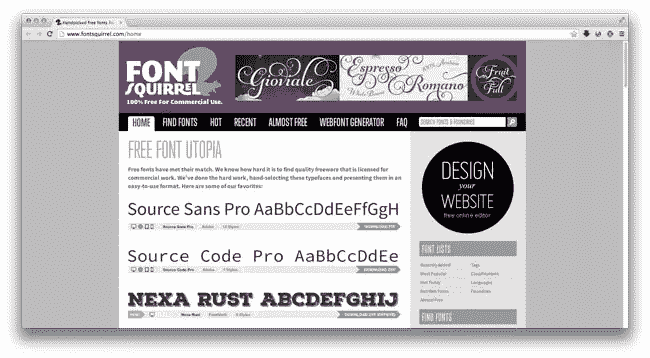

### 谷歌网络字体

这是相当普遍和众所周知的，但我认为它值得一提。Google Webfonts 提供有限的字体选择，你可以在你的项目中免费使用。这是一个发现字体的好地方。

## 动画

### 脸书流行音乐

Pop 是一个可扩展的 iOS 和 OS X 动画库，你可以使用它轻松地在你的应用中添加动画。这就是脸书用来在他们的[论文](http://www.facebook.com/paper)应用中创建动画和过渡的同一个库。

### 帆布

[Canvas](http://canvaspod.io/) 是一个 iOS 库，可以让你在不写代码的情况下将动画添加到你的应用中。如何使用它的教程可以在[这里](https://medium.com/learning-xcode-as-a-designer/animate-in-xcode-without-code-20c82a904164)找到。

## 声音

在某些用户界面中，给应用程序添加声音可能不是最好的做法，但在某些情况下，声音可能会增加整体用户体验。声音可以用于通知，用于积极的行动(例如，赞成某事，核对任务)或破坏性的行动(删除，从列表中删除)。

### 八度音阶

Octave 是一个免费的声音库，它包含了一系列美妙的点击声和哔哔声，你可以在你的项目中使用它们作为界面声音。

### 结论

以上并不是为移动设计人员提供的所有免费设计资源的详尽列表，但它提供了一个良好的开端，无论是开始移动设计，了解更多信息，还是寻找可以在您的项目中使用的好资源。

我希望你觉得这个列表有用，也许你可以分享一下你最好的资源是什么。

## 分享这篇文章