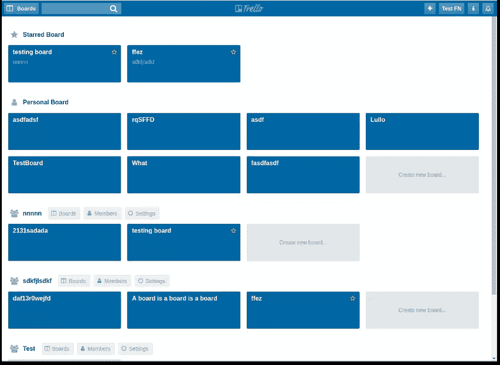

# 我如何设计和构建一个完整的 JavaScript Trello 克隆

> 原文：<https://www.sitepoint.com/fullstack-javascript-trello-clone/>

几周前，我碰到一个开发者在 GitHub 上分享他的一个副业项目:一个 Trello 克隆。这个项目是用 React、Redux、Express 和 MongoDB 构建的，看起来在 fullstack JS 技能方面有很大的空间。

我问开发人员穆斯塔法·迪乌夫，他是否有兴趣写一写他选择、设计和建造这个项目的过程，令人高兴的是，他同意了。我希望你会和我一样感兴趣，并希望它能激励你从事自己的雄心勃勃的项目！

***Nilson Jacques，编辑*T3**

* * *

在本文中，我将向您介绍我采用的方法，并结合一些我用来构建 web 应用程序的指导原则。这些技术的美妙之处在于它们可以应用于任何编程语言。我个人在工作中在 Java/JavaScript 堆栈上使用它们，这让我非常有效率。

在继续介绍这种方法之前，我将花一些时间来讨论如何:

*   在开始这个项目之前，我明确了我的目标。
*   我决定使用哪种技术。
*   我安装了应用程序。

请记住，由于整个项目都是在 GitHub ( [madClones](https://github.com/Madmous/madClones) )上进行的，所以我将专注于设计和架构，而不是实际的代码。您可以查看当前代码的一个[现场演示](http://d1ugf45u5klnwp.cloudfront.net/):您可以使用凭证 Test/Test 登录。



> 如果你有兴趣让你的 JavaScript 技能更上一层楼，注册 SitePoint Premium，看看我们的新书 [Modern JavaScript](https://www.sitepoint.com/premium/books/modern-javascript/?aref=njacques)

## 定义目标

一开始，我每天花几个小时思考我的目标，以及我想通过开发一个应用程序来实现什么。待办事项列表是不可能的，因为它不够复杂。我想把自己奉献给至少 4 个月的严肃工作(现在已经 8 个月了)。经过一周的思考，我想出了克隆我喜欢日常使用的应用程序的主意。这就是特雷罗克隆体成为一个副业的原因。

总之，我想:

*   构建全栈 JavaScript 应用程序。走出我的舒适区，使用不同的服务器技术。
*   提高我从头开始构建、设计、开发、部署和维护应用程序的能力。
*   实践 TDD(测试驱动开发)和 BDD(行为驱动开发)。TDD 是一种软件实践，它要求开发人员编写测试，看着他们失败，然后编写最少的代码使测试通过并重构(红色、绿色、重构)。另一方面，BDD 强调利用特性和场景进行开发。它的主要目标是更贴近业务，写一种他们容易理解的语言。
*   了解最新和最热门的框架。在我的工作中，我使用 angular 1.4 和 node 0.10.32(我知道这很可悲)，所以我需要接近热门的东西。
*   编写遵循 3R 原则的代码:可读性、可重构性和可重用性。
*   玩得开心。这是最重要的一条。因为我是(现在仍然是)这个项目的负责人，所以我想玩得开心，做很多实验。

## 选择堆栈

我想用 Express 构建一个 Node.js 服务器，并使用 Mongo 数据库。每个视图都需要用一个文档来表示，这样一个请求就可以获得所有必要的数据。主要的战斗是为了前端技术的选择，因为我在 Angular 和 React 之间犹豫了很久。

在选择框架时，我非常挑剔，因为只有可测试性、可调试性和可伸缩性对我来说才是真正重要的。不幸的是，只有通过实践和经验才能发现一个框架是否是可伸缩的。

我从两个概念验证(POC)开始:一个在 Angular 2 中，另一个在 React 中。不管你是把一个当做库，还是把另一个当做框架，这都无关紧要，最终目标都是一样的:构建一个应用。不是他们是什么的问题，而是他们做什么的问题。我非常喜欢 React，所以我决定继续使用它。

## 入门指南

我首先为名为 TrelloClone 的应用程序创建一个主文件夹。然后，我创建一个服务器文件夹，其中将包含我的 Express 应用程序。对于 React 应用程序，我用 [Create React App](https://www.sitepoint.com/create-react-app/) 引导它。

我在客户端和服务器端使用下面的结构，这样我就不会在应用程序之间迷路。拥有相同职责的文件夹有助于我更快地找到我要找的东西:

*   **src** :使应用程序工作的代码
*   **src/config** :与配置相关的一切(数据库、URL、应用程序)
*   src/utils :帮助我完成特定任务的实用模块。例如一个中间件
*   **测试**:测试时我只想要的配置
*   **src/static** :包含图像等
*   **index . js**:app 的入口点

## 设置客户端

我使用 create-react-app，因为它自动完成了大量开箱即用的配置。“一切都是预先配置和隐藏的，所以你可以专注于代码”，回购说。

我是这样构建这个应用的:

*   一个视图/组件由一个文件夹表示。
*   用于构建该视图的组件位于组件文件夹中。
*   路线定义了用户在视图上时的不同路线选项。
*   模块([鸭结构](https://github.com/erikras/ducks-modular-redux))是我的视图和/或组件的功能。

## 设置服务器

下面是我如何构建应用程序，每个域有一个文件夹，表示为:

*   基于 HTTP 请求的路由
*   测试请求参数的验证中间件
*   接收请求并最终返回结果的控制器

如果我有很多业务逻辑，我会添加一个服务文件。我不试图预测任何事情，我只是适应我的应用程序的发展。

## 选择依赖关系

当选择依赖项时，我只关心通过添加它们我会得到什么:如果它没有增加多少价值，那么我就跳过。从 POC 开始通常是安全的，因为它可以帮助您“快速失败”。

如果你从事敏捷开发，你可能知道过程，也可能不喜欢它。这里的要点是，你失败得越快，你迭代得越快，你就能越快地生产出以可预测的方式工作的东西。这是一个反馈和失败之间的循环，直到成功。

### 客户

以下是我总是在任何 React 应用上安装的依赖项列表:

| 包裹 | 描述 |
| --- | --- |
| 回家的 | 可预测状态容器。 |
| 反应还原 | 将 Rreact 和 Redux 绑定在一起。 |
| 还原-thunk | 允许您编写返回函数的操作的中间件。 |
| 冗余记录器 | Redux 的日志库。 |
| 反应路由器 | 路由库 |
| 洛达什 | 实用程序库 |
| 柴(发展) | 节点的 TDD 断言库。 |
| 否则(dev) | 独立的测试间谍，存根和模拟。 |
| 酶(开发) | React 的测试实用程序。 |
| 诺克(开发) | Node.js 的 HTTP 模仿和期望库 |
| redux-模拟商店(开发) | 用于测试 Redux 异步动作创建器和中间件的模拟商店。 |

有些人可能会告诉你，你并不总是需要 redux。我认为任何下降应用程序都意味着增长和规模。另外，使用 redux 获得的工具会改变您的开发体验。

### 计算机网络服务器

以下是我总是在任何 Express 应用程序上安装的依赖项列表:

| 包裹 | 描述 |
| --- | --- |
| 洛达什 |  |
| 约伊 | JavaScript 对象的对象模式描述语言和验证器。 |
| 快速增值 | 验证请求的主体、参数、查询、标题和 cookies 的中间件。 |
| 繁荣 | HTTP 友好的错误对象。 |
| cookie 分析器 | 解析 Cookie 头并填充 req.cookies |
| 温斯顿 | 异步日志库。 |
| 摩卡(发展) | Node.js 和浏览器的测试框架 |
| 柴(发展) |  |
| 柴-http(开发) | HTTP 响应断言。 |
| 否则(dev) |  |
| nodemon (dev) | 观察并自动重启应用程序。 |
| 伊斯坦布尔(巨型) | 代码覆盖率。 |

## 构建应用程序

我首先选择一个我想要开发的屏幕，并列出用户可以访问的所有功能。我选择一个并开始实现。

在开发了一个屏幕和/或功能之后，我会花一些时间思考添加的代码，如果需要的话会进行重构。

## 示例:主屏幕

让我们用一个例子来说明我上面所说的一切。我通过将前端和后端视为两个独立的实体来开发我所有的屏幕和功能。我总是从前端开始，因为它帮助我准确地知道需要显示什么。然后，很容易转向服务器，实现数据库模型并添加业务逻辑。

首先，我写下一个特性描述，并添加一些场景。下面是本文的一个示例:

```
Feature: In the home view, I should see my name in the header and a list of my boards.

Scenario: I can see my name in the header

Given I am on the home
Then I should see my user name in the header 
```

记住这个基本场景，让我们看看我如何在主视图上工作。

### 客户端

使用组件驱动开发(CDD)方法，结合 BDD，有助于将视图分割成小组件，确保它们是解耦的和可重用的。

首先，我用纯文本编写的模拟数据构建了一个静态页面，并用 CSS 对页面进行了样式化。

第二，我测试:

*   组件正确呈现
*   道具逻辑处理正确
*   事件侦听器(如果有)被触发并调用适当的方法
*   该组件从存储中接收状态

最后，我创建一个 Header 用户组件和容器，并重构我之前在 Redux 模块初始状态模拟的数据。

因为我使用的是 ducks 结构，所以我可以一次只关注一个视图。如果我注意到两个视图共享相同的数据，我可以提升我的状态并创建一个包含所有数据的更高的模块。应用程序的最终 Redux 状态由我嘲笑的所有数据组成。

一旦我的所有场景都通过了，如果我注意到我的组件与我已经创建的另一个组件非常相似，我就会查看并重构它。我可以在添加新组件之前先重构旧组件，也可以只添加新组件，这样我可以快速失败，然后再考虑更好的解决方案。

我没有浪费时间去猜测或思考用户需要看到什么。我可以构建我的视图，然后决定需要显示什么数据。在建造时对设计做出反应和思考比试图提前思考需要展示什么更容易。以我的经验，有时候会增加很多开销和不必要的会议。只要你牢记可重用性，你就不会有事。

### 服务器端

我提出的 Redux store 模型至关重要，因为我用它来设计我的数据库，然后编写我的业务逻辑。由于在视图上所做的工作，我知道主页需要获取用户的名字和公告板。我注意到我有个人板和组织板，这意味着我可以将这两个实体分开，并拥有两种不同的模式。主要目标是处理规范化的数据，让服务器完成所有繁重的工作，这样我就不用考虑这些了。

CRUD(创建、读取、更新、删除)是任何 app 都需要的基本操作集，但我不会盲目地把它们加到我所有的路线上。现在，我需要做的是获取数据，所以我只需要实现 read。然后，我可以编写一个 Mongo 查询，稍后将用户添加到我的数据库中。

## 结论

我希望您喜欢我构建全栈应用的方法。我的主要建议是永远不要害怕做大的重构。我数不清有多少次我改变了我的应用程序文件结构，只是因为我知道它不可扩展:文件夹名称、文件夹深度、它们按功能分组的方式等细节总是会产生影响。

我从不害怕犯错误，因为它们帮助我学习:我失败得越快，我学习得越快，我成长得越快。如果我犯了 100 个错误并从中吸取教训，那么我知道 100 种不同的方法来避免这些错误再次发生。

当我注意到我不喜欢的东西时，我会立即或在接下来的几天内修复它。由于我测试了我的代码，我可以很快判断出我是否破坏了正常工作的功能。

爱因斯坦说过“一旦你停止学习，你就开始死亡”，我相信一旦你停止犯错，你就停止了学习。失败，学习，继续生活。

### 我未来的计划是什么？

我继续做我的项目，因为它总是一项进行中的工作。就像一个真实的 app 一样，是在不断变化的。我的计划是:

*   将我的 monolith 项目转移到基于微服务的 mono repo 服务器上。我是在制作我的 HipChat 克隆版时做出这个决定的。我注意到我为相同的认证逻辑复制了大量代码:微服务是显而易见的选择。Ctrl-C，Ctrl-V 不是你编程的朋友。
*   在 Kubernetes 上部署微服务。
*   将 HipChat 克隆移动到 mono repo，用 Vue.js 构建一个 app。
*   开始研究电子和自然反应。
*   添加与 Travis 的持续集成(CI)和部署。
*   学习打字稿。

### 我如何设法跟上？

我有一个非常严格的惯例:

*   周一到周四:在 [HackerRank](https://www.hackerrank.com/) 和 [GeeksforGeeks](http://www.geeksforgeeks.org/) 上练习算法，为我的周末工作写文档，学习新语言，阅读技术书籍，听播客。
*   周五至周日:开发新功能和/或修复我的应用程序中的错误

我不会把我所有的空闲时间都花在这些上面。在工作日，每天 1-2 个小时就足够了。周末，虽然我不限制自己。只要我有时间，我就会致力于这个项目:我可以写代码，尝试一个工具，或者只是阅读文档。

编码是一门艺术和手艺，我以编写尽可能少的代码为荣，同时保持代码的性能和优雅。

***阅读下一篇*** : [剖析现代 JavaScript 应用](https://www.sitepoint.com/anatomy-of-a-modern-javascript-application/)

## 分享这篇文章