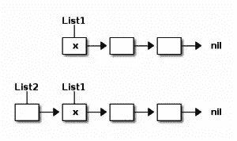

# Ruby 中的函数式编程:值对象

> 原文：<https://www.sitepoint.com/functional-programming-ruby-value-objects/>


函数式编程已经存在一段时间了。麦卡锡在 20 世纪 50 年代预见了 LISP，但你甚至可以说 Lambda 演算是第一种函数式编程语言，它是一种比 LISP 早几十年的推理计算的数学工具。

尽管它成熟了，老了，但 FP 并不打算在短期内离开我们。Scala、F#和 Clojure 都是大约在最近十年出现的函数式语言。所有这些“新”语言仍在赢得追随者。功能范式似乎比以往任何时候都更加活跃。

这是有充分理由的。我们生活在一个多核和大数据的世界，一个大规模并发、分布式系统的时代。协调并发进程是困难的，但是函数式编程可以使它变得简单一些。

使用*不可变的*数据是函数式编程的一个要求。这带来了一些挑战，但也提供了新的机遇。内存和存储的价格处于历史最低点，一旦你开始看到不变性的好处，就地编辑数据似乎就像是很久以前的一种优化。

作为卢布主义者，我们对此有何看法？我们是跳槽开始学习 Haskell 还是 Clojure？我不认为这是必要的，但它仍然是一个伟大的想法。花一些时间在函数式语言上，直到事情开始“运转”,你一定会把一些有趣的想法带回 Rubyland。你不需要函数式语言来用函数式风格编程，也不需要成为纯粹主义者或学究来获得好处。

## 价值和功能

在面向对象的编程中，对象封装了状态。它将数据字段和方法分组，Ruby 称之为实例变量。只有对象的方法可以直接访问和改变它的字段。面向对象隐藏了对象中的状态，因此对象可以保证内部的一致性。它还将行为与状态联系起来，以隐藏实现细节。

在函数编程中*值*和*函数*是明确分开的。这些形成了两个不同的方面，每个方面都有自己的限制和属性，我们可以从这两个方面吸取教训。

值是不可变的数据位。一旦一个值存在，关于它的一切都是已知的和不变的。值可以是原子的，如数字 7，也可以是组合的，如游戏中每个项目的位置列表。一旦一个价值被创造出来，我们就永远不能改变它，但是我们可以从已经存在的价值中衍生出新的价值。假设你想移动一个游戏物品。不允许您获取原始列表中的项目并更新其位置，但是您可以从旧列表中派生出一个新列表，其中一个元素有一个新位置。

## 值或变量

你曾经试图向初学者解释“一个变量”吗？对于程序员来说，这是显而易见的，但用简单的术语解释它可能会很棘手。让我们试一试

> 变量是当你给某物命名时。

这是一个好的开始，在没有可变性的“纯函数式”语言中，比如 Haskell，我们可以就此结束。但是对于 Ruby 来说，这还不够好。让我们再试一次。

> 变量是一个盒子，盒子有名字。你用这个名字来指代盒子里的东西。这个盒子在不同的时间可以装不同的东西。

这更准确，但不太直观。我们需要记住有一个间接层次:盒子和它的内容。但是如果我们同意我们从不改变盒子里面的东西，那么这个盒子就消失了，我们可以把这个名字看作是指里面的东西。这极大地简化了你的程序如何工作的心理模型。

对象隐藏了它们的状态，所以它们可以保证没有人会把事情弄糟。值总是可以共享的，所以封装在函数式编程中不是一个很重要的问题。

## 价值对象

构建有价值的对象是你今天就可以开始做的事情。它可以简单到不创建 setters，并返回一个新的更新的实例，而不是就地更新现有的实例变量。

在接下来的例子中，我将展示一些有用的东西，而不是手工做这些事情。第一个是[阿尼玛](https://github.com/mbj/anima#readme)。把它当成 Ruby 的`Struct`类，但是对于值。它创建一个基于散列的构造函数、只读属性方法和相等测试(`==`、`eql?`、`equal?`)。

```
class Ukulele
  include Anima.new(:color, :tuning)
end

u1 = Ukulele.new(color: 'green', tuning: [:G, :C, :E, :A])
u2 = Ukulele.new(color: 'green', tuning: [:G, :C, :E, :A])

u1 == u2 # => true
```

然而，你的 value 对象还没有什么价值，因为它使用的数组仍然是可变的。

```
u.tuning << :F
u # => #<Ukulele color="green" tuning=[:G, :C, :E, :A, :F]>
```

为了确保您创建的对象是真正不可变的，包括任何组件，可以使用 Adamantium。

```
class Ukulele
  include Anima.new(:color, :tuning)
  include Adamantium
end

u.tuning[0] = :F

# ~> -:6:in `[]=': can't modify frozen Array (RuntimeError)
```

为了能够调优你的四弦琴，你可以写一个方法，让*从旧的四弦琴*派生出一个新的四弦琴。这可能看起来很奇怪，改变调音并不会在现实世界中给你第二个尤克里里。然而，当你认为价值是与特定时间点相关的事实时，它就开始有意义了。我们不能回到过去改变过去。从某种意义上说，我现在拿着的*的尤克里里是*一个和以前不一样的尤克里里。肯定是，它的调音不同，所以它们是可以区分的。

```
class Ukulele
  def tune(string, note)
    self.class.new(
      color: color,
      tuning: tuning.take(string) + [note] + tuning.drop(string+1)
    )
  end
end

u = Ukulele.new(tuning: [:G, :C, :E, :A])
u.tune(0, :F) # => #<Ukulele tuning=[:F, :C, :E, :A]>
u             # => #<Ukulele tuning=[:G, :C, :E, :A]>
```

不得不重复不改变的字段变得重复，所以 [Anima::Update](http://rdoc.info/gems/anima/Anima/Update) 可以帮助你。

```
class Ukulele
  include Anima::Update

  def tune(string, note)
    update(
      tuning: tuning.take(string) + [note] + tuning.drop(string+1)
    )
  end
end
```

不可变对象的一个有趣的副作用是方法调用的结果可以被安全地缓存。这是一种被称为*记忆化*的技术，内置于金刚合金中。

```
class Ukulele
  def snares
    tuning.count
  end
  memoize :snares
end
```

Adamantium 也会冻结被记忆的值，就像它处理实例变量一样。默认情况下，它*深度冻结*嵌套结构。你可以告诉它只冻结外部对象，或者记住一个方法而不冻结它的返回值。[自述](https://github.com/dkubb/adamantium#readme)信息不错。

## 功能数据结构

这种方法的缺点是，对于每次“更改”，都需要复制大量数据。在处理大型集合时，这成为一个真正的问题。想象一个有一百万个条目的不可变数组。要添加或删除单个元素，首先需要复制整个元素。这导致了[功能数据结构](http://books.google.com.tw/books/about/Purely_Functional_Data_Structures.html?id=SxPzSTcTalAC&redir_esc=y)的想法。它们的行为类似于值，但是通过一种叫做*结构共享*的技术，它们最小化了需要复制的数据量，节省了内存和 CPU 周期。

为了理解这个概念，请考虑一个链表。在列表的前面添加一个元素并不会使原来的无效，两个列表只是共享同一个“尾部”。把“头”从列表中去掉也是同样的道理。



同样的概念可以用于树结构，重用大的部分，只改变从改变的节点到根的路径。这就是复杂的随机存取数据类型(如集合和向量)的实现方式。一种具有特别吸引人的特性的树结构是“散列数组映射的 Trie”，也称为“理想散列树”。仓鼠 gem 实现了基于散列数组映射的向量和集合，以及其他一些功能性数据结构。

有了它，你应该有一个工具箱来开始用值编程。在本系列的下一篇文章中，我们将通过探索纯函数把 F 放在 FP 中。

## 分享这篇文章