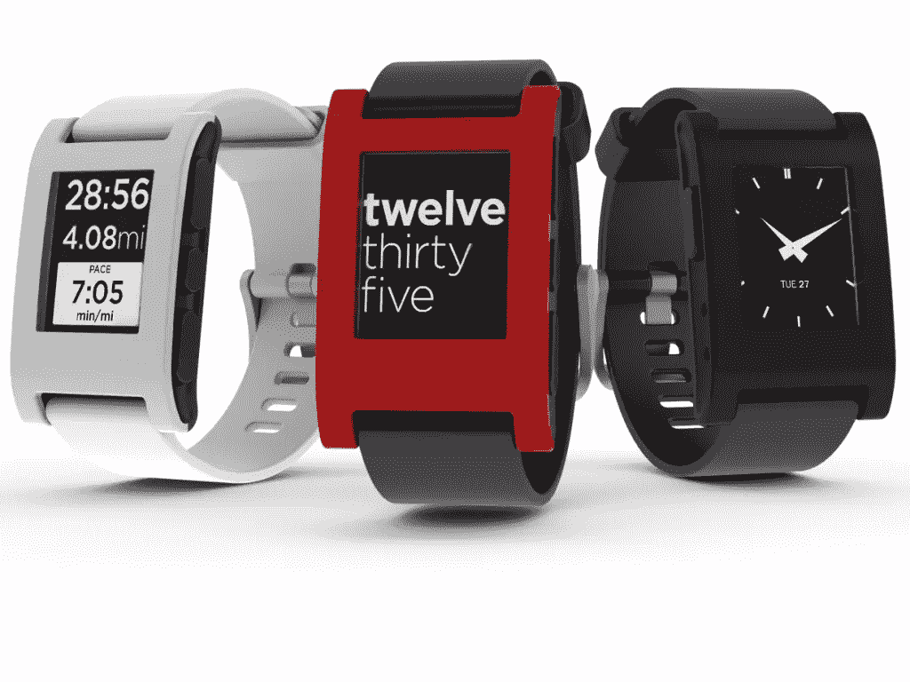

# 智能手表屏幕的未来应用

> 原文：<https://www.sitepoint.com/future-adaptations-for-smarter-watch-screens/>

如果智能手表要在市场上取得成功，取代而不是增强智能手机，开发更友好的用户界面是关键。在这篇文章中，我们将追踪智能手表迄今为止的发展，探索设计师当前面临的一些挑战，并看看未来智能手表屏幕的适应情况。

## 智能手表的简史

自 1982 年以来，随着精工的原始脉冲星 NL C01 的发布，智能手表一直是下一个大事件。当时还没有连接，这意味着 80 年代初的智能手表实际上并不那么智能。

斯沃琪的 Beep 和精工 1990 年的 Receptor 是第一批连接到更广阔世界的手表，但第一款兼作手机的手表来自三星，他们推出了 SPH WP10。2004 年，微软凭借 SPOT watch 一举成名，该公司利用调频广播更新美国主要城市的用户数据。费用是每年 59 美元。

这个时候，智能手表上的时间已经不多了，但在这个十年的开始，拼图的碎片走到了一起。科技巨头转向蓝牙技术，而不是调频。这一点得到了一系列进步的补充，包括触摸屏、更好的电池以及与智能手机等互联网连接设备的短程连接。

三星在过去几年一直处于领先地位，但尽管他们的许多产品在技术上很好，但迄今为止的销量一直很小。

2014 年，21 世纪的两大巨头，谷歌和苹果，分别发布了他们的[安卓穿戴](http://www.forbes.com/sites/paullamkin/2015/05/20/googles-big-android-wear-update-lands-with-whole-host-of-new-features/)和[苹果手表](http://www.wired.com/2015/04/the-apple-watch/)。当苹果进入市场时，它往往会改变游戏规则，但消费者一直难以准确说出苹果手表是什么。因此，到目前为止，只有苹果的狂热粉丝们接受了这种炒作。

## 智能手机屏幕响应式设计的挑战

定义市场一直是智能手表制造商取得主流成功的主要障碍之一。这些小屏幕带来的挑战限制了智能手表的商业成功，主要是在健身市场，数字信息可以清晰有效地显示。

智能手表没有提供足够的功能来取代智能手机，而不仅仅是智能手机的附加产品——大多数人不愿意两者都买。

真正的问题是，大多数网站设计者并没有设计出可以在如此小的屏幕上浏览的网站。直到最近几年，设计师们才成功有效地克服了向智能手机和平板电脑的过渡。我们有可能在 1.5 英寸的屏幕上显示我们想看的内容吗？

## 将网站缩小到这样小的尺寸有必要吗，或者可行吗？

将网页设计从桌面缩小到智能手机大小本身就是一场斗争，但可穿戴技术的需求使得即使是基本的交互也是一个挑战。智能手表的界面和行为极其严格，以至于在不禁用网站内容和功能的主要元素的情况下，响应式设计不太可能成为一种经得起未来考验的解决方案。

## 有哪些变通方法？

如果响应式设计不是解决方案，我们将如何使用这种下一代设备？尽管历史可以追溯到 80 年代初，但目前形式的可穿戴设备仍处于起步阶段。

如果客户希望能够在手腕上查找信息，那么响应式设计就不是答案。相反，设计师将不得不创建一个单独的网站或应用程序版本，以提供智能手表用户期望的用户体验。智能手表的销售是否值得在网站设计上如此大的投资还有待观察。

## 触摸屏适用于智能手表吗？

大多数现代设备都配有触摸屏，因此智能手表的触摸屏似乎是最合理的选择。一般来说，触摸屏更适合导航，因为当使用物理按钮时，可能会涉及大量的滚动。然而，如此小尺寸的触摸屏很难瞄准单个图标。

随着时间的推移，预计触摸屏技术将在智能手表领域占据主导地位，尽管目前，对于哪种系统最容易使用仍没有普遍共识。结果是存在无数不同的接口选项。

## 触摸屏的替代品有哪些？

有许多智能手表使用基于手势的界面来绕过这个问题，但是大多数用户发现它们没有触摸屏更直观。谷歌的 Android Wear 很好地利用了滑动动作来消除通知，但在选项和应用程序之间导航可能需要大量滑动。

苹果选择了触摸屏控制和位于手表右手边的数字表冠的组合，可以用来放大和滚动内容。他们界面的触摸屏元件使用强制触摸系统，该系统可以区分点击和长按来执行所需的动作。

## 最新的手势控制

在使用 Apple Watch 或触摸屏替代产品几个月后，这种系统的局限性很快就变得清晰起来。有时候，比如当你在吃饭，或者晚上手拉手散步时，触摸屏会阻止你回复通知或使用应用程序。最近的一项创新旨在解决这个 21 世纪的问题。

Aria 是一款附加腕带，与 Android Wear 和 Pebble Time 产品兼容。它允许用户通过简单的手指手势快速浏览他们的界面选项、通知和应用程序。从下面的视频中可以看到，手表侧面不需要触摸屏幕或使用物理控制。

`[https://www.youtube.com/embed/D4IrLj-ApDs](https://www.youtube.com/embed/D4IrLj-ApDs)`

Aria 腕带将在未来几周内在 Kickstarter 上首次亮相，因此我们将能够看到市场对基于手势的智能手表控制有多大的兴趣。尽管 Aria 不太可能很快控制 Apple Watch，但这可能是我们第一次看到智能手表屏幕的未来。

## 结论

如果我们将智能手表的生命周期与智能手机的生命周期进行比较，或许我们可以对可穿戴屏幕的未来有所了解。设计师们最初试图创建独立的移动网站，然后将精力重新放在响应式设计上。如果智能手表要提供的不仅仅是简单的通知和应用程序，它需要自己的网络解决方案，这种解决方案将来自更灵活的网站和屏幕设计方法。

随着公司和研究人员投入大量资金开发新方法，让设备理解我们希望它们做什么，基于手势的控制越来越被视为最自然的交互方法。触摸屏、滑动动作和侧装智能手表控制都有局限性，限制了智能手表的吸引力，但手势控制可能是制造商的王牌，可以创造智能手表所需的大众市场吸引力。

## 分享这篇文章