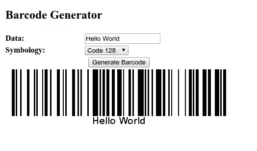
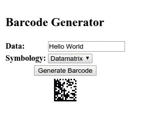

# 用 JRuby 和 Barcodes4J 生成条形码

> 原文：<https://www.sitepoint.com/generate-barcodes-with-jruby-and-barcodes4j/>


Ruby 有一个非常活跃的生态系统，为几乎所有常见问题提供解决方案。但是一个特别滞后的领域是条形码生成。Ruby 只有生成二维码的解决方案，这无疑是受欢迎的，但在行业领域没有得到广泛接受。较旧的条形码符号，如 Code 128、DataMatrix 和 PDF417，在商业应用中比 QR 码更受欢迎。如果需要在 Ruby/Rails 应用程序中生成代码 128，我们应该怎么做？

幸运的是，我们有一个解决方案:JRuby。JRuby 允许我们利用优秀的 Java 库，并在 Ruby 应用程序中使用它们。Barcode4J 就是这样一个库，它在 Java 世界中很流行，用于生成条形码。今天，我们将学习如何在 Ruby 中集成和使用 Barcode4J。那么，我们开始吧。

## 基本 rails 应用程序

我们将创建一个基本的 Rails 应用程序。该应用程序将使用 JRuby、Rails 4.2 和 SQLite 作为数据库，以保持简单。首先用 [RVM](https://rvm.io) 或者 [rbenv](http://rbenv.org) 安装 JRuby。

切换到 JRuby 和`gem install`最新的 Rails gem。现在创建一个新的 Rails 应用程序，如下所示:

```
rails new barcode4j_rails -T 
```

生成应用程序后，切换到应用程序目录并检查它是如何工作的:

```
rails s 
```

将您最喜欢的浏览器指向 http://localhost:3000 ，我们应该会看到默认的 Rails 页面。

## 集成条形码 4J

我们现在将把 Barcode4J 集成到我们的 Rails 应用程序中。首先从 [Barcode4J 项目页面](https://sourceforge.net/projects/barcode4j/files/barcode4j/Barcode4J%202.1/)页面下载 Barcode4J 文件。我们将使用 2.1.0 版本。下载**条码 4j-2.1.0-bin.zip** 并解压文件。将 **barcode4j.jar** 从 **build** 文件夹复制到我们的应用程序目录下的 **lib/barcode4j** 中。另外，将 **lib** 文件夹中的所有文件复制到 **lib/barcode4j** 中。

最后，我们的目录结构应该如下所示:

```
barcode4j_rails
  - app
  ...
  - lib
    - barcode4j
      - barcode4j.jar
      ... 
```

现在我们已经有了所有需要的文件，用下面的代码在 **lib** 目录中创建一个名为 **barcode_generator.rb** 的类:

```
# Load all Java libraries related to Barcode4J
Dir.entries("#{Rails.root}/lib/barcode4j").each do |lib|
  require "barcode4j/#{lib}" if lib =~ /\.jar$/
end

require 'java'

# Load all class references
java_import Java::java.io.ByteArrayOutputStream
java_import Java::java.awt.image.BufferedImage
java_import Java::org.krysalis.barcode4j.impl.code128.Code128Bean
java_import Java::org.krysalis.barcode4j.impl.datamatrix.DataMatrixBean
java_import Java::org.krysalis.barcode4j.impl.code39.Code39Bean
java_import Java::org.krysalis.barcode4j.impl.pdf417.PDF417Bean
java_import Java::org.krysalis.barcode4j.output.bitmap.BitmapCanvasProvider
java_import Java::org.krysalis.barcode4j.tools.UnitConv

class BarcodeGenerator
  def self.generate(symbology, data)
    # Create a ByteArrayOutputStream object for storing the image
    bos = ByteArrayOutputStream.new

    # Set DPI
    dpi = 160

    bean = nil

    # Set the Canvas object for barcode rendering
    canvas = BitmapCanvasProvider.new(bos, "image/x-png", dpi, BufferedImage::TYPE_BYTE_BINARY, false, 0)

    # Set barcode symbology
    case symbology
    when "code128"
      bean = Code128Bean.new
    when "datamatrix"
      bean = DataMatrixBean.new
    when "code39"
      bean = Code39Bean.new
    when "pdf417"
      bean = PDF417Bean.new
    end

    # Configure the barcode generator
    bean.set_module_width(UnitConv.in2mm(2.8 / dpi))
    bean.do_quiet_zone(true)

    # Generate barcode 
    bean.generateBarcode(canvas, data)
    canvas.finish()

    # Convert image to byte array for streaming
    bytes = bos.toByteArray
    bos.close

    return String.from_java_bytes(bytes)
  end
end 
```

我们已经创建了一个简单的实用程序类，可以生成四种类型的条形码，以 PNG 格式发送和返回图像文件。我们需要传递的只是条形码的符号和数据。让我们来分析一下这个类的内部工作原理。

首先，我们加载所有的**。jar** 文件放入类路径:

```
Dir.entries("#{Rails.root}/lib/barcode4j").each do |lib|
  require "barcode4j/#{lib}" if lib =~ /\.jar$/
end 
```

然后，导入所有必需的引用:

```
java_import Java::java.io.ByteArrayOutputStream
java_import Java::java.awt.image.BufferedImage
java_import Java::org.krysalis.barcode4j.impl.code128.Code128Bean
java_import Java::org.krysalis.barcode4j.impl.datamatrix.DataMatrixBean
java_import Java::org.krysalis.barcode4j.impl.code39.Code39Bean
java_import Java::org.krysalis.barcode4j.impl.pdf417.PDF417Bean
java_import Java::org.krysalis.barcode4j.output.bitmap.BitmapCanvasProvider
java_import Java::org.krysalis.barcode4j.tools.UnitConv 
```

接下来，为条形码图像设置 DPI，并创建一个`ByteArrayOutputStream`对象来保存渲染的图像。然后，创建一个`BitmapCanvas`，在其上实际绘制条形码。像这样:

```
# Create a ByteArrayOutputStream object for storing the image
bos = ByteArrayOutputStream.new

# Set DPI
dpi = 160

bean = nil

# Set the Canvas object for barcode rendering
canvas = BitmapCanvasProvider.new(bos, "image/x-png", dpi, BufferedImage::TYPE_BYTE_BINARY, false, 0) 
```

按照提供的信息初始化条形码符号系统:

```
# Set barcode symbology
case symbology
when "code128"
  bean = Code128Bean.new
when "datamatrix"
  bean = DataMatrixBean.new
when "code39"
  bean = Code39Bean.new
when "pdf417"
  bean = PDF417Bean.new
end 
```

配置条形码生成器的设置，如`quiet zone`和`module width`:

```
# Configure the barcode generator
bean.set_module_width(UnitConv.in2mm(2.8 / dpi))
bean.do_quiet_zone(true) 
```

接下来，调用实际的条形码生成方法:

```
# Generate barcode 
bean.generateBarcode(canvas, data)
canvas.finish() 
```

最后，将条形码图像转换成字节流并返回图像:

```
# Convert image to byte array for streaming
bytes = bos.toByteArray
bos.close

return String.from_java_bytes(bytes) 
```

现在我们已经有了条形码生成器。让我们在**config/initializer/barcode . Rb**中创建一个初始化器，以便在 Rails 中加载该类:

```
require 'barcode_generator' 
```

## 测试条形码生成器

现在，我们将使用以下代码在**应用程序/控制器**中创建一个`BarcodesController`类:

```
class BarcodesController < ApplicationController
  def index
  end

  def generate
    send_data BarcodeGenerator.generate(params[:symbology], params[:data]), :type => :png, :disposition => 'inline'
  end
end 
```

我们在这里定义了两个动作。首先，一个`index`动作来呈现条形码生成器的实际页面，我们将很快创建它。第二，调用和呈现条形码图像的`generate`动作。`generate`动作使用来自 URL 的`symbology`和`data`参数调用`BarcodeGenerate.generate`方法。然后，`generate`使用`send_data`方法将图像传输到浏览器。

现在更新 **config/routes.rb** 以向这些操作添加路由:

```
Rails.application.routes.draw do
  root 'barcodes#index'
  get '/barcodes/:symbology' => 'barcodes#generate'
end 
```

最后要做的事情是为条形码生成器创建实际的 UI。使用以下代码在**app/views/barcodes/index . html . erb**中创建一个视图:

```
<table border="0">
  <tr>
    <td colspan="2"><h2>Barcode Generator</h2></td>
  </tr>
  <tr>
    <td><strong>Data:</strong></td>
    <td><input name="data" id="data" value="Hello World" /></td>
  </tr>
  <tr>
    <td><strong>Symbology:</strong></td>
    <td>
      <select name="symbology" id="symbology">
        <option value="code128">Code 128</option>
        <option value="datamatrix">Datamatrix</option>
        <option value="code39">Code 39</option>
        <option value="pdf417">PDF 417</option>
      </select> 
    </td>
  </tr>
  <tr>
    <td colspan="2" align="center"><button name="submit" id="submit">Generate Barcode</button></td>
  </tr>
  <tr>
    <td colspan="2" align="center"></td>
  </tr>
</table>

<script type="text/javascript">
  $(document).ready(function() {
    $('button#submit').on('click', function() {
      $('img#barcode_image').attr('src', '/barcodes/' + $('select#symbology').val() + '?data=' + $('input#data').val());
    })
  });
</script> 
```

我们只需创建一个表单，其中一个字段用于输入数据，另一个字段用于选择条形码符号。当我们单击“生成条形码”按钮时，我们只需用相关的 URL 更新`img`标签的`src`属性来生成我们的条形码图像。

现在，让我们兜一圈。用`rails s`启动(或重启)服务器，访问 [http://localhost:3000](http://localhost:3000) 。我们应该看到表单的数据字段中已经有了`Hello World`。点击“生成条形码”按钮，您将收到一个新生成的 Code 128 条形码！



将符号系统更改为“数据矩阵”,然后再次单击“生成条形码”。现在我们应该会看到一个 Datamatrix 条形码。它看起来是这样的:



## 包扎

今天，我们学习了如何使用 Barcode4J 集成和生成各种类型的条形码。我们可以通过包含更多符号特定参数或更多符号来改进生成器类。但是我把这个留给你们做练习。我真诚地希望你喜欢这个教程。

一如既往地欢迎评论和建议。

## 分享这篇文章