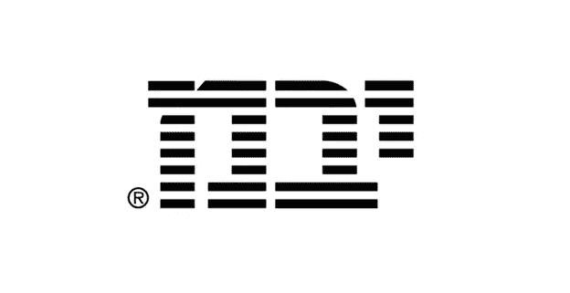
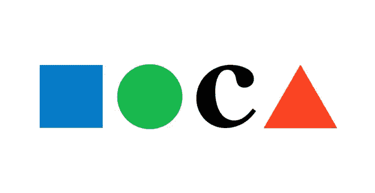

# 格式塔原则和设计心理学

> 原文：<https://www.sitepoint.com/gestalt-principles-psychology-design/>

“格式塔”这个词在设计中经常被使用。取自德语单词“形式”或“形状”，它通常指的是大于其部分总和的事物的整体外观。在心理学中，格式塔指的是让我们视觉感知秩序的基本原理。

这些原则是创造视觉意义的基础，也是标志设计中常见的。为了更好地解释如何在你的工作中运用格式塔原则，我们组织了一个面向设计师的速成班。尽情享受吧！

### 图形-背景

*Logo:索尼随身听(via [维基百科](http://en.wikipedia.org/wiki/Walkman) )*

当我们看索尼 Walkman 标志时(见上图)，我们不仅仅看到一个包含橙色和白色像素的单一平面——尽管它实际上就是这样。相反，我们大多数人也感知到一种虚幻的深度:我们看到一个数字(一个“W”和一个点)和一个似乎在它后面的背景。

这要归功于**图形-背景**格式塔原理，该原理认为，当一个较小的形状被一个较大的均匀区域包围时，我们会认为较小的物体在前面，并且有边界。通过努力，你可以逆转这种效果。试着想象一下，橙色区域是一张带有“W”的纸，上面切出点状的洞。可以做，但是感觉不自然。

注意当周围的场不再均匀时，图形-背景的区别是如何打破的。下面的版本看起来更像是一幅镶嵌画，布置在一个平面上，而不是背景前面的一个图形。

*当背景不均匀时，对虚幻深度的感知消失*

### 接近度

*Logo: IBM (via [维基百科](http://en.wikipedia.org/wiki/IBM) )*

当我们看 IBM 徽标时，我们大多数人看到的是由短横线堆叠而成的三个字母。我们看不到 8 条有间隔的长横线。这是为什么呢？部分原因是因为我们认识字母“I”、“B”和“M”，但不完全是。下面的版本是希伯来语，我们敢打赌，即使你不知道希伯来语字母表，你也能看到不同的字母:

*Logo:IBM 希伯来语版本(通过 [Logodesignlove](http://www.logodesignlove.com/hebrew-logos) )*

原因实际上与非常简单的格式塔接近原则有关。如果有一系列的物体(比如线)，我们倾向于把靠得很近的物体感知为一组。“I”的短段都比顶部水平条的短段和长段靠得更近，在“B”和“M”之间有更大的间隙，在“M”中有缝隙。因此，我们将“I”视为一个单元，而不是顶部水平条。

### 类似

正如我们倾向于将彼此接近的物体归为一类，我们也倾向于将相似的物体归为一类——无论是颜色、阴影、方向还是形状。

*Logo: [当代艺术博物馆](http://www.moca.org/)*

洛杉矶当代艺术博物馆(MOCA)的标志就是一个有趣的例子。“C”是一个恰当的字母，但是在“M”、“O”和“A”的地方有三种相应的形状:正方形、圆形和三角形。

当你看到这个标志时，你很可能会把这三种颜色的图形放在一起——尽管它们并不都是相邻的——而把黑色的“C”视为异常。将正方形和圆形视为一对，而将“C”和三角形视为另一对，虽然这是一个更符合逻辑的顺序，但这是一种压力。这就是**相似格式塔原理**在起作用。

### 继续

*标志:[Dictionary.com](http://dictionary.reference.com/)*

**连续性原理**认为，如果直线或曲线段对齐，我们倾向于将它们视为连续整体的一部分。这就是为什么，当描述 Dictionary.com 标志时，几乎每个人都会说它是一个突出五个分支的偏圆。我们认为圆形是一个连续的部分，因为如果你把它分成几段，它们会排成一行。分支是分离的，因为它们不与它对齐；他们以直角击中它。

但是这个标记可以用其他方式来描述。遭受脑损伤并且不符合正常连续性原则的人可能会说类似“这是一个右线向下弯曲的勾号，连接到一个部分“C”形，有 4 条线伸出来——如下所示:

*如果没有持续原则，你更有可能在 Dictionary.com 商标中察觉到不同的分割*

### 关闭

人类的思维不喜欢松散的结尾。当我们看到一个看起来部分封闭的图形时，我们倾向于“完成”它，即使这意味着提供想象的视觉信息。这就是所谓的**闭合原理。**

许多标志因其利用闭合原理而闻名，闭合原理允许它们使用最少的视觉信息来呈现图形。世界野生动物基金会就是一个例子。在他们的标志中，我们感觉到熊猫头顶的曲线，尽管那里没有实际的线条:

*Logo: [世界野生动物基金会](http://www.worldwildlife.org/)*

也许最著名的例子是联邦快递标志中的“隐藏”箭头。它需要自己的零线，而不是狡猾地借用“E”和“x”的边界:

*Logo: [联邦快递](http://www.fedex.com/us/)*

#### 你注意到格式塔原则在其他标志设计中的作用了吗？分享在评论里！

*本文最初发表于 [99designs 设计师博客](http://99designs.com/designer-blog/)。经许可转载。*

## 分享这篇文章