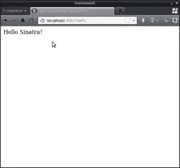

# Ruby 入门

> 原文：<https://www.sitepoint.com/getting-started-ruby/>

本系列旨在向人们介绍精彩的 Ruby 编程语言。它将涵盖编程的基础，以及把一个应用程序放到网上。

## 什么是 Ruby？

Ruby 是一种简单而强大的面向对象编程语言。它是由 Yukihiro 'Matz' Matsumoto 在 90 年代中期开发的，目的是使编程更加有趣和高效。Ruby 在日本一直有忠实的追随者，在西方也有一小部分忠实的追随者。在 2005 年 David Heinemeier Hansson 发布了 [Ruby on Rails](http://rubyonrails.org) web 框架之后，Ruby 的人气几乎在一夜之间飙升。

Ruby 的一个关键原则是语言的每个部分都是一个对象。编程中的对象是有自己的属性和动作的东西。这在目前可能没什么意义，但是当我们深入学习这门语言的时候，我们会不断地回头来看这个问题。

## 我们会做什么？

在这个系列中，我们将从安装 Ruby 开始，并学习编写程序的基础知识。我们将看看如何使用“交互式 Ruby”来获得对编程的即时反馈，以及如何将程序保存到文件中，然后运行它。我们还将探讨如何将 Ruby 程序转换成 web 应用程序，并在浏览器中运行。希望这个系列能帮助你发现为什么这么多人喜欢 Ruby 提供的强大功能和灵活性。

## 命令提示

我觉得我应该在这里提到，Ruby 的世界经常在一个“终端”中使用命令提示符来安装东西和运行程序。起初这可能有点令人畏惧，但这真的没什么可担心的，很快就会像第二天性一样。

如果您使用的是 Linux，那么我想您已经找到了命令提示符。在 Mac 上，你需要进入**应用程序**文件夹，然后进入**实用程序**文件夹(参见[本指南](http://guides.macrumors.com/Terminal)获得更多帮助)。在 Windows 上，你通常会在“应用程序”菜单中找到它([本指南](http://rubyonwindowsguides.github.io/book/ch01-01.html)提供了一些非常有用的提示，让它变得更加用户友好)。

在代码示例中，应该在命令提示符中输入的任何内容都将以$符号为前缀(不要键入$)，例如:

```
$ this command should be entered in a command prompt
```

## 安装 Ruby

现在安装 Ruby 比以前容易多了，但是过程会根据你使用的操作系统而有所不同。我推荐使用最新版本的 Ruby，在我写这篇文章的时候是 2.0.0。

如果你使用 Linux，我会推荐使用 [Ruby 版本管理器](http://rvm.io/)。这只需要将以下代码行粘贴到命令提示符中:

```
$ \curl -L https://get.rvm.io | bash -s stable --ruby
```

如果你使用 Windows，我会推荐你使用 Ruby 安装程序。这提供了一个单击式解决方案，可以安装您开始工作所需的一切。

如果您使用 Mac，那么您可以使用 Ruby 版本管理器(参见上面的 Linux 说明)，或者使用 [Homebrew](http://brew.sh/) ，使用以下命令:

```
$ brew install ruby
```

要检查一切是否运行正常，请打开一个终端窗口，并在命令提示符下键入以下行:

```
$ ruby -v
```

这会检查您运行的是哪个版本的 Ruby。您应该会得到类似下面的内容:

```
ruby 2.0.0p247 (2013-06-27 revision 41674) [i686-linux]
```

## 交互式 Ruby 入门

交互式 Ruby，或者它的朋友称之为 IRB，是一种将 Ruby 一次输入一行命令行并获得即时反馈的方式。这是试验 Ruby 并检查其工作情况的好方法。要启动并运行它，您只需在命令行提示符下键入以下命令:

```
$ irb
```

然后，您应该会看到类似下面的内容:

```
2.0.0p247 :001 >
```

现在，是时候开始写一些 Ruby 了！

学习编程时，从经典的[“Hello World！”开始是一个长期的传统程序](http://en.wikipedia.org/wiki/Hello_world_program)。我们将秉承这一精神，向测试 Ruby 的不同环境问好。在 IRB 提示符下，只需键入以下命令:

```
2.0.0p247 :001 > puts "Hello IRB!"
```

您应该会看到以下输出:

```
Hello IRB!
 => nil
```

祝贺你——你已经编写了你的第一段 Ruby 代码！

那里发生了什么？嗯，`puts`是一个 ruby 命令，代表‘put string’。Ruby 中的字符串是一个在引号之间存储文本的对象(或者是“或者”)。`puts`命令将显示它后面的字符串。

`=> nil`部分只是`puts`命令的返回值。Ruby 中的所有操作都有返回值，即使它们没有显式地返回任何东西。在那些情况下，他们仍然必须返回`nil`，这是另一个对象。

尝试使用`puts`命令向屏幕输出更多的字符串。当你感到无聊时，只需简单地键入`exit`就可以退出 IRB，就像这样:

```
2.0.0p247 :001 > exit
```

## 编写我们的第一个 Ruby 文件

既然我们已经用 IRB 编写了第一段 Ruby 代码，那么是时候将我们的工作保存到一个文件中了。创建一个文件夹来保存你的作品，并给它起一个合适的名字，比如“ruby”之类的。Ruby 文件以扩展名**保存。rb** 。首先，创建一个空文本文件，并将其保存为“hello_ruby.rb”。现在，在文件中编写以下代码并保存它:

```
puts "Hello Ruby!"
```

这与我们输入 IRB 的内容非常相似——因为它们是一样的，这就是为什么 IRB 对于快速测试非常有用。唯一的区别是当你按下回车键时，IRB 会对 ruby 进行求值。要运行这个程序，您需要使用`ruby`命令来执行它。

打开命令行提示符并导航到保存文件的位置。这可以使用`cd`命令来完成。在我的系统上，我将它保存在我的主文件夹中的一个名为“ruby”的文件夹中，因此我将键入以下内容:

```
$ cd ruby
```

这导致$符号 beign 以此路径为前缀:

```
daz@crunchbang:~/ruby$
```

一旦你进入正确的目录，我们就可以运行我们的程序，只需输入`ruby`后跟文件名，就像这样:

```
$ ruby hello_ruby.rb
```

这将产生以下输出:

```
Hello Ruby!
```

运行该文件和在 IRB 中运行 Ruby 的主要区别在于，Ruby 文件允许你输入多个命令，这些命令将在程序运行时全部执行。这可以通过在“hello_ruby.rb”中添加几行代码来演示，如下所示:

```
puts "Hello Ruby!"
puts "Hello DAZ!"
puts "Hello SitePoint!"
```

如果您保存它并在命令提示符下键入`ruby hello_ruby.rb`,输出应该是:

```
Hello Ruby!
Hello DAZ!
Hello SitePoint!
```

干得好——现在你已经编写并运行了你的第一个 Ruby 程序！我们的下一项工作是在 web 浏览器中运行我们的程序，但在此之前，我们必须学习如何安装 Ruby gem。

## 红宝石

Ruby Gems 是通过添加额外的功能来帮助扩展 Ruby 语言的代码库。它们通常用 Ruby 编写(尽管有时也使用其他语言，比如 C)。有成千上万的 Ruby gems 可以帮助你为程序添加各种功能。

## 辛纳特拉登上舞台

Sinatra 是一个 Ruby gem，它让你的 Ruby 程序可以轻松访问支持 web 的 HTTP 层。这意味着你可以用相对较少的额外代码将你的 Ruby 程序转换成 web 应用程序。如果你还不知道，我碰巧[很喜欢辛纳屈](http://rubysource.com/7-things-i-love-about-sinatra/)。

首先，我们需要安装辛纳特拉宝石:

```
$ gem install sinatra
```

(注意:`gem`命令是和 Ruby 一起安装的)

我们需要在我们的“ruby”文件夹中创建一个名为 **hello_sinatra.rb** 的新文件。在该文件中，放置以下代码:

```
require 'sinatra'

get '/hello' do
  "Hello Siantra!"
end
```

第一个`require 'sinatra'`用于从 Sinatra gem 加载代码，将其功能添加到我们的程序中。

下一部分是 Sinatra 中的路由处理器，它是 Ruby 中的“块”的一个例子。`get`表示浏览器用来“获取”网页的 HTTP 动词。在这之后是字符串'/hello '。这是用来访问浏览器地址栏中的代码的路径。接下来是我们想要运行的实际代码。这次我们不需要使用`puts`命令，因为 Sinatra 会自动输出一个字符串，如果它是 route 处理程序中的最后一行代码。

该文件实际上只是另一个 ruby 程序，所以我们以与之前完全相同的方式运行它:

```
$ ruby hello_sinatra.rb
```

然后，您应该会看到以下消息:

```
[2013-08-07 17:35:33] INFO  WEBrick 1.3.1
[2013-08-07 17:35:33] INFO  ruby 2.0.0 (2013-06-27) [i686-linux]
== Sinatra/1.4.2 has taken the stage on 4567 for development with backup from WEBrick
[2013-08-07 17:35:33] INFO  WEBrick::HTTPServer#start: pid=2988 port=4567
```

这告诉我们，Sinatra 已经启动了一个 web 服务器，这意味着您可以在浏览器中访问应用程序。要查看我们程序的结果，在任何浏览器中导航到[http://localhost:4567/hello](http://localhost:4567/hello)，您应该会看到以下内容:

[](https://www.sitepoint.com/wp-content/uploads/2013/08/Screen1.png)

解释一下我们在浏览器中输入的 URL——localhost 是在您自己的计算机上运行的 web 服务器所使用的域(该应用程序在互联网上不可用，只能在您的计算机上使用), 4567 是 Sinatra 用来呈现该应用程序的端口。

## 资源

如果你想进一步学习，那么你很幸运。有很多学习 Ruby 的资源。下面是我发现特别有用的一小部分(在许多情况下是免费的或者有免费选项):

*   尝试 Ruby——一个互动教程，在大约 15 分钟内给你一个 Ruby 的旋风之旅
*   [鹤嘴锄书](http://pragprog.com/book/ruby4/programming-ruby-1-9-2-0)——权威的红宝石书，第一版可在[网上免费获得](http://www.ruby-doc.org/docs/ProgrammingRuby/)，或者你可以获得最新版本的印刷版或电子书格式。
*   [学习编程](http://pragprog.com/book/ltp2/learn-to-program)——一本介绍使用 Ruby 编程的基础知识的好书。网上有一个[免费版](http://pine.fm/LearnToProgram/)和一个印刷版
*   Ruby Tapas–Avdi Grimm 制作了这些短视频
*   你真正写的一本书，向你展示了如何使用 Ruby 和 Sinatra 构建一个完整的 web 应用程序
*   Sinatra 的维护者写的另一本书，更深入地讲述了 Sinatra 实际上是如何运作的
*   这个网站本身就充满了关于 Ruby、Sinatra 和 Ruby on Rails 的文章，你可以随意浏览

## 那都是乡亲们！

本系列的第一部分到此结束。我们介绍了 Ruby 编程语言，安装了它，并用 Ruby 编写了我们的第一个程序。我们还使用 Sinatra gem 将我们的程序变成了一个 web 应用程序。这一切都是从一点点基础开始的，但这仅仅是开始——继续关注我们，事情会变得越来越有趣。

在下一部分中，我们将更深入地了解在 Ruby 中使用字符串可以做的所有美妙的事情。

我希望这篇文章对你有用，请在下面的评论区留下你的反馈或问题。

## 分享这篇文章