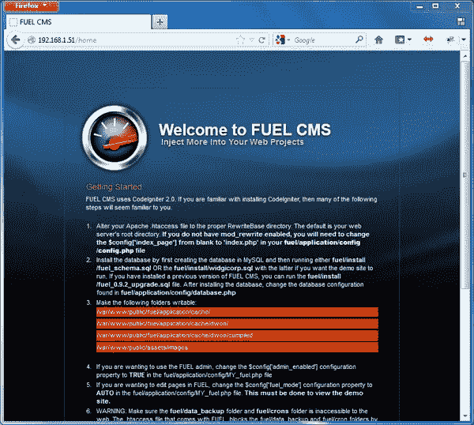
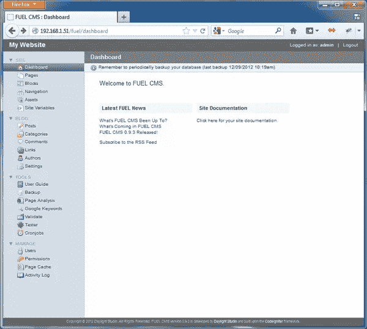
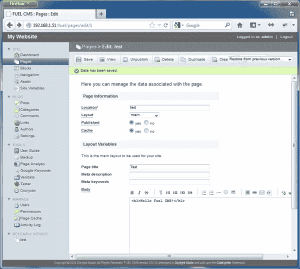
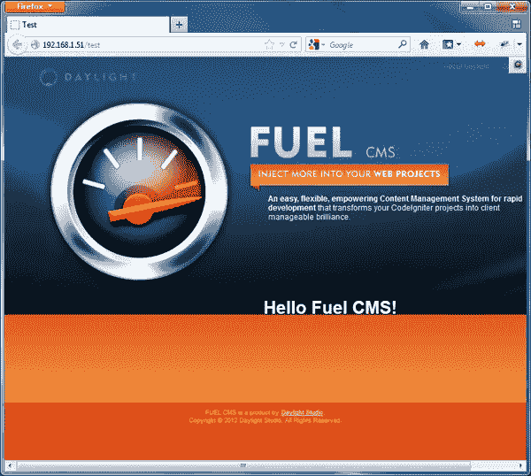
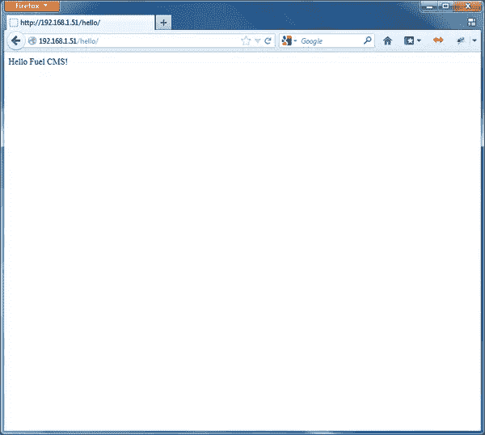

# Fuel CMS 入门，第 1 部分

> 原文：<https://www.sitepoint.com/getting-started-with-fuel-cms-1/>

当你听到 CMS 这个缩写的时候，你可能会想到 Drupal，Joomla，甚至 WordPress。然而，如果您想要更轻量级或更灵活的东西，也有替代那些重量级产品的方法。如果你正在寻找一个简单的管理界面，或者将定制的应用程序代码集成到站点中，那么我建议探索 Fuel CMS。在这个由两部分组成的系列中，我将讨论 Fuel CMS 的一些概念。在这一部分，我将讨论它的安装以及如何设置视图。在第二部分，我将讨论如何编写一个 Fuel CMS 模块。

## 燃料 CMS 快速概述

Fuel CMS 是一个构建在 CodeIgniter 框架之上的内容管理系统。关于该项目的详细描述可在其网站上找到:

> FUEL CMS 是一个基于模块的框架和内容管理系统的混合体。它是在流行的 CodeIgniter PHP web 框架上开发的，允许你像平常一样创建你的模型、视图和控制器，并且只在你需要的时候使用 CMS 部分。

管理仪表板确实简单易懂，如果您在开发后将项目交给一个不太懂技术的客户，这是一个好主意。然而，在其他 CMS 中，你可以不用写任何代码就能建立一个完整的网站，而 Fuel CMS 却不是这样。您必须按照 CodeIgniter 的方式自己做事情。如果你不喜欢写代码，那么这可能不是适合你的 CMS。

文档建议您在开始之前应该对 CodeIgniter 有一些基本的了解，但是这是我第一次使用 CodeIgniter，我能够相对容易地构建一个工作站点，所以根据您的目标，使用任何 MVC 框架的经验可能都足够了。

Fuel CMS 的开发始于 2010 年 11 月左右，目前的稳定版本是 0.92。1.0 版本目前是测试版。

## 安装和配置燃料 CMS

Fuel CMS 的安装过程不同于其他内容管理系统；没有花哨的安装程序，只有一个介绍页面，解释您需要在配置中指定的各种设置。您必须自己执行数据库安装脚本。但我们毕竟是开发者，所以这不是不可克服的。

你可以使用 Git 克隆代码的最新版本[,也可以下载一份 ZIP 存档。无论如何，将代码放在您的`htdocs`目录的根目录下。当你访问 *http://localhost* (或者你的开发地址)时，你应该会看到一个页面，上面列出了在开始开发你的网站之前你需要执行的步骤。](http://github.com/daylightstudio/FUEL-CMS "daylightstduio/FUEL-CMS - GitHub")



按照说明配置 Apache，创建数据库，并更改目录权限。

Fuel CMS 提供了一些`.htaccess`文件来帮助你设置重写规则，让一切顺利运行。这是我遇到一些问题的地方，因为我正在使用 Nginx。

配置文件可以在`fuel/application/config`下找到。燃料 CMS 可以完全定制，但我现在将坚持最重要的设置。

在`MY_FUEL.php`文件中设置以下内容:

*   你的网站名称
*   `fuel_mode`:是在数据库中查找页面数据，还是查看文件，或者两者兼而有之。(对于本文，将其设置为“auto ”,表示两者都有。)

在`database.php`文件中，在相应的字段中输入数据库信息。

如果你的服务器不支持 mod_rewrite，在`config.php`文件中将 index_page 选项改为“index.php”。

现在，您已经准备好登录到位于 *http://localhost/fuel* 的管理面板。

## 创建您的第一页

使用默认用户名和密码(都是“admin ”)登录仪表板。登录后，系统会提示您更改密码。你应该现在就这么做，否则你做的每一个动作都会弹出一个烦人的提醒。

所以你在这里:在中间你看到一些信息，最新的新闻和一个链接到文档。菜单位于左侧。在 Fuel CMS 中，一切都被分成模块:站点模块、博客模块、几个工具模块和用户模块。



您可能想做的第一件事是创建一个页面。这是一个与大多数其他内容管理系统相似的简单过程。在左侧菜单中，单击页面，然后单击创建按钮。

输入一个位置(这是 URL 片段，所以没有空格！)，页面标题和您的内容，然后单击保存。



可以通过进入*http://localhost/index . PHP/test*访问页面。您将看到您输入的文本，但与安装页面的设计相同。



## 创建自定义视图

您刚刚创建的页面使用了安装页面的布局，因此请返回编辑您的页面(转到菜单中的页面，然后单击页面标题)。请注意当前设置为“主”的布局设置。将其更改为“无”，保存，然后再次检查页面。现在，您将看到一个包含文本的空白页。

布局位于视图文件夹:`fuel/application/views/_layouts`。当我们查看默认布局(`main.php`)时，我们看到以下内容:

```
<?php $this->load->view('_blocks/header')?>

<div id="main_inner">
<?php echo fuel_var('body', ''); ?>
</div>

<?php $this->load->view('_blocks/footer')?>
```

第一行和最后一行包括块:设计元素，可以在网站的各个部分重复使用。在这种情况下，页眉和页脚是块，因为它们在整个网站的许多页面上可能是相同的。您还可以为导航、JavaScript includes 或任何您需要的东西创建块。

`echo fuel_var('body')`行从数据库中检索您为页面指定的内容并显示出来。

上面的例子使用布局将基本的可编辑页面放在一起。但是正如我前面提到的，您也可以创建定制的视图文件。例如，如果你有一个功能不同于网站上其他页面的页面，那么你就需要编写一个自定义视图。这部分过程实际上与 CodeIgniter 的关系比与 Fuel CMS 本身的关系更大。

这里我们将遵循 opt-in 控制器方法:URL 调用呈现我们的视图的控制器的动作。将以下内容另存为`fuel/application/controllers/hello.php`:

```
<?php
class Hello extends CI_Controller {

public function __construct()
{
parent::__construct();
}

public function index()
{
// load the fuel_page library class and pass
// it the view file you want to load
$this->load->module_library(
FUEL_FOLDER,
'fuel_page',
array('location' => 'hello')
);
$this->fuel_page->render();
}
}
```

我们已经用方法`index()`定义了一个控制器类`Hello`，当你请求页面时会调用这个方法。我们将名为“hello”的`fuel_page`加载到`views`目录中，它指向`hello.php`。

现在让我们添加一些页面使用的变量。变量最常用于创建仪表板中的输入字段并将其映射到模板中的变量。全局变量在`fuel/application/views/_variables/global.php`中，我们可以通过创建文件`hello.php`来覆盖它们。

`_variables/hello.php`文件的内容是:

```
<?php
$vars['layout'] = 'none';
```

这将覆盖 layout 变量以使用“none”布局，就像我们之前对测试页面所做的那样。

然后在`views`文件夹中，如`hello.php`所示，我们有:

```
<?php
echo 'Hello Fuel CMS!';
```

进入 *http://localhost/hello* ，你应该会看到“Hello Fuel CMS！”消息。



在编写视图时，有一些自定义标记可以帮助保持代码的整洁。Fuel CMS 提供使用 [Dwoo 模板系统](http://wiki.dwoo.org/index.php/Main_Page "Main Page - Dwoo Docs")将这些标签转换成合适的 PHP 代码。例如，您可以使用:

```
{foreach $data soldier}
{$soldier->rank} - {$soldier->name}
{/foreach}
```

而不是用 output 语句写一个原生的`foreach`循环。

## 结论

我们已经讨论了安装 Fuel CMS 以及创建页面和视图。有了这些基础知识，如果我们想制作一个有多个页面和自定义布局的网站，应该不难做到。

在下一篇文章中，我将解释如何建立你自己的模块。敬请期待！

图片 via[Fotolia](http://us.fotolia.com/?utm_source=sitepoint&utm_medium=website_link&utm=campaign=sitepoint "Royalty Free Stock Photos at Fotolia.com")

## 分享这篇文章