# 使用 Syncano 的代码盒开始使用微服务

> 原文：<https://www.sitepoint.com/getting-started-with-microservices-using-syncanos-codeboxes/>

*本文由[辛卡诺](http://www.syncano.io/?utm_source=sitepoint&utm_medium=sponsored-content&utm_content=link_article_header&utm_campaign=sitepointarticle_v2)赞助。感谢您对使 SitePoint 成为可能的赞助商的支持。*

Syncano 是一个非常迷人的平台，它可以帮助您处理应用程序的后端和中间件。在我上一篇关于如何用 Stripe & Syncano 构建每日确认短信服务的文章中，我们已经了解了 Syncano 的功能，我们在订阅服务中整合了一个发送每日短信确认的服务。所有后端和中间件都由 Syncano 负责。非常整洁！

在本文中，我们将更密切地关注 Syncano 的代码盒概念——什么是代码盒，我们如何在 Syncano 中制作和运行它们，以及我们如何将它们连接到外部 API。我们将使用 GitHub 的 API 制作一个演示来展示什么是可能的。

## 什么是密码箱？

代码箱是一段代码，可以通过多种方式在云中运行。每个代码盒都旨在提供我们的 web 应用程序拼图中的一块——为整个应用程序做出贡献的一点功能。

为了提供我们希望 CodeBox 在 web 应用程序中做什么的细节，我们可以向 CodeBox 传递参数，就像向 HTTP 请求传递参数一样。例如，我们可以有一个代码盒来查找存储在数据库中的歌词。它将接受两个参数，歌曲名和艺术家。该代码框的样本输入可以是“Jack Sparrow”和“Lonely Island”。代码盒将使用这些参数运行，如果它知道这首歌，就提供歌词。如果没有，它会返回一条消息说它找不到它们。

关于代码盒，我最喜欢的一点是它们可以用多种不同的语言创建。Syncano 支持用 Python、Golang、Node.js、Swift、PHP 和 Ruby 编写的代码盒。不仅如此，用不同语言编写的代码盒可以一起工作来创建一个正常运行的 web 应用程序。它非常灵活！

## 代码

对于那些想跟随示例的人来说，工作代码可以在 [GitHub](https://github.com/patcat/SyncanoDemo2) 上找到。使用它，享受它，拓展它——随心所欲。

## 如何创建代码箱

为了说明在 Syncano 应用程序中使用 CodeBoxes，我们将组装一个非常简单的应用程序，从 GitHub repo 中查找 pull 请求。是时候我们有一种方法来关注我们的 GitHub 团队项目进展如何了？

首先，我们前往 [Syncano 仪表盘](https://dashboard.syncano.io/)并创建一个新应用。如果你对 Syncano 完全陌生，需要一些这方面的指导，[看看之前 SitePoint 关于 Syncano 的文章](https://www.sitepoint.com/how-to-build-a-daily-affirmations-sms-service-with-stripe-syncano/)——应该能帮到你。

然后，我们转到左侧的“代码箱”部分，单击上面带加号的图标创建一个新的代码箱:

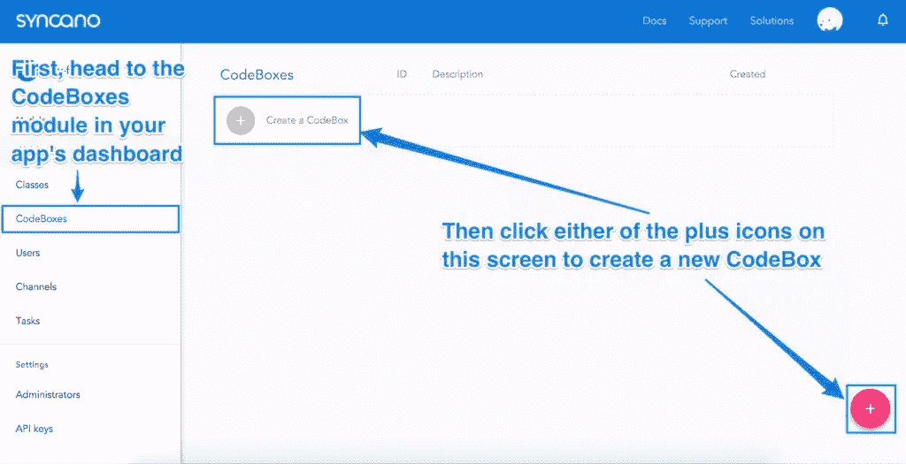

然后，在出现的弹出框中:

*   为您的代码框输入一个标题——这可以是一个简短而清晰的标签，帮助您在仪表板中找到它，例如“查找 GitHub Pull 请求”。
*   输入代码盒的描述——这不是必需的，但我更喜欢使用它来包括更多关于代码盒如何工作的细节，例如“从 GitHub repo 中查找和过滤拉请求”。
*   选择您喜欢的运行时环境——在本文中，我们将使用 Node.js，所以如果您想直接跟随，请选择它！
*   点击“确认”创建代码盒！

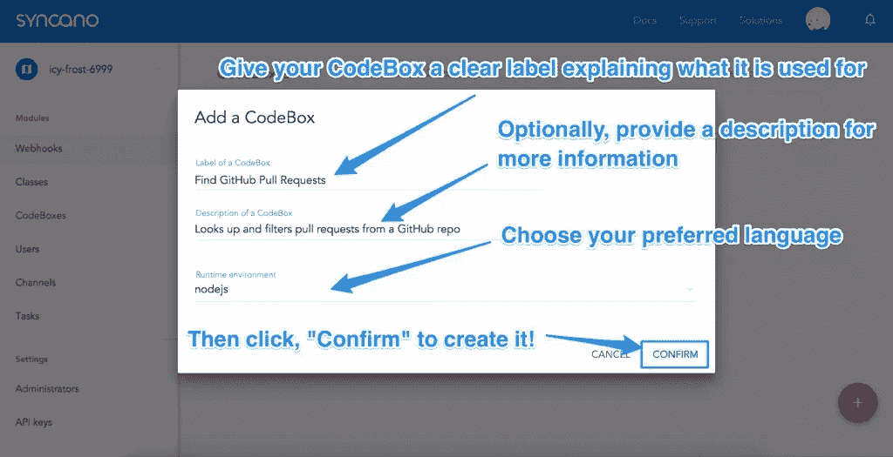

一旦你创建了你的代码箱，Syncano 会直接把你带到代码箱编辑界面。您将看到一个带有文本`# Start coding!`的空白页面。我们应该按照说明，在那里放一些简单的东西作为初始测试运行。

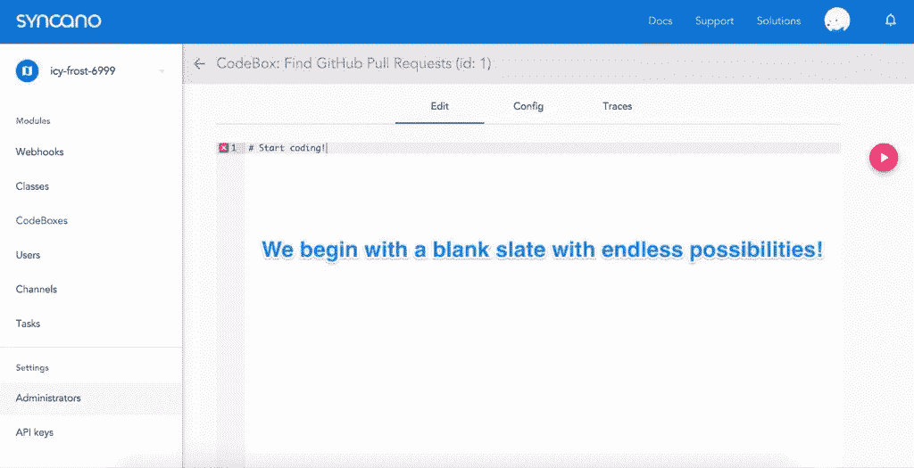

## 运行代码箱

输入一个简单的`console.log()`语句，然后点击右边的 run 按钮进行测试运行:

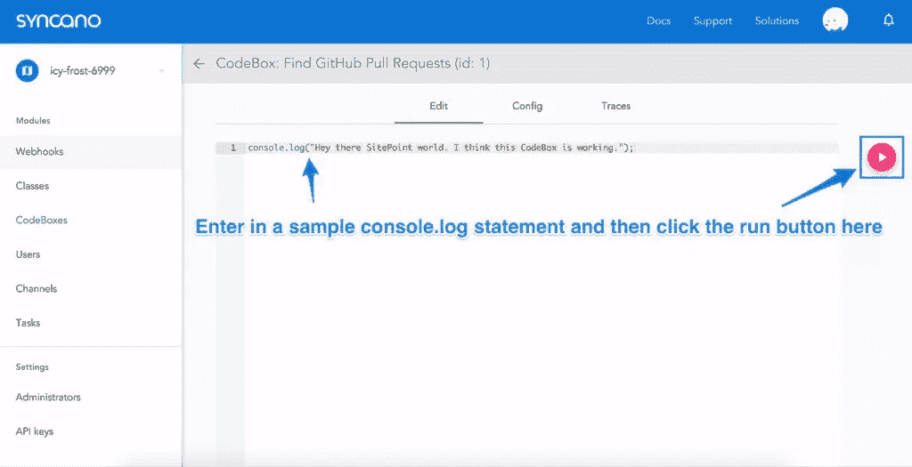

然后，如果我们向下滚动页面，我们会发现一个结果屏幕，显示成功的输出:

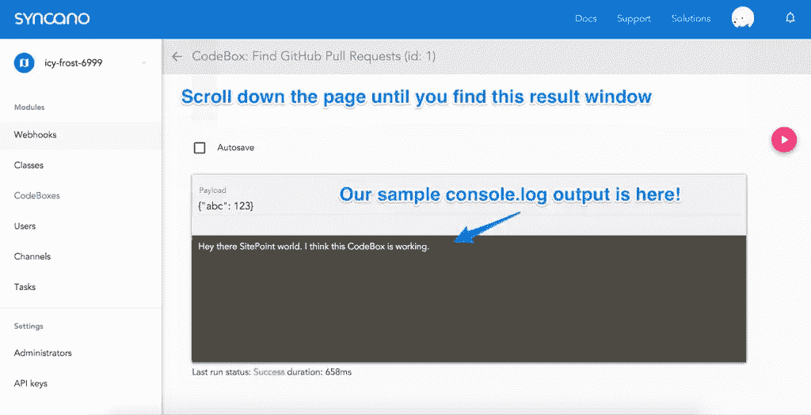

## 从辛加诺外面跑出来

我们也可以在辛加诺外运行一个密码箱。这才是真正的力量所在！有两种方法可以从 Syncano 外部访问我们的代码箱——通过 cURL、JavaScript 或 Python 直接运行代码箱，或者通过 Webhook 运行代码箱。直接运行代码箱需要帐户密钥(因此需要管理员访问权限),并导致代码箱在后台运行。您的结果不会立即返回，这可能会很混乱。另一方面，Webhooks 不需要帐户密钥，并且是同步运行的——您将在响应中收到 CodeBox 的执行结果。

举两个例子，我们将看看通过 cURL 命令和 Webhook 直接访问 CodeBox。

要通过 cURL 访问 CodeBox，我们需要我们的帐户密钥来证明我们被授权这样做。Webhooks 不需要帐号密钥，所以如果您对如何使用 cURL 不感兴趣，可以直接跳到下一节！但是，知道在哪里可以找到您的帐户密钥是非常方便的。

### 查找您的帐户密钥

要查找您的帐户密钥，请单击 Syncano 仪表盘右上角的个人资料图片，然后单击您的帐户名称:

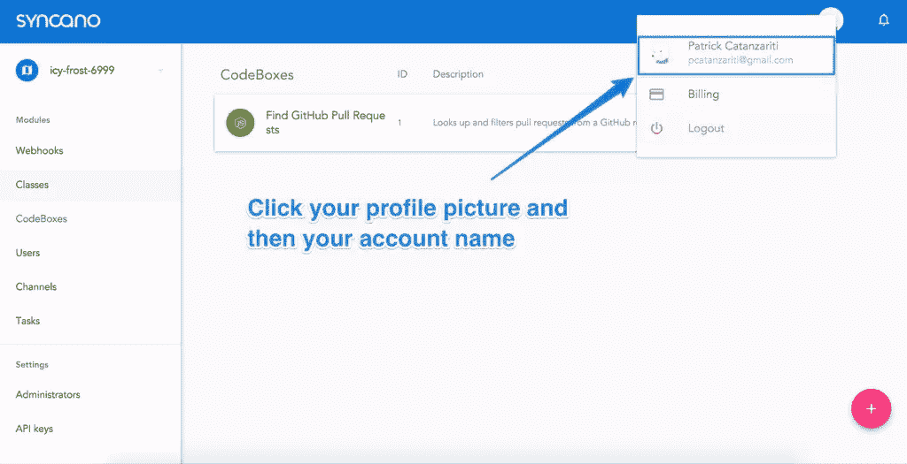

在此页面中，单击右侧的“身份验证”部分。此屏幕显示您的帐户密钥。通过按下屏幕上的“复制”按钮或手动复制按钮旁边的密钥来复制密钥:

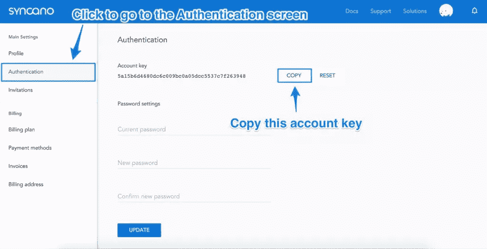

请将该密钥保存在安全的地方，我们将在下一步中使用它！

### 通过 cURL 运行代码箱

我们远程运行 CodeBox 的第一个选择是通过 cURL 命令，您可以从命令行运行它。对于感兴趣的人，你可以通过下面的链接将它安装在 Windows [64 位](http://curl.haxx.se/dlwiz/?type=bin&os=Win64&flav=MinGW64)和 [32 位](http://curl.haxx.se/dlwiz/?type=bin&os=Win32&flav=-&ver=2000/XP)上。对于那些使用 OS X 的用户，苹果已经为你提供了作为操作系统一部分的 cURL。

打开您的命令提示符并输入以下内容，用您的帐户密钥替换`YOUR_ACCOUNT_KEY_YOU_COPIED_EARLIER`，用您的实例名替换`YOUR_INSTANCE_NAME`(我的实例名是`icy-frost-6999`)。`1`是你的密码箱 ID。如果到目前为止您只有一个代码箱，它的 ID 将是 1:

```
curl -X POST \
-H "X-API-KEY: YOUR_ACCOUNT_KEY_YOU_COPIED_EARLIER" \
-H "Content-Type: application/json" \
"https://api.syncano.io/v1/instances/YOUR_INSTANCE_NAME/codeboxes/1/run/"
```

运行时，应该会产生以下结果:

```
{"status":"pending","links":{"self":"\/v1\/instances\/icy-frost-6999\/codeboxes\/1\/traces\/3\/"},"executed_at":null,"result":{},"duration":null,"id":3}
```

这还没有向我们显示结果，因为结果的跟踪可以通过不同的命令访问。在这个响应中，我们可以看到跟踪结果所需的一条主要信息— `"id":3`。这是我们要查看的跟踪的 ID。为了查看我们的`console.log()`是否已经在该跟踪中运行，我们使用代码箱 ID 1 和跟踪 ID 3 运行下面的 cURL 命令:

```
curl \
-H "X-API-KEY: YOUR_ACCOUNT_KEY_YOUCOPIED_EARLIER" \
"https://api.syncano.io/v1/instances/YOUR_INSTANCE_NAME/codeboxes/1/traces/3/
```

结果应该是这样的:

```
{"status":"success","links":{"self":"\/v1\/instances\/icy-frost-6999\/codeboxes\/1\/traces\/3\/"},"executed_at":"2016-01-08T03:25:53.881717Z","result":{"stderr":"","stdout":"Hey there SitePoint world. I think this CodeBox is working."},"duration":1489,"id":3}
```

我们的`console.log()`已经运行成功！

### 通过 Webhooks 运行代码箱

对于我们的 web 应用程序，我们希望能够在前端通过 JavaScript 运行我们的 CodeBox。为了公开运行 CodeBox 而不暴露账户密钥，我们设置了一个叫做 Webhook 的东西。一个 Webhook 给了我们一个公共的 URL 来发送 POST 请求，以便运行 CodeBox。

要设置公共 Webhook，请转到您的实例的 Syncano 仪表板，然后单击左侧的“Webhooks”菜单项。然后点击“创建网页挂钩”:

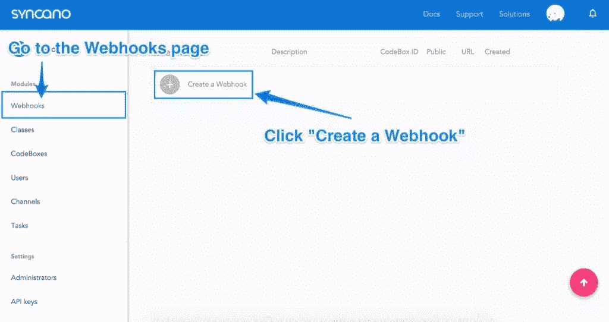

在出现的弹出窗口中，我们将 Webhook 称为“findpullrequests”，并给它一个“找到我们的 GitHub Pull 请求的公共链接”的描述。该描述仅供您自己参考，因此您可以随意以任何方式描述它！然后，我们在最后一个字段中选择我们的代码箱，将其设置为将要运行的代码箱。点击“公开此 Webhook ”,准备好后点击“确认”:

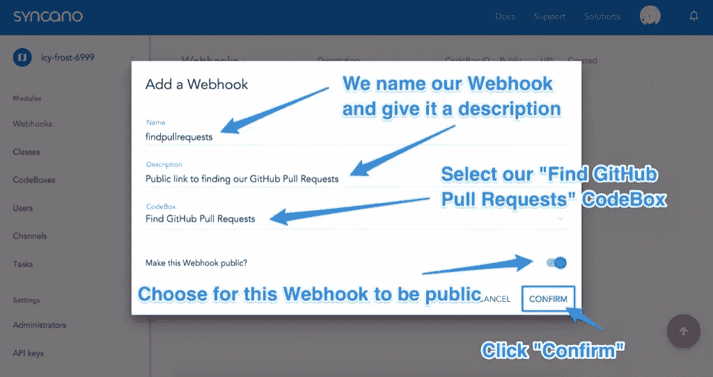

然后 Syncano 返回我们的 Webhook 列表，展示我们的新 web hook。在这个 Webhook 上的 URL 列下有一个链接——我们单击它来复制我们将用来运行我们的代码箱的公共 URL。

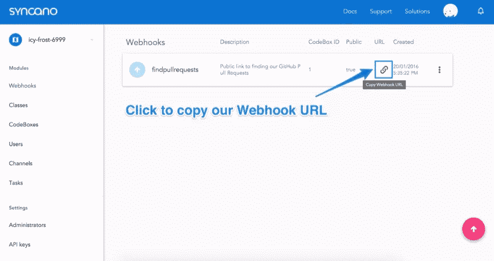

值得注意的是——你可以将这个链接粘贴到你的浏览器中来测试 Webhooks，而不需要一开始就创建一个完整的应用程序。

### 通过 JavaScript 和 Webhooks 运行代码盒

我们的前端 HTML 将会非常简单。对于本文中的各种示例，您可以使用 JavaScript 框架，但是为了使事情尽可能简单和通用，我们坚持在我们的 POST 请求的前端使用简单的 JavaScript 和 jQuery。

```
<!doctype html>
<html>
  <head>
    <title>GitHub Pull Request Checker</title>
  </head>
  <body>
    <div id="main">
      <h1>Pull Requests</h1>

      <div id="pull-requests">

      </div><!-- pull-requests -->
    </div><!-- main -->

    <script src="js/vendor/jquery.min.js"></script>
    <script src="js/vendor/syncano.min.js"></script>
    <script src="js/app.js"></script>
  </body>
</html>
```

这里要注意的主要代码行是我们在 jQuery 之后包含的 Syncano JavaScript 文件([你可以从他们的 GitHub](https://github.com/Syncano/syncano-js-lib/archive/master.zip) 获得 Syncano JavaScript 文件):

```
<script src="js/syncano.min.js"></script>
```

在我们自己的 JavaScript 中，我们称之为`app.js`，我们将使用以下代码创建一个 JavaScript 文件:

```
(function() {
  $.ajax({
    type: "POST",
    url: "https://api.syncano.io/v1/instances/YOUR-INSTANCE-NAME/webhooks/p/abcd/findpullrequests/"
  })
  .done(function(res) {
    console.log('Response:');
    console.log(res);
  });
}());
```

我们将 webhook URL 复制到 jQuery AJAX POST 请求的`url`字段中:

```
$.ajax({
  type: "POST",
  url: "https://api.syncano.io/v1/instances/YOUR-INSTANCE-NAME/webhooks/p/abcd/findpullrequests/",
```

当我们的请求成功返回时，`.done()`回调就会运行。在我们的回调函数中，我们首先记录它已经成功运行，然后记录响应是什么。来自 Syncano CodeBox 的响应返回一个带有数据响应的`res`变量。

如果我们用这段代码运行我们的 web 应用程序，它将展示我们的`console.log()`的全部荣耀:


我们现在准备改进这个代码盒，给我们一些有用的信息，让我们在最新的 GitHub pull 请求中读取它。

## 将我们的密码箱连接到 GitHub

为了让我们的代码盒从 Github 中读取，我们需要添加一些功能。我们需要具备以下能力:

*   **发出 HTTP 请求—**我们将在我们的代码箱中使用`request`节点模块来这样做。
*   **向 GitHub API 发出一个 HTTP 请求–**特别是，我们希望检索 pull 请求。
*   **告诉 CodeBox 我们的 GitHub 用户名和 repo 名称–**我们希望能够在任何人的任何 GitHub repo 中重用这个 CodeBox，所以我们将这些设置为 CodeBox 的参数。
*   **通过标签过滤这些请求—**我们希望能够要求代码箱给我们一个带有特定标签的拉请求，所以我们也将它设置为代码箱的可选参数。我们将使用`lodash`节点模块来查看数据。
*   **返回每个拉取请求的标题、URL 和标签–**这些是我们将在 web 应用程序中显示的内容。我们不需要任何其他数据。

为了实现这一点，我们的代码箱看起来像这样:

```
var request = require("request"),
    _ = require("lodash"),
    username = ARGS.POST.username,
    repo = ARGS.POST.repo,
    pullLabel = ARGS.POST.label;

var options = {
  url: "https://api.github.com/repos/" + username + "/" + repo + "/issues?state=all",
  headers: {
    "User-Agent": "syncano-sample-pull-app"
  }
};

if (!username || !repo) {
    console.log("Error: Need more info!"); return false;
}

request(options, function (error, response, body) {
  if (error) {
    console.log("Error: ", JSON.stringify(error));
  } else if (!error && response.statusCode == 200) {
    var pulls = JSON.parse(body),
        returnValue = "[";

    _(pulls).forEach(function(pull) {
      var display = false;

      if (pullLabel) {
          if (_.filter(pull.labels, _.matches({"name": pullLabel})).length > 0) {
            display = true;
          }
      } else {
        display = true;
      }
      if (display) {
        returnValue += "{\"title\":\"" + pull.title + "\", \"url\":\"" + pull.html_url + "\",  \"state\":\"" + pull.state + "\",  \"labels\":" + JSON.stringify(pull.labels) + "},";  
      }
    }).value();
    returnValue = returnValue.substring(0, returnValue.length - 1);
    returnValue += "]";
    console.log(returnValue);
  }
});
```

### 我们的密码箱解释说

代码盒以我们上面提到的`request`和`lodash`模块的`require`语句开始:

```
var request = require("request"),
    _ = require("lodash"),
```

然后，我们使用`ARGS.POST.theargumentname`格式设置我们的代码箱可以接受的参数。为了让它接收 POST 请求之外的参数，您可以使用`ARGS.theargumentname`。

```
username = ARGS.POST.username,
repo = ARGS.POST.repo,
pullLabel = ARGS.POST.label;
```

然后我们开始设置我们想要发送给 GitHub 的 HTTP 请求。我们设置了想要发送 HTTP 请求到 [GitHub 的发布 API](https://developer.github.com/v3/issues/) 的 URL。在我自己的例子中，我希望请求`https://api.github.com/repos/patcat/GreatestRepoOfAllTime/issues?state=all`。我将`state`设置为`all`，这样打开和关闭的拉请求都可以通过。从技术上讲，这个调用将检索问题和拉请求，所以如果我们愿意，我们可以在页面上将标题重命名为“问题和拉请求”!我让它保持原样，因为我的回购没有任何问题。

```
var options = {
  url: "https://api.github.com/repos/" + username + "/" + repo + "/issues?state=all",
```

我们的 HTTP 请求的另一个重要选项是包含一个用户代理头，因为 GitHub 使用它来跟踪调用来自哪里。你可以给你的名字起任何你喜欢的名字，只是要让它独一无二。

```
headers: {
    "User-Agent": "syncano-sample-pull-app"
  }
};
```

如果我们的 CodeBox 在参数中没有给出用户名或 repo 名称，它将返回一个错误，并且不再继续。

```
if (!username || !repo) {
  console.log("Error: Need more info!"); return false;
}
```

否则，我们运行上面定义的 HTTP 请求。如果有错误，它将出现在`error`变量中。我们将检测该变量并记录下来。如果没有错误，并且我们有一个成功的 HTTP 200 响应，我们的 CodeBox 将继续解释它收到的 pull 请求数据。

```
request(options, function (error, response, body) {
  if (error) {
    console.log("Error: ", JSON.stringify(error));
  } else if (!error && response.statusCode == 200) {
```

我们的拉取请求数据将在返回的`body`变量中。它是 JSON 字符串的形式，所以我们将它解析成 JavaScript 可以查看的东西，并保存在一个名为`pulls`的变量中。我们还创建了一个名为`returnValue`的新变量，在这里我们将编译 JSON 数据数组，并将结果提供给运行代码盒的人。

```
var pulls = JSON.parse(body),
    returnValue = "[";
```

然后，我们使用 lodash 模块的`forEach()`函数查看 GitHub 返回的每个 pull 请求，并对其进行处理:

```
_(pulls).forEach(function(pull) {
  ...
}
```

在这个`forEach()`函数中，我们设置了一个名为`display`的新变量，它将决定每个拉请求是否应该显示给从代码盒中请求拉请求的人。如果代码盒有一个`pullLabel`参数，它知道我们正在从一个特定的标签中寻找结果。在这种情况下，它遍历从 GitHub 返回的`pull.labels`中的每个标签，如果有任何匹配，它将这个 pull 请求设置为显示。

```
var display = false;

if (pullLabel) {
    if (_.filter(pull.labels, _.matches({"name": pullLabel})).length > 0) {
      display = true;
    }
}
```

否则，如果没有`pullLabel`参数，那么我们不会按标签过滤，我们肯定希望显示这个 pull 请求。

```
else {
  display = true;
}
```

在决定是否要显示拉请求后，我们检查那个`display`变量，然后用`pull.title`、`pull.state`和`pull.labels`将一个 JSON 字符串添加到我们的`returnValue`中。`pull.labels`被转换成一个 JSON 字符串，因为 GitHub 可以返回多个标签，我们希望这些标签能够很好地嵌套在我们返回的 JSON 中。

```
if (display) {
    returnValue += "{\"title\":\"" + pull.title + "\", \"url\":\"" + pull.html_url + "\",  \"state\":\"" + pull.state + "\",  \"labels\":" + JSON.stringify(pull.labels) + "},";  
  }
}).value();
```

当我们浏览了每个 pull 请求后，我们从`returnValue`中删除了最后一个字符(它是一个尾随的逗号，因为每个 pull 请求循环都在该字符串中添加了一个逗号),然后我们关闭了 JSON 对象数组。

```
returnValue = returnValue.substring(0, returnValue.length - 1);
returnValue += "]";
```

为了完成这项工作并发送数据，我们将它记录到控制台，以便我们的 web 应用程序可以获取它。

```
console.log(returnValue);
  }
});
```

## 更新我们应用程序的 HTML

我们的应用程序的前端代码非常简单。我们添加了一些样式，使它看起来更整洁，并且我们更新了 JavaScript，看起来像这样:

```
(function() {
  $.ajax({
    type: "POST",
    url: "https://api.syncano.io/v1/instances/YOUR-INSTANCE-NAME/webhooks/p/abcd/findpullrequests/",
    data: {"username":"patcat", "repo":"GreatestRepoOfAllTime", "label":"invalid"}
  })
  .done(function(res) {
    var pulls = JSON.parse(res.result.stdout),
        pullsHTML = "";

    for (var i = 0; i " + pulls[i].labels[j].name + "";
      }
      pullsHTML += "" + pulls[i].title + stateHTML + ""
    }

    document.getElementById('pull-requests').innerHTML = pullsHTML;
  });
}());
```

### 我们的前端 JavaScript 更新解释

已调整的代码盒部分包括:

我们的 CodeBox running 函数现在有了一个我们希望在`data`值中发送的有效载荷参数——这允许我们请求特定的用户名、存储库和标签，我们希望从它们那里获得拉取请求。对于我自己的例子，我只显示名为“invalid”的拉请求:

```
data: {"username":"patcat", "repo":"GreatestRepoOfAllTime", "label":"invalid"}
```

一旦请求成功，我们从我们的 CodeBox 的`res.result.stdout`响应中解析 JSON 字符串(在那里可以找到`console.log`响应),并将其保存在一个名为`pulls`的变量中。我们还为将要放到页面上的 HTML 输出设置了一个名为`pullsHTML`的变量。

```
var pulls = JSON.parse(res.result.stdout),
    pullsHTML = "";
```

类似于我们在 GitHub 数组中看到的情况，但是没有 lodash(如果您愿意，您可以将 lodash 引入您的前端！)，我们遍历每个拉请求，并将其显示为一个链接。如果有任何标签，我们也会将其添加到组合中。我们还用一个名为`pull-open`或`pull-closed`的类来定义拉请求的状态。

```
for (var i = 0; i < pulls.length; i++) {
    var stateHTML = "";
    for (var j = 0; j < pulls[i].labels.length; j++) {
        stateHTML += "<div class=\"label\">" + pulls[i].labels[j].name + "</div>";
    }
    pullsHTML += "<a class=\"pull pull-" + pulls[i].state + "\" href=\"" + pulls[i].url + "\" target=\"_blank\">" + pulls[i].title + stateHTML + "</a>"
}
```

最后，我们将代码放入页面上的`#pull-requests`元素中:

```
document.getElementById('pull-requests').innerHTML = pullsHTML;
```

## 在活动

如果我们以 GitHub repo 为例，可以看到有四个 pull 请求在等待。其中两个被标记为无效，一个无效的拉请求被关闭:

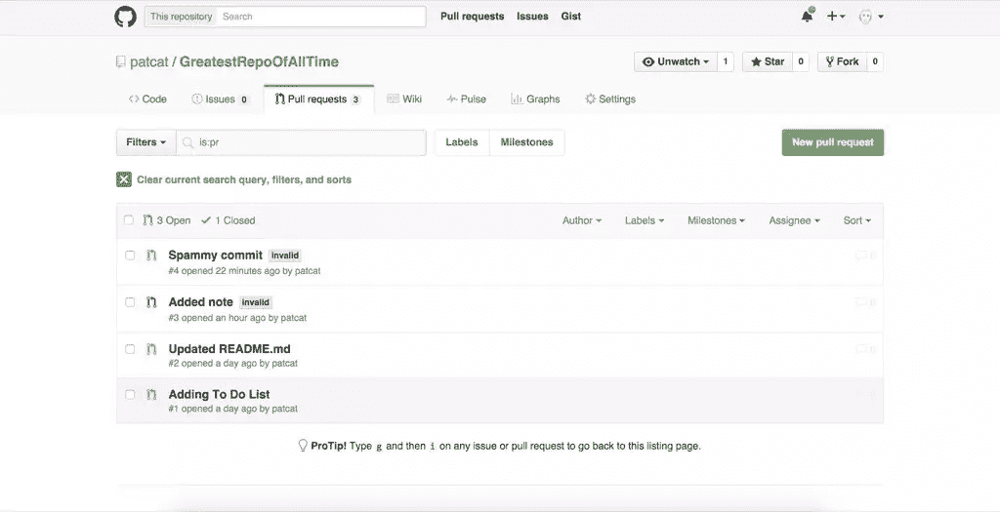

如果我们通过加载`index.html`来运行我们的 web 应用程序，Syncano 只向我们的应用程序提供两个 GitHub pull 请求——这两个请求被标记为无效。其中一个请求被划掉了，这是我的示例 CSS 中关闭的票证的样式的一部分(您可以按照自己喜欢的方式对整个应用程序进行样式化，或者看一下演示代码！).

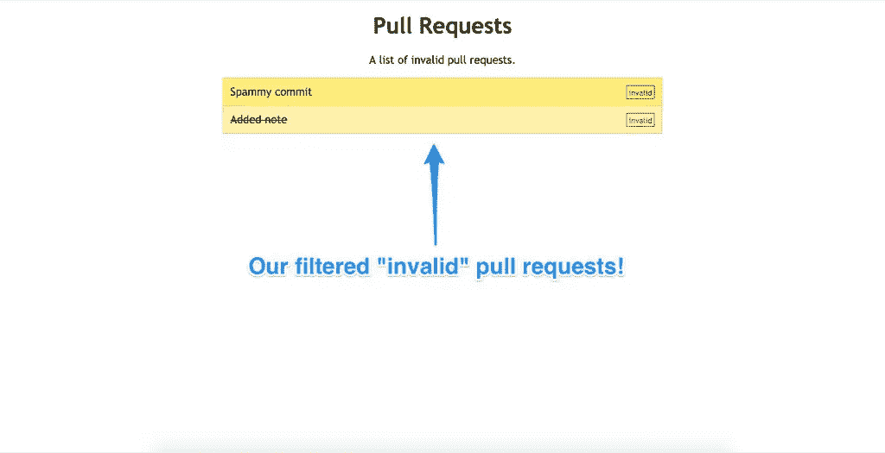

## 结论

CodeBoxes 和 Syncano 为您的 web 应用程序提供了一种非常好的、简单的方式来建立一个模块化的、可重用的无服务器平台。GitHub pull 请求示例完全运行在 Syncano 的服务上，只有一个静态 HTML 页面，其中包含一些基本的 JavaScript 来拉入数据。对于那些对为你的下一个项目建立后端环境不太感兴趣的人来说，Syncano 和它的 CodeBoxes 可能是完美的选择。

## 分享这篇文章