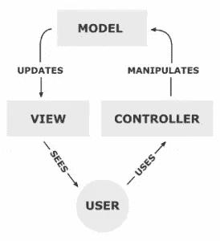

# MVC 入门

> 原文：<https://www.sitepoint.com/getting-started-with-mvc/>

维基百科提供

Ruby on Rails 经常被宣传为 MVC web 框架(但实际上，Rails 是一个 Model 2-MVC 框架，我稍后将回到这个讨论中)，用于创建现代的、工业级的 web 应用程序。Ruby on Rails 于 2004 年 7 月作为开源项目首次发布，大约 8 年后，它已经成为最流行的 web 框架之一。然而，它的设计模式——模型-视图-控制器架构——更加古老，并且深深扎根于 web 应用领域之外。

## 历史

为了深入理解 MVC 框架，我们先来探究一下它的历史。模型-视图-控制器模式是由 Trygve Reenskaug 在 20 世纪 70 年代提出的，作为施乐 PARC 公司正在开发的 smalltalk 系统的一部分。这远远早于万维网的出现，甚至早于计算机个人化。具有 MVC 设计模式的 smalltalk 系统专注于关注点分离，这是一个所有现代 web 框架基于其优先级划分的设计原则。他们成功地将数据模型(数据处理部分)从内容中分离出来，并将内容从表示中分离出来。他们还实施了一个中间驱动力，这是第一命令。尽管它有一些缺点，但它吸引了 web 开发人员，导致许多早期的 web 框架使用 MVC 设计模式(并且显然演变成了构建 Web 应用程序的事实上的标准)。

## Ruby on Rails 中的 MVC 框架

导航到 rails 应用程序根目录并运行