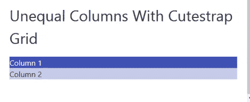
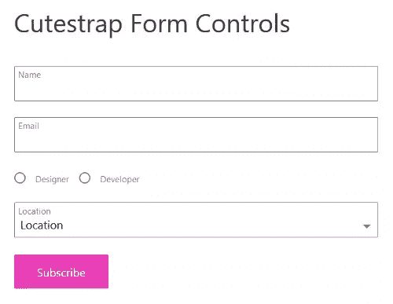
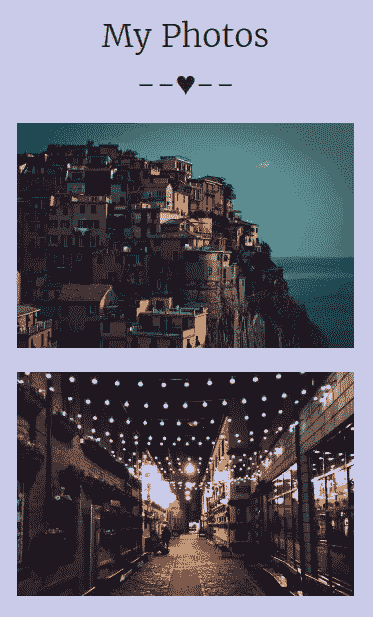
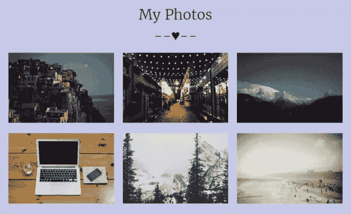
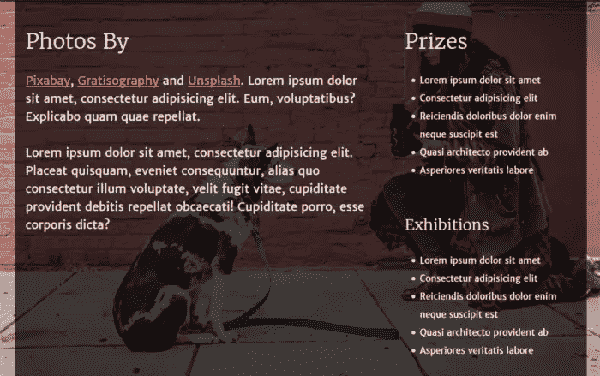

# 了解 Cutestrap，一个轻量级 CSS 框架

> 原文：<https://www.sitepoint.com/getting-to-know-cutestrap-a-lightweight-css-framework/>

Cutestrap 是一个全新的 CSS 框架。本文展示了 Cutestrap 的特性，并通过使用它构建一个简单的[单页 HTML 模板](http://codepen.io/SitePoint/pen/LkJkpg)来测试这个框架。

## Cutestrap 的功能

像大多数成功的 web 开发样板和框架一样，Cutestrap 减少了开发时间和重复性任务。根据文档页面上引人注目的定义，[泰勒·查尔兹](https://www.tylerchilds.com/)的 [Cutestrap](https://www.cutestrap.com/) 是“一个时髦、固执己见的 CSS 框架。这是自举的一个微小替代物。”这是一个很好的网站和应用程序快速原型的起点。

尽管它的文件很小，但 Cutestrap 不仅仅是一个带有一些基本重置样式的空白入门模板。它附带了一个字体选择、一个调色板，以及一些关于表单域和一些其他元素外观的明确视图。

另一方面，Cutestrap 远不能提供像 [Bootstrap](http://getbootstrap.com/) 和 [Foundation](http://foundation.zurb.com/) 这样的成熟框架所带来的大量功能和组件。

Cutestrap 的主要特点:

*   超级小——只有 8kb 的 CSS 代码
*   轻松定制，如果使用 [Sass](http://sass-lang.com/) 就更简单了
*   使用 [BEM 方法的大型 CSS 组织](http://getbem.com/)
*   印刷元素的一致垂直节奏
*   [KSS 生成的文档](http://warpspire.com/kss/)便于将 Cutestrap 文档转化为您项目的生活方式指南

让我们安装 Cutestrap 来了解更多信息。

## 安装可爱带

你可以走传统路线，直接从[框架的主页](https://www.cutestrap.com/)下载`cutestrap.zip`。或者，您可以使用 [npm](https://www.npmjs.com/) 将 Cutestrap 集成到您的项目中:

```
npm install cutestrap 
```

或者[鲍尔](https://bower.io/):

```
bower install cutestrap 
```

## 定制 Cutestrap

你可以通过使用它的 Sass 版本或者它的编译版本来修改 Cutestrap 中的任何东西。

在这方面，Cutestrap 与其他流行的 CSS 框架并无不同。如果您喜欢普通的 CSS，您可以直接在项目中包含`cutestrap.css`(或者它在产品中的缩小版本),然后从您的定制样式表文档中覆盖 Cutestrap CSS 规则。

选择 Sass 替代方案会给您带来更大的灵活性和速度。设置项目的一种方法是创建一个分部文件，在其中存储您的自定义变量，包括您希望从框架中覆盖的内容。接下来，您可以创建一个`custom.scss`文件，其中您可以使用`@import`语句引用包含您的定制变量的文件和原始的`cutestrap/dist/scss/cutestrap.scss`文件:

```
//custom variables
@import "custom-variables";

//original Cutestrap 
@import "path-to-framework-folder/cutestrap";

//custom Sass code goes here 
```

编写`@import`语句的顺序很重要。事实上，在`cutestrap.scss`之前包含`custom-variables.scss`可以确保您在自定义文件中覆盖的所有 Cutestrap 变量值都将在编译后的 CSS 输出中生效。

您的自定义 Sass 代码位于`@import`语句下方。

## Cutestrap 框架包含了什么？

除了一些智能默认样式之外，Cutestrap 还提供了一个网格系统、漂亮的排版、按钮和表单域等常见的网站组件，以及一些方便的实用程序类。

让我们仔细看看。

### 格子

Cutestrap 提供了一个使用 [flexbox](https://www.w3.org/TR/2016/CR-css-flexbox-1-20160526/) 构建的超级简单的网格。

下面是两列网格的代码:

```
<div class="wrapper">
  <div class="grid">
    <div>
      Column 1
    </div>
    <div>
      Column 2
    </div>
  </div>
</div> 
```

为了控制内容区域的宽度，Cutestrap 提供了三个 CSS 类供选择:

*   `.wrapper`最大宽度为 960 像素
*   `.wrapper-small`最大宽度为 640 像素
*   `.wrapper-large`–最大宽度为 1200 像素

如果您使用网格而没有将它包含在`.wrapper`容器中，您的内容将会跨越整个屏幕宽度，这可能是也可能不是您想要的结果。

网格本身只需要一个类为`.grid`的容器元素。该元素中的列将均匀分布在整个可用空间中。不需要为行和列添加类。

上面的代码示例针对两列，因此每列占用一半的可用空间:


如果我添加四列，每列将占用 25%的可用空间:

```
<div class="wrapper">
  <div class="grid">
    <div>
      Column 1
    </div>
    <div>
      Column 2
    </div>
    <div>
      Column 3
    </div>
    <div>
      Column 4
    </div>
  </div>
</div> 
```

这是上面的代码片段在浏览器中的样子:


如您所见，列不会换行。为了创建新行，您需要一个新的`.grid`容器:

```
<div class="wrapper">
  <div class="grid">
    <div>
      Column 1 Row 1
    </div>
    <div>
      Column 2 Row 1
    </div>
    <div>
      Column 3 Row 1
    </div>
  </div>
  <div class="grid">
    <div>
      Column 1 Row 2
    </div>
    <div>
      Column 2 Row 2
    </div>
    <div>
      Column 3 Row 2
    </div>
  </div>
</div> 
```

以下是上述标记在浏览器中的呈现方式:


但是 Cutestrap 如何处理一个**响应式布局**？这是一种常见的布局模式，其中列在小屏幕上一个接一个地堆叠，并在桌面屏幕上形成网格布局。

使用下面的栅格修改器类可以快速实现这一点:

*   `.grid--medium`–柱子堆叠在小屏幕上。只有当屏幕尺寸达到 600 像素时，它们才开始流入网格布局
*   `.grid--large`–与相同的模式。网格-中等，但是当屏幕宽度至少为 960 像素时，列开始将自己排列成网格

下面是基本代码:

```
<div class="wrapper">
  <div class="grid grid--medium">
    <div>
      Column 1
    </div>
    <div>
      Column 2
    </div>
  </div>
</div> 
```

到目前为止，您只看到了等柱网轴线的示例。要添加不同宽度的**列，只需使用以下列修饰符类之一:**

*   `.column--light`–将此类应用于列，使其宽度为默认列的一半
*   `.column--heavy`–将此类应用于一列，使其宽度为默认列的两倍

上面的两个类通过改变 [`flex-grow`](https://developer.mozilla.org/en/docs/Web/CSS/flex-grow) 属性来实现它们的目标，该属性决定了分配给 flex 容器中的项目的空间大小。

这里有一个简单的例子:

在宽于 600 像素的屏幕上，第 2 列的宽度是第 1 列的一半:

```
<div class="wrapper">
  <div class="grid grid--medium">
    <div>
      Column 1
    </div>
    <div class="column--light">
      Column 2
    </div>
  </div>
</div> 
```

上面的代码是这样在浏览器的宽屏上呈现的:


下面是相同的代码在小屏幕上显示的方式:



要查看 Cutestrap 网格的运行情况，请前往 CodePen 上的[现场演示。](http://codepen.io/SitePoint/pen/PzdzoY/)

在 [CodePen](http://codepen.io) 上通过 SitePoint ( [@SitePoint](http://codepen.io/SitePoint) )看到笔 [Cutestrap 网格](http://codepen.io/SitePoint/pen/PzdzoY/)。

### 排印

Cutestrap 中的印刷元素使用 [rem 单位](https://www.sitepoint.com/understanding-and-using-rem-units-in-css/)根据根`html`元素上的 62.5%的字体大小来调整大小，对于大于 960px 的视口，该字体大小高达 78.125%。2.4 的基线会产生和谐的垂直节奏，从而增强网页内容的外观。

Cutestrap 为 1 级到 6 级标题以及段落、块引用和表格元素提供了样式。这里是 CodePen 上的[现场演示。](http://codepen.io/SitePoint/pen/jAvAVB)

在 [CodePen](http://codepen.io) 上通过 SitePoint ( [@SitePoint](http://codepen.io/SitePoint) )看笔 [Cutestrap 排版](http://codepen.io/SitePoint/pen/jAvAVB/)。

标题和正文的默认 CSS 字体堆栈包括以下字体:

*   未来的未来
*   下一步
*   新 Helvetica
*   跟着我
*   韦尔达纳
*   无衬线字体

您可以使用常规 CSS 或 Sass 轻松地更改这一点。

例如，要将 Merriweather Sans 用于正文，将 Merriweather 用于标题，请将以下代码片段添加到您的自定义 CSS 文档中:

```
body {
  font-family: 'Merriweather Sans', sans-serif; 
}

h1, h2, h3, h4, h5, h6 {
  font-family: 'Merriweather', serif;
} 
```

要使用 Cutestrap Sass 文件做同样的事情，只需用您自己选择的字体替换正文的`$base-font`变量和标题的`$heading`变量。你可以在 Cutestrap 的`scss`文件夹中的`variables/_type.scss`文件中找到这些变量。

### 小跟班

Cutestrap 使用一个类`.btn`将独特的样式应用于按钮元素、提交/输入元素和链接元素。

此外，该框架提供了默认`.btn`类的两种变体:`.btn--secondary`和`.btn--link`。

```
<button>Button</button>
<input type="button" value="Input Button" class="btn">
<button class="btn--secondary">Secondary</button>
<a href="#" class="btn btn--link">Button Link</a> 
```


查看 [CodePen 演示](http://codepen.io/SitePoint/pen/rLkLOw)。

在 [CodePen](http://codepen.io) 上通过 SitePoint ( [@SitePoint](http://codepen.io/SitePoint) )查看笔 [Cutestrap 按钮样式](http://codepen.io/SitePoint/pen/rLkLOw/)。

### 形式

Cutestrap 使用统一的标记结构和 CSS 样式构建表单域，这使它们在不同的浏览器中具有一致的外观。

下面是一个简单表单的标记:

```
<form>
  <label class="textfield">
    <input type="text">
    <span class="textfield__label">Name</span>
  </label>
  <label class="textfield">
    <input type="email">
    <span class="textfield__label">Email</span>
  </label>
  <label class="radio">
    <input type="radio" name="designer">
    <span class="radio__label">Designer</span>
  </label>
  <label class="radio">
    <input type="radio" name="developer">
    <span class="radio__label">Developer</span>
  </label>
  <label class="select">
    <select>
      <option value="Location" disabled selected>Location</option>
      <option value="EU">EU</option>
      <option value="US">US</option>
      <option value="Australia">Australia</option>
    </select>
    <span class="select__label" for="select">Location</span>
  </label>
  <button type="submit">Subscribe</button>
</form> 
```

以下是标记在浏览器中的显示方式:



要查看实时代码，请查看 CodePen 上的[演示。](http://codepen.io/SitePoint/pen/ZOrObX)

通过 [CodePen](http://codepen.io) 上的 SitePoint ( [@SitePoint](http://codepen.io/SitePoint) )查看笔 [Cutestrap 表单控件](http://codepen.io/SitePoint/pen/ZOrObX/)。

### 实用程序类别

Cutestrap 提供了少量方便的实用程序类来做诸如对齐文本、清除浮动、增加或减少`font-size`等事情。

Cutestrap 实用程序类的完整列表可在 [Cutestrap 文档页面](https://www.cutestrap.com/)上找到。

## 将所有这些放在一起:让我们编写一个演示页面

本文的 HTML 演示包括到目前为止讨论过的所有 Cutestrap 的关键特性。我在这里展示的代码仅限于这些特性。你可以在 [CodePen](http://codepen.io/SitePoint/pen/LkJkpg/) 上自由检查细节。

在 [CodePen](http://codepen.io) 上通过 SitePoint ( [@SitePoint](http://codepen.io/SitePoint) )看到带 Cutestrap 的 Pen [HTML 模板。](http://codepen.io/SitePoint/pen/LkJkpg/)

以下是英雄部分的 HTML 代码:

```
<div class="hero">
  <div class="wrapper">
    <article class="ta-center">
      <!-- Hero image here  -->
      <h1 class="section-title">Title</h1>
      <p class="fs-large">Tagline</p>
    </article> <!--/article -->   
  </div> <!--/.wrapper -->
</div> <!--/.hero --> 
```

hero 部分是全幅的，但是使用`.wrapper`类来控制显示区域的最大宽度和居中。

部分标题和标志行以`.ta-center`居中，标志行的字体使用`.fs-large`变大。这两个都是控制文本内容显示的方便的 Cutestrap 实用程序类。


文件夹部分是一个响应性的三列图像网格，沿两行排列。代码如下:

```
 <div class="portfolio">
  <div class="wrapper">   

    <!-- First row -->
    <div class="grid grid--medium">
      <figure>
        
      </figure>
      <!-- Two more items -->
          ...
    </div><!-- /.grid --> 

    <!-- Second row -->
    <div class="grid grid--medium">
      <figure>
        
      </figure>
      <!-- Two more items -->
          ...
    </div><!-- /.grid -->

  </div><!-- /.wrapper -->
</div><!-- /.portfolio --> 
```

为了实现响应式布局，Portfolio 部分使用了`.grid--medium`修饰符类:内容堆叠在小屏幕上；在宽于 640 像素的屏幕上，内容显示在三列网格中。





演示的三列页脚使用相同的结构:


“关于”部分有一个响应性的两列布局。移动视图显示上下堆叠的列，桌面视图并排显示列，右列比左列窄。

使用上面的`.grid--medium`修饰符类来实现响应式布局。应用于第二列的`.column--light`类是缩小第二列所需的全部内容:

```
 <div class="about">
  <div class="wrapper">
    <div class="grid grid--medium">
      <!-- Wider column -->
      <article>
        Content in wider column
      </article>
      <!-- Narrower column -->
      <article class="column--light">
        Content in narrower column
      </article>
    </div><!-- /.grid -->  
  </div><!-- /.wrapper -->
</div><!-- /.about --> 
```



Contact 部分只显示居中的表单元素。为了避免表单跨越页面的常规宽度，并且缺少现成的类来偏移列，我使用了`.wrapper-small`类。这导致居中的容器将表单元素限制在相对于网页的常规宽度更窄的边界内。

相关的标记如下所示:

```
 <div class="contact">
  <div class="wrapper-small">

    <!-- form element here -->

  </div><!-- /.wrapper-small -->
</div><!-- /.contact --> 
```

要构建表单元素，只需使用 Cutestrap 标记和 CSS 类，如本文前面所述。

对于这个演示，我为默认的链接和按钮元素选择了不同的颜色。您可以使用下面的 CSS 片段来自定义这些元素:

```
/*Links*/
a:link {
  color: #ff9800;
}

a:visited,
a:active {
  color: #ffad33;
}

a:hover,
a:focus {
  color: #cc7a00;
}

/*Buttons*/
.btn,
input[type="submit"],
input[type="button"] {
  background-color: #ff9800;
}
.btn:focus, .btn:hover,
input[type="submit"]:focus,
input[type="submit"]:hover,
input[type="button"]:focus,
input[type="button"]:hover {
  background-color: #cc7a00;
}
.btn:active,
input[type="submit"]:active,
input[type="button"]:active {
  background-color: #ff9800;
} 
```

如果您使用的是 Cutestrap 的 Sass 版本，只需将以下变量的值更改为您想要的颜色:

*   `$link`
*   `$link--visited`
*   `$link--hover`
*   `$link--active`

`.btn`类使用`$primary`颜色变量来设置背景颜色的样式。因此，如果您想修改按钮元素的默认背景颜色，只需更改`$primary`变量的颜色值。

编译就大功告成了！

以下是表单元素在浏览器中的外观:


## 结论

在本文中，我介绍了 Cutestrap，一个全新的 CSS 框架。

Cutestrap 有许多有趣的特性，但是对我来说它最大的优点是它简单的学习曲线:我花了一个多小时来学习如何使用这个框架和构建本文附带的演示页面。部分原因是因为 Cutestrap 很小:该框架不支持旧浏览器，它只为一些关键元素提供样式，网格不允许列的偏移或嵌套(尽管我喜欢它的简单性)，并且不包括 JavaScript 交互式组件。Sass 代码组织得很好，但是很少，甚至看不到一个 mixin。

这是好事吗？这取决于你需要什么作为你项目的起点。

开源 CSS 框架的生态系统已经变得非常有竞争力。微小是不够的。甚至像 Bootstrap 和 Foundation 这样的大公司也已经高度模块化，因此只需启用或禁用 Sass 变量就可以了，Bootstrap 和 Foundation 经常因导致不必要的代码膨胀而成为众矢之的。

然而，我需要提醒自己，Cutestrap 非常年轻，实际上还是一个婴儿——我刚刚注意到，在撰写本文时，它在 GitHub 上的首次提交才大约一个月大。这意味着框架有充足的时间来发展和成熟。

如果你已经尝试过 Cutestrap，并且想要建议一个新功能或者发送一个 pull 请求，请前往 GitHub 上的[项目页面并参与进来。](https://github.com/cutestrap/cutestrap)

你在开发工作中使用过 Cutestrap 吗？你造了什么？我等不及收到你的来信了！

## 分享这篇文章