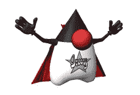

# JVM 上的动态化:JRuby 与 Groovy

> 原文：<https://www.sitepoint.com/going-dynamic-on-jvm-jruby-vs-groovy/>

## JVM 太牛逼了！

许多抨击 Java 的人犯了混淆 Java 语言和 Java 平台的错误。当然，Java 语言是冗长的；它缺少闭包、混合等等。但是 JVM 太棒了。它非常快，可以在任何地方运行，有多个垃圾收集器，有本地线程和很棒的监控工具。因此，您可能仍然希望在 JVM 上运行服务器端应用程序。最好的部分是你不必使用 Java 语言。如果你是动态语言的爱好者，有很多选择。最成熟的是 JRuby 和 Groovy。如果你在问自己，“我应该选择 Groovy 还是 JRuby”，请阅读这篇文章，希望你能够做出决定。

## 绝妙的

让我们从 Groovy 开始。Groovy 是一种为 Java 虚拟机设计的动态语言。它从 Ruby 和 Python 等语言中汲取了许多想法(并加入了一些自己的想法)，并将它们封装在一个类似 Java 的语法中。与移植语言相比，为 JVM Groovy 设计有一些优势。其中之一是与 Java 语言的无缝互操作性(Groovy 到 Java 和 Java 到 Groovy)。然而，为了让它更接近 Java，该语言的设计者不得不做出一些妥协。例如，Groovy 使用 getters 和 setters 来定义属性。

[Groovy 主页](http://groovy.codehaus.org/)

## JRuby

它是 Ruby 语言在 JVM 上的实现。因此，JRuby 最酷的地方在于它是 Ruby。这意味着你可以在 JVM 上使用 Ruby 平台的所有优点。不仅仅是 Rails。ruby 爱好者已经开发了很多非常酷的东西，并且能够使用所有这些库。然而，这也有不好的一面。JRuby 与 Java 的互操作不如 Groovy 流畅。

[JRuby 主页](http://jruby.org/)

## Groovy 与 JRuby

让我们比较这些语言的以下几个方面:成熟度、语言特性、黑仔库、与 Java 的互操作性、性能和工具。

### 成熟

JRuby 项目去年庆祝了它的 10 周年纪念。它支持 Ruby 1.8 和 1.9。大多数 gem 与 JRuby 一起工作没有任何问题。那些不起作用的有用 Java 写的类似物(比如 Nokogiri Java)。有一些云解决方案支持 JRuby 和一些健壮的应用服务器。这是目前最快的 Ruby 实现。我认为 JRuby 现在势头正猛。人们到处都在谈论和写 JRuby 相对于 MRI 的优势。它在许多公司的生产中使用(例如，LinkedIn 和 Square)。

Groovy 项目开始于 2003 年。2008 年趋于稳定。最初，它主要是作为 Java 平台的脚本语言使用的，但是在过去的几年里，它的生态系统已经真正成熟了。许多惯用的 Groovy 库(例如，Spork、Geb 和 Gradle)已经问世。Groovy 也有云部署选项。Groovy 被许多已经有 Java 基础设施的公司使用(例如网飞)。

### 语言特征

由于 Groovy 在很多方面都受到了 Ruby 的启发，所以这两种语言非常相似。尽管侧重点不同。Groovy 有可选的类型和接口，它的结构更像 Java，这使它比 Ruby 更静态。Groovy 区别于其他动态类型语言的“更静态”的特性之一是编译时元编程。在 Groovy 中，你可以编写编译器的扩展来改变语言的语义。它为实现很酷的特定于领域的语言提供了很多选择。测试框架 Spock 就是一个很好的例子: