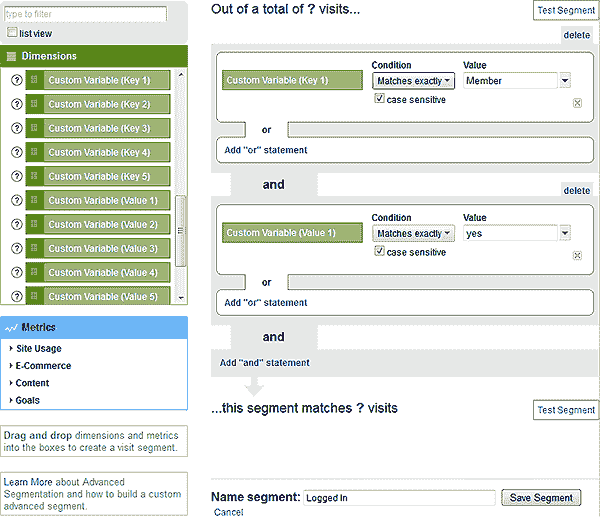
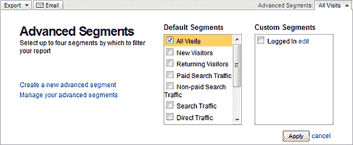

# 如何在谷歌分析中使用自定义变量

> 原文：<https://www.sitepoint.com/google-analytics-custom-variables/>

在谷歌分析中很容易跟踪[活动](https://www.sitepoint.com/google-analytics-monitor-promotions-campaigns/)、[电子商务交易](https://www.sitepoint.com/track-ecommerce-transactions-google-analytics-reports/)和 [JavaScript 事件](https://www.sitepoint.com/google-analytics-track-javascript-ajax-events/)。自定义变量提供了更高层次的控制，允许你分割所有的访问者数据，例如

*   监控成员和非成员查看的页面
*   发现新客户和现有客户购买了哪些产品
*   按主题对内容进行分类。

使用以下代码设置单个自定义变量:

```
 _gaq.push(["_setCustomVar", index, name, value, scope]); 
```

其中:

**索引** *(必选)*
您可以在任何页面上设置多达五个自定义变量，因此索引是 1 到 5 之间的整数。

我建议保持简单——为每个网站定义五个或更少的自定义变量，并分配一个一致的索引。如果它们分布在多个页面上，就有可能创建更多，但这会导致混乱。

**名称** *自定义变量名称。*

 ***值** *自定义变量值。可以设置数值，但是数据是作为字符串传递和处理的。*

 ***范围** *(可选)1 到 3 之间的整数其中:*

 **   1 是访问者级别—自定义变量数据持续存在于个人的每次访问和查看的页面中。
*   2 是会话级—自定义变量数据在个人进行的单次访问期间保持不变。
*   3 是页面视图级别—自定义变量数据仅在当前页面视图期间持续存在。

例如，可以在用户注册并首次登录后设置下面的访问者级别变量。它只需要设置一次，因为它将与用户保持关联(即使当他们从我们的系统注销时):

```
 _gaq.push(["_setCustomVar", 1, "Member", "yes", 1]); 
```

也许我们现在想根据会员注册的月数(最多 12 个月)来划分会员。我们可以在他们登录时设置一个会话级变量:

```
 _gaq.push(["_setCustomVar", 2, "RegisteredFor", Math.max(months,12)+" months", 2]); 
```

如果我们想跟踪用户感兴趣的主题，我们可以设置一个页面视图级别的变量:

```
 _gaq.push(["_setCustomVar", 3, "Topic", "JavaScript", 3]); 
```

自定义变量不会立即发送，通常应该在调用 _trackPageView()之前设置。当 _trackEvent()发生自定义事件时，也会发送它们，但这种情况并不可靠。因此，我们的完整代码可以是:

```
 var _gaq = _gaq || [];
_gaq.push(['_setAccount', 'UA-XXXXXXXX-X']);

// set custom variables
_gaq.push(["_setCustomVar", 1, "Member", "yes", 1]);
_gaq.push(["_setCustomVar", 2, "RegisteredFor", Math.max(months,12)+" months", 2]);
_gaq.push(["_setCustomVar", 3, "Topic", "JavaScript", 3]);

// track page view
_gaq.push(['_trackPageview']);

(function() {
	var ga = document.createElement('script'); ga.type = 'text/javascript'; ga.async = true;
	ga.src = ('https:' == document.location.protocol ? 'https://ssl' : 'http://www') + '.google-analytics.com/ga.js';
	var s = document.getElementsByTagName('script')[0]; s.parentNode.insertBefore(ga, s);
})(); 
```

## 自定义变量报告

在 Google Analytics 中查看自定义变量最简单的方法是查看**访问者** > **自定义变量**报告。

然而，**我的定制**中的**高级细分**提供了更高级别的分析。点击**创建新的定制段**，然后展开尺寸框的**访问者**部分。通过将自定义变量名或值拖动到尺寸框来定义线段。下面的屏幕截图定义了一个名为“Logged In”的新段，该段查找“Member”变量设置为“yes”的数据:



保存细分后，您可以打开任何报告，并单击右上角的“所有访问”选项卡。您可以通过勾选“已登录”复选框将其限制为仅显示成员:



你在 Google Analytics 中发现自定义变量有什么有趣的用途吗？*** 

## ***分享这篇文章***