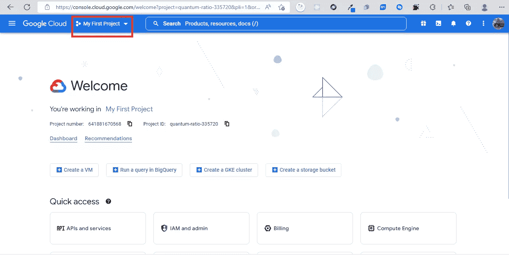
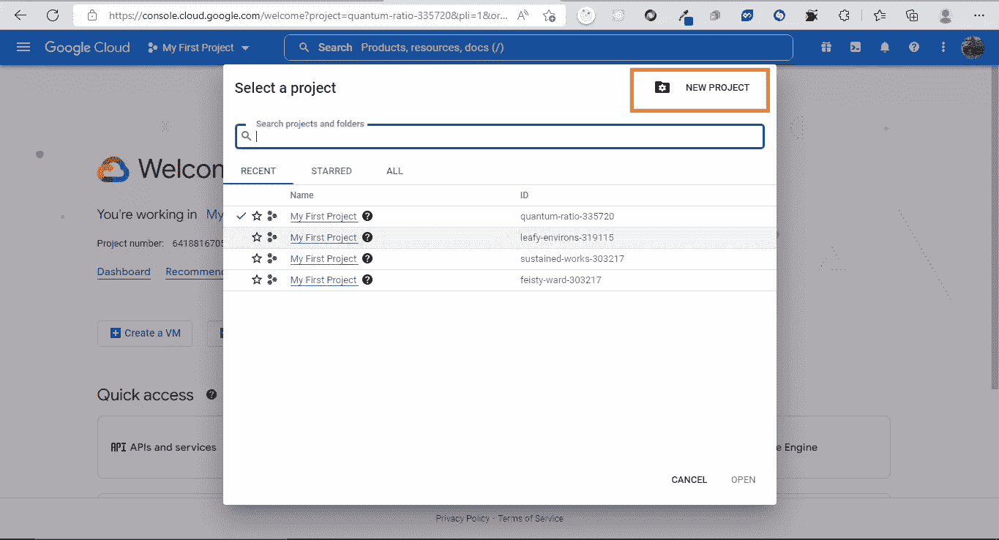
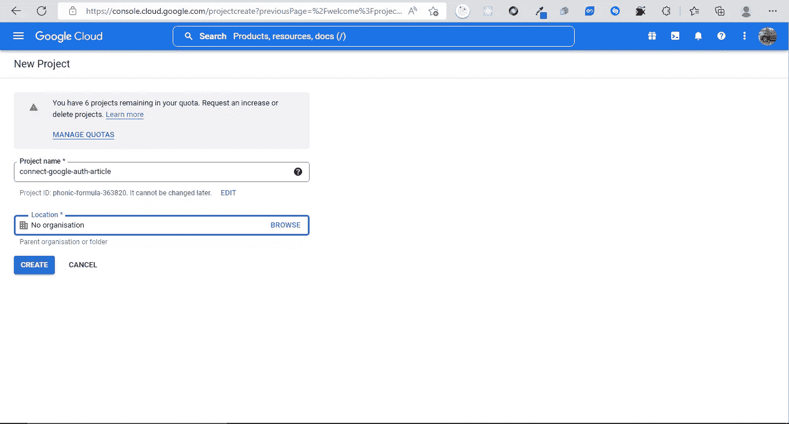
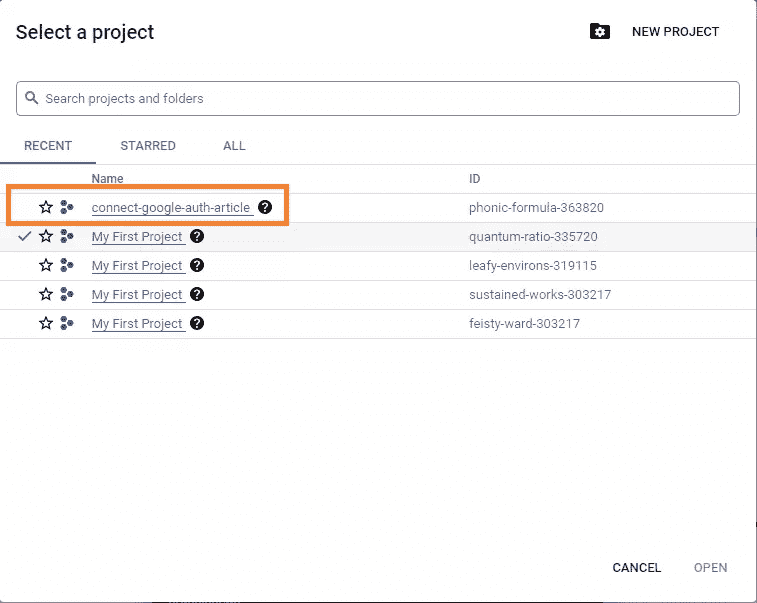
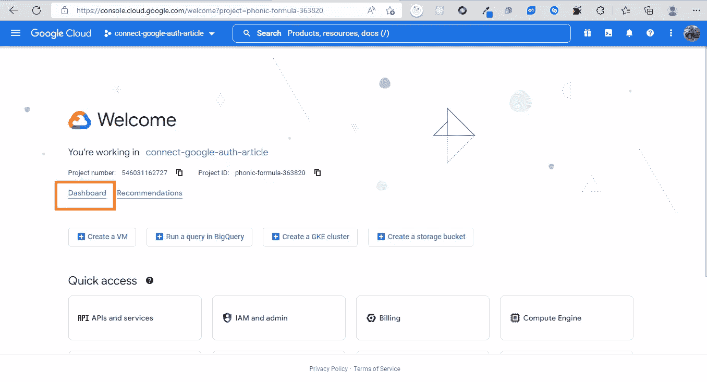
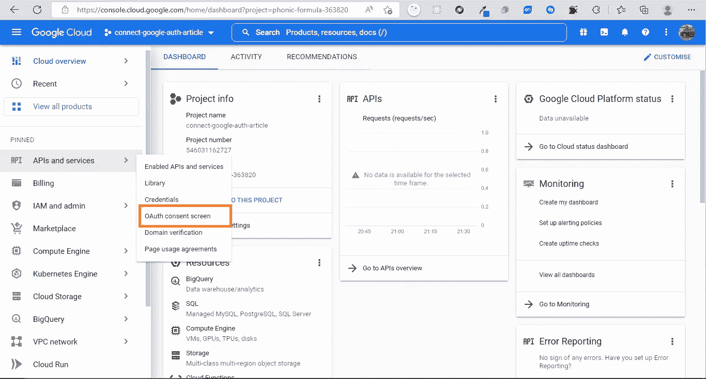
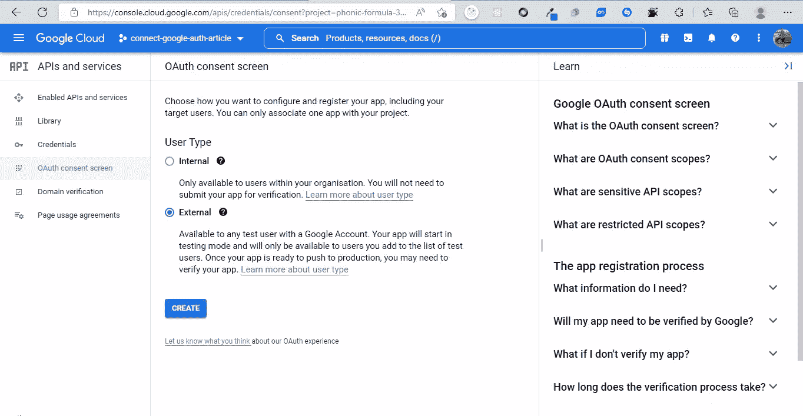
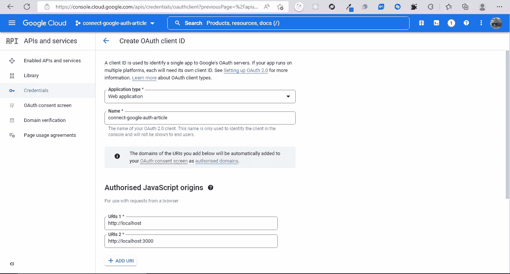
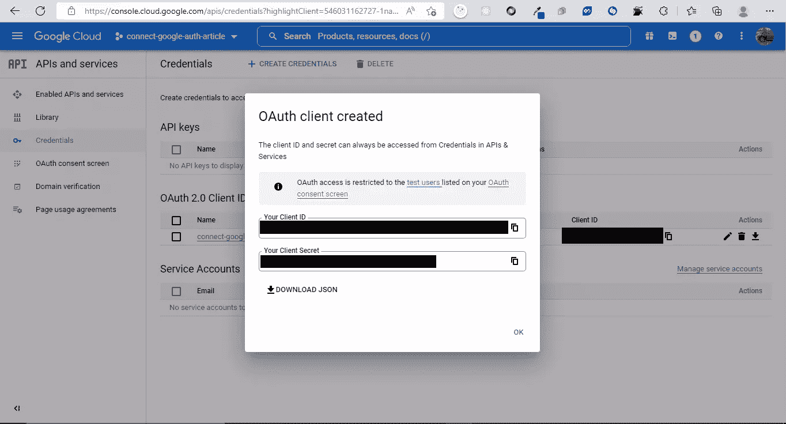

# 如何在 React 和 Express 应用程序中设置新的 Google Auth

> 原文：<https://www.sitepoint.com/google-auth-react-express/>

在本文中，您将了解如何在 React.js 和 Express.js 应用程序中配置新的 Google Auth“使用 Google 登录”按钮。

这种新方法简化了开发人员实现 Google Auth 的方式。它带来了一些显著的优势，例如允许用户查看个人资料图片，以便选择正确的谷歌账户——这可以防止注册错误，并确保当谷歌在 2023 年 3 月 31 日停止使用旧的“[登录谷歌](https://developers.google.com/identity/gsi/web/reference/js-reference)”JavaScript 库时，你的应用程序不会受到影响。

值得注意的是，新创建的客户端 id 现在被禁止使用旧的[平台库](https://apis.google.com/js/platform.js)，并且 Google Auth 必须以这种方式实现。

下面是本文的源代码:[服务器](https://github.com/sitepoint-editors/connect-and-use-new-google-auth-server)和[客户端](https://github.com/sitepoint-editors/connect-and-use-new-google-auth-client)。

## 生成 Google 客户端 ID 和密码

实现 Google 身份验证的第一步是为您正在创建的应用程序生成一个客户端 ID 和密码。

### 第一步

我们首先前往[谷歌控制台](https://console.cloud.google.com/)。



### 第二步

点击上面突出显示的下拉菜单。之后，点击下面突出显示的新项目。



### 第三步

添加项目名称。我选择了`connect-google-auth-article`。



### 第四步

单击步骤 1 中的下拉菜单选择项目。



### 第五步

您看到的下一个屏幕应该类似于下面的示例。然后点击仪表板上的。



### 第六步

下一步是配置 oauth 同意。为此，将鼠标悬停在“API 和服务”上，然后单击“OAuth 同意屏幕”。



### 第七步

选择您想要的同意类型。我选择外部并点击**创建**。



### 第八步

设置同意后，单击凭据以设置您的应用程序详细信息。由于我的应用程序托管在 localhost 上，我设置了如下图所示的细节。



*注意:当您准备好部署您的应用程序时，您应该用您想要使用的域名替换 URI1 和 URI2 比如`https://example.com`。*

### 第九步

成功存储您的凭据后，您可以复制或下载生成的客户端 ID 和密码。



## 设置 React 应用程序

引导 React.js 应用程序最简单的方法是使用 [Create React App](https://create-react-app.dev/) 。

因此，创建一个文件夹，你可以随意命名。然后打开一个终端，运行下面的代码:`npx create-react-app app`。

## 设置 Express 服务器

在根目录中创建另一个文件夹。我给我的取名`server`。然后，打开一个终端，cd 进入服务器:`cd server`。

之后，在通过运行`npm init -y`生成`package.json`之前，创建一个`server.js`文件。接下来，安装以下软件包:

*   Express.js:“一个最小且灵活的 Node.js web 应用程序框架，为 web 和移动应用程序提供了一组健壮的特性”。
*   CORS:一个 Node.js 包，用于提供一个 Connect/Express 中间件，该中间件可用于支持具有各种选项的跨来源资源共享。
*   Dotenv:从`.env`文件加载环境变量的 Node.js 包。
*   Google-auth-library: Google API 的 Node.js 认证客户端库。
*   jsonwebtoken:node . js 的 Jsonwebtoken 实现库。
*   Nodemon:在 Node.js 应用程序开发过程中使用的简单监视器脚本。

您可以运行以下命令来安装上面的软件包:

```
npm install express cors dotenv google-auth-library jsonwebtoken nodemon 
```

之后，通过以下方式配置您的脚本:

```
// package.json
  "scripts": {
    "start": "node server.js",
    "dev": "nodemon server.js"
  }, 
```

您的`package.json`应该是这样的:

```
// package.json
{
  "name": "connect-google-auth-article",
  "version": "1.0.0",
  "description": "",
  "main": "server.js",
  "scripts": {
    "start": "node server.js",
    "dev": "nodemon server.js"
  },
  "dependencies": {
    "cors": "^2.8.5",
    "dotenv": "^16.0.2",
    "express": "^4.18.1",
    "google-auth-library": "^8.5.2",
    "jsonwebtoken": "^8.5.1",
    "nodemon": "^2.0.20"
  },
  "keywords": [],
  "author": "",
  "license": "ISC"
} 
```

之后，在`server.js`中编写以下代码，并运行`npm run dev`来启动您的服务器:

```
// server.js
const express = require("express");
const app = express();
require("dotenv/config"); // configure reading from .env
const cors = require("cors");
const { OAuth2Client } = require("google-auth-library");
const jwt = require("jsonwebtoken");

app.use(
  cors({
    origin: ["http://localhost:3000"],
    methods: "GET,POST,PUT,DELETE,OPTIONS",
  })
);
app.use(express.json());

let DB = [];

app.listen("5152", () => console.log("Server running on port 5152")); 
```

## 准备 React 应用程序

为了准备我们的客户端应用程序，我们将把 Google 脚本添加到我们的`public/index.html`文件的头部:

```
<!-- index.html -->
  <script src="https://accounts.google.com/gsi/client" async defer></script> 
```

我们的`index.html`文件应该是这样的:

```
<!-- index.html -->
<!DOCTYPE html>
<html lang="en">
  <head>
    <meta charset="utf-8" />
    <link rel="icon" href="%PUBLIC_URL%/favicon.ico" />
    <meta name="viewport" content="width=device-width, initial-scale=1" />
    <meta name="theme-color" content="#000000" />
    <meta
      name="description"
      content="Web site created using create-react-app"
    />
    <link rel="apple-touch-icon" href="%PUBLIC_URL%/logo192.png" />
    <link rel="manifest" href="%PUBLIC_URL%/manifest.json" />
    <!-- Google Signup/signin script  -->
    <script src="https://accounts.google.com/gsi/client" async defer></script>
    <title>React App</title>
  </head>
  <body>
    <noscript>You need to enable JavaScript to run this app.</noscript>
    <div id="root"></div>
  </body>
</html> 
```

接下来，我们将在我们的`src` : `screens`和`hooks`中创建两个文件夹。
`screens`文件夹将包含五个文件:`Home.jsx`、`Landing.jsx`、`Login.jsx`、`Signup.jsx`和`index.js`。`hooks`文件夹将只包含一个文件:`useFetch.jsx`。

## 配置客户端路由

我们将用于客户端路由的包是`react-router-dom`。打开一个新的终端，cd 进 app，运行下面的代码:`npm install react-router-dom`。

然后我们可以更新我们的`App.js`,如下所示:

```
// App.js
import React, { useEffect } from "react";
import { useState } from "react";
import { BrowserRouter, Routes, Route, Navigate } from "react-router-dom";

const App = () => {
  const [user, setUser] = useState({});

  return (
    <BrowserRouter>
      <Routes>

      </Routes>
    </BrowserRouter>
  );
};

export default App; 
```

## 创建登录页面

在我们的例子中，登录页面是未经身份验证的用户唯一可用的页面。它将包含注册和登录页面的链接。它看起来会像这样:

```
// Landing.jsx
import React from "react";
import { Link } from "react-router-dom";

const Landing = () => {
  return (
    <>
      <header style={{ textAlign: "center" }}>
        <h1>Welcome to my world</h1>
      </header>
      <main style={{ display: "flex", justifyContent: "center", gap: "2rem" }}>
        <Link
          to="/signup"
          style={{
            textDecoration: "none",
            border: "1px solid gray",
            padding: "0.5rem 1rem",
            backgroundColor: "wheat",
            color: "#333",
          }}
        >
          Sign Up
        </Link>
        <Link
          to="/login"
          style={{
            textDecoration: "none",
            border: "1px solid gray",
            padding: "0.5rem 1rem",
            backgroundColor: "whitesmoke",
            color: "#333",
          }}
        >
          Login
        </Link>
      </main>
    </>
  );
};

export default Landing; 
```

让我们来分解一下:

*   该组件返回由空标记表示的 React 片段元素。
*   该片段包含两个元素:`<header>`和`<main>`。标题返回一个`<h1>`并将文本居中，而主元素从`react-router-dom`返回两个链接并将它们居中。
*   为这两个链接提供了不同的背景颜色以改善 UX。

接下来，我们可以像这样打开`screens/index.js`文件并导出`Landing.jsx`:

```
// index.js
export { default as Landing } from "./Landing"; 
```

之后，我们可以将它导入到`App.js`文件中，在这里我们为它配置一个路由:

```
// App.js
import {  Landing } from "./screens"; 
```

另外:

```
// App.js
<Route
  path="/"
  element={user?.email ? <Navigate to="/home" /> : <Landing />}
  /> 
```

## 创建一个 useFetch 挂钩

React 中的一个**钩子**是一种特殊的函数，允许你使用 React 的功能。要创建一个钩子，打开`hooks/useFetch.jsx`并添加以下代码:

```
// useFetch.jsx
import { useState } from "react";

const useFetch = (url) => {
  const [loading, setLoading] = useState(false);
  const [error, setError] = useState("");

  const handleGoogle = async (response) => {
    console.log(response)
  };
  return { loading, error, handleGoogle };
};

export default useFetch; 
```

## 创建注册页面

打开`screens/Signup.jsx`文件并添加以下代码:

```
// Signup.jsx
import React, { useEffect } from "react";
import { Link } from "react-router-dom";
import useFetch from "../hooks/useFetch";

// https://developers.google.com/identity/gsi/web/reference/js-reference

const SignUp = () => {
  const { handleGoogle, loading, error } = useFetch(
    "http://localhost:5152/signup"
  );

  useEffect(() => {
    /* global google */
    if (window.google) {
      google.accounts.id.initialize({
        client_id: process.env.REACT_APP_GOOGLE_CLIENT_ID,
        callback: handleGoogle,
      });

      google.accounts.id.renderButton(document.getElementById("signUpDiv"), {
        // type: "standard",
        theme: "filled_black",
        // size: "small",
        text: "continue_with",
        shape: "pill",
      });

      // google.accounts.id.prompt()
    }
  }, [handleGoogle]);

  return (
    <>
      <nav style={{ padding: "2rem" }}>
        <Link to="/">Go Back</Link>
      </nav>
      <header style={{ textAlign: "center" }}>
        <h1>Register to continue</h1>
      </header>
      <main
        style={{
          display: "flex",
          justifyContent: "center",
          flexDirection: "column",
          alignItems: "center",
        }}
      >
        {error && <p style={{ color: "red" }}>{error}</p>}
        {loading ? (
          <div>Loading....</div>
        ) : (
          <div id="signUpDiv" data-text="signup_with"></div>
        )}
      </main>
      <footer></footer>
    </>
  );
};

export default SignUp; 
```

让我们来分解一下:

*   我们从`useFetch`钩子中提取可用的状态和功能。我们还传递 URL，我们将调用该 URL 来处理我们对服务器的登录。
*   在`useEffect`中，我们检查 Google 脚本的可用性——由我们放在`public.index.html`文件中的脚本处理。
*   然后，我们使用脚本中可用的`initialize`方法来处理身份验证按钮的功能。
*   我们还传递了一个回调函数，我们已经在`useFetch`钩子中定义了这个函数。

接下来，我们将使用`renderButton`方法在屏幕上显示我们的认证按钮。我们传递的第一个参数是按钮将要嵌入的元素，使用的是`getElementById`方法。我们可以传递的下一个参数用于定制按钮的外观。它具有以下必需的设置:

*   `type`:它接受两个值——标准和图标。

此外，它具有可选设置，包括以下内容:

*   `theme`:按钮主题。它可以接受下列之一:`filled_blue`、`outline`和`filled_black`。
*   `size`:定义按钮的大小。它接受`large`、`medium`和`small`。
*   `text`:定义按钮文本。它接受下列之一:`signin_with`、`signup_with`、`continue_with`和`signin`。
*   `shape`:定义按钮的形状。它接受`rectangular`、`pill`、`circle`或`square`。
*   `logo_alignment`:定义图标在按钮中的放置方式。它可以接受`left`或`center`。
*   `width`:定义按钮的宽度。值得注意的是，最大宽度为 400。

另一个选项是`locale`，用于为特定语言设置。

我们还检查错误的可用性，并显示给用户。我们也检查装载状态。

## 创建登录页面

登录页面类似于注册页面。唯一的区别是服务器 URL 和按钮文本。代码应该如下所示:

```
// Login.jsx
import React, { useEffect } from "react";
import { Link } from "react-router-dom";
import useFetch from "../hooks/useFetch";

// https://developers.google.com/identity/gsi/web/reference/js-reference

const Login = () => {
  const { handleGoogle, loading, error } = useFetch(
    "http://localhost:5152/login"
  );

  useEffect(() => {
    /* global google */
    if (window.google) {
      google.accounts.id.initialize({
        client_id: process.env.REACT_APP_GOOGLE_CLIENT_ID,
        callback: handleGoogle,
      });

      google.accounts.id.renderButton(document.getElementById("loginDiv"), {
        // type: "standard",
        theme: "filled_black",
        // size: "small",
        text: "signin_with",
        shape: "pill",
      });

      // google.accounts.id.prompt()
    }
  }, [handleGoogle]);

  return (
    <>
      <nav style={{ padding: "2rem" }}>
        <Link to="/">Go Back</Link>
      </nav>
      <header style={{ textAlign: "center" }}>
        <h1>Login to continue</h1>
      </header>
      <main
        style={{
          display: "flex",
          justifyContent: "center",
          flexDirection: "column",
          alignItems: "center",
        }}
      >
        {error && <p style={{ color: "red" }}>{error}</p>}
        {loading ? <div>Loading....</div> : <div id="loginDiv"></div>}
      </main>
      <footer></footer>
    </>
  );
};

export default Login; 
```

*注意:`google.accounts.id.prompt()`用于在用户打开你的网页时自动要求用户登录。它可以放在根文件或登录页面中。*

还在根文件夹中创建一个`.env.local`文件，并添加以下内容:

```
REACT_APP_GOOGLE_CLIENT_ID=your client id 
```

接下来，我们从`screens.index.js`文件中导出注册和登录页面:

```
// index.js...
export { default as Login } from "./Login";
export { default as Signup } from "./SignUp"; 
```

之后，我们在`App.js`文件中配置它们的路由:

```
// App.js
import {  Landing, Login, Signup } from "./screens"; 
```

另外:

```
// App.js
<Route
    path="/signup"
    element={user?.email ? <Navigate to="/home" /> : <Signup />}
  />
  <Route
    path="/login"
    element={user?.email ? <Navigate to="/home" /> : <Login />}
  /> 
```

## 更新 useFetch

Google 身份验证返回一个带有 JWT 凭证的响应。然而，为了验证其真实性并为用户创建一个会话，我们将对服务器进行后续调用。我们应该更新我们的`hooks/useFetch`文件，如下所示:

```
// useFetch.jsx
  const handleGoogle = async (response) => {
    setLoading(true);
    fetch(url, {
      method: "POST",
      headers: {
        "Content-Type": "application/json",
      },

      body: JSON.stringify({ credential: response.credential }),
    })
      .then((res) => {
        setLoading(false);

        return res.json();
      })
      .then((data) => {
        if (data?.user) {
          localStorage.setItem("user", JSON.stringify(data?.user));
          window.location.reload();
        }

        throw new Error(data?.message || data);
      })
      .catch((error) => {
        setError(error?.message);
      });
  }; 
```

让我们来分解一下:

*   我们的回调函数接受作为响应传入的来自 Google authentication 的参数。
*   然后我们使用`fetch`向服务器发出请求。
*   当我们得到适当的响应时，我们将用户以 JSON 格式存储到`localStorage`中。

## 创建注册和登录路线

打开`server.js`文件。首先，我们将创建一个函数来验证我们将收到的凭证:

```
// server.js
/**
 *  This function is used verify a google account
 */
const GOOGLE_CLIENT_ID = process.env.GOOGLE_CLIENT_ID;
const client = new OAuth2Client(GOOGLE_CLIENT_ID);

async function verifyGoogleToken(token) {
  try {
    const ticket = await client.verifyIdToken({
      idToken: token,
      audience: GOOGLE_CLIENT_ID,
    });
    return { payload: ticket.getPayload() };
  } catch (error) {
    return { error: "Invalid user detected. Please try again" };
  }
} 
```

在服务器的根文件夹中创建一个`.env`文件，并添加以下内容:

```
# .env
GOOGLE_CLIENT_ID=your client id
JWT_SECRET=mySecret 
```

接下来，创建注册路线:

```
// server.js
app.post("/signup", async (req, res) => {
  try {
    // console.log({ verified: verifyGoogleToken(req.body.credential) });
    if (req.body.credential) {
      const verificationResponse = await verifyGoogleToken(req.body.credential);

      if (verificationResponse.error) {
        return res.status(400).json({
          message: verificationResponse.error,
        });
      }

      const profile = verificationResponse?.payload;

      DB.push(profile);

      res.status(201).json({
        message: "Signup was successful",
        user: {
          firstName: profile?.given_name,
          lastName: profile?.family_name,
          picture: profile?.picture,
          email: profile?.email,
          token: jwt.sign({ email: profile?.email }, "myScret", {
            expiresIn: "1d",
          }),
        },
      });
    }
  } catch (error) {
    res.status(500).json({
      message: "An error occurred. Registration failed.",
    });
  }
}); 
```

还要创建登录路由:

```
// server.js
app.post("/login", async (req, res) => {
  try {
    if (req.body.credential) {
      const verificationResponse = await verifyGoogleToken(req.body.credential);
      if (verificationResponse.error) {
        return res.status(400).json({
          message: verificationResponse.error,
        });
      }

      const profile = verificationResponse?.payload;

      const existsInDB = DB.find((person) => person?.email === profile?.email);

      if (!existsInDB) {
        return res.status(400).json({
          message: "You are not registered. Please sign up",
        });
      }

      res.status(201).json({
        message: "Login was successful",
        user: {
          firstName: profile?.given_name,
          lastName: profile?.family_name,
          picture: profile?.picture,
          email: profile?.email,
          token: jwt.sign({ email: profile?.email }, process.env.JWT_SECRET, {
            expiresIn: "1d",
          }),
        },
      });
    }
  } catch (error) {
    res.status(500).json({
      message: error?.message || error,
    });
  }
}); 
```

让我们来分解一下:

*   在路由中，我们首先检查凭证是否被传递到主体中。然后，我们尝试验证凭证。如果有错误，我们会以 JSON 格式将其发送回客户端。
*   在注册过程中，我们将用户的配置文件存储在数据库数组中，并发送一封由 JWT 签名的电子邮件作为令牌，以此作为成功响应。
*   在登录路径中，我们检查用户是否存在于数据库中，如果不存在，就抛出一个错误。如果它存在，我们还会发送一封 JWT 签名的电子邮件作为带有其他参数的令牌，作为成功响应。

## 更新 App.js

在客户端应用程序的`App.js`中，我们将使用以下代码更新文件以检查`local storage`中的用户:

```
// App.js
 useEffect(() => {
    const theUser = localStorage.getItem("user");

    if (theUser && !theUser.includes("undefined")) {
      setUser(JSON.parse(theUser));
    }
  }, []); 
```

## 创建 Home.jsx

`Home.jsx`文件是用户成功注册或登录后可用的页面:

```
// Home.jsx
import React from "react";

const Home = ({ user }) => {
  const logout = () => {
    localStorage.removeItem("user");
    window.location.reload();
  };
  return (
    <div style={{ textAlign: "center", margin: "3rem" }}>
      <h1>Dear {user?.email}</h1>

      <p>
        You are viewing this page because you are logged in or you just signed
        up
      </p>

      <div>
        <button
          onClick={logout}
          style={{
            color: "red",
            border: "1px solid gray",
            backgroundColor: "white",
            padding: "0.5rem 1rem",
            cursor: "pointer",
          }}
        >
          Logout
        </button>
      </div>
    </div>
  );
};

export default Home; 
```

接下来，我们将从`screens/index.js`文件中导出它，如下所示:

```
export { default as Home } from "./Home"; 
```

之后，我们将在`App.js`中导入并设置其路线:

```
import { Home, Landing, Login, Signup } from "./screens"; 
```

另外:

```
<Route
    path="/home"
    element={user?.email ? <Home user={user} /> : <Navigate to="/" />}
  /> 
```

## 结论

恭喜你！我们已经设置了新的谷歌认证。

这里再次提供了源代码:[服务器](https://github.com/sitepoint-editors/connect-and-use-new-google-auth-server)和[客户端](https://github.com/sitepoint-editors/connect-and-use-new-google-auth-client)。

**相关阅读:**

*   [使用 Express Generator 在几分钟内创建新的 Express.js 应用程序](https://www.sitepoint.com/create-new-express-js-apps-with-express-generator/)
*   [node . js Express 的 5 个简单性能调整](https://www.sitepoint.com/5-easy-performance-tweaks-node-js-express/)
*   [使用平均堆栈进行用户认证](https://www.sitepoint.com/user-authentication-mean-stack/)
*   [使用 Node.js 中的 Passport 进行本地认证](https://www.sitepoint.com/local-authentication-using-passport-node-js/)

## 分享这篇文章