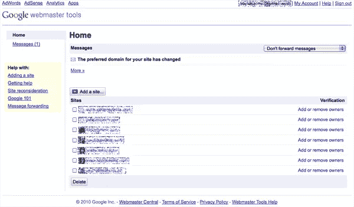
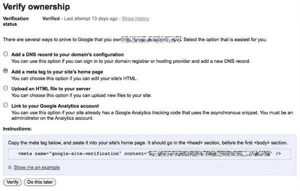
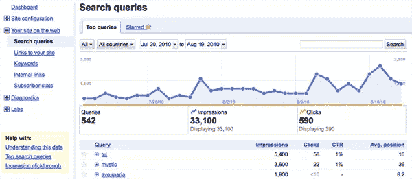
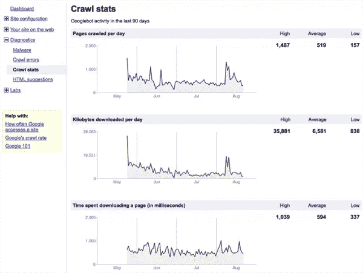
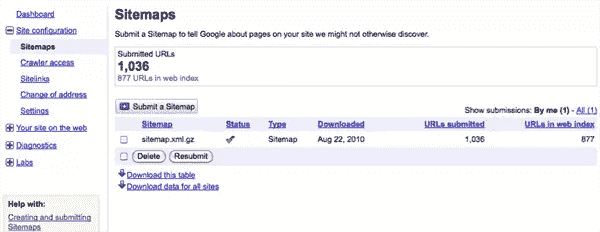
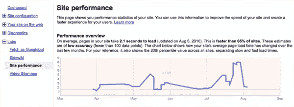

# 充分利用谷歌网站管理员工具

> 原文：<https://www.sitepoint.com/google-webmaster-tools/>

本文节选自我们最新发布的[*SEO 商业指南*](https://www.sitepoint.com/kits/seo-business-guide/) 。这篇文章的整个章节，以及另外两个章节，可以作为[的免费 PDF 下载](https://www.sitepoint.com/kits/seo-business-guide/samplechapters.php)。如果你有兴趣了解更多关于如何进行有效的和最佳实践的 SEO，这是非常值得一试的。Google 和 Bing 都提供了一个网站管理员仪表板，通过仪表板可以洞察任何已经注册和验证的网站上搜索引擎的活动。 [ [1](#ftn.id2754601) ] 这些仪表板提供了许多工具和对数据的洞察，这些数据无法通过任何其他方法收集。它们提供了了解搜索引擎如何“看到”您的站点的唯一方法，也是识别您的站点的关键爬行、索引和排名问题的唯一方法。重要的是要注意到，搜索引擎并不要求提供他们所报告的全部、完整或准确的数据。考虑到这一点，您应该只使用这些工具，并与您用来跟踪搜索和网站性能的其他方法结合使用，如网站分析和 SERPs(搜索引擎结果页面)本身。对于那些管理多个网站的人来说，一个显著的好处是你可以在每个仪表板上添加多个网站；这允许您保持登录状态，并在您的站点组合之间切换以查看数据。图 1 中的[“谷歌网站管理员工具主屏幕”](#fig_webmastertoolshome "Figure 1. The Google Webmaster Tools home screen")显示了一个谷歌网站管理员工具账户，里面有各种各样的网站。

**图一。谷歌网站管理员工具主屏幕**

## 开始使用

在你开始查看搜索引擎关于你的网站的数据之前，你必须首先向他们注册网站，并核实所有权。这通常是通过将一个小文件上传到 web 服务器的根目录，或者在您的主页上添加一段代码来完成的。Google 还允许您通过向域配置添加 DNS(域名服务器)记录，或通过与 Google Analytics 管理员帐户链接来验证网站。您可以在[图 2“网站管理员工具验证”](#fig_wbmst_verify "Figure 2. Webmaster Tools verification")中看到所有可用的验证选项。谷歌的网站管理员工具可以在 https://www.google.com/webmasters/tools/的[找到，必应的可以在 http://www.bing.com/webmaster/的](https://www.google.com/webmasters/tools/)[找到。](http://www.bing.com/webmaster/)

**图二。站长工具验证**

## 概述

GA_googleFillSlot(“Articles_6_300x250”);

网站管理员工具的主要任务是提供关于爬行和索引的信息。他们提供的信息很少的一个搜索方面是排名。由于谷歌的网站管理员工具是这一领域的主导者，我们将集中在它的工具集上进行解释，但是必应的仪表板提供了非常相似的见解。那么，用网站管理员工具注册你的网站有什么好处呢？Google 的网站管理员工具面板分为四个部分，所以我们将总结每个部分包含的内容。

### 你在网络上的站点

这个区域提供了关于人们和搜索引擎如何找到并导航到你的内容(链接和关键词)的数据。

Search queries This lists the most popular searches for which your site appeared in Google results, as well as impressions and clicks that were made from those results to your site. Recent improvements in this section include the ability to see this represented in a graph over time, with the average position in the rankings, and specific information on each keyword or phrase, as shown in [Figure 3, “Search queries graphed over time”](#fig_wmt_searchqueries "Figure 3. Search queries graphed over time").

**图 3。随着时间推移绘制的搜索查询**

*如何使用:* 与你的分析指标和广告词(如果适用)一起使用，以确定哪些术语为你的网站带来了最多的流量。它会显示你是否瞄准了正确的术语，而点击率会显示你的搜索结果是否如预期的那样。

Links to your site.

This shows what pages have the most backlinks, and allows you to view the sites/pages that contain the link and what anchor text was used.

 *How to use:* While most backlinks will be to your home page, you might be unaware of what terms othersites are using to link to you. This will have a direct impact on what terms your site will rank for; identifying the volume of backlinks you have for each of your pages will give you the ability to measure your link-building efforts.

Keywords

This lists the most common keywords found when crawling your site, and the frequency of those terms. The data indicates which keywords Google believes your site to be about, based on their presence in your content. *How to use:* This will reveal if your site has been compromised—if a spam word is showing—or if any words in your content are gaining unwanted prominence. Conversely, if particular words you’re targeting *aren’t*showing as expected, then you can take steps to increase their prominence.  Internal links

This shows how you link to your own content, by counting and displaying which of your pages link to other pageswithin your site.*How to use:* Deeper content is often harder for search engines to find. If the targeted page is showing a low number of internal links, you can take steps to add additional ones.

### 诊断

这个区域概述了搜索引擎在搜索你的网站时可能遇到的问题。

Crawl errors

This shows what pages caused crawling issues: from page not found to server errors that were encountered, as well as what page linked to the error-causing page, and when it occurred. *How to use:* Server errors such as 500 and 503 should be immediately tested to see if they’re still occurring, as they normally only show when your server is unavailable or having issues. 404 (page not found) errors are often caused by the page’s address having been changed without any redirection applied. You should be aiming to have almost no 404 results; in those cases where they’re inevitable (for example, external sites might—for reasons unknown—link to a page that doesn’t exist), your 404 page should be designed to ensure that visitors stay on your site. You can do this by including elements such as a site search or links to popular content.

Crawl stats

This displays three handy graphs, shown in [Figure 4, “Crawling statistics”](#fig_wmtcrawlstats "Figure 4. Crawling statistics"): how many pages were crawled per day, the amount of data downloaded, and the time spent downloading. 

**图 4。抓取统计数据**

*用法:* 监控这些图表很重要，因为它们显示了搜索引擎随时间的活动。抓取的页面数量或下载的数据量的任何突然下降都可能表明您的网站最近的更改已经产生了负面影响。花费在下载上的时间可能表明服务器性能有问题，可能需要纠正。

HTML suggestions

This lists issues found relating to your description `meta` and `title` tags, highlighting those that are missing or causing duplicate content issues. *How to use:* If you have reports of a large number of duplicate titles and/or meta descriptions, it means that Google is having trouble establishing a clear picture of what your pages are about. You also run the risk of search engines viewing your pages as duplicate content and filtering them from the search results. You should be using this tool to identify which pages need to have the titles and descriptions rewritten.

### 站点配置

网站管理员工具的另一部分是你的站点配置。这让你可以通知 Google 你的站点地图在哪里，监控你的站点的`robots.txt`文件，控制站点链接的显示方式——如果适用的话，还可以调整建议的抓取速率(小心使用最后一个)。这个部分最大的好处可能是网站地图 和爬虫访问功能。通过提交一个站点地图——无论是 XML 还是文本文件格式，或者使用 RSS/Atom feeds——你可以最清楚地了解你的内容有多少被索引；仪表板报告了索引 URL 的实际数量，您可以将其与您的站点地图中提交的数量进行比较，如图[图 5，“Google 网站管理员工具的站点地图功能”](#fig_wmtsitemaps "Figure 5. Google Webmaster Tools’ Sitemaps functionality")所示。缺点是谷歌网站管理员工具不能告诉你哪些网址被索引，哪些没有。

**图 5。谷歌网站管理员工具的网站地图功能**

爬虫访问功能使你能够请求从索引中删除一个 URL 但是这有一些严格的要求。隐藏在站点配置部分的设置部分的是参数处理功能。这允许您限制爬虫对麻烦的查询字符串参数的访问，这些参数可能会给您带来重复内容问题，或者旨在提供您不想让搜索引擎感兴趣的特定功能；例如，页面的打印版本。

### 实验室

虽然这些是核心的主要报告，谷歌网站管理员工具还提供了一个实验室部分，在那里可以获得实验性的新功能。例如，你可以报告一个特定的页面是如何被谷歌的蜘蛛(被称为 Googlebot)抓取的，或者绘制一个页面加载所需的时间——如图 6[“网站性能概览”](#fig_wmtperformance "Figure 6. Site performance overview")所示。

**图 6。现场性能概述**

## 大局

搜索引擎提供的网站管理员工具提供了其他任何第三方方法无法提供的数据和见解，当与您网站的分析工具(以及您可能使用的任何排名检查和跟踪工具)结合在一起时，您将在搜索引擎中对您网站的表现有一个最全面的了解。在这个问题上，我们只是触及了皮毛；引擎本身提供了大量的信息，Google 和 Bing 都提供了一个社区论坛，在那里你可以提出支持资源中没有的问题。本文摘自我们最新发布的[*SEO 商业指南*](https://www.sitepoint.com/kits/seo-business-guide/) 。整个第 2 章，*最佳 SEO 实践*，包括本文中的内容，可以作为免费的 PDF 下载[与其他两章一起获得。如果你喜欢你在这里看到的，一定要去看看！](https://www.sitepoint.com/kits/seo-business-guide/samplechapters.php)

* * *

[[1](#id2754601)] Yahoo also offers a webmaster dashboard, but with the bulk ofYahoo’s search services being taken over by Microsoft Bing, we’llconcentrate on the two largest active webmaster dashboards.

## 分享这篇文章