# Ruby 中的图形算法

> 原文：<https://www.sitepoint.com/graph-algorithms-ruby/>

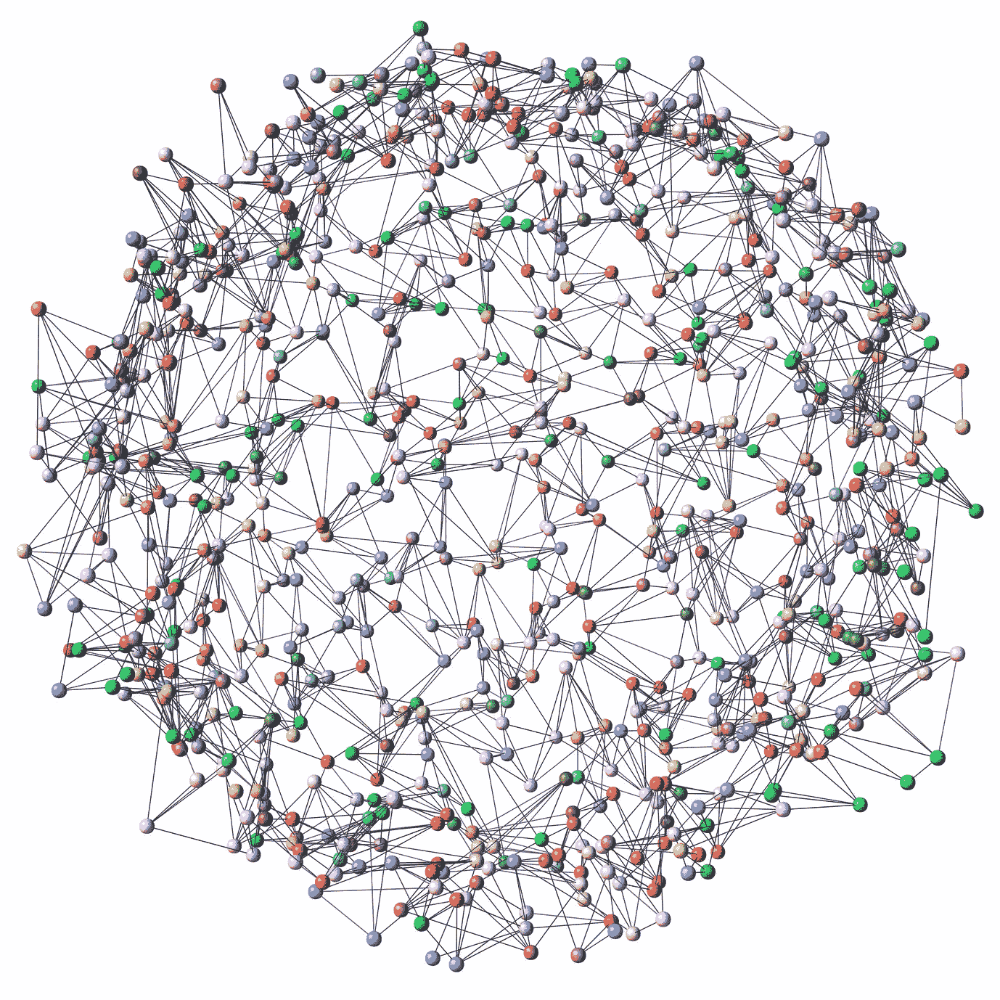

许多 ruby 爱好者都专注于软件工程的一个方面:web 开发。这不一定是件坏事。网络正以令人难以置信的速度增长，绝对是一个值得拥有专业知识的领域(无论是金钱还是其他方面)。然而，这并不意味着 Ruby 对于 web 开发来说是好的。

标准的算法是计算机科学的基础，有一点这方面的经验是非常有益的。在本文中，我们将介绍一些最基本的图算法:深度优先搜索和广度优先搜索。我们将看看它们背后的思想，它们在应用程序中的位置，以及它们在 Ruby 中的实现。

## 术语

在我们真正开始研究算法本身之前，我们需要了解一点图论。如果你以前学过任何形式的图论，你可以安全地跳过这一节。基本上，*图*是一组节点，它们之间有一些边(例如，节点代表人，边代表人之间的关系)。图论的特别之处在于，我们并不特别关心节点和边的欧几里德几何结构。换句话说，我们不在乎它们形成的角度。相反，我们关心这些边缘创造的“关系”。这种东西现在有点乱，但是一旦我们看一些具体的例子，它就会变得清晰:

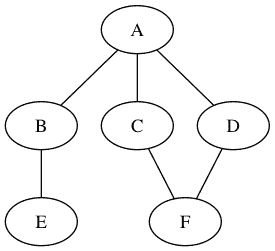

好了，这里:我们有一个图表。但是，如果我们想要一个可以表示“A 与 B 相关，但 B 与 A 不相关”这一思想的结构呢？我们可以在图中有*条有向*边。

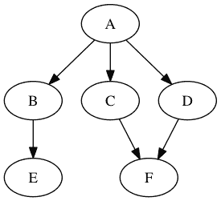

现在，每段关系都有一个方向。当然，我们可以从无向图中创建一个有向图，用两条方向相反的有向边替换每条无向边。

## 根本问题

假设我们给定一个有向图(G)和两个节点:(S)和(T)(通常称为源和终端)。我们想弄清楚(S) (T)之间是否有路径。我们能沿着从(S)到(T)的边(正确的方向)到达(T)吗？我们还对完成这条路径需要遍历哪些节点感兴趣。

这个问题有两种不同的解决方案:深度优先搜索和广度优先搜索。给定名称和一点想象力，很容易猜出这两种算法之间的区别。

## 邻接矩阵

在我们进入每个算法的细节之前，让我们看一下如何表示一个图。存储图形最简单的方法可能是邻接矩阵。假设我们有一个有(V)个节点的图。如果存在从节点[i]到节点[j]的边，那么我们将 a (1)放在行(I)和行(j)中。如果没有这样的边，那么我们将 a (0)放在行(I)和行(j)中。邻接表是表示图的另一种方式。对于每个节点(I ),我们设置包含对(I)有边的节点的引用的列表。

这两种方法有什么区别？假设我们有一个有 1000 个节点但只有一条边的图。对于邻接矩阵表示，我们必须分配一个(1000*1000)元素数组来表示图形。另一方面，好的邻接表表示不需要表示所有节点的输出。然而，邻接表也有自己的缺点。对于链表的传统实现，检查给定的边是否存在需要线性时间。例如，如果我们想检查 edge (4，6)是否存在，那么我们必须查看 4 的输出列表，然后循环遍历它(它可能包含图中的所有节点)以检查 6 是否是该列表的一部分。

另一方面，检查邻接矩阵中的第 4 行和第 6 列是否为 1 花费了恒定量的时间，而不管图的结构如何。所以，如果你有一个稀疏的图(即很多节点，很少的边)，使用邻接表。如果你有一个密集的图，并且正在做大量的边的存在性检查，使用邻接矩阵。

对于本文的其余部分，我们将主要使用邻接矩阵表示法，因为推理起来稍微简单一些。

## 深度优先搜索

我们再来看看根本问题。基本上，我们试图弄清楚我们是否能从另一个(些)节点到达某个(T)节点。想象一只老鼠从节点(S)开始，一块奶酪从节点(T)开始。鼠标可以沿着它看到的第一条边开始寻找(T)。它在它到达的每个节点都这样做，直到它遇到一个不能再前进的节点(仍然没有找到(T))。然后，它将回溯到它有另一条边的最后一个节点，重复这个过程。从某种意义上来说，鼠标在返回之前会尽可能地“深入”图形。我们将这种算法称为*深度优先搜索*。

为了构建算法，我们需要某种方法来跟踪当时间到来时回溯到哪个节点。为了方便起见，我们使用一种叫做“堆栈”的数据结构。放置在堆栈上的第一个项目是将离开堆栈的第一个项目。这就是为什么我们称栈为 LIFO(后进先出)结构——“后进”元素是“先出”元素。鼠标在网络中穿行时必须保存一堆节点。每次到达一个节点，鼠标都将所有可能的输出(即子节点)添加到堆栈中。然后，它从堆栈中取出第一个元素(称为“弹出”操作)并移动到该节点。在我们进入死胡同的情况下(即可能的输出集是空的)，那么“弹出”操作将返回我们可以回溯的节点。

让我们看一个深度优先搜索的例子:

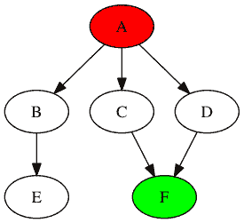

在该图中，我们将 A 作为源节点(即(S))，将 F 作为终端节点(即(T))。让我们给图表添加一点颜色，使搜索过程更加清晰。作为堆栈一部分的所有节点都是蓝色的，位于堆栈顶部(即“pop”旁边)的节点是紫色的。所以，现在:


鼠标将从堆栈中弹出“A ”,并以任意顺序添加输出:

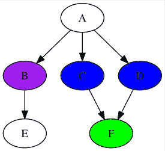

然后，鼠标移动到节点“B”(即，将它弹出堆栈)，并将其唯一的输出添加到堆栈中:

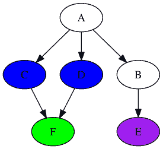

啊哦。我们碰到了一个没有输出节点的节点。幸运的是，这没有问题。我们只需弹出“B ”,使“D”成为堆栈的顶部:

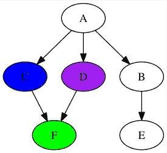

从那里，它只是一个跳跃到我们正在寻找的节点！下面是最终结果:


你可能想知道如果节点 F 不能从节点 a 到达会发生什么。简单:在某些时候，我们会有一个完全空的栈。一旦我们到达那个点，我们知道我们已经穷尽了从节点 a 开始的所有可能的路径。

## Ruby 中的深度优先搜索

了解了深度优先搜索(即 DFS)的工作原理后，我们来看看 Ruby 的实现:

```
def depth_first_search(adj_matrix, source_index, end_index)
  node_stack = [source_index]

  loop do
    curr_node = node_stack.pop
    return false if curr_node == nil
    return true if curr_node == end_index

    children = (0..adj_matrix.length-1).to_a.select do |i| 
      adj_matrix[curr_node][i] == 1
    end

    node_stack = node_stack + children
  end
end
```

如果您按照示例进行操作，实现应该会很自然。让我们一步一步地分解它。首先，方法定义非常重要:

```
depth_first_search(adj_matrix, source_index, end_index)
```

我们必须传入`adj_matrix`，它是图的邻接矩阵表示，在 Ruby 中实现为数组的数组。我们还提供了邻接矩阵中源节点和终端节点的索引(`source_index`和`end_index`)。

```
node_stack = [source_index]
```

堆栈从源节点开始。这可以认为是鼠标的起点。虽然这里我们使用标准的 Ruby 数组作为堆栈，但是只要实现提供了“推入”和“弹出”元素的方法(并且这些操作按照我们期望的方式运行)，堆栈实现就无关紧要。

```
loop do
...
end
```

代码使用一个永久循环，然后在我们遇到某些情况时中断。

```
curr_node = node_stack.pop
return false if curr_node == nil
return true if curr_node == end_index
```

这里，我们从堆栈中弹出当前节点，如果堆栈是空的或者它是我们正在寻找的节点，我们就跳出循环。

```
children = (0..adj_matrix.length-1).to_a.select do |i| 
  adj_matrix[curr_node][i] == 1
end
```

这部分有点罗嗦，但是目标很简单。从邻接矩阵中，通过检查邻接矩阵中的 1 来挑选`curr_node`的“孩子”。

```
node_stack = node_stack + children
```

获取这些节点，并将它们推到堆栈的末尾。完美！如果您想尝试一下这个实现:

```
adj_matrix = [
  [0, 0, 1, 0, 1, 0],
  [0, 0, 1, 0, 0, 1],
  [0, 0, 0, 1, 0, 0],
  [0, 0, 0, 0, 1, 1],
  [0, 0, 0, 0, 0, 0],
  [0, 0, 0, 0, 0, 0]
]

p depth_first_search(adj_matrix, 0, 4)
```

这是深度优先搜索的快速实现。在实践中，您可能希望对“节点”有一个更复杂的定义，因为它们很少只是索引，而且通常还附有数据。但是，深度优先搜索的一般概念保持不变。注意，我们的实现只适用于非循环图，即没有循环的图。如果我们还想对循环图进行操作，我们需要跟踪我们是否已经访问了一个节点。这是一个非常简单的练习；尝试实现它！

## 横向优先搜索

如果我们有一个图，其中有一个 10，000 节点长的路径，包含一堆我们不关心的节点，会怎么样？然后，使用深度优先搜索可能会毫无理由地遍历这条巨大的路径。这就是广度优先搜索的用武之地。我们不是沿着一条路走下去，而是将我们的搜索“展开”到图表的每一层。想象一下，拿一壶水，把它倒进源节点。如果边是管道，水应该流过图的每个“层”(由到源节点的距离确定)，并可能到达终端节点。

让我们回到我们的鼠标，但这一次，我们将使用广度优先搜索。我们毛茸茸的朋友将从一个节点开始，并将该节点的所有子节点放入一个列表中。鼠标将选择列表中“最旧”的元素，而不是移动到最近插入的元素。看一看一个例子将使这个概念变得清晰(同样，在图中:蓝色表示列表的一部分，紫色表示要从列表中删除的下一个元素，绿色表示终端)。我们以与深度优先搜索相同的方式开始:

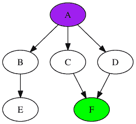

将子元素添加到列表中，但是鼠标现在将移动到首先插入的元素:

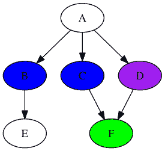

现在，有趣的部分来了。我们将“F”添加到列表中，但是不要立即处理它，因为“C”和“B”已经在前面添加了。所以，这是状态:

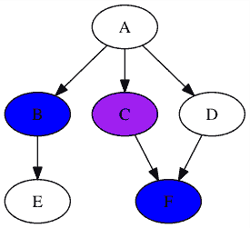

去掉“C”，然后跳到“B”。区别就在这里:

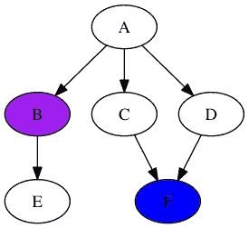

最后，当我们跳回“F”时，老鼠可以得到奶酪:

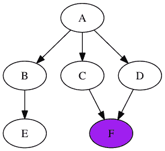

## Ruby 中的广度优先搜索

我们一直使用的结构(即“列表”)被称为“队列”。您可能还记得，堆栈就是 LIFO(后进先出)。另一方面，队列是一种 FIFO 结构(先进先出)。在我们的 DFS 实现中，只需用队列替换堆栈，它现在就是 BFS 的一个实现:

```
def breadth_first_search(adj_matrix, source_index, end_index)
  node_queue = [source_index]

  loop do
    curr_node = node_queue.pop

    return false if curr_node == nil
    return true if curr_node == end_index

    children = (0..adj_matrix.length-1).to_a.select do |i| 
      adj_matrix[curr_node][i] == 1
    end

    node_queue = children + node_queue
  end
end
```

这段代码只有两个重要的部分。

```
curr_node = node_queue.pop
```

注意，我们仍然在使用`pop`方法。像前面一样，这将返回`node_queue`的最后一个元素，并将其从数组中移除。但是，它不会像对堆栈那样给出最近插入的元素，因为这一行:

```
node_queue = children + node_queue
```

因为我们将元素添加到列表的开头，所以从列表的末尾取出一个元素会给我们首先插入的元素，而不是最后插入的元素。因此，稍微改变我们对节点列表的管理就会改变队列的行为。

通常，你会想把这类东西包装在一个类或模块中，并给它`enqueue`和`dequeue`方法来澄清我们使用`node_queue`作为队列的事实。这里，再一次，广度优先搜索只有在我们的图中没有循环时才有效。要包含带圈的图，我们需要跟踪我们已经“发现”的节点。修改实现来做到这一点非常简单，也是推荐的做法。

## 结论

我希望你喜欢这篇快速浏览 Ruby 中最基本的图形算法的文章。当然，即使有了这些，我们还留下了许多未覆盖的区域。例如，如果我们不只是检查我们是否能从源到达一个节点，而是想要从源到那个节点的路径呢？如果我们想要最短的路径呢？事实证明，只要稍加努力，DFS 和 BFS 就可以扩展成各种有用的算法。在下一篇算法文章中，我们将看看这些不同的“扩展”

## 分享这篇文章