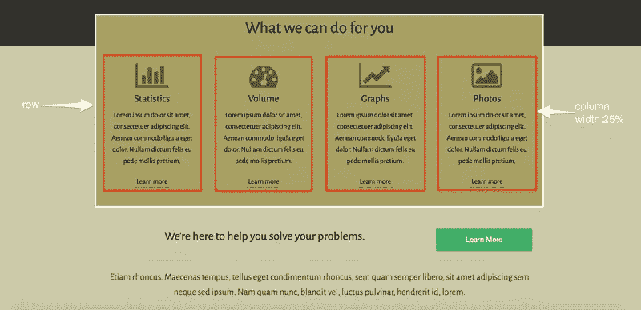
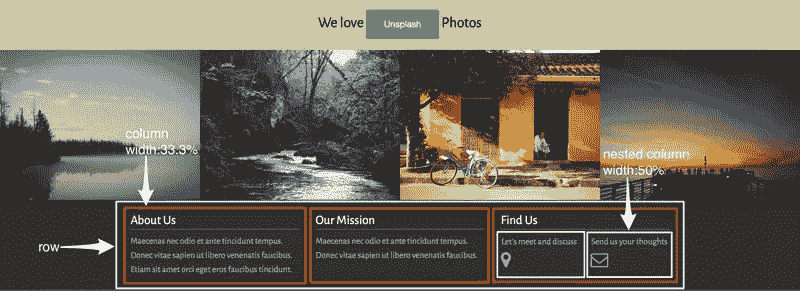

# 网格系统比较:Bootstrap 3 与 Foundation 5

> 原文：<https://www.sitepoint.com/grid-system-comparison-bootstrap-vs-foundation/>

[Bootstrap](http://getbootstrap.com/) 和 [Foundation](http://foundation.zurb.com/) 是我最喜欢的两个前端框架，尤其是用于快速网站原型制作。两者都有现成的组件，可以加快我的工作流程。除了他们的小差异，他们的大多数基本特征看起来和我很相似。

在本文中，我将介绍网格的基础知识。首先，我将向您展示它们的结构，描述它们的关键组件，以及它们如何根据屏幕大小而有所不同。然后，我将通过一个真实的例子来帮助你将学到的知识应用到实践中。

我们开始吧！

## 比较媒体查询

在分析 Bootstrap 和 Foundation 的网格结构之前，让我们先看看它们都为响应式布局提供的断点。这些用于设置每个框架提供的可用网格的数量。

Bootstrap 指定了四个基于像素的媒体查询断点。下表显示了它们:

| 屏幕 | Viewport Size | 集装箱宽度 | 类别前缀 |
| --- | --- | --- | --- |
| 超小屏幕 | < 768 像素 | 汽车 | `.col-xs-*` |
| 小屏幕 | ≥768 像素 | 750 像素 | `.col-sm-*` |
| 中等屏幕 | ≥992 像素 | 970 像素 | `.col-md-*` |
| 大屏幕 | ≥1200 像素 | 1170 像素 | `.col-lg-*` |

基础包括五个基于 em 的媒体查询。下表显示了这些情况:

| 屏幕 | Viewport Size | 类别前缀(默认网格) | 类别前缀(块网格) |
| --- | --- | --- | --- |
| 小屏幕 | ≤ 40em (640px) | `.small-*` `.column(s)` | `.small-block-grid-*` |
| 中等屏幕 | ≥40 063 em(641 px) | `.medium-*` `.column(s)` | `.medium-block-grid-*` |
| 大屏幕 | ≥64 063 em(1025 px) | `.large-*` `.column(s)` | `.large-block-grid-*` |
| x 大屏幕 | ≥90 063 em(1441 px) | 未激活 | 未激活 |
| xxl 大屏幕 | ≥120 063 em(1921 px) | 未激活 | 未激活 |

为了让你了解这些媒体查询是如何工作的，我建议你看一看 [Bootstrap 演示](http://codepen.io/SitePoint/pen/EageYR)和相关的[基金会演示](http://codepen.io/SitePoint/pen/ByLOaj)。但是如果你仍然有一点困惑，接下来的部分将会澄清一些事情。

*注意:默认情况下，基金会的 XLarge 和 XXLarge 屏幕的网格是禁用的。如果您想使用它们，您必须“取消注释”并将`$include-xl-html-grid-classes`和`$include-xl-html-block-grid-classes`变量的值设置为`true`。你可以在`_settings.scss`部分找到那些变量。*

## 网架结构

Bootstrap 和 Foundation 都提供了一个移动优先的 12 列网格，由行和列组成。列嵌套在行内。每行最多可扩展到 12 个。行也可以嵌套在列中。


这两个框架都有许多预定义的类，可以用来设置列的大小。如上所述，Bootstrap 包括四个媒体查询断点，Foundation 有五个。对于每个网格，有一个不同的类前缀可用于设置列的大小(参见两个表)。

Bootstrap 的网格还需要一个行包装元素。这应该有一个`container`或`container-fluid`的类。具有`container`类的元素具有固定的宽度，该宽度根据视口而变化(参见上面的第一个表)，而具有`container-fluid`类的元素扩展以填充浏览器窗口的整个宽度。

## 专栏！= 12?

一个网格中的列数可能不是 12。在这种情况下，Bootstrap 会将最后一列向左浮动，而 Foundation 会将其向右浮动。如果您想覆盖 Foundation 的默认行为，将`end`类添加到最后一列。

要了解这种差异，您可以看一看 [Bootstrap 示例](http://codepen.io/SitePoint/pen/raMZNJ)和 [Foundation 示例](http://codepen.io/SitePoint/pen/ogzPNm)。

## 实用程序类别

这两个框架都提供了额外的类，为您定制网格提供了极大的灵活性。

可见性类别允许您根据特定的屏幕大小显示或隐藏内容。偏移类允许您将不完整的列居中或调整它们之间的间距。还有一些类可以指定不同设备上的列的顺序。

所有这些不同类的例子可以在[这个引导演示](http://codepen.io/SitePoint/pen/RNGYwX)和[这个基础演示](http://codepen.io/SitePoint/pen/GgjXgR)中看到。

## 块状网格

除了默认网格，Foundation 还支持另一个网格特性，叫做[块网格](http://foundation.zurb.com/docs/components/block_grid.html)。这允许您用最少的标记创建大小相等的列。为了使用它，将行定义为一个`ul`元素，将其中的列定义为`li`元素。然后通过将相关的类(参见上面的第二个表)应用到`ul`元素来指定列的大小。

此时你可能会想，规则网格和块网格有什么区别？让我们简单看一下其中的两个:

1.  与默认网格不同，默认网格对每一行应用一个`max-width`，块网格总是填充整个窗口宽度。
2.  块网格只能用于大小相等的项目。

为了更好地展示网格是如何区分的，[这里有一个演示](http://codepen.io/SitePoint/pen/WbGgbo)。

## 使用网格

现在我们已经很好地理解了这两个框架的网格，让我们看看如何使用它们来构建一个[引导页面](http://codepen.io/SitePoint/pen/Kwgxwm)和相应的[基础页面](http://codepen.io/SitePoint/pen/MYjqYE)。

下面的屏幕截图显示了我们将构建的第一个布局:



从 Bootstrap 开始，我们用类`container`定义一个元素。如前所述，这个类为元素设置了一个固定的宽度，其值取决于屏幕大小(参见 Bootstrap 表)。然后，我们向它添加一个类为`row`的元素。

现在，我们准备设置我们的列。对于大屏幕，我们需要四个大小相等的列。所以我们定义了四个`div`元素，每个元素都有一个`col-lg-3`类。然而，对于中小型设备，我们更喜欢每行两列。出于这个原因，我们使用了`col-sm-6`类。最后，对于超小型设备，我们希望这些列是堆叠的。这是移动优先框架的默认行为，因此，没有必要定义`col-xs-12`类。

以下是 HTML 的外观:

```
<div class="container">
    <div class="row">
        <div class="col-sm-6 col-lg-3">
            <!-- content -->
        </div>
        <div class="col-sm-6 col-lg-3">
            <!-- content -->
        </div>
        <div class="col-sm-6 col-lg-3">
            <!-- content -->
        </div>
        <div class="col-sm-6 col-lg-3">
            <!-- content -->
        </div>
    </div>
</div>
```

我们继续打基础吧。

Foundation 的网格与 Bootstrap 的非常相似，但更简单一些。首先，我们必须用包含我们的列的类`row`定义一个元素。这个类将元素的`max-width`设置为 62.5rems (1000px)。接下来，我们添加列。为了实现这一点，我们指定了`div`元素，每个元素都有一个`column`或`columns`类，并使用相应的网格类设置它们的宽度(参见上面的基础表)。同样，对于小型设备，我们不必定义`small-12`类。

以下是基于 Foundation 网格的 HTML:

```
<div class="row">
    <div class="medium-6 large-3 columns">
        <!-- content -->
    </div>
    <div class="medium-6 large-3 columns">
        <!-- content -->
    </div>
    <div class="medium-6 large-3 columns">
        <!-- content -->
    </div>
    <div class="medium-6 large-3 columns">
        <!-- content -->
    </div>
</div>
```

至此，我希望您已经开始更加熟悉这两个框架的网格系统。但是，也许另一个例子将有助于使这一点更清楚。

在下一个例子中，我们将构造`footer`。下面的图形表示显示了我们希望如何设计它的样式:



这里，我们将选择一个与上一个示例不同的布局模式。

对于中等及以上的屏幕尺寸(或者对于 Bootstrap 的网格是小且大)，我们希望显示三列。但是，请注意，在最后一列中有一个嵌套行。这由两列组成。对于所有设备，我们将它们的宽度设置为一行宽度的 50%。最后，我们将调整嵌套列中出现的图标的可见性。

下面是 Bootstrap 的代码:

```
<div class="container">
  <div class="row">
    <div class="col-sm-4">
      <!-- content -->
    </div>
    <div class="col-sm-4">
      <!-- content -->
    </div>
    <div class="col-sm-4">
      <div class="row">
        <div class="col-xs-6">
          <a href="#">
            <p>Let's meet and discuss</p>
            <i class="fa fa-map-marker fa-2x visible-lg"></i>
          </a>
        </div><!-- .col-xs-6 -->
        <div class="col-xs-6">
          <!-- content -->
        </div>
      </div><!-- .row -->
    </div><!-- .col-sm-4 -->
  </div><!-- .row -->
</div><!-- .container -->
```

有了基础:

```
<div class="row">
  <div class="medium-4 columns">
    <!-- content -->
  </div>
  <div class="medium-4 columns">
    <!-- content -->
  </div>
  <div class="medium-4 columns">
      <ul class="small-block-grid-2">
          <li>
            <a href="#">
              <p>Let's meet and discuss</p>
              <i class="fa fa-map-marker fa-2x show-for-large-up"></i>
            </a>
          </li>
          <li>
            <!-- content -->
          </li>
      </ul>
  </div><!-- .medium-4 .columns -->
</div><!-- .row -->
```

*注意:我们可以使用 Foundation 的默认网格来创建嵌套行，而不是块网格。*

## 结论

如果你想了解更多关于 Bootstrap 网格系统的信息，你可能也想读读 Syed Fazle Rahman 的文章[了解 Bootstrap 的网格系统](https://www.sitepoint.com/understanding-bootstrap-grid-system/)。

总之，在本文中，我介绍了 Bootstrap 和 Foundation 的网格结构。然后我们看了如何在实际项目中利用他们的网格。如您所见，两个网格看起来很相似，可以进一步定制。

我希望你喜欢阅读这篇文章，也许你可以把你在这里学到的东西应用到你自己的项目中。一如既往，欢迎在下面的评论中分享你对这些框架的想法。

## 分享这篇文章