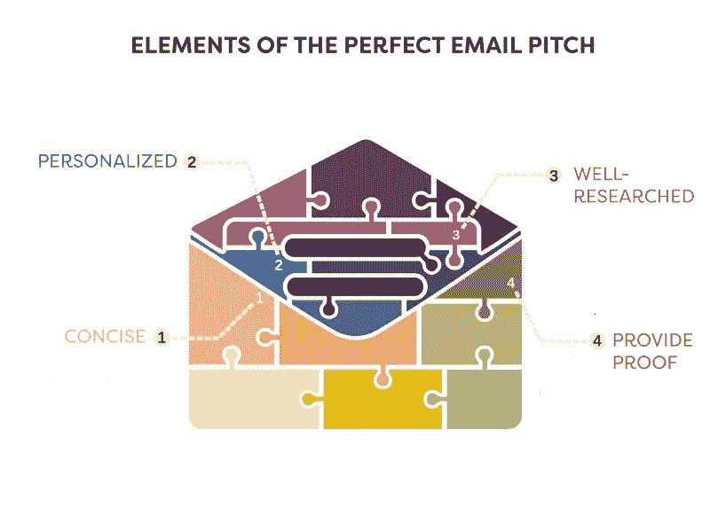

# 如何发表:客座博客的最终指南

> 原文：<https://www.sitepoint.com/guest-blogging/>

你想把自己定位为行业内的思想领袖有几个原因。

也许你正试图作为一个专家建立你的个人品牌，或者这是一个提高你的网站和你的整体业务流量的策略。

不管你的理由是什么，这不是一个特别快速的过程，而是一个需要努力的过程。

让你的声音出现在那里并展示你的专业知识的最好方法之一就是写博客。

这个想法是你为其他出版物写作，这些出版物为你提供了一个炫耀你所知的平台。

这些天并不能保证你会获得你网站的反向链接，因为[SEO 的客座博客基本上是非法的](https://www.mattcutts.com/blog/guest-blogging/)，但是你很有可能会在你的作者简历中获得你网站和社交资料的链接，这将提高所列链接的流量。

所以，事不宜迟，让我们来看看你应该采取哪些步骤来成功地撰写客座博文。

## 1.开始构建您的投资组合

尼尔·帕特尔表示，在你接触编辑，希望在他们的网站上发表文章之前，你需要建立自己的作品集和社交媒体账户。你应该有自己的博客，在那里你可以发表你的作品，也可以通过社交账户来发布你的内容。

你可以选择免费的在线博客平台，如 WordPress 或 Blogger，或者如果你销售产品或服务或有在线作品集，你可以在现有网站上添加一个博客部分。

你可以也应该使用 [LinkedIn Publishing](https://help.linkedin.com/app/answers/detail/a_id/47445/~/long-form-posts-on-linkedin---overview) 来增加自己的曝光率。

### 创建博客帖子时:

1.  研究你所在行业内的书籍，注意哪些做得好，他们得到了多少关注。
2.  考虑如何创建包含原创想法和行业见解的标题和帖子。
3.  注意格式，以便[提高可读性](http://www.problogdesign.com/blog-usability/30-ways-to-improve-readability/)。例如，使用图像、要点和标题(H2、H3 等。)以使其更容易消化。
4.  考虑标题将如何为你的观众解决问题。操作方法文章和列表帖子通常非常受欢迎，因为这些文章和列表几乎可以立即提供解决方案。
5.  想一想你将在帖子底部包含什么行动号召(CTA ),以促进讨论、推动行动和参与。
6.  为了给读者增加更多的价值并引起编辑的注意，找到一些你可以链接到的高知名度的博客。

## 2.别忘了社交媒体。

社交媒体将成为分发你的内容和获得你的关注的关键。

因此，选择社交网络，在那里你的观众会在网上闲逛。受欢迎的网络包括 Twitter、脸书、LinkedIn 和 Google Plus。如果你的博客非常直观，你还应该包括 Pinterest 或 Instagram。

一旦你做到了这一点，你将需要投入大量的工作来增加你的[跟随着](http://www.socialmediaexaminer.com/microsoft-dynamics-social-media-following/)。

我看到很多人从承诺给你 5 美元 10 万粉丝的网站上购买粉丝。

不要这样做！

[很容易被发现](http://yoursocialmediaworks.com/4-clues-twitter-followers-are-purchased)，你购买的追随者极不可能参与或满足于你或给你提供任何真正的价值。

最好的社交追随者是通过有组织地锁定你的特定人群而获得的。

#### 个人提示:我发现个人社交媒体账户比商业账户获得了更多的参与度。

## 3.研究你的目标网站。

一旦你在博客上发表了很多精彩的文章，在 LinkedIn 上发表了一些，扩大了你的社交媒体关注，你就应该开始研究你想投稿的出版物。

你可能想瞄准顶级博客，如福布斯或赫芬顿邮报，但当你刚刚开始时，这些可能很难进入。因此，在开始的时候，瞄准那些不太知名的网站。

据《福布斯》首席产品官刘易斯·德沃金(Lewis DVorkin)称，该网站由专业记者和行业专家组成，他们都接受我们的编辑和团队成员的调查。

“我们看看他们的经历。我们看他们的资历和他们的所作所为，我们拒绝了许多人，”他在一次采访中说。

所以，除非你引起了轰动，否则一开始你不太可能有机会为福布斯这样的网站写作。

相反，你应该在你的行业内寻找特定的博客，比如 [SitePoint](https://www.sitepoint.com/write-for-us/) ，它可以让你通过文章和教程展示你的专业知识。

通过搜索以下术语，您可以在设计空间中找到它们:

*   为我们写作+设计(您可以在不同的搜索中更改最终的单词，例如网页设计、网页开发、移动开发、UX 设计等。)
*   投稿指南+你的行业关键词
*   提交指南+您的行业关键词
*   客座博文+你的行业关键词
*   提交内容+你的行业关键词

以上并不是你应该使用的搜索术语的详尽列表，但是你已经明白了。你也可以使用网站，比如 all top T1，来寻找知名的利基博客。

## 4.研究网站的格式和编辑。

一些网站只是提供一个表格，你可以在那里提交内容，但大多数网站需要一封初始电子邮件，里面有一些想法和你想贡献的文章的简要概述。

研究一下你想写的部分的编辑是谁，并在电子邮件中恰当地描述他们。

编辑会收到大量的投稿请求，所以如果你对编辑的称呼不正确，你很可能不会像他们的编辑那样在他们的网站上发表文章。

对编辑来说，这种对细节的忽视表明你不愿意花哪怕是最少的努力去寻找合适的人选；因此，你不太可能写出一篇经过充分研究、写得很好的文章。

利用网站地图，谷歌，尽你所能找到合适的编辑的名字和关于出版物的信息。

此外，研究在网站上做得好的标题类型，以及它们的写作格式。

大多数提供提交指南，所以通读这些指南，并确保你遵循它们。

## 5.提出你的想法。

首先，保持你的介绍性邮件简短明了。

包括一些故事构思，以及一个简短的(最多两到三句话)概要和你的作品集或写作样本的链接。

用这样一种方式组织你的邮件，让编辑清楚你已经阅读了网站上的帖子，并且明白编辑想要什么。这里有一个成功推销电子邮件的好例子。

> 嗨[插入编辑名字]！
> 
> 我的名字是[名字姓氏-指向您的网站或 LinkedIn 的超链接]。我为美国各地的出版物和博客撰稿，我的建议被刊登在 X、Y 和 z 等出版物上。
> 
> 我想为[刊物名称]写一篇文章。
> 
> 我提议的标题是:[标题]。
> 
> #### 样本介绍:
> 
> [包括故事的简短介绍]
> 
> #### 链接到我以前的作品:
> 
> *   链接 2
> *   链接 2
> *   链接 3
> 
> 期待为你写作！
> 
> [名字] =)

重要的是不要写得太多，因为如果写得太多，一个忙碌的编辑是不太可能看的。

编辑经常每天必须处理至少 10 到 20 个或更多的请求；因此，快速消化的更容易被响应。

## 6.写帖子。

一旦你被录取了，就该写文章了。

如果编辑没有提供截止日期，那么回复邮件告诉她一个预期的交付日期，这样她就可以相应地安排她的日程表。

当涉及到写作过程本身时，研究指导方针并严格遵守它们。

你的帖子应该提供新鲜的想法和可行的建议，这将为读者提供很多关键的信息。

它应该与支持信息的外部链接充分研究，它应该包含图像或视频，如果可用的话。一定要问清楚你是否需要包含图片，或者他们是否会担心这些细节。

如果你被要求提供图片，那么重要的图片是在[知识共享的](http://creativecommons.org/)许可下使用的。

一些允许你搜索知识共享的图片的网站仍然需要你的许可才能使用，所以要仔细检查许可。

艾丽莎·格雷戈里发布了一份免费图片网站的综合列表，你可以在这里查看。

如果你正在创建一个演示技术的教程，请附上截图。

你的帖子应该[容易浏览](http://www.nngroup.com/articles/how-users-read-on-the-web/)。请记住:

*   保持段落和句子简洁明了。它们最多应该是两到三句话。
*   使用项目符号
*   利用适当的图像
*   确保段落之间有空白
*   彻底检查拼写和语法。使用诸如[语法](https://www.grammarly.com/)拼写和 [HemingwayApp](http://www.hemingwayapp.com/) 等工具指出过长的句子和段落和/或过度使用被动语态。

一旦你对文章感到满意，把它提交给编辑并等待反馈。耐心点，不要第二天再发邮件了。编辑会尽力去做的。

如果几个星期后你没有听到任何消息，那就发一封短信询问最新情况。

如果编辑回复你要求编辑，尽快完成，然后重新提交。

## 7.推广一下。

一旦帖子发布，就在社交媒体上分享，并留意评论。

如果你参与到社区中并回答帖子上留下的任何评论，编辑会更倾向于让你提交另一个帖子。

通过创建“推特”来鼓励参与社交媒体，说服你的追随者点击、阅读并分享。

例如，这个帖子“Tweetables”可能是这样的:

*   如何发表:终极指南——在文章评论中告诉我们你是如何发表文章的。

*   你会犯这些邮件错误吗？这可能是编辑不发布你的内容的原因。

通过包括一个 CTA，你鼓励你的读者参与进来，并促使其他人阅读。

在这里发挥你的创造力，这将大大提高你帖子的参与度。

[当你不在的时候，使用日程安排软件](http://www.lifehack.org/articles/communication/the-ultimate-guide-to-social-media-update-scheduling.html)，如 [Buffer](http://bufferapp.com/) ，在社交网站上分享帖子，以获得更多的参与度。但也要确保你在梳理回复，感谢人们的分享、喜欢和评论。

## 8.冲洗并重复。

一旦你的第一篇文章发布出去，你的网站的流量会逐渐增加。但是请记住，这不是一个一蹴而就的过程，在你开始称自己为思想领袖或影响者之前，你必须持续发布更多的帖子。

如果你坚持不懈地投入工作，确保你也参与各种论坛的讨论，那么你会看到结果。

记住，罗马不是一天建成的。

通过评论行业博客和/或以下地方，让自己尽可能地走出去:

*   LinkedIn 上的行业讨论组
*   Quora
*   Reddit
*   Google Plus 社区
*   脸书工业集团

## 结论

清楚地向自己阐明你想成为行业思想领袖的原因，并尽早定义你的目标。

这需要大量的工作。没有捷径可走。

如果你想快速成长，那么你需要在网上保持活跃，每天与你的观众互动。

一旦你有了自己的名字，编辑们就会来找你，这时事情才真正开始变得有趣。

#### 你在哪里出版过？你想在哪里出版？请在下面的评论中告诉我们，我们会看看是否能为您提供任何提示或解决方案。

## 分享这篇文章