# 用 Prisma 2、Chakra UI 和 React 建立习惯跟踪器

> 原文：<https://www.sitepoint.com/habit-tracker-prisma-2-chakra-ui-react/>

【2019 年 6 月， [Prisma 2 预告](https://www.prisma.io/blog/announcing-prisma-2-zq1s745db8i5/)上映。Prisma 1 改变了我们与数据库交互的方式。我们可以通过普通的 JavaScript 方法和对象访问数据库，而不必用数据库语言本身编写查询。Prisma 1 充当了数据库前端的抽象，因此更容易制作 CRUD(创建、读取、更新和删除)应用程序。

Prisma 1 架构是这样的:


注意，后端需要一个额外的 Prisma 服务器来访问数据库。最新版本不需要额外的服务器。它被称为 Prisma 框架(以前称为 Prisma 2 ),是 Prisma 的完全重写。最初的 Prisma 是用 Scala 编写的，所以它必须通过 JVM 运行，并且需要一个额外的服务器来运行。它也有记忆问题。

Prisma 框架是用 Rust 编写的，所以内存占用很少。此外，使用 Prisma 1 时所需的额外服务器现在与后端捆绑在一起，因此您可以像使用图书馆一样使用它。

Prisma 框架由三个独立的工具组成:

1.  [Photon](https://photonjs.prisma.io/) :一个类型安全的自动生成的数据库客户端(“ORM 替代”)
2.  Lift:一个带有定制工作流的声明性迁移系统
3.  [Studio](https://github.com/prisma/studio) :一个数据库 IDE，提供了一个管理 UI 来支持各种数据库工作流。

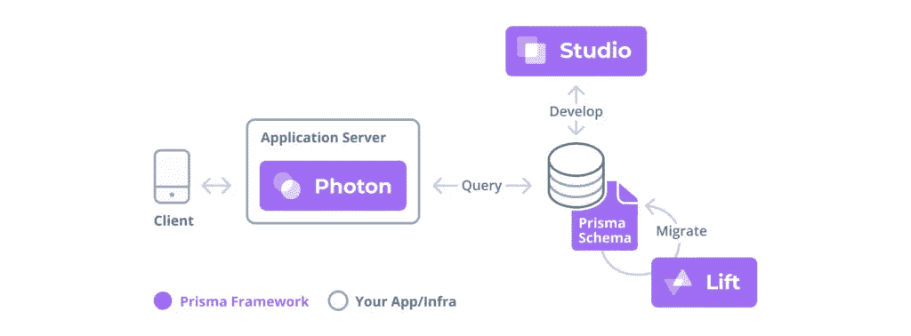

Photon 是一个类型安全的数据库客户机，它取代了传统的 orm，Lift 允许我们以声明的方式创建数据模型并执行数据库迁移。Studio 允许我们通过漂亮的管理 UI 来执行数据库操作。

## 为什么用 Prisma？

Prisma 消除了编写复杂数据库查询的复杂性，简化了应用程序中的数据库访问。通过使用 Prisma，您可以更改底层数据库，而不必更改每个查询。它只是工作。目前只支持 mySQL、SQLite 和 PostgreSQL。

Prisma 提供由自动生成的 Prisma 客户端提供的类型安全数据库访问。它有一个简单而强大的 API 来处理关系数据和事务。它允许使用 [Prisma Studio](https://github.com/prisma/studio) 进行可视化数据管理。

由于静态分析和编译时错误检查，提供端到端的类型安全意味着开发人员可以对他们的代码充满信心。当拥有明确定义的数据类型时，开发人员的体验会大大提高。类型定义是 IDE 功能的基础，如智能自动完成或跳转到定义。

Prisma 统一了一次对多个数据库的访问(即将推出)，因此大大降低了跨数据库工作流的复杂性(即将推出)。

它基于使用 GraphQL 的模式定义语言(SDL)表达的声明性数据模型，通过 Lift 提供自动数据库迁移(可选)。

## 先决条件

对于本教程，您需要了解 [React](https://reactjs.org/) 的基本知识。你还需要了解[反应钩](https://reactjs.org/docs/hooks-intro.html)。

因为本教程主要关注 Prisma，所以假设您已经掌握了 React 及其基本概念的工作知识。

如果你没有上述内容的工作知识，不要担心。有大量的教程可以帮助你准备这篇文章。

在本教程的整个过程中，我们将使用`yarn`。如果你还没有安装`yarn`，从[这里](https://yarnpkg.com/en/docs/install)安装。

为了确保我们在同一页上，这些是本教程中使用的版本:

*   节点 v12.11.1
*   npm 版本 6.11.3
*   npx 版本 6.11.3
*   纱线 v1.19.1
*   prisma 2v 2 . 0 . 0-预览 016.2
*   react v16.11.0

## 文件夹结构

我们的文件夹结构如下:

```
streaks-app/
  client/
  server/ 
```

`client/`文件夹将从 [create-react-app](https://github.com/facebook/create-react-app) 引导，`server/`文件夹将从 [prisma2](https://github.com/prisma/prisma2) CLI 引导。

因此，您只需要创建一个名为`streaks-app/`的根文件夹，在用各自的 CLI 搭建它时，就会生成子文件夹。继续创建`streaks-app/`文件夹和`cd`，如下所示:

```
$ mkdir streaks-app && cd $_ 
```

## 后端(服务器端)

### 引导一个新的 Prisma 2 项目

您可以使用 [npx](https://github.com/npm/npx) 命令引导一个新的 Prisma 2 项目，如下所示:

```
$ npx prisma2 init server 
```

或者，您可以全局安装`prisma2` CLI 并运行`init`命令。执行以下操作:

```
$ yarn global add prisma2 // or npm install --global prisma2
$ prisma2 init server 
```

### 运行交互`prisma2 init`流程&选择样板文件

在交互式提示中选择以下选项:

1.  选择**初学者工具包**
2.  选择 **JavaScript**
3.  选择 **GraphQL API**
4.  选择 **SQLite**

一旦终止，`init`命令将在`server/`文件夹中创建一个初始项目设置。

现在打开`schema.prisma`文件，并用以下内容替换它:

```
generator photon {
 provider = "photonjs"
}

datasource db {
 provider = "sqlite"
 url = "file:dev.db"
}

model Habit {
 id String @default(cuid()) @id
 name String @unique
 streak Int
} 
```

`schema.prisma`包含数据模型以及配置选项。

在这里，我们指定要连接到名为`dev.db`的 SQLite 数据源以及像`photonjs` generator 这样的目标代码生成器。

然后我们定义数据模型`Habit`，它由`id`、`name`和`streak`组成。

`id`是类型为`String`的主键，默认值为 [cuid()](https://github.com/ericelliott/cuid) 。

`name`的类型为`String`，但有一个约束条件，即它必须是唯一的。

`streak`属于`Int`类型。

`seed.js`文件应该是这样的:

```
const { Photon } = require('@generated/photon')
const photon = new Photon()

async function main() {
  const workout = await photon.habits.create({
    data: {
      name: 'Workout',
      streak: 49,
    },
  })
  const running = await photon.habits.create({
    data: {
      name: 'Running',
      streak: 245,
    },
  })
  const cycling = await photon.habits.create({
    data: {
      name: 'Cycling',
      streak: 77,
    },
  })
  const meditation = await photon.habits.create({
    data: {
      name: 'Meditation',
      streak: 60,
    },
  })
  console.log({
    workout,
    running,
    cycling,
    meditation,
  })
}

main()
  .catch(e => console.error(e))
  .finally(async () => {
    await photon.disconnect()
  }) 
```

该文件创建各种新习惯，并将其添加到 SQLite 数据库中。

现在进入`src/index.js`文件并删除其内容。我们将从头开始添加内容。

首先导入必要的包并声明一些常量:

```
const { GraphQLServer } = require('graphql-yoga')
const {
 makeSchema,
 objectType,
 queryType,
 mutationType,
 idArg,
 stringArg,
} = require('nexus')
const { Photon } = require('@generated/photon')
const { nexusPrismaPlugin } = require('nexus-prisma') 
```

现在让我们在它下面声明我们的`Habit`模型:

```
const Habit = objectType({
  name: 'Habit',
  definition(t) {
    t.model.id()
    t.model.name()
    t.model.streak()
  },
}) 
```

我们利用`nexus`包中的`objectType`来声明`Habit`。

`name`参数应该与`schema.prisma`文件中定义的相同。

`definition`函数允许您在引用`Habit`的地方公开一组特定的字段。这里我们曝光`id`、`name`和`streak`场。

如果我们只公开`id`和`name`字段，那么只要引用了`Habit`，就只有这两个字段会被公开。

在下面，粘贴`Query`常量:

```
const Query = queryType({
  definition(t) {
    t.crud.habit()
    t.crud.habits()

    // t.list.field('habits', {
    //   type: 'Habit',
    //   resolve: (_, _args, ctx) => {
    //     return ctx.photon.habits.findMany()
    //   },
    // })
  },
}) 
```

我们利用`nexus`包中的`queryType`来声明`Query`。

Photon generator 生成一个 API，该 API 公开了`Habit`模型上的 CRUD 函数。这就是允许我们揭露`t.crud.habit()`和`t.crud.habits()`的方法。

`t.crud.habit()`允许我们通过`id`或`name`来查询任何个人习惯。`t.crud.habits()`简单返回所有习惯。

或者，`t.crud.habits()`也可以写成:

```
t.list.field('habits', {
  type: 'Habit',
  resolve: (_, _args, ctx) => {
    return ctx.photon.habits.findMany()
  },
}) 
```

上面的代码和`t.crud.habits()`会给出相同的结果。

在上面的代码中，我们创建了一个名为`habits`的字段。回程`type`是`Habit`。然后我们调用`ctx.photon.habits.findMany()`从我们的 SQLite 数据库中获取所有习惯。

*注意，`habits`属性的名称是使用[复数](https://github.com/blakeembrey/pluralize)包自动生成的。因此，推荐的做法是将我们的模型命名为单数——也就是说，`Habit`而不是`Habits`。*

我们对`habits`使用了`findMany`方法，它返回一个对象列表。我们发现所有的`habits`正如我们已经提到的`findMany`里面没有条件。点击可以了解更多关于如何在`findMany`T5 里面添加条件。

在`Query`下方，粘贴`Mutation`如下:

```
const Mutation = mutationType({
  definition(t) {
    t.crud.createOneHabit({ alias: 'createHabit' })
    t.crud.deleteOneHabit({ alias: 'deleteHabit' })

    t.field('incrementStreak', {
      type: 'Habit',
      args: {
        name: stringArg(),
      },
      resolve: async (_, { name }, ctx) => {
        const habit = await ctx.photon.habits.findOne({
          where: {
            name,
          },
        })
        return ctx.photon.habits.update({
          data: {
            streak: habit.streak + 1,
          },
          where: {
            name,
          },
        })
      },
    })
  },
}) 
```

`Mutation`使用`nexus`包中的`mutationType`。

这里的 CRUD API 公开了`createOneHabit`和`deleteOneHabit`。

`createOneHabit`顾名思义，创建一个习惯，而`deleteOneHabit`删除一个习惯。

`createOneHabit`别名为`createHabit`，所以在调用变异时我们调用`createHabit`而不是`createOneHabit`。

同样，我们叫`deleteHabit`而不是`deleteOneHabit`。

最后，我们创建一个名为`incrementStreak`的字段，它增加了一个习惯的条纹。回程`type`是`Habit`。它接受类型为`String`的`args`字段中指定的参数`name`。该参数作为第二个参数在`resolve`函数中接收。我们通过调用`ctx.photon.habits.findOne()`并在`where`子句中传递`name`参数来找到`habit`。我们需要这个来获得当前的`streak`。最后，我们通过将`streak`增加 1 来更新`habit`。

在`Mutation`下方，粘贴以下内容:

```
const photon = new Photon()

new GraphQLServer({
  schema: makeSchema({
    types: [Query, Mutation, Habit],
    plugins: [nexusPrismaPlugin()],
  }),
  context: { photon },
}).start(() =>
  console.log(
    `🚀 Server ready at: http://localhost:4000\n⭐️ See sample queries: http://pris.ly/e/js/graphql#5-using-the-graphql-api`,
  ),
)

module.exports = { Habit } 
```

我们使用`nexus`包中的`makeSchema`方法来组合我们的模型`Habit`，并将`Query`和`Mutation`添加到`types`数组中。我们还将`nexusPrismaPlugin`添加到我们的`plugins`数组中。最后，我们在 [localhost:4000](http://localhost:4000/) 启动我们的服务器。端口 4000 是 [graphql-yoga](https://github.com/prisma-labs/graphql-yoga) 的默认端口。您可以在此按照建议[更改端口。](https://github.com/prisma/prisma2/issues/594#issuecomment-534545903)

现在让我们启动服务器。但是首先，我们需要确保我们最新的模式更改被写入到`node_modules/@generated/photon`目录中。运行`prisma2 generate`时会出现这种情况。

如果你没有全球安装`prisma2`，你将不得不用`./node_modules/.bin/prisma2 generate`替换`prisma2 generate`。然后我们需要迁移数据库来创建表。

### 使用 Lift 迁移您的数据库

使用 Lift 迁移数据库遵循两步流程:

1.  保存新的迁移(迁移在文件系统中表示为目录)
2.  运行迁移(迁移底层数据库的模式)

在 CLI 命令中，可以按如下方式执行这些步骤(CLI 步骤正在更新过程中，以便与之匹配):

```
$ prisma2 lift save --name 'init'
$ prisma2 lift up 
```

同样，如果你没有在全球范围内安装它，你必须用`./node_modules/.bin/prisma2`替换`prisma2`。

现在，迁移过程已经完成。我们已经成功创建了表。现在我们可以在数据库中植入初始值。

继续在终端中运行以下命令:

```
$ yarn seed 
```

这将为我们的数据库植入八个习惯，如我们的`seed.js`文件中所指定的。

现在，您可以通过键入以下命令来运行服务器:

```
$ yarn dev 
```

这将在 [localhost:4000](http://localhost:4000/) 运行您的服务器，您可以打开并查询您制作的所有 API。

### 列出所有习惯

```
query habits {
  habits {
    id
    name
    streak
  }
} 
```

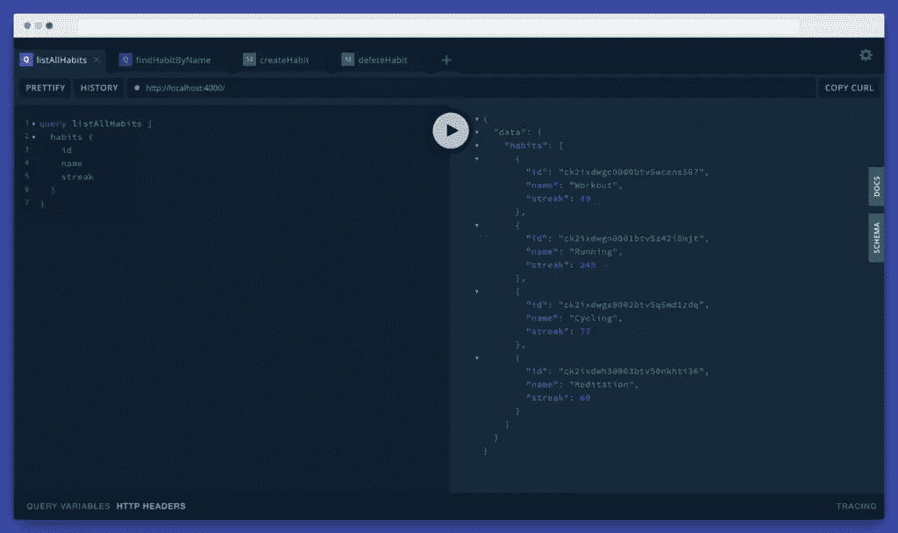

### 通过名字找到习惯

```
query findHabitByName {
  habit(where: { name: "Workout" }) {
    id
    name
    streak
  }
} 
```

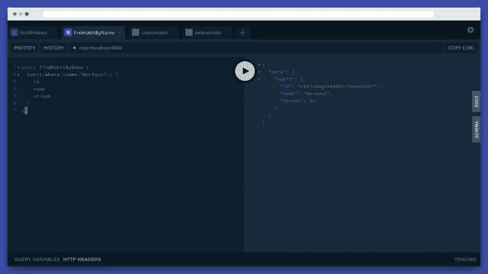

### 养成习惯

```
mutation createHabit {
  createHabit(data: { name: "Swimming", streak: 10 }) {
    id
    name
    streak
  }
} 
```

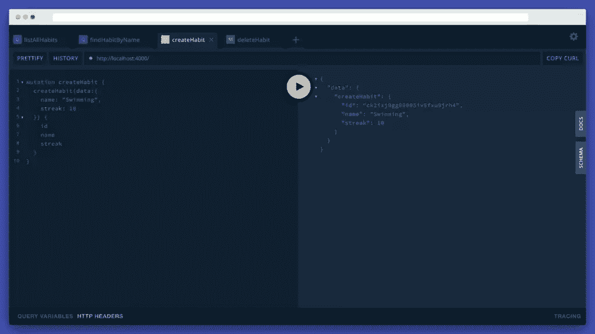

### 删除习惯

```
mutation deleteHabit {
  deleteHabit(where: { id: "ck2kinq2j0001xqv5ski2byvs" }) {
    id
    name
    streak
  }
} 
```

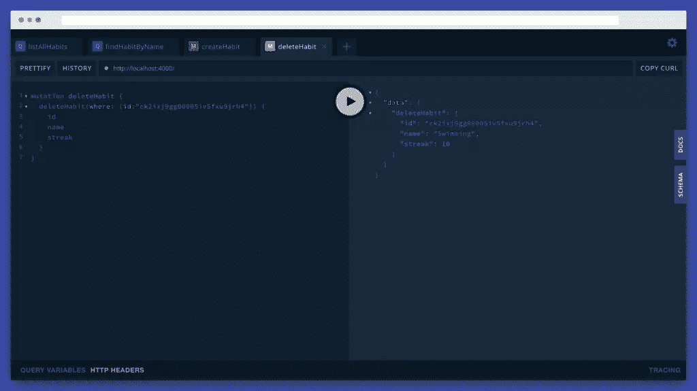

### 增量条纹

```
mutation incrementStreak {
  incrementStreak(name: "Workout") {
    streak
  }
} 
```

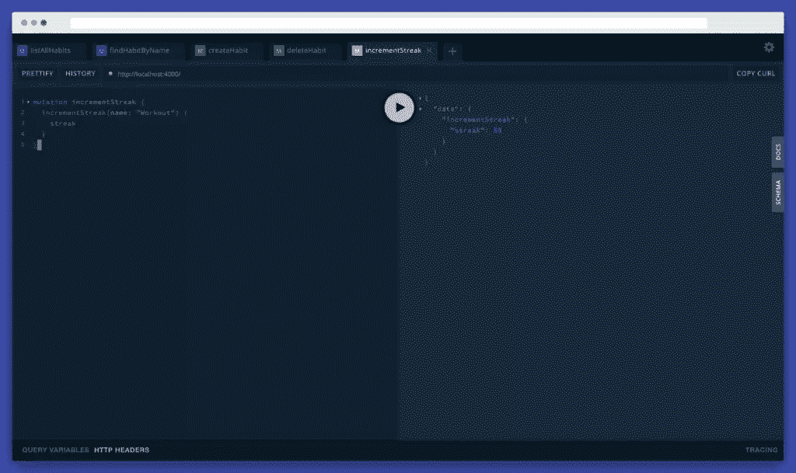

这就是我们后端所需要的。我们现在开始做前端吧。

## 前端(客户端)

### 引导一个新的 React 项目

使用 [create-react-app](https://github.com/facebook/create-react-app) 引导一个新的 React 项目。通过执行以下操作，使用 [npx](https://github.com/npm/npx) 引导一个新项目，而不必全局安装`create-react-app`:

```
$ npx create-react-app client 
```

或者，您可以全局安装`create-react-app`并引导一个新的 React 项目，然后这样做:

```
$ yarn global add create-react-app // or npm install --global create-react-app
$ create-react-app client 
```

这将使用`create-react-app`引导一个新的 React 项目。

现在进入`client/`目录，运行项目，并键入以下内容:

```
$ cd client
$ yarn start 
```

这将在 [localhost:3000](http://localhost:3000/) 上运行客户端。

它现在应该是这样的:

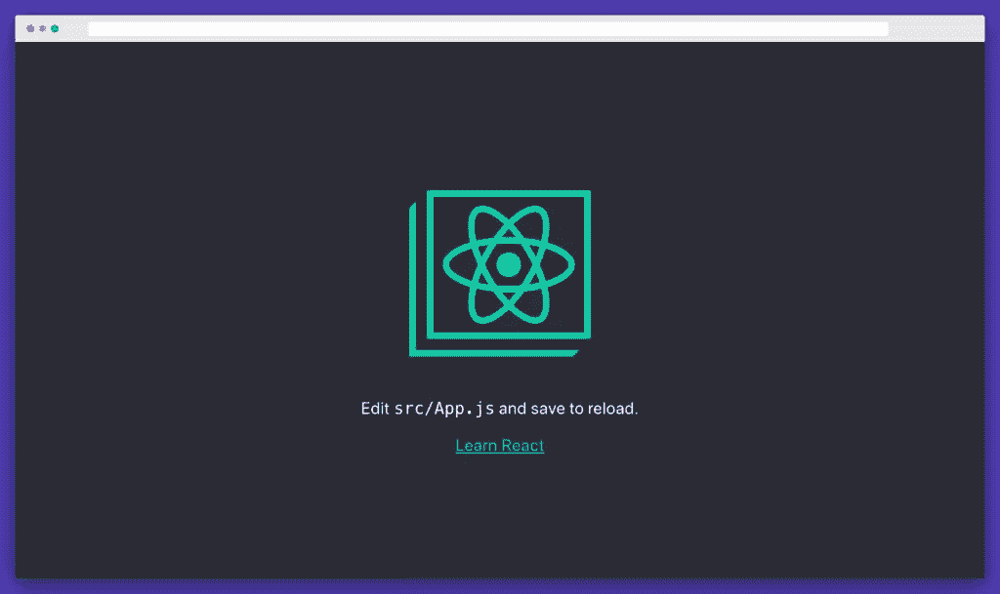

现在进入`src/`目录，删除不需要的文件，如`App.css`、`App.test.js`、`index.css`和`logo.svg`:

```
$ cd src
$ rm App.css App.test.js index.css logo.svg 
```

从`index.js`和`App.js`中删除对已删除文件的引用。

`index.js`现在应该是这样的:

```
import React from "react";
import ReactDOM from "react-dom";
import App from "./App";
import * as serviceWorker from "./serviceWorker";

ReactDOM.render(<App />, document.getElementById("root"));

// If you want your app to work offline and load faster, you can change
// unregister() to register() below. Note this comes with some pitfalls.
// Learn more about service workers: https://bit.ly/CRA-PWA
serviceWorker.unregister(); 
```

确保你的`App.js`看起来像这样:

```
import React from 'react'

function App() {
 return <div>Streaks App</div>
}

export default App 
```

### urql:通用反应查询语言

继续，首先安装 [urql](https://formidable.com/open-source/urql/) ，它是 [Apollo 客户端](https://www.apollographql.com/docs/react/)的替代。我们还需要安装`graphql`，因为它是`urql`的对等依赖项。您可以通过在终端中键入以下命令来实现这一点:

```
$ cd .. // come out of the 'src/' directory and into the 'client/' directory
$ yarn add urql graphql 
```

现在将`App.js`更改为以下内容，将`urql`连接到 Prisma GraphQL 后端:

```
import React from 'react'
import { createClient, Provider } from 'urql'

const client = createClient({
  url: 'http://localhost:4000/'
})

const App = () => (
  <Provider value={client}>
    <div>Streaks App</div>
  </Provider>
)

export default App 
```

这里，我们通过传入我们的后端`url`来使用`urql`的`createClient`函数，然后将其作为`value`道具传递给`Provider`组件。这允许我们查询、变更或订阅任何作为`Provider`组件的子组件的组件。

它现在应该是这样的:

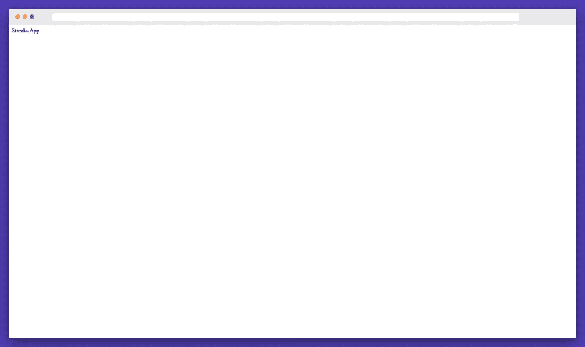

### Chakra UI

在本教程中，我们将使用 [Chakra UI](https://chakra-ui.com/) 作为我们的组件库来更快地制作漂亮的应用程序。这是一个不同类型的组件库，是为了可访问性和速度而构建的。它是完全可主题化和可组合的。要安装它，请在终端中键入以下内容:

```
$ yarn add @chakra-ui/core @emotion/core @emotion/styled emotion-theming 
```

Chakra 在引擎盖下使用[情感](https://emotion.sh/)，所以我们需要安装它和它的对等依赖。

在本教程中，我们还需要`graphql-tag`来解析我们的 GraphQL 查询，`react-icons`来显示漂亮的图标，`@seznam/compose-react-refs`来组成多个 refs， [react-hook-form](https://react-hook-form.com/) 来创建表单。

确保通过在终端中键入以下命令来安装它们:

```
$ yarn add graphql-tag react-icons @seznam/compose-react-refs react-hook-form 
```

现在继续将`App.js`更改为以下内容:

```
import { Text, ThemeProvider } from '@chakra-ui/core'
import React from 'react'
import { createClient, Provider } from 'urql'

const client = createClient({
  url: 'http://localhost:4000/'
})

const App = () => (
  <Provider value={client}>
    <ThemeProvider>
      <>
        <Text fontSize='5xl' textAlign='center'>
          Streaks App
        </Text>
      </>
    </ThemeProvider>
  </Provider>
)

export default App 
```

我们从`@chakra-ui/core`导入了[文本](https://chakra-ui.com/text)和`ThemeProvider`。

组件用于在一个界面中呈现文本和段落。默认情况下，它呈现一个`<p>`标签。

我们把我们的`Text`组件`fontSize`作为`5xl`，并把它对齐中心。

我们也把整个东西包在`ThemeProvider`里面。`ThemeProvider`让我们通过将`theme`对象作为道具传入来为我们的应用程序添加一个主题。Chakra UI 有一个默认的主题，如果我们在组件上包装`ThemeProvider`，就会看到这个主题。布局现在看起来像这样:

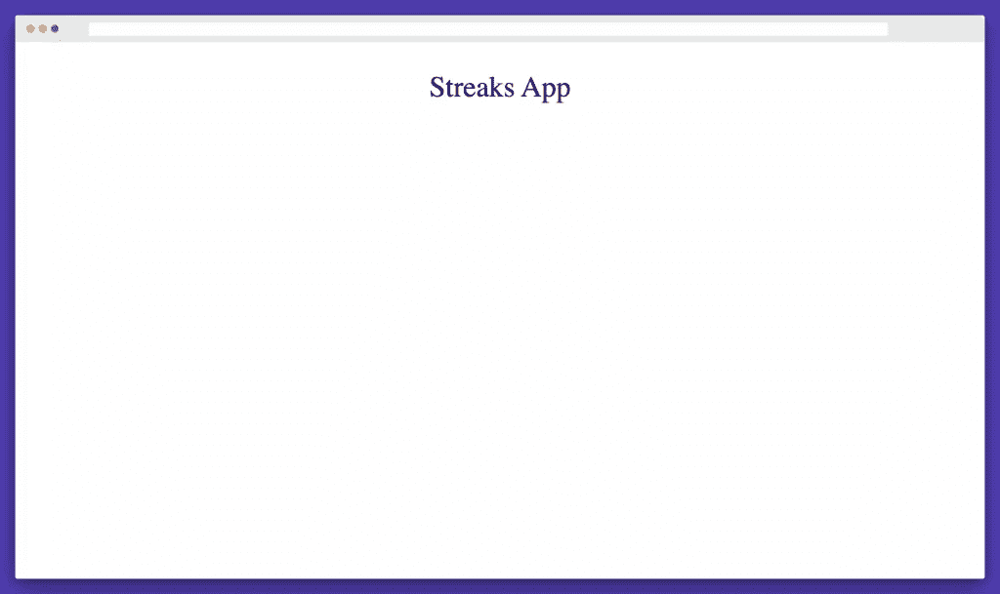

尝试移除`ThemeProvider`以查看它如何影响布局。看起来是这样的:

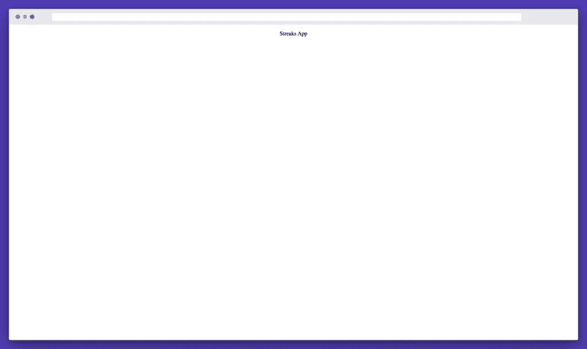

把它放回去。现在，让我们编写我们的应用程序。

现在继续创建一个`components`和一个`graphql`文件夹:

```
$ mkdir components graphql 
```

进入`graphql`文件夹，创建名为`createHabit.js`、`deleteHabit.js`、`incrementStreak.js`、`listAllHabits.js`和`index.js`的文件。

```
$ cd graphql
$ touch createHabit.js deleteHabit.js incrementStreak.js listAllHabits.js index.js 
```

### 列出所有习惯查询

打开`listAllHabits.js`并粘贴以下内容:

```
import gql from 'graphql-tag'

export const LIST_ALL_HABITS_QUERY = gql` query listAllHabits {
    habits {
      id
      name
      streak
    }
  } ` 
```

注意，上面的`query`类似于我们在 GraphiQL 编辑器中输入的内容。这就是 GraphQL 的使用方法。首先，我们在 GraphiQL 编辑器中键入`query`或`mutation`,看看它是否给出了我们需要的数据，然后我们将它复制粘贴到应用程序中。

### 创造习惯突变

在`createHabit.js`内，粘贴以下内容:

```
import gql from 'graphql-tag'

export const CREATE_HABIT_MUTATION = gql` mutation createHabit($name: String!, $streak: Int!) {
    createHabit(data: { name: $name, streak: $streak }) {
      id
      name
      streak
    }
  } ` 
```

我们再次从上面的 GraphiQL 编辑器中复制了`mutation`。主要的区别是我们用一个由`$`标注的变量替换了硬编码的值，这样我们就可以输入用户指定的任何内容。上面的突变将被用来创造一种习惯。

### 删除习惯突变

在`deleteHabit.js`中粘贴以下内容:

```
import gql from 'graphql-tag'

export const DELETE_HABIT_MUTATION = gql` mutation deleteHabit($id: ID!) {
    deleteHabit(where: { id: $id }) {
      id
      name
      streak
    }
  } ` 
```

上面的突变会被用来删除一个习惯。

### 增量条纹突变

在`incrementStreak.js`中粘贴以下内容:

```
import gql from 'graphql-tag'

export const INCREMENT_STREAK_MUTATION = gql` mutation incrementStreak($name: String) {
    incrementStreak(name: $name) {
      streak
    }
  } ` 
```

上述突变将用于增加给定习惯的条纹。

最后，为了使从一个文件中`import`所有内容变得容易，在`index.js`中粘贴以下内容:

```
export * from './createHabit'
export * from './deleteHabit'
export * from './incrementStreak'
export * from './listAllHabits' 
```

这让我们可以从一个文件而不是四个不同的文件中获取信息。当我们有 10 个`queries`和`mutations`时，这是有益的。

现在进入`components/`目录，创建名为`CreateHabit.js`、`DeleteHabit.js`、`Habit.js`、`ListAllHabits.js`和`index.js`的文件。

```
$ cd ../components/
$ touch CreateHabit.js DeleteHabit.js Habit.js ListAllHabits.js index.js 
```

我们将在本教程的后面触及其余的文件，但现在打开`index.js`并粘贴以下内容:

```
export * from './Common/Error'
export * from './Common/Loading'
export * from './CreateHabit'
export * from './DeleteHabit'
export * from './Habit'
export * from './ListAllHabits' 
```

现在创建一个`Common/`文件夹，在里面创建`Loading.js`和`Error.js`:

```
$ mkdir Common && cd $_
$ touch Loading.js Error.js 
```

`cd $_`允许我们在`Common`目录创建后立即进入它。然后我们在里面创建`Loading.js`和`Error.js`。

现在在`src/`目录下创建一个`utils/`文件夹，里面有两个文件——`getIcon.js`和`index.js`:

```
$ cd ../../
$ mkdir utils/ && cd $_
$ touch getIcon.js index.js 
```

### 为习惯创建图标

现在打开`getIcon.js`并粘贴以下内容:

```
import { AiOutlineQuestion } from 'react-icons/ai'
import { FaCode, FaRunning, FaSwimmer } from 'react-icons/fa'
import { FiPhoneCall } from 'react-icons/fi'
import {
  GiCycling,
  GiMeditation,
  GiMuscleUp,
  GiTennisRacket,
} from 'react-icons/gi'
import { MdSmokeFree } from 'react-icons/md'

const icons = [
  {
    keywords: ['call', 'phone'],
    pic: FiPhoneCall,
  },
  {
    keywords: ['workout', 'muscle', 'body-building', 'body building'],
    pic: GiMuscleUp,
  },
  {
    keywords: ['cycling', 'cycle'],
    pic: GiCycling,
  },
  {
    keywords: ['running', 'run'],
    pic: FaRunning,
  },
  {
    keywords: ['swimming', 'swim'],
    pic: FaSwimmer,
  },
  {
    keywords: ['racket', 'tennis', 'badminton'],
    pic: GiTennisRacket,
  },
  {
    keywords: [
      'smoke',
      'smoking',
      'no smoking',
      'no-smoking',
      'smoke free',
      'no smoke',
    ],
    pic: MdSmokeFree,
  },
  {
    keywords: ['code', 'code everyday', 'program', 'programming'],
    pic: FaCode,
  },
  {
    keywords: ['meditate', 'meditation'],
    pic: GiMeditation,
  },
]

export const getIcon = name => {
  let icon = AiOutlineQuestion
  for (let i = 0; i < icons.length; i++) {
    const { keywords, pic } = icons[i]
    const lowerCaseName = name.toLowerCase()
    const doesKeywordExistInName = keywords.some(keyword =>
      lowerCaseName.includes(keyword),
    )
    if (doesKeywordExistInName) {
      icon = pic
      break
    }
  }

  return icon
} 
```

这是一个帮助文件，包含一个名为`getIcon`的函数。它接受一个习惯名并返回一个合适的图标。要添加更多的图标，需要用合适的`keywords`和`pic`向`icons`数组添加一个对象，可以从[的 react-icons](https://react-icons.netlify.com/) 导入。

让我们从`index.js`导入这个函数，这样我们可以很容易地导入它，而不必记住文件名。这在这里并不是必需的，但是当应用程序变大时，这是很有帮助的。

打开`index.js`并粘贴以下一行程序:

```
export * from './getIcon' 
```

继续打开`Loading.js`并粘贴以下内容:

```
import { Flex, Spinner } from '@chakra-ui/core'
import React from 'react'

export const Loading = () => (
  <Flex justify='center' flexWrap='wrap'>
    <Spinner
      thickness='4px'
      speed='0.65s'
      emptyColor='gray.200'
      color='blue.800'
      size='xl'
    />
  </Flex>
) 
```

我们展示了一个从 Chakra UI 库中导入的漂亮的`Spinner`。我们将它封装在一个`Flex`组件中，这使得无需编写 CSS 就可以轻松应用 Flexbox。在我看来，Chakra 可以轻松地更快地制作漂亮的应用程序，而不必编写自定义的 CSS。

现在打开`Error.js`并粘贴以下内容:

```
import {
  Alert,
  AlertDescription,
  AlertIcon,
  AlertTitle,
  Flex,
} from '@chakra-ui/core'
import React from 'react'

export const Error = () => (
  <Flex justify='center' flexWrap='wrap'>
    <Alert status='error'>
      <AlertIcon />
      <AlertTitle mr={2}>Whoops,</AlertTitle>
      <AlertDescription>
        there has been an error. Please try again later!
      </AlertDescription>
    </Alert>
  </Flex>
) 
```

这里，我们显示一个错误框。你可以很容易地在 Chakra UI 文档中找到上面的代码。这里没有火箭科学。只是简单的复制粘贴。

### 表现出单一的习惯

打开`Habit.js`并粘贴以下内容:

```
import { Badge, Box, Flex, Text } from '@chakra-ui/core'
import React from 'react'
import { useMutation } from 'urql'
import { INCREMENT_STREAK_MUTATION } from '../graphql/index'
import { getIcon } from '../utils/index'

const colors = [
  'tomato',
  'green.400',
  'yellow.300',
  'cornflowerblue',
  'antiquewhite',
  'aquamarine',
  'lightpink',
  'navajowhite',
  'red.500',
  'lightcoral'
]

export const Habit = ({ index, habit }) => {
  const { id, name, streak } = habit
  const bgColor = colors[index % colors.length]
  const [res, executeMutation] = useMutation(INCREMENT_STREAK_MUTATION) // eslint-disable-line no-unused-vars

  return (
    <Flex
      align='center'
      justify='flex-end'
      direction='column'
      bg={bgColor}
      width='300px'
      height='300px'
      borderRadius='40px'
      margin='16px'
      padding='16px'
    >
      <Box as={getIcon(name)} size='144px' />
      <Text fontWeight='hairline' fontSize='3xl' textAlign='center'>
        {name}
        <Badge
          as='span'
          fontWeight='hairline'
          fontSize='xl'
          rounded='full'
          mx='2'
          px='3'
          textTransform='lowercase'
          cursor='pointer'
          onClick={() => executeMutation({ name })}
        >
          {streak}
        </Badge>
      </Text>
    </Flex>
  )
} 
```

`Habit`组件显示一个带有`streak`徽章的`habit`。它包括`index`和`habit`。我们使用`index`来旋转来自`colors`数组的`habit`的背景颜色。一旦显示最后一种颜色，它将返回到第一种颜色。

在`Flex`组件中，我们通过调用带有`as`道具的`Box`组件来显示一个`icon`。`as`属性用于将`Box`组件的默认`div`替换为`as`属性中指定的任何内容。所以在这种情况下，我们将用`getIcon`的返回值替换它，它是来自`react-icons`的一个`icon`。

接下来，我们在`Text`组件中显示`name`，并用`Badge`组件包装`streak`。当点击`streak`时，调用`INCREMENT_STREAK_MUTATION`，我们已经在上面用`urql`的`useMutation`函数定义了它。我们将适当的习惯`name`传递给函数，这样我们就可以增加特定的习惯。

### 显示习惯列表

打开`ListAllHabits.js`并粘贴以下内容:

```
import { Flex, Text } from '@chakra-ui/core'
import React from 'react'
import { useQuery } from 'urql'
import { LIST_ALL_HABITS_QUERY } from '../graphql/index'
import { Error, Habit, Loading } from './index'

export const ListAllHabits = () => {
  const [{ fetching, error, data }] = useQuery({ query: LIST_ALL_HABITS_QUERY })

  if (fetching) return <Loading />
  if (error) return <Error />
  const noHabits = !data.habits.length

  return (
    <Flex
      justify='center'
      align='center'
      flexWrap='wrap'
      flexDirection={noHabits ? 'column' : 'row'}
    >
      {noHabits && (
        <Text fontWeight='bold' fontSize='3xl' color='tomato'>
          You currently track 0 habits. Add one.
        </Text>
      )}
      {data.habits.map((habit, i) => (
        <Habit key={habit.id} index={i} habit={habit} />
      ))}
    </Flex>
  )
} 
```

在这里，我们通过传入`LIST_ALL_HABITS_QUERY`调用`urql`的`useQuery`函数来获取所有的习惯。它返回`fetching`、`error`和`data`。

当`fetching`为`true`时，我们显示`Loading`组件，它显示`Spinner`。

当`error`为`true`时，我们显示`Error`组件，它显示一个`Alert`。

稍后，我们检查是否存在任何`habits`，如果没有任何`habits`，那么我们显示`You currently track 0 habits. Add one.`

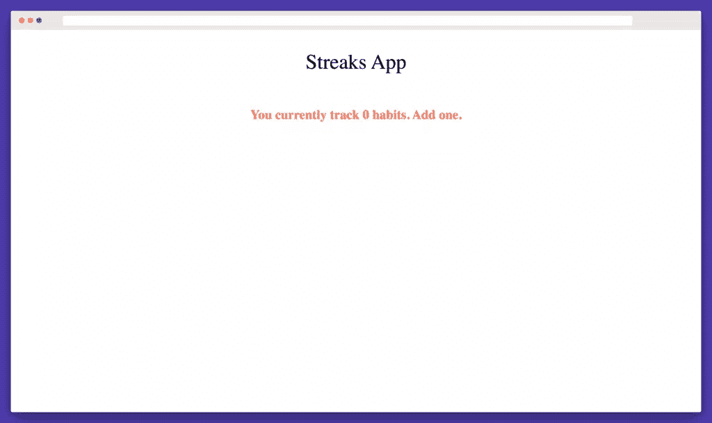

如果我们有任何`habits`，我们显示它们，看起来像这样:

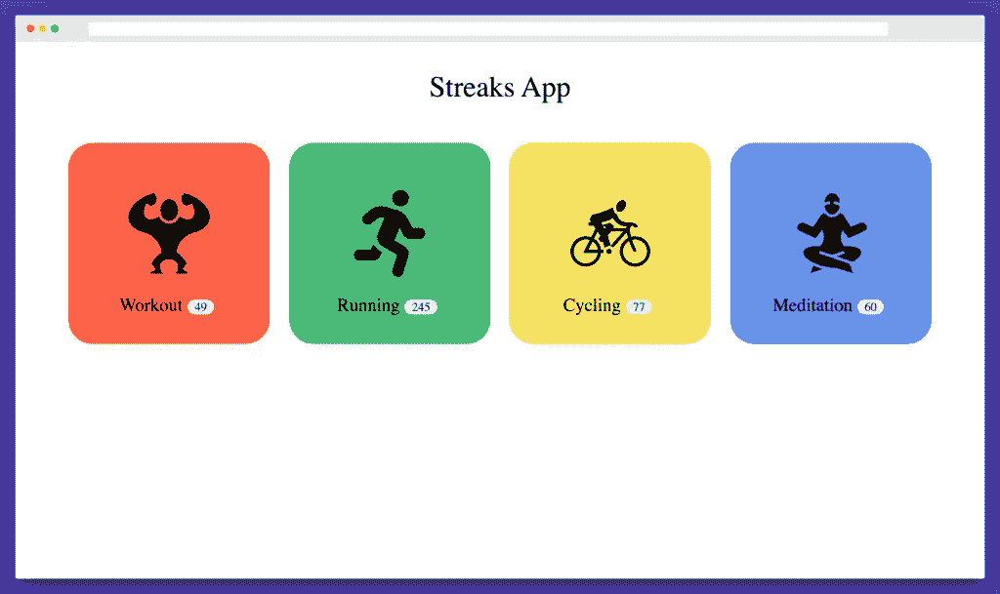

尝试点击`streak`徽章，看它增加。

### 改掉一个习惯

现在，打开`DeleteHabit.js`并粘贴以下内容:

```
import {
  AlertDialog,
  AlertDialogBody,
  AlertDialogContent,
  AlertDialogFooter,
  AlertDialogHeader,
  AlertDialogOverlay,
  Button,
  IconButton,
} from '@chakra-ui/core'
import React from 'react'
import { useMutation } from 'urql'
import { DELETE_HABIT_MUTATION } from '../graphql/index'

export const DeleteHabit = ({ id, name }) => {
  const [isOpen, setIsOpen] = React.useState()
  const onClose = () => setIsOpen(false)
  const cancelRef = React.useRef()

  const [res, executeMutation] = useMutation(DELETE_HABIT_MUTATION) // eslint-disable-line no-unused-vars

  const deleteHabit = () => {
    executeMutation({ id })
    onClose()
  }
  return (
    <>
      <IconButton
        variantColor='red'
        border='1px solid white'
        aria-label='Delete Habit'
        size='md'
        icon='delete'
        cursor='pointer'
        onClick={() => setIsOpen(true)}
      />
      <AlertDialog
        isOpen={isOpen}
        leastDestructiveRef={cancelRef}
        onClose={onClose}
      >
        <AlertDialogOverlay />
        <AlertDialogContent>
          <AlertDialogHeader fontSize='lg' fontWeight='bold'>
            Delete “{name}” Habit
          </AlertDialogHeader>

          <AlertDialogBody>
            Are you sure? You can't undo this action afterwards.
          </AlertDialogBody>

          <AlertDialogFooter>
            <Button ref={cancelRef} onClick={onClose}>
              Cancel
            </Button>
            <Button variantColor='red' onClick={deleteHabit} ml={3}>
              Delete
            </Button>
          </AlertDialogFooter>
        </AlertDialogContent>
      </AlertDialog>
    </>
  )
} 
```

这些代码大部分是从 Chakra UI 的 [AlertDialog](https://chakra-ui.com/alertdialog) 中抓取的。这个组件的主要目的是显示一个`trash`图标，当点击它时，用两个按钮`Cancel`和`Delete`提醒一个模态。点击`Cancel`，调用`onClose`函数，使模态消失，点击`Delete`，调用`deleteHabit`函数。

`deleteHabit`函数调用`DELETE_HABIT_MUTATION`，同时将从父组件获得的`id`传递给它，并通过调用`onClose`关闭模态。

现在再次打开`Habit.js`，将以下导入添加到顶部:

```
import { DeleteHabit } from './index' 
```

现在，在关闭`Badge`组件的下方，添加以下代码:

```
<DeleteHabit id={id} name={name} /> 
```

整个`Habit.js`文件现在应该看起来像这样:

```
import { Badge, Box, Flex, Text } from '@chakra-ui/core'
import React from 'react'
import { useMutation } from 'urql'
import { INCREMENT_STREAK_MUTATION } from '../graphql/index'
import { getIcon } from '../utils/index'
import { DeleteHabit } from './index'

const colors = [
  'tomato',
  'green.400',
  'yellow.300',
  'cornflowerblue',
  'antiquewhite',
  'aquamarine',
  'lightpink',
  'navajowhite',
  'red.500',
  'lightcoral'
]

export const Habit = ({ index, habit }) => {
  const { id, name, streak } = habit
  const bgColor = colors[index % colors.length]
  const [res, executeMutation] = useMutation(INCREMENT_STREAK_MUTATION) // eslint-disable-line no-unused-vars

  return (
    <Flex
      align='center'
      justify='flex-end'
      direction='column'
      bg={bgColor}
      width='300px'
      height='300px'
      borderRadius='40px'
      margin='16px'
      padding='16px'
    >
      <Box as={getIcon(name)} size='144px' />
      <Text fontWeight='hairline' fontSize='3xl' textAlign='center'>
        {name}
        <Badge
          as='span'
          fontWeight='hairline'
          fontSize='xl'
          rounded='full'
          mx='2'
          px='3'
          textTransform='lowercase'
          cursor='pointer'
          onClick={() => executeMutation({ name })}
        >
          {streak}
        </Badge>
        <DeleteHabit id={id} name={name} />
      </Text>
    </Flex>
  )
} 
```

它现在应该是这样的:


现在试着点击任何习惯上的`trash`图标。它应该打开一个模式，如下所示:

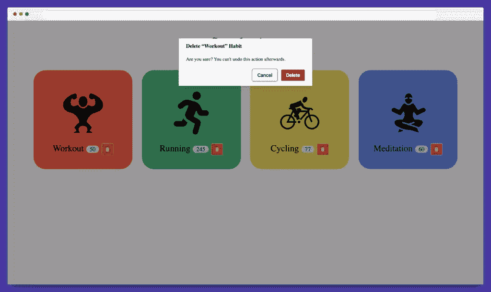

如果你点击*取消*，它将关闭模态。如果您点击*删除*，该习惯将从用户界面和 Prisma 数据库中删除，如下所示:

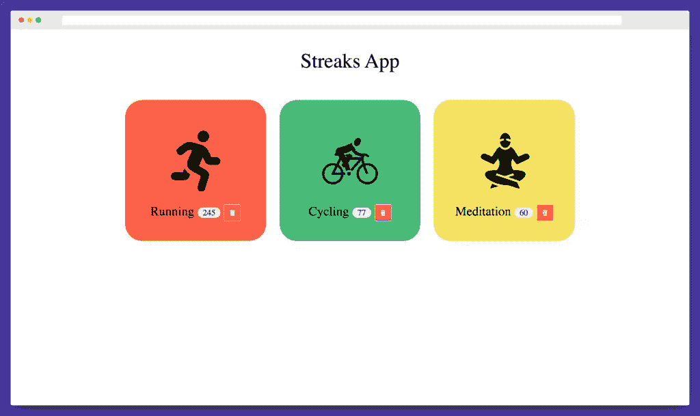

### 养成习惯

现在让我们打开`CreateHabit.js`并粘贴以下内容:

```
import {
  Button,
  Flex,
  FormControl,
  FormLabel,
  Icon,
  Input,
  Modal,
  ModalBody,
  ModalCloseButton,
  ModalContent,
  ModalFooter,
  ModalHeader,
  ModalOverlay,
  useDisclosure,
} from '@chakra-ui/core'
import composeRefs from '@seznam/compose-react-refs'
import React, { useRef } from 'react'
import useForm from 'react-hook-form'
import { useMutation } from 'urql'
import { CREATE_HABIT_MUTATION } from '../graphql/index'

export const CreateHabit = () => {
  const { handleSubmit, register } = useForm()
  const { isOpen, onOpen, onClose } = useDisclosure()
  const [res, executeMutation] = useMutation(CREATE_HABIT_MUTATION) // eslint-disable-line no-unused-vars

  const initialRef = useRef()
  const finalRef = useRef()

  const onSubmit = (values, e) => {
    const { name, streak } = values
    executeMutation({
      name,
      streak: +streak,
    })
    e.target.reset()
    onClose()
  }

  return (
    <Flex
      width='300px'
      height='300px'
      borderRadius='40px'
      margin='16px'
      padding='16px'
      justify='center'
      flexWrap='wrap'
    >
      <Icon
        name='small-add'
        onClick={onOpen}
        fontSize='300px'
        cursor='pointer'
      />
      <Modal
        initialFocusRef={initialRef}
        finalFocusRef={finalRef}
        isOpen={isOpen}
        onClose={onClose}
      >
        <ModalOverlay />
        <ModalContent>
          <ModalHeader>Create Habit</ModalHeader>
          <ModalCloseButton />
          <form onSubmit={handleSubmit(onSubmit)}>
            <ModalBody pb={6}>
              <FormControl>
                <FormLabel htmlFor='name'>Habit name</FormLabel>
                <Input
                  name='name'
                  ref={composeRefs(initialRef, register)}
                  placeholder='Enter your habit'
                  width='90%'
                />
              </FormControl>

              <FormControl mt={4}>
                <FormLabel htmlFor='streak'>Streak</FormLabel>
                <Input
                  name='streak'
                  type='number'
                  placeholder='Enter your streak'
                  width='90%'
                  ref={register}
                />
              </FormControl>
            </ModalBody>

            <ModalFooter>
              <Button
                type='submit'
                rounded='md'
                bg='green.500'
                color='white'
                mr={3}
              >
                Save
              </Button>
              <Button onClick={onClose}>Cancel</Button>
            </ModalFooter>
          </form>
        </ModalContent>
      </Modal>
    </Flex>
  )
} 
```

同样，大部分内容是从 Chakra UI 的 [FormControl](https://chakra-ui.com/formcontrol) 中复制的。在这里，我们向用户显示一个`+`图标，它来自 Chakra 自己的[图标](https://chakra-ui.com/icon)组件。

当点击`+`图标时，我们打开一个使用[反应钩子形式](https://react-hook-form.com/)的模态。

React 钩子表单是用钩子构建表单的最简单的方法。我们只需要将`register`传递给我们想要跟踪的`input`的`ref`。当我们从`react-hook-form`调用钩子`useForm`时，我们得到`register`。我们还获得了`handleSubmit`，我们需要将它传递给`form`组件。我们需要传递`handleSubmit`一个函数。在我们的例子中，我们传递`onSubmit`并且这个函数的第一个参数`values`是我们得到的值，这些值是用户输入的。

这里需要注意的一点是，我们使用来自`@seznam/compose-react-refs`的`composeRefs`来组成多个 refs。这是必需的，因为我们需要提供`register` ref 来注册我们的 React 钩子表单并跟踪该值。第二个 ref `initialRef`是需要的，因为我们需要它在弹出窗口一出现就关注第一个输入。对于使用屏幕阅读器的人来说，这对于辅助功能也是必要的。

最后，当我们调用`onSubmit`时，我们检查它是否不为空，然后我们用两个参数`name`和`streak`调用突变。`+streak`表示`String`被强制为`Number`。基本上，从 React 钩子表单返回的所有值都是`strings`，但是在我们的后端，我们期待的是`number`。

最后，我们`reset`表单来清除所有的值和输入状态。然后我们关闭模态。

现在继续将`CreateHabit`导入顶部的`ListAllHabits.js`:

```
import { CreateHabit, Error, Habit, Loading } from './index' 
```

此外，确保将它包含在您使用`Array.map()`列出所有习惯的上方，如下所示:

```
<CreateHabit /> 
```

`ListAllHabits.js`文件现在必须看起来像这样:

```
import { Flex, Text } from '@chakra-ui/core'
import React from 'react'
import { useQuery } from 'urql'
import { LIST_ALL_HABITS_QUERY } from '../graphql/index'
import { CreateHabit, Error, Habit, Loading } from './index'

export const ListAllHabits = () => {
  const [{ fetching, error, data }] = useQuery({ query: LIST_ALL_HABITS_QUERY })

  if (fetching) return <Loading />
  if (error) return <Error />
  const noHabits = !data.habits.length

  return (
    <Flex
      justify='center'
      align='center'
      flexWrap='wrap'
      flexDirection={noHabits ? 'column' : 'row'}
    >
      {noHabits && (
        <Text fontWeight='bold' fontSize='3xl' color='tomato'>
          You currently track 0 habits. Add one.
        </Text>
      )}
      <CreateHabit />
      {data.habits.map((habit, i) => (
        <Habit key={habit.id} index={i} habit={habit} />
      ))}
    </Flex>
  )
} 
```

它现在应该显示如下的`+`符号:

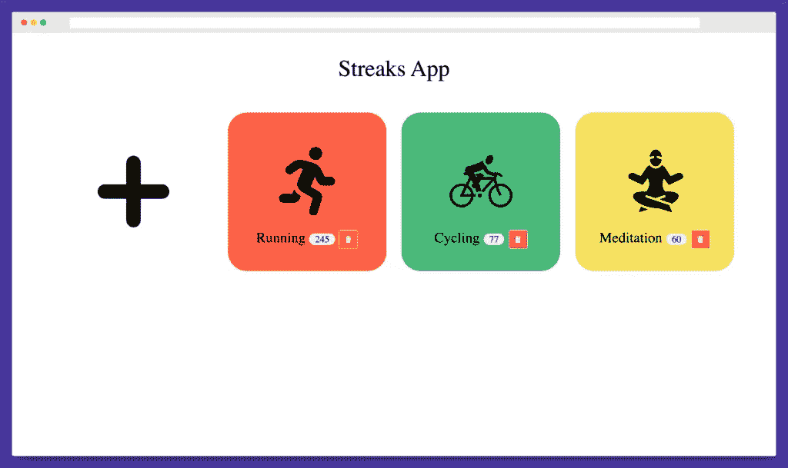

现在点击`+`符号，添加我们删除的带有`50`条纹的`Workout`习惯。

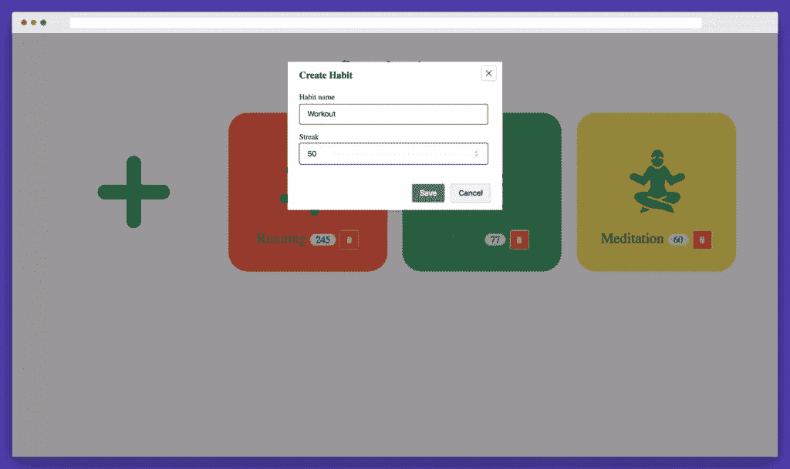

一旦你点击`Save`，注意它会立即被添加。

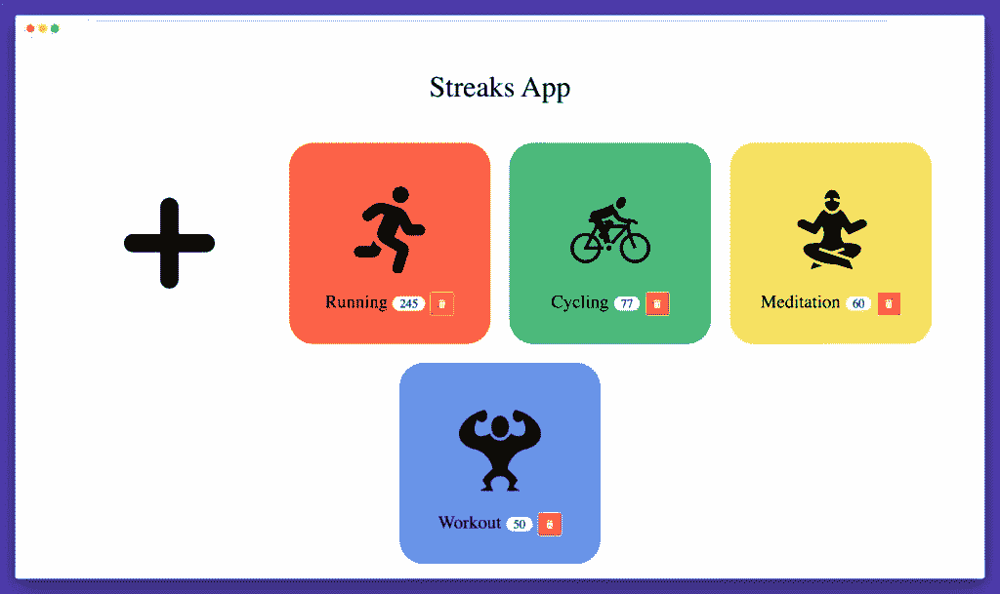

你可以添加一堆你想追踪的其他习惯。添加了一堆习惯之后，现在看起来是这样的:

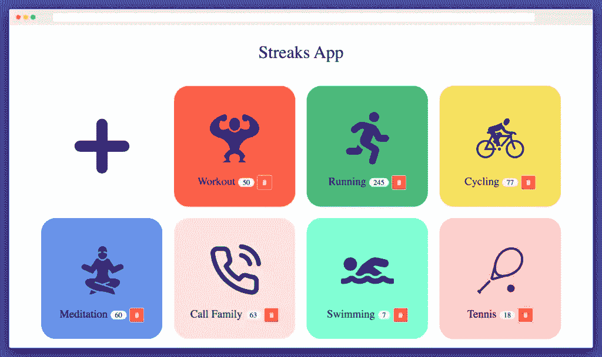

## 结论

在本教程中，我们从头开始构建了一个完整的习惯跟踪器应用程序“Streaks”。我们使用 [Chakra UI](https://chakra-ui.com/) 作为我们的 React 组件库来快速制作一个漂亮的、可访问的应用程序。Chakra UI 通过添加内置的构建模块帮助我们创建警报、模态和微调器，这样我们就可以专注于编写逻辑而不是编写 CSS。

我们使用的 [React 钩子来创建简单易用的表单。它让我们不用写很多代码就能保持表单的简洁。](https://react-hooks-form.com/)

在我们的后端，我们使用了 Prisma 框架。我们使用 Prisma 自己的[光子](https://photonjs.prisma.io/)来声明性地创建数据模型，使用 [Lift](https://lift.prisma.io/) 来执行数据库迁移。Prisma 通过使用静态类型使查询数据库变得简单，这使我们可以放心地编码。内置的自动完成功能允许我们以闪电般的速度编写应用程序。

当 Prisma 框架处于测试阶段时，你可以在你的业余项目中享受它的乐趣。很快就出来了，敬请关注。

现在，您可以放心地创建自己的全栈应用了。

## 分享这篇文章