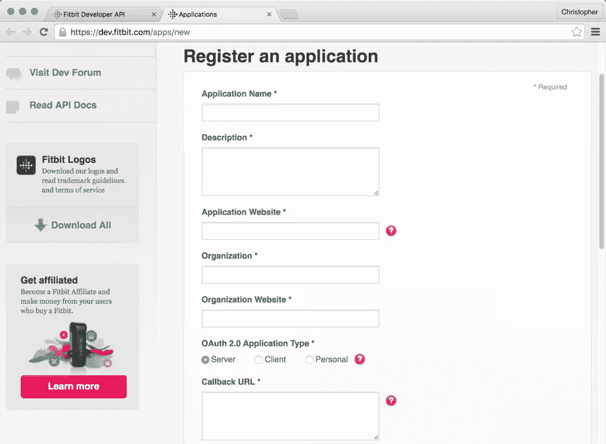
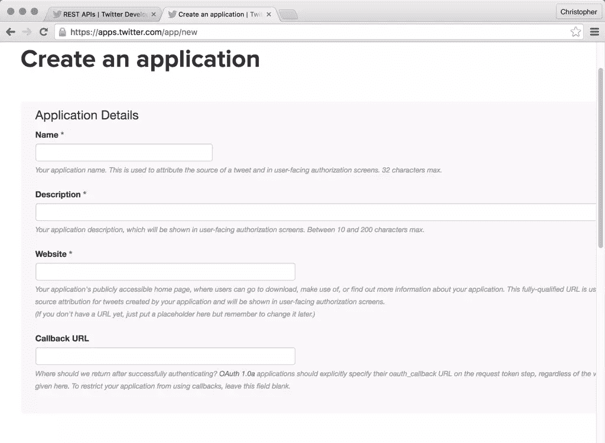

# 入侵 Fitbit——模仿 Twitter DMs 的寻呼机！

> 原文：<https://www.sitepoint.com/hacking-the-fitbit-emulating-a-pager-for-twitter-dms/>

我一直试图在早上早点醒来。问题是闹钟会吵醒所有人，不仅仅是我。为了解决这个问题，我最近买了我能找到的最便宜的 Fitbit，因为我了解到他们有一个整洁的静音闹钟。

事实是，如果我有现金，我宁愿买苹果手表。当我拿到 Fitbit 的时候，我的程序员大脑立刻跳到了问题上；“我怎么黑这个东西？”


我最终了解了一些关于 Fitbit、OAuth 和 Twitter API 的知识。我还了解到，有时候买一块苹果手表会更好…

本教程的代码可以在 [Github](https://github.com/assertchris-tutorials/tutorial-hacking-the-fitbit) 上找到。

## 入门指南

我决定尝试使用无声警报作为通知系统。我会查看新的 Twitter 直接消息，并尽快设置闹钟。这样，当我感觉到一个我没有预料到的无声警报时，我可以查看 Twitter…

原来 [Fitbit](https://dev.fitbit.com/) 和 [Twitter](https://dev.twitter.com/overview/documentation) 都有 JSON APIs，并且都通过 OAuth 认证。我首先创建了一个新的 [Lumen](https://www.sitepoint.com/building-a-hacker-news-reader-with-lumen/) 应用程序，作为这个项目的任务调度器和通信器:

```
composer install laravel/lumen . 
```

Lumen 实际上只是 Laravel 框架的精简版本。默认情况下，有一些东西是禁用的，其他东西设置为“轻量级”替代实现。您在 Lumen 中构建的所有东西都可以移植到 Laravel，所以我想我应该尝试一下，看看它是否足够快，是否有足够的功能来处理通信。

交流需要分两步进行:

1.  创建链接/按钮，将应用程序连接到 Twitter 和 Fitbit
2.  计划命令行任务以检查新的直接消息并设置警报。

我首先为第一步添加路由:

```
$app->get("/", function() {
    return view("dashboard");
});

$app->get("/auth/fitbit", function() {
    // begin auth with fitbit
});

$app->get("/auth/fitbit/callback", function() {
    // store oauth credentials
});

$app->get("/auth/twitter", function() {
    // begin auth with twitter
});

$app->get("/auth/twitter/callback", function() {
    // store oauth credentials
}); 
```

*这发生在`app/Http/routes.php`。*

我还必须为这些创建一个仪表板视图:

```
<a href="{{ url("auth/fitbit") }}">connect with fitbit</a>
<a href="{{ url("auth/twitter") }}">connect with twitter</a> 
```

*这发生在`resources/views/dashboard.blade.php`。*

Lumen 中已经删除了`artisan serve`命令，但是如果你真的想要回它(就像我一样)，你可以用:

```
composer require mlntn/lumen-artisan-serve 
```

您还必须在`app/Console/Kernel.php`中将`\Mlntn\Console\Commands\Serve::class`添加到注册的控制台命令列表中。

## 注册应用程序

Fitbit 和 Twitter 都要求我注册新的应用程序，然后他们才会提供我认证所需的 OAuth 密钥。



我在本地开发这个，使用 Artisan 服务器，到达像`http://localhost:8080/auth/twitter`这样的路线。Twitter 应用程序注册页面不允许带有本地主机、IP 地址或端口号的回拨 URL。

我正要设置从`https://assertchris.io/auth/twitter`到`http://localhost:8080/auth/twitter`的重定向，这时我注意到在 Twitter 的接口和 OAuth 请求中可以使用不同的回调 URL。如果您遇到同样的问题，只需在 Twitter 界面中使用一个假的 URL(来自真实域),并且在您发出 OAuth 请求时使用本地 URL，我将向您展示…



## 发出 OAuth 请求

我选择 Lumen 的原因之一是因为[名媛](https://github.com/laravel/socialite)。交际花抽象了 OAuth 和 [Guzzle](https://github.com/guzzle/guzzle) 涉及的大部分苦差事，抽象了其余的！

我添加了 Fitbit 和 Twitter 的公开密钥和秘密密钥:

```
FITBIT_KEY=...
FITBIT_SECRET=...
FITBIT_REDIRECT_URI=...

TWITTER_KEY=...
TWITTER_SECRET=...
TWITTER_REDIRECT_URI=... 
```

*这发生在`.env`。*

*如果我在 Laravel 中构建这个应用程序，我也需要修改`app/config/services.php`来引用这些`.env`变量。*

然后我安装了来自`https://socialiteproviders.github.io`的社交网站、Fitbit 和 Twitter 提供商:

```
composer require laravel/socialite
composer require socialiteproviders/fitbit
composer require socialiteproviders/twitter 
```

部分社交网站安装说明建议将社交网站服务提供商添加到`config/app.php`中的服务提供商列表中。第三方 Fitbit 和 Twitter 提供商有一个不同的服务提供商，取代了官方的服务提供商。

Lumen 去掉了`config`文件夹，所以这个服务提供者需要在`bootstrap/app.php`中注册。我还取消了对`EventServiceProvider`类的注释:

```
$app->register(
    App\Providers\EventServiceProvider::class
);

$app->register(
    SocialiteProviders\Manager\ServiceProvider::class
); 
```

*这发生在`bootstrap/app.php`。*

既然`EventServiceProvider`类又回来了，我可以添加这些 OAuth 提供者需要的事件了:

```
namespace App\Providers;

use Laravel\Lumen\Providers\EventServiceProvider as Base;
use SocialiteProviders\Manager\SocialiteWasCalled;
use SocialiteProviders\Fitbit\FitbitExtendSocialite;
use SocialiteProviders\Twitter\TwitterExtendSocialite;

class EventServiceProvider extends Base
{
    protected $listen = [
        SocialiteWasCalled::class => [
            FitbitExtendSocialite::class . "@handle",
            TwitterExtendSocialite::class . "@handle",
        ],
    ];
} 
```

*这发生在`app/Providers/EventServiceProvider.php`。*

有了这些设置，我就可以开始连接 Fitbit 和 Twitter 了:

```
use Laravel\Socialite\Contracts\Factory;

$manager = $app->make(Factory::class);

$fitbit = $manager->with("fitbit")->stateless();
$twitter = $manager->with("twitter");

$app->get("/auth/fitbit", function() use ($fitbit) {
    return $fitbit->redirect();
});

$app->get("/auth/fitbit/callback", function() use ($fitbit) {
    // use $fitbit->user()
});

$app->get("/auth/twitter", function() use ($twitter) {
    return $twitter->redirect();
});

$app->get("/auth/twitter/callback", function() use ($twitter) {
    // use $twitter->user()
}); 
```

*这发生在`app/Http/routes.php`。*

*Lumen 中默认禁用的另一项功能是会话管理。这是有意义的，因为 Lumen 主要面向无状态 JSON web 服务，而不是实际的网站。问题是 Socialite 在 OAuth 2 中默认使用会话。我可以用`stateless()`方法……*禁用它

每个交际花提供者都提供了一个`redirect()`方法，我可以用自定义的路径返回它。当用户点击该路由时，他们会被重定向到我希望他们进行身份验证的服务。

一个简单的`dd($fitbit->user())`和`dd($twitter->user())`向我展示了细节正按预期返回到我的本地服务器上。

现在我可以从 Twitter 上直接获取信息:

```
use GuzzleHttp\Client;
use GuzzleHttp\HandlerStack;
use GuzzleHttp\Subscriber\Oauth\Oauth1;
use Illuminate\Support\Facades\Cache;

$app->get("/auth/twitter/callback", function() use ($twitter) {
    $user = $twitter->user();

    Cache::forever("TWITTER_TOKEN", $user->token);
    Cache::forever("TWITTER_TOKEN_SECRET", $user->tokenSecret);

    return redirect("/");
}); 
```

*这发生在`app/Http/routes.php`。*

连接到这些服务只是第一步。一旦他们将数据发送回我的应用程序，我需要将其附加到未来的请求中。最好通过另一条路径获取直接消息，所以现在我将把它们存储在缓存中。

默认的缓存提供者是 Memcache。如果您的操作系统中没有它，您可以安装它，或者配置不同的缓存驱动程序。

*我还使用了一个 Laravel facade 来快速访问底层缓存类。这些在 Lumen 中默认是禁用的，但是您可以在`boostrap/app.php`中取消对`$app->withFacades();`的注释来再次启用它们。*

## 获取直接消息

接下来，我将添加一个到仪表板的链接和一个新的路由，用于获取直接消息:

```
<a href="{{ url("twitter/fetch") }}">fetch direct messages</a> 
```

*这发生在`resources/views/dashboard.blade.php`。*

```
$app->get("twitter/fetch", function() {
    $middleware = new Oauth1([
        "consumer_key" => getenv("TWITTER_KEY"),
        "consumer_secret" => getenv("TWITTER_SECRET"),
        "token" => Cache::get("TWITTER_TOKEN"),
        "token_secret" => Cache::get("TWITTER_TOKEN_SECRET"),
    ]);

    $stack = HandlerStack::create();
    $stack->push($middleware);

    $client = new Client([
        "base_uri" => "https://api.twitter.com/1.1/",
        "handler" => $stack,
    ]);

    $response = $client->get("direct_messages.json", [
        "auth" => "oauth",
    ]);

    header("content-type: application/json");
    print $response->getBody();
}); 
```

*这发生在`app/Http/routes.php`。*

由于我有令牌和令牌秘密(作为 OAuth 过程的一部分，从 Twitter 发回给我们)，我们可以使用`HandlerStack`和`Oauth1`类透明地将 OAuth 凭证添加到我用 Guzzle 发出的请求中。

我可以稍微修改一下，记录当前的直接消息，这样我就可以知道我收到了什么新消息:

```
$latest = Cache::get("TWITTER_LATEST", 0);

$response = $client->get("direct_messages.json", [
    "auth" => "oauth",
    "query" => [
        "since_id" => $latest,
    ],
]);

// header("content-type: application/json");
// print $response->getBody();

$response = (string) $response->getBody();
$response = json_decode($response, true);

foreach ($response as $message) {
    if ($message["id"] > $latest) {
        $latest = $message["id"];
    }
}

Cache::forever("TWITTER_LATEST", $latest); 
```

*这发生在`app/Http/routes.php`。*

Twitter 允许我过滤掉指定的直接消息 ID 之后的所有直接消息，所以我应该循环所有的直接消息并缓存最新的(最大的)ID。那么未来的请求将不包括旧的直接消息，如果有任何新消息，我可以设置警报。

## 设置静音警报

我想存储 Fitbit OAuth 令牌的详细信息，就像我为 Twitter 做的那样:

```
$app->get("/auth/fitbit/callback", function() use ($fitbit) {
    $user = $fitbit->user();

    Cache::forever("FITBIT_TOKEN", $user->token);
    Cache::forever("FITBIT_USER_ID", $user->id);

    return redirect("/");
}); 
```

*这发生在`app/Http/routes.php`。*

现在，假设我已经连接到 Fitbit 和 Twitter，我可以在有新的直接消息时设置闹钟:

```
if (count($response)) {
    $token = Cache::get("FITBIT_TOKEN");
    $userId = Cache::get("FITBIT_USER_ID");

    $client = new Client([
        "base_uri" => "https://api.fitbit.com/1/",
    ]);

    $response = $client->get("user/-/devices.json", [
        "headers" => [
            "Authorization" => "Bearer {$token}"
        ]
    ]);

    $response = (string) $response->getBody();
    $response = json_decode($response, true);

    $id = $response[0]["id"];

    $endpoint =
        "user/{$userId}/devices/tracker/{$id}/alarms.json";

    $response = $client->post($endpoint, [
        "headers" => [
            "Authorization" => "Bearer {$token}"
        ],
        "form_params" => [
            "time" => date("H:iP", strtotime("+1 minute")),
            "enabled" => "true",
            "recurring" => "false",
            "weekDays" => [strtoupper(date("l"))],
        ],
    ]);

    header("content-type: application/json");
    print $response->getBody();
} 
```

*这发生在`app/Http/routes.php`。*

注意到我为什么需要在 Fitbit 中使用一种不同的身份验证了吗？Fitbit 使用 OAuth 2，并允许令牌的承载报头。这比 Twitter 的 OAuth 1 要求简单多了。

我发出的第一个请求是获取我的 Fitbit 帐户中的设备。给我多一点时间，我可以创建一个列表，和一些选择排序，使它更动态一点。

一旦我有了设备 ID(分配了 Fitbit ),我就可以创建一个新的静音警报。它需要一个特殊的日期格式，并且日期需要是大写的今天。调试信息告诉我是否设置了新的警报。如果没有直接消息，我什么也看不到。

## 结论

这对我来说是一个非常有趣的项目。我了解了一些关于新 Lumen 应用程序的限制，使用 Socialite 连接到 OAuth 服务，以及如何与 Fitbit 和 Twitter APIs 交互。

我的 Fitbit 至少每 15 分钟同步一次，每次打开 iPhone 应用程序时也是如此。也许新的 Fitbit 型号同步更频繁，或者有某种服务器启动的推送。这只是一个我不得不忍受的限制。或者我可以买一块苹果手表。

## 分享这篇文章