# Android Wear 开发者预览版，第 2 部分

> 原文：<https://www.sitepoint.com/hands-android-wear-developer-preview-part-2/>

在第 1 部分中，我们介绍了 Android Wear，如何注册该程序并让模拟器工作。让我们进行一些开发，向我们的 Android wear 项目添加支持库。

## Android 预览应用

回顾一下我之前关于如何开始的文章中的步骤:

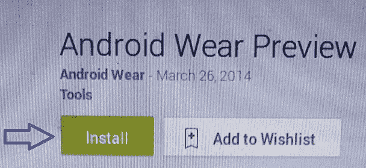

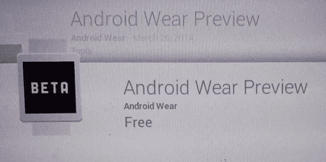

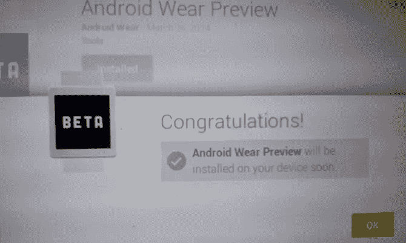

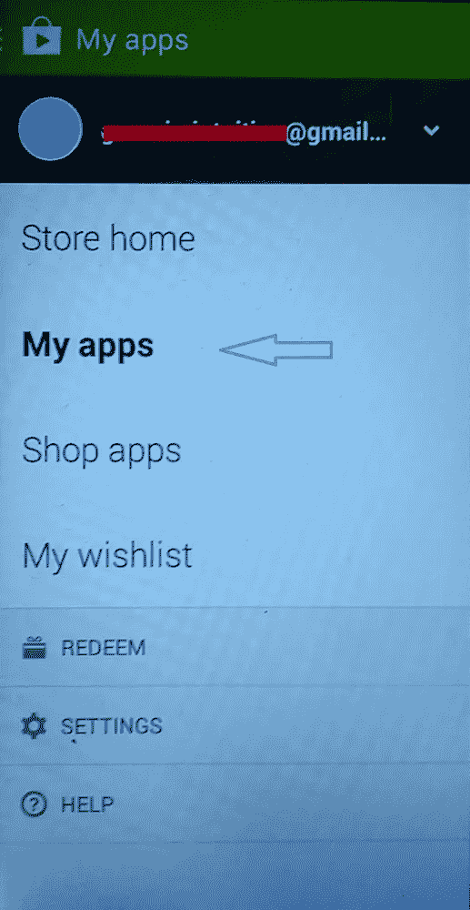

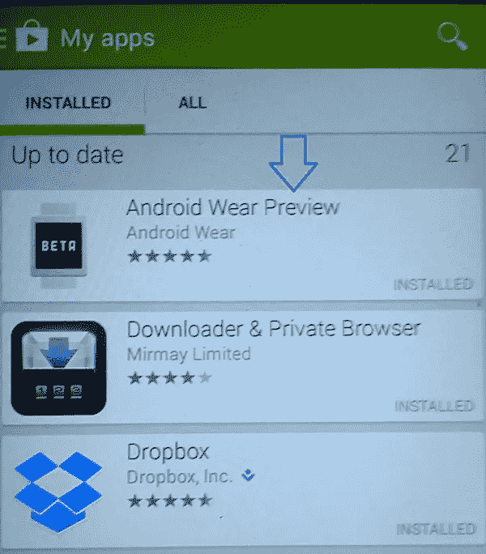

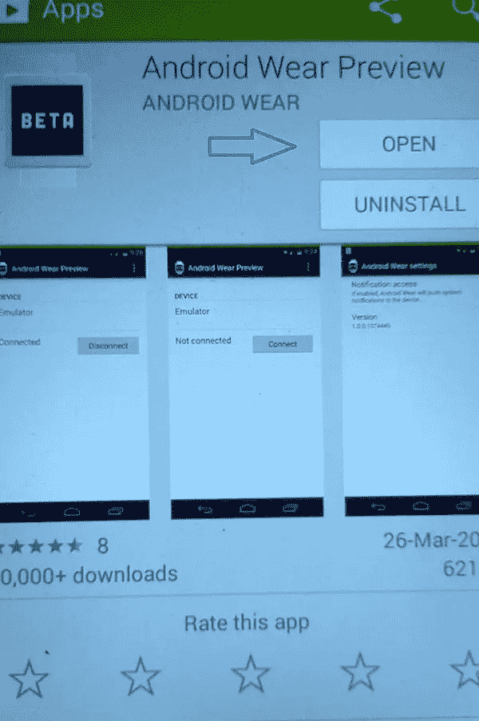

如上图，通过打开 Android Wear 预览应用，你会看到如下消息:


现在，点击消息:

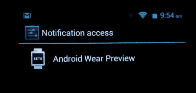

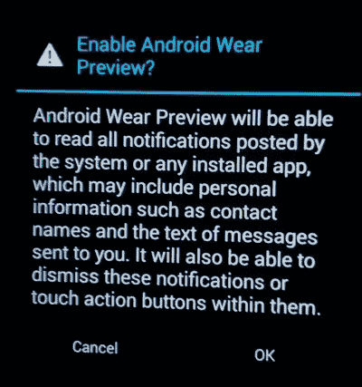

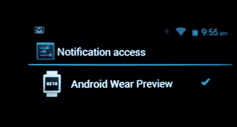

使用 USB 将您的设备连接到开发机器。

*注意:机器不应连接其他 Android 设备。*

确保 Android Wear 模拟器正在运行。模拟器应该处于相同的状态，显示时间和表示没有设备连接的断开图标。

打开一个终端，按照以下步骤操作:

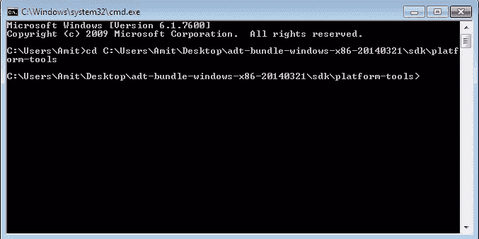

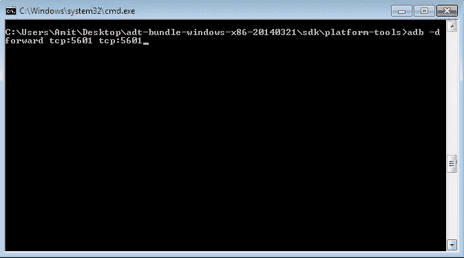

**adb -d 转发 tcp:5601 tcp:5601**

解释一下:

**ADB**:*Android Debug Bridge*，一个与仿真器实例或连接的 Android 设备通信的客户端-服务器程序。

**-d** :向连接的 USB 设备发出 adb 命令。

**转发**:端口转发，将特定主机端口上的请求转发到不同的端口。

您也可以尝试这些命令:
**adb 设备**:打印所有连接的仿真器和设备的列表。

**adb 版本**:打印 adb 版本号。

Android Wear 模拟器现在将显示“g”orb 图标，表明它已与您的 Android 设备配对。

## 添加 Android Wear 预览版支持库

要添加 Android 支持库及其包含的几个 API，您必须注册开发者预览版。

阅读我的[上一篇文章](https://www.sitepoint.com/hands-android-wear-developer-sdk/)来提醒自己预览支持库下载链接。

注册成功后 Google 发来的邮件如下图所示:


下载并解压缩软件包后，按照以下步骤将库添加到项目中:

*   在 Android 应用程序项目根目录下创建一个 **libs/** 目录。
*   将 v4 支持库 JAR 文件从 Android SDK 目录复制到项目的 **libs/** 目录中。
    SDK 目录路径:**<sdk>/extras/Android/support/v4/Android-support-v4 . jar</sdk>**
    这里的路径是:**ADT-bundle-windows-x86–2014 03 21/SDK/extras/Android/support/v4**

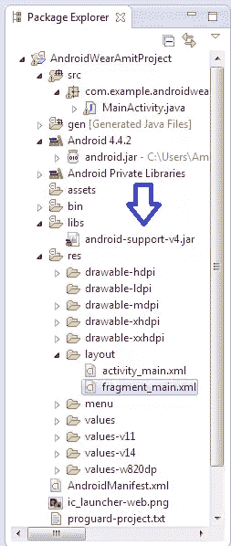

*   将 Android SDK 目录下的 30kb jar 文件 wearable-preview-support.jar 复制到您的项目 **libs/** 目录下。


*   将*wearable-preview-support . jar*文件粘贴到 **libs/** 目录下。

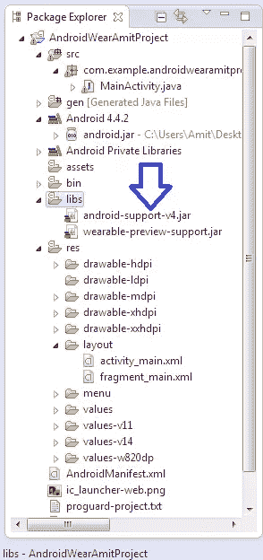

*   右键单击 JAR 文件并选择**构建路径>添加到构建路径**。

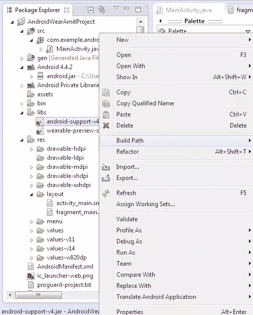

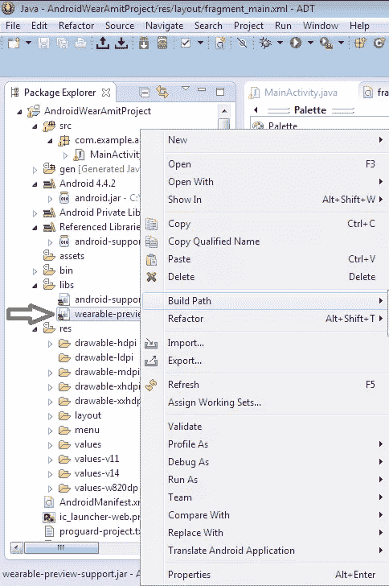

## 让我们创建通知

通知使可穿戴体验成为现实，并可以通过各种方式增强。

下面的代码片段应该添加到`MainActivity.java`文件中。您可以通过展开 **src/** 节点找到这个文件。我假设你非常熟悉 Android 的目录结构。

*注意:您可以在启动项目时在 src/ node 中创建一个 java 文件，而不是创建默认的 MainActivity.java 文件*

让我们从导入所需的类开始:

### 从导入类开始


### 创建通知

对于通知，我们使用以下两个 API:

*   [通知 Compat API](http://developer.android.com/reference/android/support/v4/app/NotificationCompat.html)
*   [通知经理 Compat API](http://developer.android.com/reference/android/preview/support/v4/app/NotificationManagerCompat.html)

我们将使用以下类和方法:

*   **Intent** :是一个对要执行的操作给出抽象描述的类。
*   **pending content**:是一个类，它给出了意图和要执行的目标动作的描述。
*   **putExtra()** :将扩展数据添加到意图的方法。
*   **getActivity()** :检索`PendingIntent`以开始新活动的方法。
*   **setSmallIcon()** :设置小图标的方法。
*   **setContentTitle()** :设置文本第一行的方法。
*   **setContentText()** :设置第二行文本的方法。
*   **setContentIntent()** :当一个通知被点击时，这个方法提供了一个要发送的`PendingIntent`。
*   **notify()** :这个方法使得一个线程(正在等待)被唤醒。

通知的代码片段如下:

```
// Unique ID for notification
int id = 1;

// Build intent for notification content
Intent intent = new Intent(this, ViewEventActivity.class);
intent.putExtra(EXTRA_EVENT_ID, eventId);
PendingIntent pendingIntent = PendingIntent.getActivity(this, 0, intent, 0);

// The Builder class for NotificationCompat objects. 
NotificationCompat.Builder builder = new NotificationCompat.Builder(this)
        .setSmallIcon(R.drawable.ic_event)
        .setContentTitle(eventTitle)
        .setContentText(eventLocation)
        .setContentIntent(pendingIntent);

// Get an instance of the NotificationManager service
NotificationManagerCompat notificationMgr = NotificationManagerCompat.from(this);

// Build the notification and issue it with the notification manager.
notificationMgr.notify(id, builder.build());
```

下面的代码片段将一个`NotificationCompat.BigTextStyle`实例添加到事件通知中，以包含完整的事件描述。

在`NotificationCompat.Builder`对象上调用`setStyle()`，向其传递一个`BigTextStyle`的实例，将扩展内容添加到您的通知中。`InboxStyle`也可以作为实例传递。

这里，我们使用了以下类和方法:

**BigTextStyle** :是一个生成大格式通知的 rebuilder 类。
**addAction** :向通知添加动作的方法。

```
// Used for generating large-format notifications that include lengthy text
BigTextStyle bigStyle = new NotificationCompat.BigTextStyle();
bigStyle.bigText(eventDescription);

NotificationCompat.Builder builder = new NotificationCompat.Builder(this)
        .setSmallIcon(R.drawable.ic_event)
        .setLargeIcon(BitmapFractory.decodeResource(getResources(), R.drawable.notif_background))
        .setContentTitle(eventTitle)
        .setContentText(eventLocation)
        .setContentIntent(viewPendingIntent)
        .addAction(R.drawable.ic_map, getString(R.string.map), mapPendingIntent)
        .setStyle(bigStyle);
```

在手持设备上展开通知可以看到大量内容，而在 Android Wear 上，内容是默认可见的。

可以使用以下方法将更多内容添加到您的通知中:

*   **setLargeIcon** (位图图标):设置大图标。
*   **setNumber** (int number):设置通知右侧的大数字。
*   **setVibrate** (long[]模式):设置的振动模式。
*   **setWhen** (long when):设置事件发生的时间，面板中的通知按此时间排序。

## 是时候给通知添加一些页面了

总的来说，生活并不局限于一次做一件事。许多其他分心的事物让我们忙碌而不专注。大量的通知会造成混乱，让用户不知所措。

为了减少混乱，可以在 Android Wear 的通知中添加一个或多个页面。附加页面会立即出现在主通知卡的右侧。

在这里，我们将使用以下方法:

*   **addPage()** :用于添加单页
*   **addPages()** :用于添加多页

通过创建主通知(即通知的首页)来启动流程。这是通过使用`addPage()`方法完成的。永远记住一次添加一页，要添加多页，使用`Collection`和`addPages()`方法。

例如，下面是向通知添加第二页的代码片段:

```
// Builder for the main notification
NotificationCompat.Builder builder = new NotificationCompat.Builder(this)
        .setSmallIcon(R.drawable.new_message)
        .setContentTitle(&quot;Page One&quot;)
        .setContentText(&quot;Club event at 8PM today&quot;)
        .setContentIntent(viewPendingIntent);

// Big text style for page two
BigTextStyle pageTwoStyle = new NotificationCompat.BigTextStyle();
secondPageStyle.setBigContentTitle(&quot;Page Two&quot;).bigText(&quot;Meet me at the restaurant within 1 hour for further discussions.&quot;);

// Create page two notification
Notification pageTwoNotification = new NotificationCompat.Builder(this).setStyle(pageTwoStyle).build();

// Create main notification and add the second page
Notification addNotification = new WearableNotifications.Builder(builder)
        .addPage(pageTwoNotification)
        .build();
```

## 堆叠通知

为手持设备创建通知时，您应该将相似的通知聚合到一个摘要通知中。例如，当收到多条消息时，使用一条通知来提供摘要，如“3 条新消息”

将可穿戴设备的所有通知组合在一个堆栈中。通知堆栈显示为一个卡片，用户可以展开该卡片来分别查看每个通知的详细信息。

### 分组

对于通知分组，我们使用以下方法:

*   setGroup ():要创建一个堆栈，请为堆栈中的每个通知调用这个函数，并指定一个组键。
*   **Notify** ():调用此方法将每个通知发送给可穿戴设备。

下面，我们将逐一创建和发布三个通知。让我们从第一个通知开始:

```
final static String GROUP_KEY_EMAILS = &quot;group_key_emails&quot;;

// Build first notification and pass this builder to WearableNotifications.Builder
NotificationCompat.Builder builder = new NotificationCompat.Builder(mContext)
         .setContentTitle(&quot;New message: &quot; + sender1)
         .setContentText(subject1)
         .setSmallIcon(R.drawable.new_mail);

// Use the group GROUP_KEY_EMAILS
Notification notificationOne = new WearableNotifications.Builder(builder)
         .setGroup(GROUP_KEY_EMAILS)
         .build();

// Issuing the notification
NotificationManagerCompat notificationManager = NotificationManagerCompat.from(this);
notificationManager.notify(notificationId1, notif);
```

创建第二个通知时指定相同的组密钥。当您调用`notify()`时，这个通知出现在与前一个通知相同的堆栈中:

```
// Build second notification
builder = new NotificationCompat.Builder(mContext)
         .setContentTitle(&quot;New message: &quot; + sender2)
         .setContentText(subject2)
         .setSmallIcon(R.drawable.new_mail);

// Use the same group GROUP_KEY_EMAILS
Notification notificationTwo = new WearableNotifications.Builder(builder).setGroup(GROUP_KEY_EMAILS).build();  

// Second notification
notificationManager.notify(notificationId2, notif);
```

现在，第三个通知:

```
// Build third notification
builder = new NotificationCompat.Builder(mContext)
         .setContentTitle(&quot;New message: &quot; + sender3)
         .setContentText(subject3)
         .setSmallIcon(R.drawable.new_mail);

// Use the same group GROUP_KEY_EMAILS
Notification notificationThree = new WearableNotifications.Builder(builder).setGroup(GROUP_KEY_EMAILS).build();

// Third notification
notificationManager.notify(notificationId3, notif);
```

默认情况下，最新的通知显示在顶部，其他通知按时间降序排列。

### 汇总通知

在手持设备上，提供通知摘要至关重要。将订单位置设置为`GROUP_ORDER_SUMMARY`很重要。

*注意:此通知不会出现在可穿戴设备的通知堆栈中，而是作为唯一的通知出现在手持设备上。*

```
// For large icon
Bitmap bmpLargeIcon = BitmapFactory.decodeResource(getResources(), R.drawable.ic_large_icon);

builder = new NotificationCompat.Builder(this)
        .setSmallIcon(R.drawable.ic_small_icon)
        .setLargeIcon(bmpLargeIcon);

// Use the same group key GROUP_KEY_EMAILS
WearableNotifications.Builder wearableBuilder = new WearableNotifications
        .Builder(builder)
        .setGroup(GROUP_KEY_EMAILS,
                WearableNotifications.GROUP_ORDER_SUMMARY);

// Build the final notification by passing wearableBuilder to InboxStyle notification
Notification summary = new NotificationCompat.InboxStyle(
        wearableBuilder.getCompatBuilder())
        .addLine(&quot;Amit    Attend Sachin’s last Test Match.&quot;)
        .addLine(&quot;Ansh    Business meeting for e-learning project.&quot;)
        .addLine(&quot;CoMoDay    Event for technical writers.&quot;)
        .setBigContentTitle(&quot;3 new messages&quot;)
        .setSummaryText(&quot;Your Email-Id here&quot;)
        .build();

notificationManager.notify(notificationId4, summary);
```

### 资源参考

*   [支持库](http://developer.android.com/tools/support-library/features.html#v4)
*   [包支持](http://developer.android.com/reference/android/preview/support/package-summary.html)
*   [设计原则](http://developer.android.com/wear/design/index.html)

## 我们学到了什么？

在本期 Android wear 实践中，我们了解到:

*   如何安装 Android Wear 预览版 App？
*   向 Android 项目添加支持库。
*   如何在 android 项目源文件中开始编码？
*   创建和发出通知。
*   向通知添加页面。
*   为通知分组和创建摘要。

尝试创建和发布通知，并在您的应用程序中添加一些页面，让我知道您的体验。

## 分享这篇文章