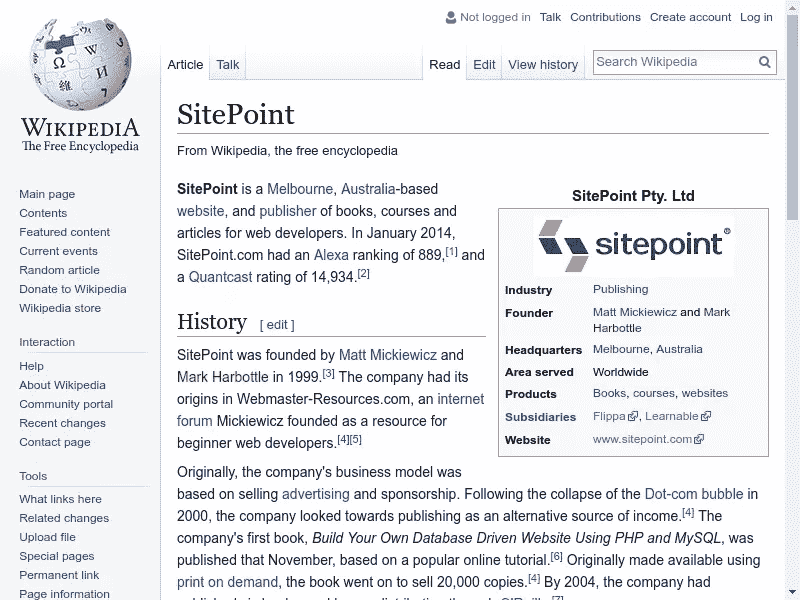

# 快速提示:Node.js 中的 Headless Chrome 入门

> 原文：<https://www.sitepoint.com/headless-chrome-node-js/>

在我们的工作中，我们经常需要能够重复用户旅程，以确保我们的页面在我们对网站进行更改时提供一致的体验。对于能够一致且方便地完成这一点至关重要的是允许我们编写这些类型的测试的库，这样我们就可以针对它们运行断言并维护关于结果的文档。输入 headless browsers:命令行工具，它为您提供了以编程方式编写跨站点的用户交互脚本并捕获测试结果的能力。

多年来，我们中的许多人一直在使用 [PhantomJS](http://phantomjs.org/) 、 [CasperJS](http://casperjs.org/) 和其他工具来完成这一任务。但是，就像爱一样，我们的心可以留给别人。截至 Chrome 59(Windows 用户为 60)，Chrome 自带无头浏览器。此外，尽管它目前不支持 Selenium，但它使用 Chromium 和 Blink 引擎，即它在 Chrome 中模拟实际的用户体验。

与以往一样，本文的代码可以在我们的 [GitHub repo](https://github.com/sitepoint-editors/ChromeHeadless) 上找到。

## 从命令行运行 Headless Chrome

从命令行运行 Headless Chrome 相对容易。在 Mac 上，你可以为 Chrome 设置一个别名，并使用`—headless`命令行参数运行

```
alias chrome="/Applications/Google\ Chrome.app/Contents/MacOS/Google\ Chrome”
chrome --headless --disable-gpu --remote-debugging-port=9090 https://www.sitepoint.com/ 
```

在 Linux 上，甚至更容易:

```
google-chrome --headless --disable-gpu --remote-debugging-port=9090 https://www.sitepoint.com/ 
```

*   `--headless`:运行时没有用户界面或显示服务器依赖关系
*   `--disable-gpu`:禁用 GPU 硬件加速。这是暂时需要的。
*   `--remote-debugging-port`:在指定端口上启用 HTTP 远程调试。

您还可以与您请求的页面进行交互，例如将`document.body.innerHTML`打印到 stdout，您可以:

```
google-chrome --headless --disable-gpu --dump-dom http://endless.horse/ 
```

如果你想知道还有什么可能，可以在这里找到完整的参数列表。

## 在 Node.js 中运行 Headless Chrome

然而，本文的重点不是命令行，而是在 Node.js 中运行 Headless Chrome。

*   chrome-remote-interface:JavaScript API 提供了命令和通知的简单抽象。
*   chrome 启动器(Chrome-launcher):这允许我们跨多个平台从 Node 内部启动 Chrome。

然后我们可以设置我们的环境。这假设您的计算机上安装了 Node 和 npm。如果不是这样，那么[在这里查看我们的教程](https://www.sitepoint.com/quick-tip-multiple-versions-node-nvm/)。

```
mkdir headless
cd headless
npm init -y
npm install chrome-remote-interface --save
npm install chrome-launcher --save 
```

之后，我们想用 headless-chrome 实例化一个会话。让我们从在项目文件夹中创建一个`index.js`文件开始:

```
const chromeLauncher = require('chrome-launcher');
const CDP = require('chrome-remote-interface');

(async function() {
  async function launchChrome() {
    return await chromeLauncher.launch({
      chromeFlags: [
        '--disable-gpu',
        '--headless'
      ]
    });
  }
  const chrome = await launchChrome();
  const protocol = await CDP({
    port: chrome.port
  });

  // ALL FOLLOWING CODE SNIPPETS HERE

})(); 
```

首先，我们需要我们的依赖项，然后创建一个自调用函数来实例化 Chrome 会话。请注意，在撰写本文时需要`--disable-gpu`标志，但在您阅读本文时可能不需要，因为它只是作为一种变通方法[(由 Google 推荐)](https://developers.google.com/web/updates/2017/04/headless-chrome)才需要。我们将使用`async / await`来确保我们的应用程序在执行下一系列步骤之前等待无头浏览器启动。

> **旁注**:我们将使用需要在进入后续步骤之前完成操作的功能。这允许在继续之前有时间呈现页面、执行交互等。这些步骤中有许多是非阻塞的，所以我们需要依靠承诺来暂停执行。关于异步功能的更多信息可以在 [Mozilla 开发者网络](https://developer.mozilla.org/en-US/docs/Web/JavaScript/Reference/Statements/async_function)或者[网站](https://www.sitepoint.com/simplifying-asynchronous-coding-async-functions/)上找到。

接下来，我们需要公开测试所需的域:

```
const {
  DOM,
  Page,
  Emulation,
  Runtime
} = protocol;
await Promise.all([Page.enable(), Runtime.enable(), DOM.enable()]); 
```

这里最重要的是`Page`对象——我们将使用它来访问呈现给 UI 的内容。这也将是我们指定导航到哪里，我们与什么元素交互，以及我们将在哪里运行我们的脚本。

## 浏览页面

一旦我们初始化了我们的会话并定义了我们的域，我们就可以开始浏览站点了。我们希望选择一个起点，因此我们使用上面启用的页面域导航到:

```
Page.navigate({
  url: 'https://en.wikipedia.org/wiki/SitePoint'
}); 
```

这将加载页面。然后，我们可以使用`loadEventFired`方法来定义运行应用程序的步骤，以执行代码来复制我们的用户旅程。在本例中，我们将只抓取第一段的内容:

```
Page.loadEventFired(async() => {
  const script1 = "document.querySelector('p').textContent"
  // Evaluate script1
  const result = await Runtime.evaluate({
    expression: script1
  });
  console.log(result.result.value);

  protocol.close();
  chrome.kill(); 
}); 
```

如果您使用`node index.js`运行脚本，您应该会看到类似下面的输出:

```
SitePoint is a Melbourne, Australia-based website, and publisher of books, courses and articles for web developers. In January 2014, SitePoint.com had an Alexa ranking of 889,[1] and a Quantcast rating of 14,934.[2] 
```

## 更进一步——抓取截图

这很好，但是我们可以很容易地将任何代码替换到那个`script1`值中，以点击链接、填写表单字段，并使用查询选择器运行一系列交互。每一步都可以存储在一个 JSON 配置文件中，并加载到节点脚本中按顺序执行。这些脚本的结果可以使用测试平台(比如 Mocha)进行验证，允许您交叉引用所捕获的值是否满足 UI / UX 需求。

作为测试脚本的补充，当你浏览网站时，你可能会想要捕捉你的页面截图。幸运的是，所提供的域有一个`captureScreenshot`函数可以做到这一点。

```
const chromeLauncher = require('chrome-launcher');
const CDP = require('chrome-remote-interface');
const file = require('fs');

(async function() {
  ...

  Page.loadEventFired(async() => {
    const script1 = "document.querySelector('p').textContent"
    // Evaluate script1
    const result = await Runtime.evaluate({
      expression: script1
    });
    console.log(result.result.value);

    const ss = await Page.captureScreenshot({format: 'png', fromSurface: true});
    file.writeFile('screenshot.png', ss.data, 'base64', function(err) {
      if (err) {
        console.log(err);
      }
    });

    protocol.close();
    chrome.kill();
  });
})(); 
```

`fromSurface`标志是另一个标志，在撰写本文时[是跨平台支持](https://bugs.chromium.org/p/chromium/issues/detail?id=687407)所需要的，在未来的迭代中可能不需要。

使用`node index.js`运行脚本，您应该会看到类似下面的输出:



## 结论

如果你正在编写自动化脚本，你应该现在就开始使用 Chrome 的无头浏览器。虽然它仍然没有与 Selenium 等工具完全集成，但模拟 Chromes 渲染引擎的好处不应被低估。这是以完全自动化的方式重建用户体验的最佳方式。

我会留给你一些进一步的阅读:

*   API 文件:[https://chromedevtools.github.io/devtools-protocol/](https://chromedevtools.github.io/devtools-protocol/)
*   无头 Chrome 入门:[https://developers . Google . com/web/updates/2017/04/Headless-Chrome](https://developers.google.com/web/updates/2017/04/headless-chrome)

请在下面的评论中告诉我你对无头浏览器的体验。

## 分享这篇文章