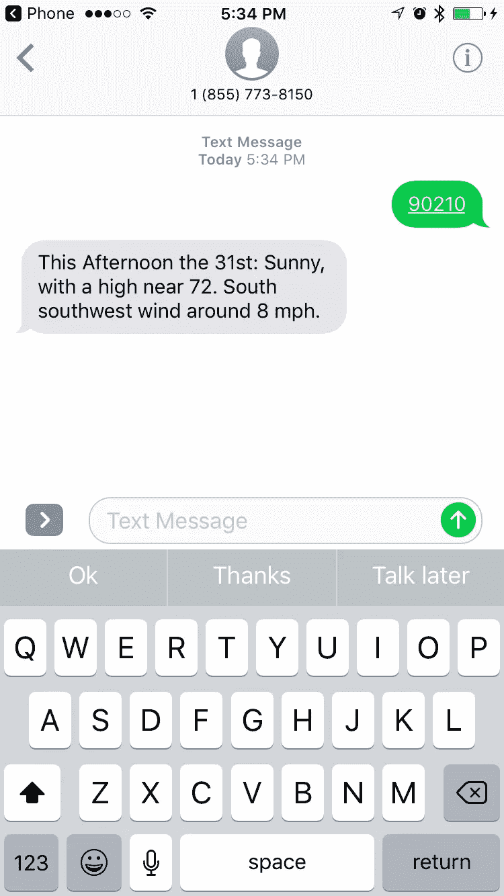
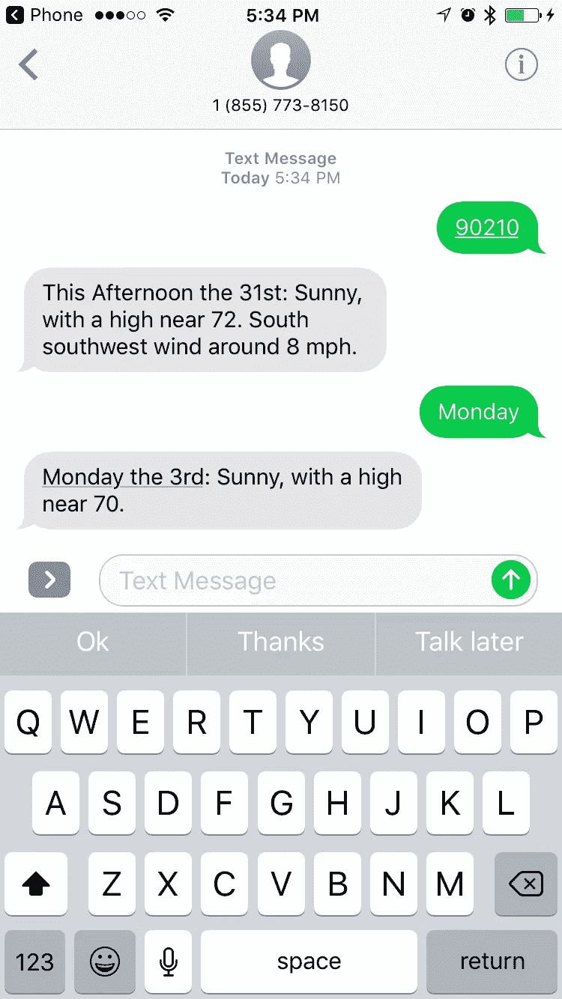
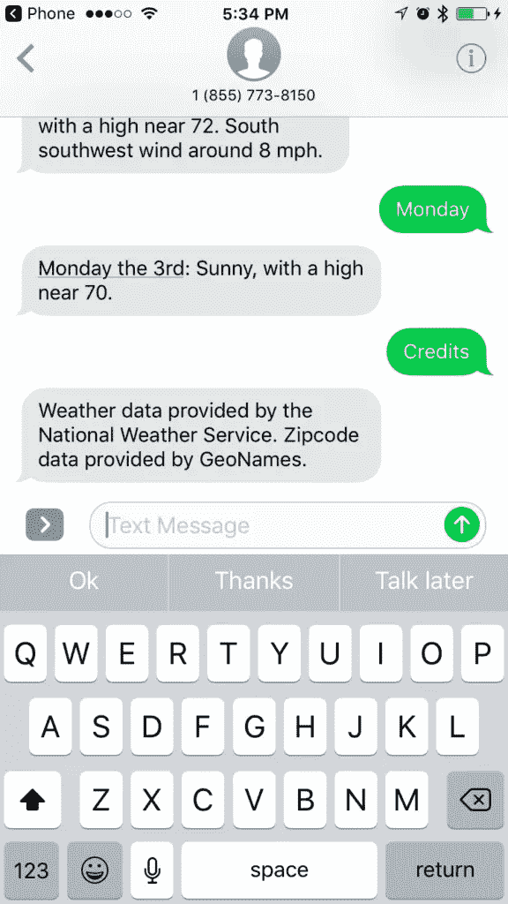
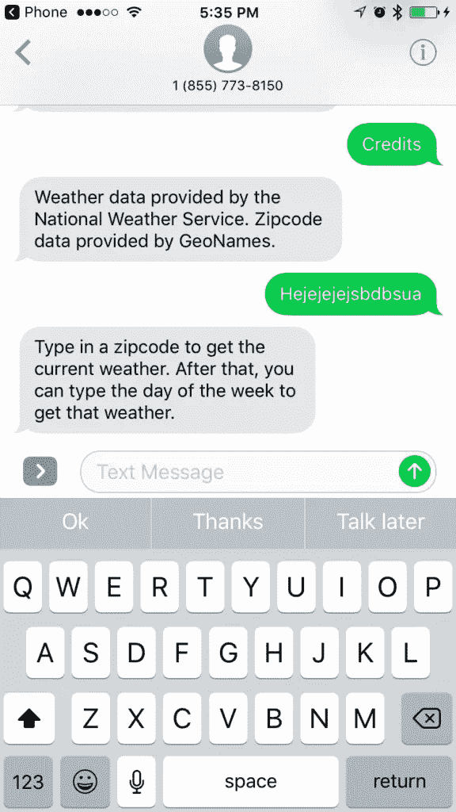

# 你好，拉弗尔？通过短信与 PHP 通信！

> 原文：<https://www.sitepoint.com/hello-laravel-communicating-php-sms/>

*这篇文章由[沃恩·安切塔](https://www.sitepoint.com/author/wancheta)进行了同行评审。感谢 SitePoint 的所有同行评审员使 SitePoint 的内容尽可能做到最好！*

* * *

在本文中，我们将修改我们的 [Laravel 支持电话的天气预报应用](https://www.sitepoint.com/hello-laravel-communicating-php-phone-calls)，以便除了语音电话系统之外，还可以通过 SMS(文本消息)访问它。如果你还没有阅读过[的上一篇文章](https://www.sitepoint.com/hello-laravel-communicating-php-phone-calls)，建议你阅读一下——这是一篇 10 分钟的文章，可以得到很好的结果。

*注意:如果你对我们使用的开发环境感到困惑，它是[家园改进版](https://www.sitepoint.com/quick-tip-get-homestead-vagrant-vm-running/)，你可以在这里了解更多[，或者通过](https://www.sitepoint.com/re-introducing-vagrant-right-way-start-php/)[购买我们关于 PHP 环境的书](https://www.sitepoint.com/premium/books/jump-start-php-environment/?aref=bskvorc)来详细了解。*


## 添加路线

为了允许 SMS 通信，我们需要更多的路由。打开`routes/web.php`文件，将以下代码添加到其中:

```
Route::group(['prefix' => 'sms', 'middleware' => 'twilio'], function () {
    Route::post('weather', 'SmsController@showWeather')->name('weather');
}); 
```

路由的前缀是`sms`，因此路由将具有类似于`/sms/weather`的路径，如示例中所示。这是我们发送短信所需的唯一路线，因为 Twilio 会一遍又一遍地调用同一条路线。Twilio 将通过 HTTP `POST`访问它。我们也可以在没有前缀的情况下这样做，但是如果我们以后决定在 SMS 端添加更多的功能，这样会更灵活。

## 服务层

接下来，我们将修改之前编写的服务。打开`app/Services/WeatherService.php`文件并删除当前的`getWeather`方法，然后用下面的方法替换它:

```
 public function getWeather($zip, $dayName, $forSms = false)
    {

        $point = $this->getPoint($zip);
        $tz = $this->getTimeZone($point);
        $forecast = $this->retrieveNwsData($zip);
        $ts = $this->getTimestamp($dayName, $zip);

        $tzObj = new \DateTimeZone($tz->timezoneId);

        $tsObj = new \DateTime(null, $tzObj);
        $tsObj->setTimestamp($ts);

        foreach ($forecast->properties->periods as $k => $period) {
            $startTs = strtotime($period->startTime);
            $endTs = strtotime($period->endTime);

            if ($ts > $startTs and $ts < $endTs) {
                $day = $period;
                break;
            }
        }

        $weather = $day->name;
        $weather .= ' the ' . $tsObj->format('jS') . ': ';

        $response = new Twiml();

        if ($forSms) {
            $remainingChars = 140 - strlen($weather);

            if (strlen($day->detailedForecast) > $remainingChars) {
                $weather .= $day->shortForecast;
                $weather .= '. High of ' . $day->temperature . '. ';
                $weather .= $day->windDirection;
                $weather .= ' winds of ' . $day->windSpeed;
            } else {
                $weather .= $day->detailedForecast;
            }

            $response->message($weather);
        } else {
            $weather .= $day->detailedForecast;

            $gather = $response->gather(
                [
                    'numDigits' => 1,
                    'action' => route('day-weather', [], false)
                ]
            );

            $menuText = ' ';
            $menuText .= "Press 1 for Sunday, 2 for Monday, 3 for Tuesday, ";
            $menuText .= "4 for Wednesday, 5 for Thursday, 6 for Friday, ";
            $menuText .= "7 for Saturday. Press 8 for the credits. ";
            $menuText .= "Press 9 to enter in a new zipcode. ";
            $menuText .= "Press 0 to hang up.";

            $gather->say($weather . $menuText);
        }

        return $response;
    } 
```

这个功能和老的很像。唯一的区别是，它考虑到天气请求可能通过 SMS 来自电话设备，所以它确保天气预报不会太长，并试图将其限制在 140 个字符以内。对短信的响应仍然是 TwiML，只是将[格式化为短信](https://www.twilio.com/docs/api/twiml/sms/your_response)。

## 控制器

在`app/Http/Controllers`文件夹中创建一个名为`SmsController.php`的文件，并将以下代码放入其中:

```
<?php

namespace App\Http\Controllers;

use App\Services\WeatherService;
use Illuminate\Http\Request;
use Twilio\Twiml;

class SmsController extends Controller
{
    protected $weather;

    public function __construct(WeatherService $weatherService)
    {
        $this->weather = $weatherService;
    }

    public function showWeather(Request $request)
    {
        $parts = $this->parseBody($request);

        switch ($parts['command']) {
            case 'zipcode':
                $zip = $parts['data'];

                $request->session()->put('zipcode', $zip);

                $response = $this->weather->getWeather($zip, 'Today', true);

                break;
            case 'day':
                $zip = $request->session()->get('zipcode');

                $response = $this->weather->getWeather($zip, $parts['data'], true);

                break;
            case 'credits':
                $response = new Twiml();

                $response->message($this->weather->getCredits());

                break;
            default:
                $response = new Twiml();

                $text = 'Type in a zipcode to get the current weather. ';
                $text .= 'After that, you can type the day of the week to get that weather.';

                $response->message($text);

                break;
        }

        return $response;
    }

    private function parseBody($request)
    {
        $ret = ['command' => ''];
        $body = trim($request->input('Body'));

        if (is_numeric($body) and strlen($body) == 5) {
            $ret['command'] = 'zipcode';
            $ret['data'] = $body;
        }

        if (in_array(ucfirst(strtolower($body)), $this->weather->daysOfWeek) !== false) {
            $ret['command'] = 'day';
            $ret['data'] = ucfirst(strtolower($body));
        }

        if (strtolower($body) == 'credits') {
            $ret['command'] = 'credits';
        }

        return $ret;
    }
} 
```

当用户发来短信时，Twilio 总是会选择相同的路线。此应用没有任何重定向。这就是为什么我们只定义了一条路由，这意味着所有的请求都将通过`showWeather`方法。用户可以向应用程序发送不同的文本，所以我们将使用`parseBody`方法解析请求体，找出他们想要的内容。

`parseBody`方法首先创建一个默认返回值。然后，它去掉空白。这样，如果用户输入“90210”(注意空格)，程序仍将按预期工作。一旦去除了空白，就根据三个`if`语句对文本主体进行评估。第一个`if`语句检查用户是否输入了邮政编码。第二个`if`语句检查用户是否输入了一周中的某一天。它通过确保只有第一个字母大写来规范化输入，并将其与`WeatherService`类中的`$daysOfWeek`数组属性的内容进行比较，以确定是否提到了一周中的某一天。最后一个`if`语句检查用户是否请求了积分。如果三个`if`语句都不等于`true`，那么程序就无法判断用户想要什么，并将返回默认值。这个默认值将使`weather`方法向用户发送一条帮助消息，解释如何使用该应用程序。

`parseBody`方法返回一个包含两个键的数组。`command`键是确定用户意图的键。`data`键是命令附带的数据。在`showWeather`方法中，在`parsebody`被调用后，使用一个`switch`语句来查看`command`数组键的值。

如果解析器确定用户发送了邮政编码，那么我们将邮政编码存储在一个会话中，并返回该邮政编码今天的预测。TwiML 响应示例如下所示:

```
<?xml version="1.0" encoding="UTF-8"?>
<Response>
  <Message>This Afternoon the 31st: Sunny, with a high near 72\. South southwest wind around 8 mph.
  </Message>
</Response> 
```

如果确定输入了一周中的某一天，则返回该天的预测。TwiML 响应示例如下所示:

```
<?xml version="1.0" encoding="UTF-8"?>
<Response>
  <Message>Monday the 3rd: Sunny, with a high near 70.
  </Message>
</Response> 
```

如果解析器确定请求了信用，则应用程序返回带有信用的 TwiML 响应:

```
<?xml version="1.0" encoding="UTF-8"?>
<Response>
  <Message>Weather data provided by the National Weather Service. Zipcode data provided by GeoNames.
  </Message>
</Response> 
```

如果解析器不能确定用户的意图，那么将返回一条帮助消息，带有 TwiML:

```
<?xml version="1.0" encoding="UTF-8"?>
<Response>
  <Message>Type in a zipcode to get the current weather. After that, you can type the day of the week to get that weather.
  </Message>
</Response> 
```

### Twilio

登录您的 Twilio 帐户，导航至您的电话号码设置。你可以去[这个页面](https://www.twilio.com/console/phone-numbers)看到你的号码。在 SMS 部分，输入以下格式的 URL:`http://NGROK_HOST/sms/weather`，其中`NGROK_HOST`是您从 [Ngrok](https://www.sitepoint.com/use-ngrok-test-local-site/) 程序记录的 URL 中的主机名。


## 使用应用程序

打开手机上的短信应用程序，向你的 Twilio 手机号码发送类似`92010`的邮政编码。几秒钟后，您应该会收到今天天气预报的回复。



接下来，您可以向号码发送一周中的某一天，号码将回复当天的预测。



你也可以发送单词`credits`，它会返回积分。



如果你输入一个天气应用程序不理解的命令，它会返回一些帮助文本。



## 结论

在两篇文章中，我们看到了如何构建一个应用程序，它能够使用语音菜单通过语音电话系统与用户交互，并使用 SMS 与他们交互。这是使用 Laravel 实现的应用程序后端和 Twilio 实现的电话/短信集成。通过编写更多的代码，我们看到了扩展语音应用程序，通过短信向用户展示相同的功能是可能的。

您可以在 [Github](https://github.com/sitepoint-editors/sitepoint-twilio-weather-example) 上找到本系列文章的示例代码。

你可以用 Twilio 和 PHP 实现很多可能的应用程序，这只是可以做的事情的一小部分。点击查看文档[获取灵感。](https://www.twilio.com/docs/tutorials?filter-language=php)

## 分享这篇文章